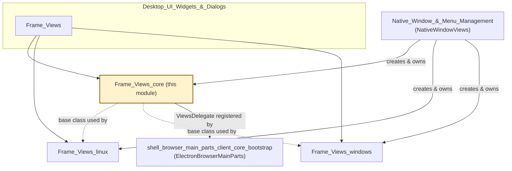
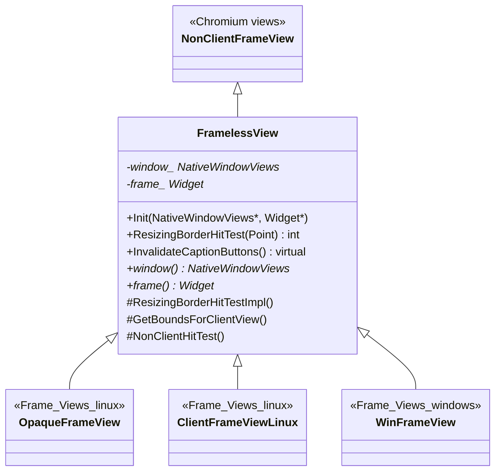
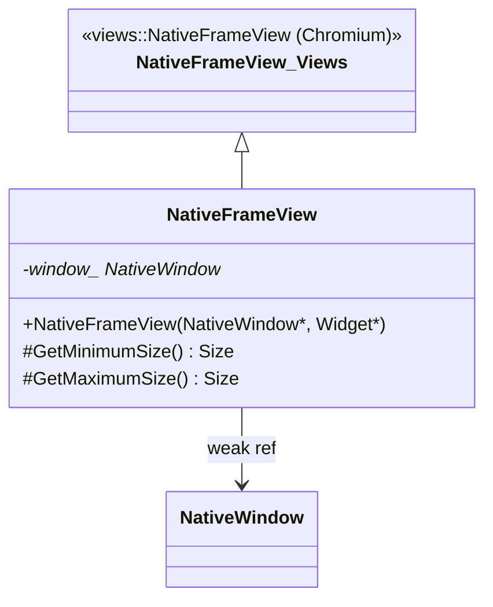
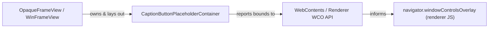
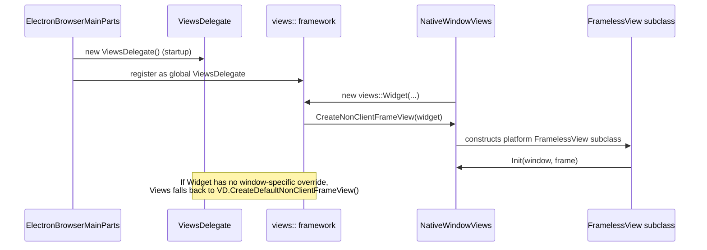
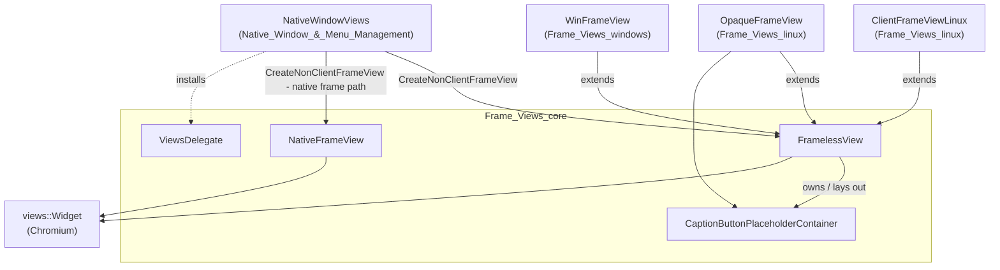
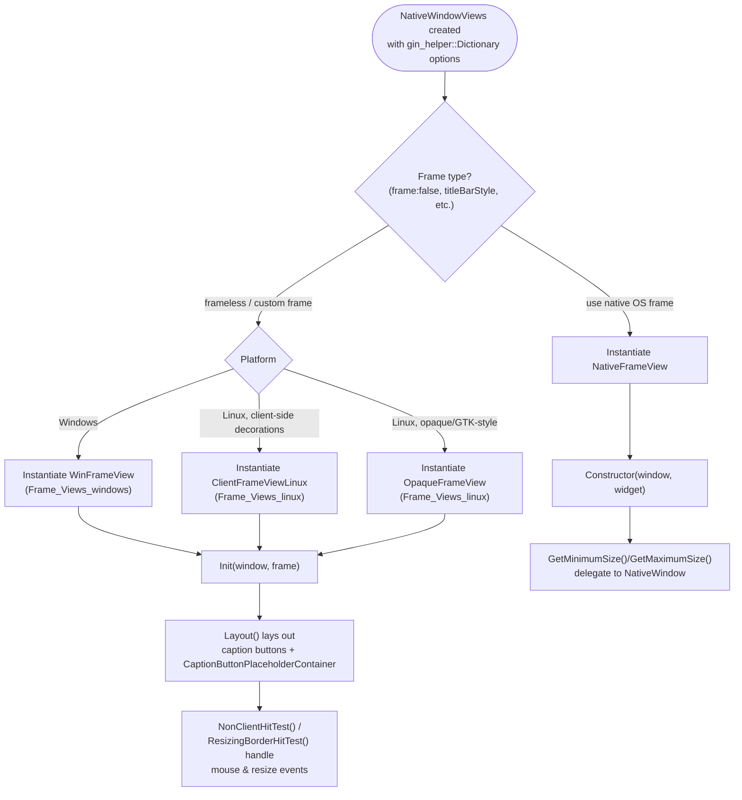
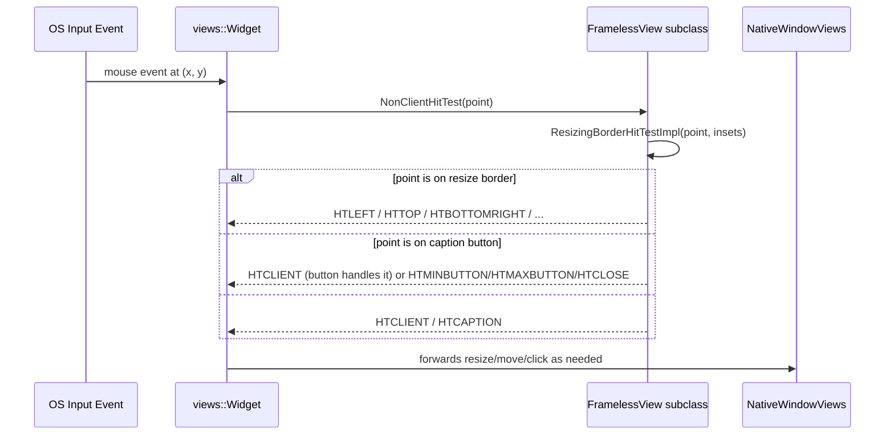

# Frame_Views_core

## Introduction

`Frame_Views_core` is the platform-agnostic foundation of Electron's **native window frame rendering** subsystem. It provides the base abstractions used to draw and manage the *non-client area* of a top-level window — the title bar, resize borders, caption buttons, and window-controls-overlay (WCO) placeholder — when Electron renders window decorations itself instead of delegating entirely to the OS.

This module defines:

- **`FramelessView`** — the abstract base class for all custom (non-native) frame implementations, providing frameless/borderless window behavior and shared hit-testing/resizing logic.
- **`NativeFrameView`** — a thin wrapper around the OS-native frame (`views::NativeFrameView`) that still cooperates with Electron's `NativeWindow` sizing constraints.
- **`CaptionButtonPlaceholderContainer`** — a non-interactive placeholder `View` used to reserve non-client-area space for Windows Controls Overlay (WCO) button regions.
- **`ViewsDelegate`** — Electron's implementation of the Chromium `views::ViewsDelegate` interface, controlling global Views framework behavior (window placement persistence, default frame view creation, platform icon lookup, etc.).

Together these components form the **shared contract** that platform-specific frame view implementations build upon. Concrete, OS-specific rendering logic lives in sibling modules:

- [Frame_Views_windows](Frame_Views_windows.md) — `WinFrameView`, `WinCaptionButtonContainer`, `WinCaptionButton`, icon painters.
- [Frame_Views_linux](Frame_Views_linux.md) — `OpaqueFrameView`, `ClientFrameViewLinux`, `ElectronDesktopWindowTreeHostLinux`.

This module is a child of [Frame_Views](Frame_Views.md), which itself belongs to the broader [Desktop_UI_Widgets_&_Dialogs](Desktop_UI_Widgets_&_Dialogs.md) domain.

---

## Module Position in the System

- **Upstream consumer:** [Native_Window_&_Menu_Management](Native_Window_&_Menu_Management.md) — specifically `NativeWindowViews` (in `shell_browser_native_window_views`) — instantiates and owns frame view objects derived from `FramelessView`/`NativeFrameView` via `CreateNonClientFrameView()`.
- **Bootstrap integration:** `ViewsDelegate` is constructed once during application startup by `ElectronBrowserMainParts` (see [Browser_Process_Core_&_Lifecycle](Browser_Process_Core_%26_Lifecycle.md)) and installed into the Views framework's global delegate slot before any `views::Widget` is created.
- **Sibling specializations:** [Frame_Views_windows](Frame_Views_windows.md) and [Frame_Views_linux](Frame_Views_linux.md) subclass `FramelessView` to provide OS-specific caption button layouts, theming, and hit-testing.

---

## Core Components

### 1. `FramelessView`

**File:** `shell/browser/ui/views/frameless_view.h`

The central abstraction of this module. `FramelessView` extends `views::NonClientFrameView` and implements the base behavior required for windows that either have no OS-drawn frame at all, or that need custom hit-testing/resize logic layered on top of a client-drawn frame.

Key responsibilities:

| Responsibility | Method(s) |
|---|---|
| Association with owning window/widget | `Init(NativeWindowViews*, views::Widget*)`, `window()`, `frame()` |
| Resize-border hit testing | `ResizingBorderHitTest()`, `ResizingBorderHitTestImpl()` |
| Non-client hit testing | `NonClientHitTest()` |
| Client-area bounds computation | `GetBoundsForClientView()`, `GetWindowBoundsForClientBounds()` |
| Caption button invalidation hook | `InvalidateCaptionButtons()` (virtual, overridden by subclasses) |
| Sizing constraints | `CalculatePreferredSize()`, `GetMinimumSize()`, `GetMaximumSize()` |
| Event targeting | `TargetForRect()` (from `views::ViewTargeterDelegate`) |

It intentionally leaves several `views::NonClientFrameView` overrides as no-ops (`GetWindowMask`, `ResetWindowControls`, `UpdateWindowIcon`, `UpdateWindowTitle`, `SizeConstraintsChanged`) so that subclasses only need to override what is relevant to their platform.

`FramelessView` holds **non-owning** (`raw_ptr`) references to:
- `window_` — the associated `NativeWindowViews*` (see [Native_Window_&_Menu_Management](Native_Window_&_Menu_Management.md))
- `frame_` — the associated `views::Widget*`

---

### 2. `NativeFrameView`

**File:** `shell/browser/ui/views/native_frame_view.h`

A minimal specialization of Chromium's `views::NativeFrameView`, used when the window opts to keep the **native OS-drawn** title bar/frame rather than Electron's custom drawing. It overrides only sizing behavior so that minimum/maximum size queries are forwarded to Electron's `NativeWindow` (see [Native_Window_&_Menu_Management](Native_Window_&_Menu_Management.md)) instead of relying purely on Views' internal computation.

This class is selected by `NativeWindowViews::CreateNonClientFrameView()` when the window is configured to use the platform's native frame (i.e., not frameless and not using a custom client-drawn frame).

---

### 3. `CaptionButtonPlaceholderContainer`

**File:** `shell/browser/ui/views/caption_button_placeholder_container.h`

A lightweight, non-interactive `views::View` subclass. It does not draw or respond to input — its sole purpose is to **reserve a region of the non-client area** so that renderer-side content (via the Window Controls Overlay / WCO API) knows this area is occupied by (native or overlay) caption buttons and should be treated as non-client, avoiding double-handling of clicks.

Used by:
- [Frame_Views_linux](Frame_Views_linux.md)'s `OpaqueFrameView` (`caption_button_placeholder_container_` member)
- Windows caption-button layout code in [Frame_Views_windows](Frame_Views_windows.md)

---

### 4. `ViewsDelegate`

**File:** `shell/browser/ui/views/electron_views_delegate.h`

Electron's concrete implementation of `views::ViewsDelegate`, the global hook point Chromium's Views toolkit uses for app-level policy decisions. There is exactly **one** instance for the whole browser process, created during startup.

Key responsibilities:

| Responsibility | Method(s) |
|---|---|
| Window placement persistence | `SaveWindowPlacement()`, `GetSavedWindowPlacement()` |
| Accessibility/menu notifications | `NotifyMenuItemFocused()` |
| Default frame view creation | `CreateDefaultNonClientFrameView(Widget*)` — this is the primary integration point with this module, returning a default `FramelessView`/`NativeFrameView` derivative when a widget doesn't have Electron's window-specific frame logic wired in |
| Platform window icons (Windows/Linux) | `GetDefaultWindowIcon()`, `GetSmallWindowIcon()` |
| Windows-specific taskbar autohide edges | `GetAppbarAutohideEdges()`, `OnGotAppbarAutohideEdges()` |
| Widget initialization hook | `OnBeforeWidgetInit()` |
| Window-manager-provided title bar detection (Linux) | `WindowManagerProvidesTitleBar()` |

`ViewsDelegate` is largely process-global glue: it does not track per-window state (aside from the Windows-only `appbar_autohide_edge_map_` cache) and instead answers ad-hoc queries from the Views framework as widgets are created and destroyed throughout the app's lifetime.

---

## Architecture Overview

### Component Interaction Detail

---

## Data Flow: Hit Testing and Resizing

`FramelessView` centralizes the logic that determines what a given screen point represents (client area, resize border, caption button, etc.), which subclasses refine:

---

## Relationship to Other Modules

| Related Module | Relationship |
|---|---|
| [Native_Window_&_Menu_Management](Native_Window_&_Menu_Management.md) | `NativeWindowViews` is the primary owner/creator of `FramelessView`/`NativeFrameView` instances via `CreateNonClientFrameView()`. It also exposes `ClientFrameViewLinux` retrieval (`GetClientFrameViewLinux()`) and coordinates `SetTitleBarOverlay()`, which affects `CaptionButtonPlaceholderContainer` layout. |
| [Frame_Views_linux](Frame_Views_linux.md) | Provides `OpaqueFrameView` and `ClientFrameViewLinux`, both subclasses of `FramelessView`, implementing Linux-specific (GTK/X11) caption button rendering and theming. |
| [Frame_Views_windows](Frame_Views_windows.md) | Provides `WinFrameView` (subclass of `FramelessView`) plus `WinCaptionButtonContainer`/`WinCaptionButton`/icon painters for Windows-specific rendering (DWM, Fluent icons). |
| [Browser_Process_Core_&_Lifecycle](Browser_Process_Core_%26_Lifecycle.md) | `ElectronBrowserMainParts` constructs the singleton `ViewsDelegate` and other platform Views infrastructure (`ViewsDelegateMac`, `LayoutProvider`) during startup. |
| [Menu_(Model_&_Views)](Menu_%28Model_%26_Views%29.md) | `RootView`, which composes `MenuBar` with the content view inside the frame, interacts with `NativeWindowViews`/`FramelessView`-derived frames for layout coordination. |
| [Desktop_UI_Widgets_&_Dialogs](Desktop_UI_Widgets_%26_Dialogs.md) | Parent domain grouping all window-chrome and dialog UI, including this module and its Windows/Linux specializations. |

---

## Summary

`Frame_Views_core` supplies the **shared skeleton** for Electron's custom window-chrome rendering:

- `FramelessView` — abstract hit-testing/sizing/caption-button contract for all custom frames.
- `NativeFrameView` — pass-through wrapper for OS-native frames that still respects Electron sizing constraints.
- `CaptionButtonPlaceholderContainer` — reserves non-client space for the Window Controls Overlay feature.
- `ViewsDelegate` — process-wide Views framework policy hook, including the default frame-view factory fallback.

Platform teams extend `FramelessView` in [Frame_Views_windows](Frame_Views_windows.md) and [Frame_Views_linux](Frame_Views_linux.md) to provide the concrete, pixel-accurate caption button and theming behavior appropriate to each OS, while this module keeps that logic decoupled from `NativeWindowViews` and the rest of the [Native_Window_&_Menu_Management](Native_Window_&_Menu_Management.md) module.
