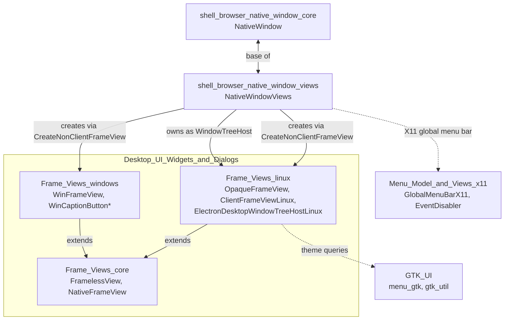
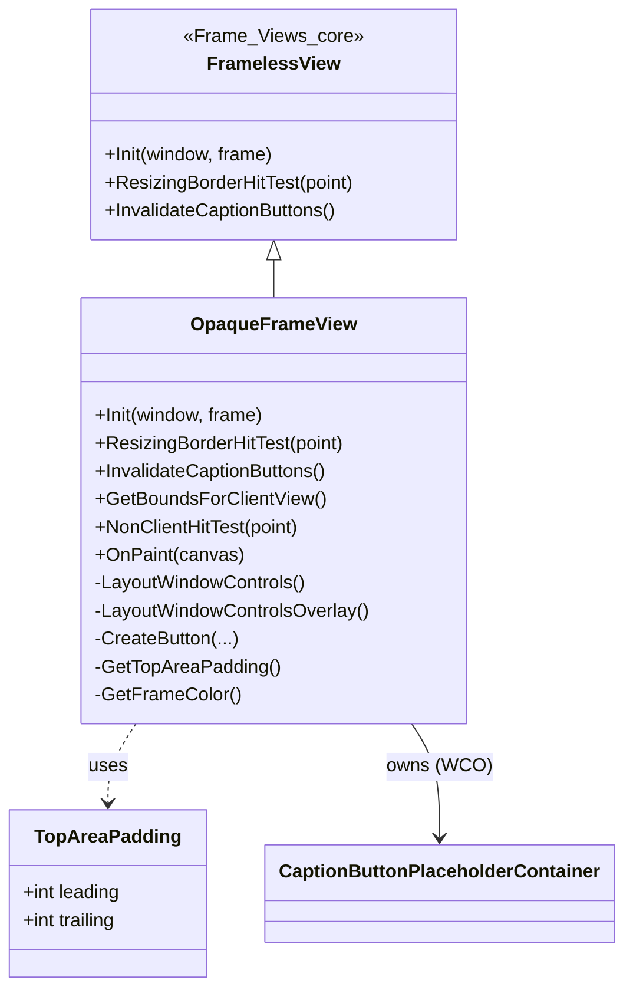
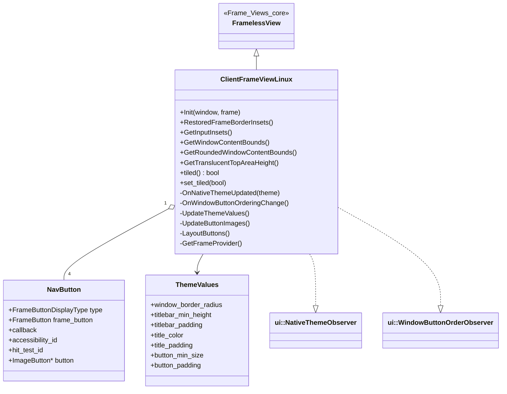
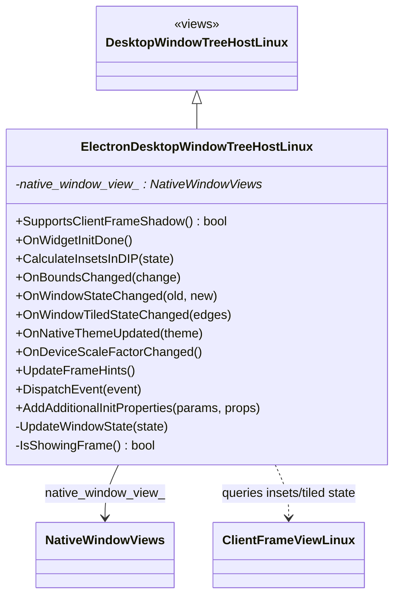
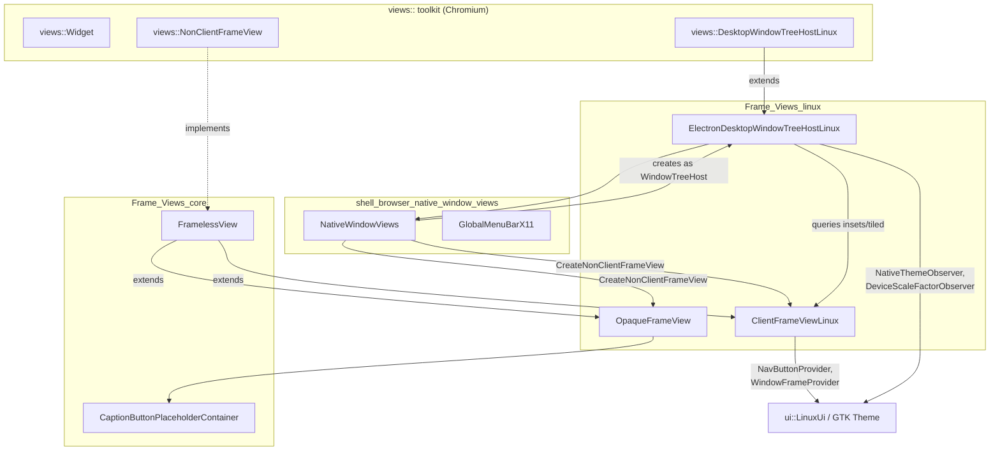
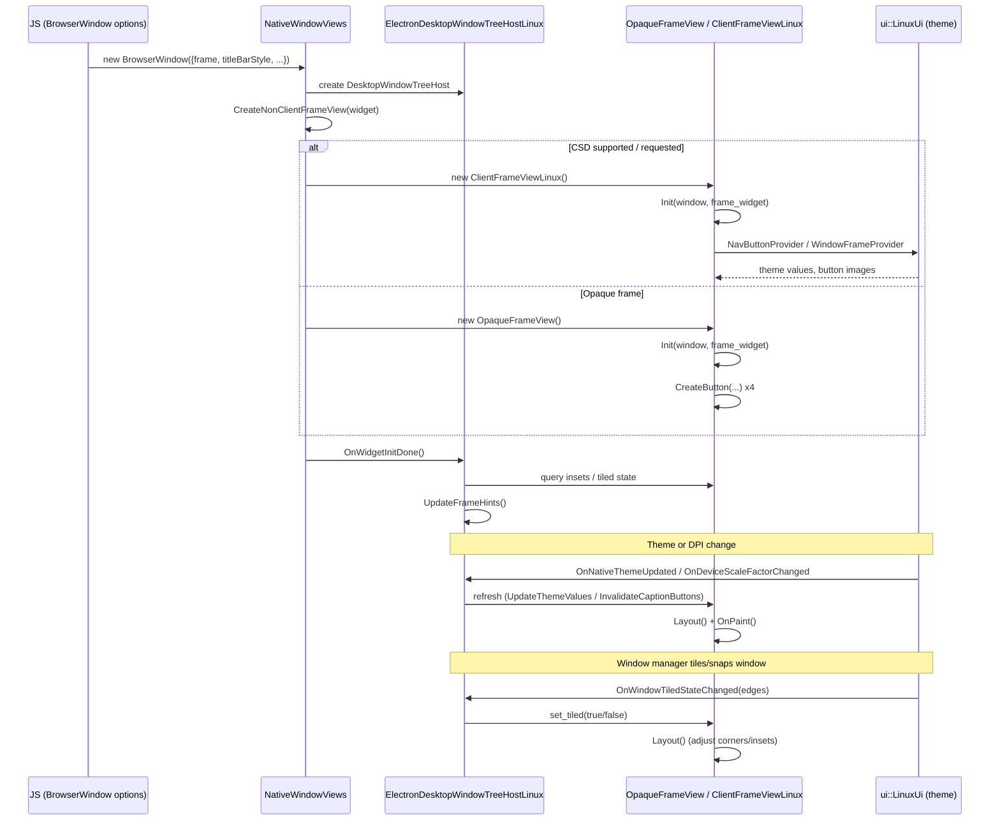
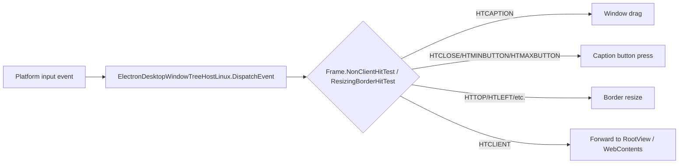

# Frame_Views_linux

## Introduction

`Frame_Views_linux` is the Linux-specific implementation of Electron's window frame ("non-client view") rendering layer. It provides the concrete `views::NonClientFrameView` subclasses that draw and manage window decorations — title bars, minimize/maximize/close buttons, borders, and shadows — for `BrowserWindow` instances running on Linux (X11/Wayland via the `views` toolkit and `ui::LinuxUi`/GTK theming).

The module contains two competing frame implementations selected at window-creation time:

- **`OpaqueFrameView`** — Electron/Chromium-drawn ("opaque") frame that paints its own caption buttons and title bar using Chromium's vector icons and theme colors. Used when the desktop environment does not support (or the app opts out of) native/client-side decorations.
- **`ClientFrameViewLinux`** — Client-Side Decoration (CSD) frame that delegates button rendering and border/shadow painting to the Linux toolkit (`ui::NavButtonProvider` / `ui::WindowFrameProvider`), producing frames that match the native GTK/desktop theme (rounded corners, native button icons, etc.).

Both frame views plug into `ElectronDesktopWindowTreeHostLinux`, which bridges the `views` widget/window-tree-host machinery with X11/Wayland platform windowing (tiled-state, insets, DPI, theme change notifications) so the correct frame is drawn and hit-tested consistently with the host window manager.

This module is a Linux-specific sibling of [Frame_Views_core](Frame_Views_core.md) (which defines the shared `FramelessView` base and `NativeFrameView`) and [Frame_Views_windows](Frame_Views_windows.md) (the Windows equivalent). It is consumed by [shell_browser_native_window_views](shell_browser_native_window_views.md), which owns `NativeWindowViews` and decides which `NonClientFrameView` to instantiate.

---

## Module Position in the System

---

## Core Components

### 1. `OpaqueFrameView`
File: `shell/browser/ui/views/opaque_frame_view.h`

A `FramelessView` subclass (see [Frame_Views_core](Frame_Views_core.md)) that implements a fully self-drawn ("opaque"/non-CSD) frame, modeled after Chromium's `OpaqueBrowserFrameView`.

Responsibilities:
- Creates and lays out the minimize/maximize/restore/close caption buttons (`views::Button`) using Chromium vector icons.
- Computes frame border insets, top-area height, and button spacing depending on window state (restored/maximized) via helpers such as `FrameBorderInsets`, `NonClientTopHeight`, `GetTopAreaPadding`.
- Supports **Window Controls Overlay (WCO)** layout through `LayoutWindowControlsOverlay` and a `CaptionButtonPlaceholderContainer` (shared with [Frame_Views_core](Frame_Views_core.md)) that reserves space beneath the real caption buttons for web content.
- Implements hit-testing (`NonClientHitTest`, `ResizingBorderHitTest`) so the OS/compositor knows where to resize/drag/click system buttons.
- Reacts to activation changes (`PaintAsActiveChanged`) to repaint with active/inactive frame colors (`GetFrameColor`).

Internal `TopAreaPadding` struct: a simple `{leading, trailing}` pixel-padding pair describing how much space to leave before laying out leading/trailing caption buttons — used to correctly position buttons regardless of RTL/button order.

### 2. `ClientFrameViewLinux`
File: `shell/browser/ui/views/client_frame_view_linux.h`

A `FramelessView` subclass that implements **Client-Side Decorations** by delegating to the Linux toolkit's theming APIs (`ui::LinuxUi`, `ui::NavButtonProvider`, `ui::WindowFrameProvider`) so the window frame visually matches the user's GTK/desktop theme (native button glyphs, rounded corners, shadows).

Key responsibilities:
- Observes `ui::NativeTheme` (`ui::NativeThemeObserver`) and window-button-order changes (`ui::WindowButtonOrderObserver`) to rebuild button images/order (`UpdateButtonImages`, `UpdateThemeValues`) whenever the desktop theme changes.
- Builds up to `kNavButtonCount` (4) `NavButton` entries — pairing a `ui::NavButtonProvider::FrameButtonDisplayType`, a `views::FrameButton` id, a widget callback (e.g. `&views::Widget::Minimize`), and the actual `views::ImageButton`.
- Maintains a `ThemeValues` snapshot (border radius, titlebar min height/padding, title color/padding, button min size/padding) pulled from the active theme, used throughout layout and painting.
- Provides geometry helpers consumed by `ElectronDesktopWindowTreeHostLinux`: `RestoredFrameBorderInsets`, `RestoredMirroredFrameBorderInsets`, `GetInputInsets`, `GetWindowContentBounds`, `GetRoundedWindowContentBounds`, `GetTranslucentTopAreaHeight`.
- Tracks whether the window is currently **tiled** (`tiled()`/`set_tiled()`) — snapped/tiled windows typically lose rounded corners and some insets.
- Draws the rounded window mask (`GetWindowMask`) and paints the title/frame (`OnPaint`), and lays out the title label and nav buttons (`LayoutButtons`, `LayoutButtonsOnSide`).

### 3. `ElectronDesktopWindowTreeHostLinux`
File: `shell/browser/ui/electron_desktop_window_tree_host_linux.h`

Extends `views::DesktopWindowTreeHostLinux` to integrate Electron's Linux frame views with the platform window (X11/Wayland). It is the glue between the OS/compositor-level window (tiling, DPI, decorations) and the `ClientFrameViewLinux`/`OpaqueFrameView` painted above.

Responsibilities:
- Holds a non-owning pointer to the owning `NativeWindowViews` (`native_window_view_`), obtained from [shell_browser_native_window_views](shell_browser_native_window_views.md).
- `SupportsClientFrameShadow()` — reports whether the platform/compositor can render CSD shadows, informing `ClientFrameViewLinux::host_supports_client_frame_shadow_`.
- `CalculateInsetsInDIP()` — supplies frame insets (from `ClientFrameViewLinux` when active) to the platform window for correct hit-testing/compositing.
- `OnBoundsChanged`, `OnWindowStateChanged`, `OnWindowTiledStateChanged` — propagate platform window state transitions (e.g., tiled/snapped edges) into the active frame view (`set_tiled`), and trigger relayout.
- `OnNativeThemeUpdated` / `OnDeviceScaleFactorChanged` — observed via `ui::NativeThemeObserver` / `ui::DeviceScaleFactorObserver` (through `base::ScopedObservation`) to refresh frame decorations when theme or DPI changes.
- `UpdateFrameHints()` — pushes updated frame insets/shape/opaque-region hints to the platform window (e.g., X11/Wayland shell surface), so the compositor's own decorations/hit regions match the client-drawn frame.
- `DispatchEvent()` — intercepts input events at the tree-host level (e.g., before/after client frame processing) as needed for CSD dragging/resizing.
- `AddAdditionalInitProperties()` — augments `ui::PlatformWindowInitProperties` (e.g., requesting server-side decoration disablement for CSD).

---

## Architecture Overview

---

## Frame Selection & Rendering Flow

`NativeWindowViews::CreateNonClientFrameView()` (see [shell_browser_native_window_views](shell_browser_native_window_views.md)) decides, at widget-creation time, which concrete frame view to instantiate based on window options (e.g. `frame: false`, `titleBarStyle`, WCO settings) and desktop-environment capability (whether the host supports CSD shadows via `ElectronDesktopWindowTreeHostLinux::SupportsClientFrameShadow()`).

---

## Hit-Testing & Input Flow

Both frame views implement `NonClientHitTest`/`ResizingBorderHitTest` so the compositor and `views` event pipeline can correctly distinguish clicks on caption buttons, the draggable title bar, and resize borders. `ElectronDesktopWindowTreeHostLinux::DispatchEvent` sits above this, allowing platform-level adjustments before events reach the frame view or client web contents.

---

## Relationship to Other Modules

| Related Module | Relationship |
|---|---|
| [Frame_Views_core](Frame_Views_core.md) | Provides the shared `FramelessView` base class and `CaptionButtonPlaceholderContainer` used by both `OpaqueFrameView` (WCO placeholder) and, indirectly, `ClientFrameViewLinux`. |
| [Frame_Views_windows](Frame_Views_windows.md) | Sibling platform implementation (`WinFrameView`, `WinCaptionButton*`) providing the same frame-view contract on Windows. |
| [shell_browser_native_window_views](shell_browser_native_window_views.md) | Owns `NativeWindowViews`, which selects and constructs the correct frame view (`CreateNonClientFrameView`) and hosts `ElectronDesktopWindowTreeHostLinux` as its `DesktopWindowTreeHost`. Also owns `GlobalMenuBarX11` and X11 `EventDisabler`, which interact with the same window on Linux. |
| [shell_browser_native_window_core](shell_browser_native_window_core.md) | Defines the cross-platform `NativeWindow` base class that `NativeWindowViews` extends; frame views ultimately affect `NativeWindow::GetBounds/GetContentBounds` results. |
| [GTK_UI](GTK_UI.md) | `ClientFrameViewLinux` and its theme/button providers rely on GTK-backed `ui::LinuxUi` implementations for native-looking decorations. |
| [Menu_(Model_&_Views)_x11](Menu_%28Model_%26_Views%29_x11.md) | X11-specific global menu bar (`GlobalMenuBarX11`) and `EventDisabler`, used alongside these frame views within `NativeWindowViews` on Linux. |

---

## Summary

`Frame_Views_linux` isolates all Linux/X11-specific window-decoration logic behind the shared `FramelessView` contract defined in [Frame_Views_core](Frame_Views_core.md):

- **`OpaqueFrameView`** self-draws a Chromium-style frame with vector-icon caption buttons — used when CSD is unavailable or undesired.
- **`ClientFrameViewLinux`** defers to the desktop theme (GTK) for pixel-accurate native decorations, tracking theme/button-order changes and tiled window state.
- **`ElectronDesktopWindowTreeHostLinux`** connects these views to the underlying X11/Wayland platform window, propagating theme, DPI, and window-state changes and computing the insets/hints the compositor needs.

Together these components let `NativeWindowViews` present either an application-drawn or a theme-matched native frame on Linux, while keeping the same external `NativeWindow`/`BrowserWindow` API surface used across all platforms.
