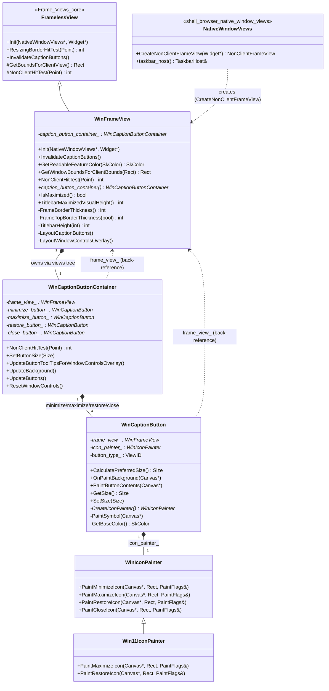
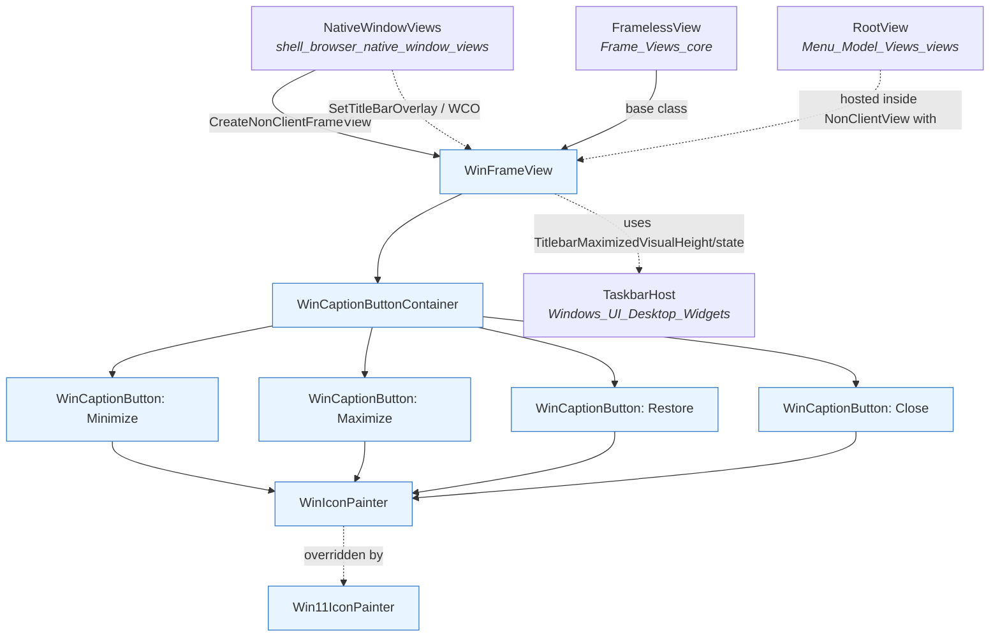
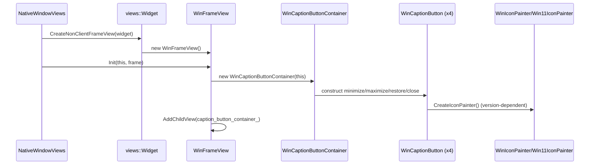
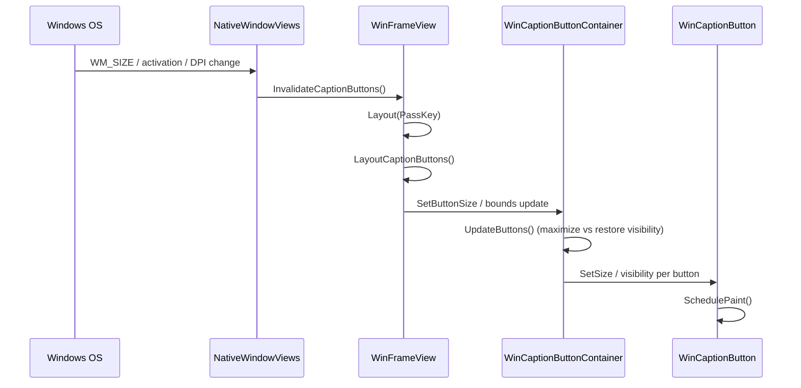
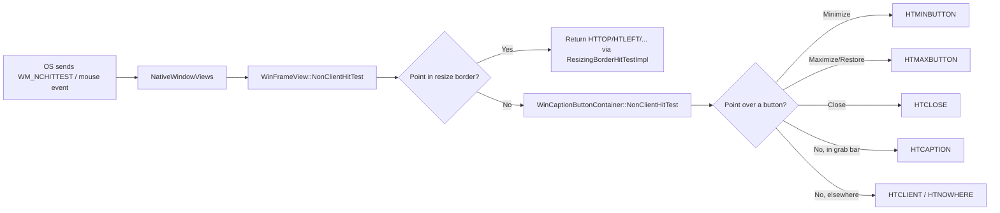
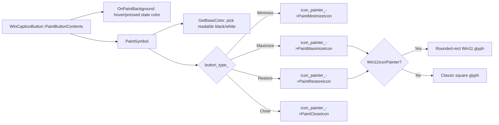

# Frame Views (Windows)

## Introduction

The **Frame Views (Windows)** module implements the Windows-specific *non-client frame* for Electron's `views`-backed windows. It renders the title bar, and the minimize / maximize / restore / close caption buttons, matching the look and feel of native Windows 10/11 application frames (including the "glass" style caption buttons used by Chromium on Windows).

This module is a Windows-only specialization sitting alongside [Frame_Views_core](Frame_Views_core.md) (the shared/base frame view infrastructure) and [Frame_Views_linux](Frame_Views_linux.md) (the Linux/GTK equivalent). It is instantiated by [shell_browser_native_window_views](shell_browser_native_window_views.md) when a `BrowserWindow`/`BaseWindow` is created without a custom titlebar on Windows, and it cooperates with the broader [Windows_UI_(Desktop_Widgets)](Windows_UI_(Desktop_Widgets).md) module (taskbar, jump lists, desktop widget hosting) to provide a fully native Windows window experience.

## Purpose & Core Functionality

On Windows, Electron windows that use the default (non-frameless, non-custom-titlebar) chrome need a `views::NonClientFrameView` that:

1. Draws the caption area (title bar) and reserves space for the standard Windows caption buttons.
2. Provides clickable, themeable minimize/maximize-restore/close buttons that visually adapt to Windows 10 vs. Windows 11 styling and to light/dark/accent-color theming.
3. Participates in hit-testing so Windows treats the caption area as draggable (`HTCAPTION`) and the buttons as their respective hit-test regions (`HTMINBUTTON`, `HTMAXBUTTON`, `HTCLOSE`), enabling native window snapping, Aero Snap layouts, and Windows 11 Snap Layout flyouts.
4. Lays out itself and its buttons in response to window state changes (maximize/restore, DPI/touch mode changes, Window Controls Overlay for frameless-with-overlay windows).

The module is composed of four cooperating components:

| Component | Role |
|---|---|
| `WinFrameView` | The `NonClientFrameView` implementation. Owns layout, hit-testing, and bounds calculations for the whole frame. |
| `WinCaptionButtonContainer` | A `views::View` that groups the four caption buttons, manages their visibility/state based on window state, and computes caption-area hit-testing. |
| `WinCaptionButton` | An individual caption button (`views::Button`) for minimize, maximize, restore, or close, responsible for painting its own background and symbol. |
| `WinIconPainter` / `Win11IconPainter` | Strategy classes that paint the actual minimize/maximize/restore/close glyphs; `Win11IconPainter` overrides maximize/restore painting to match Windows 11's rounded-rectangle iconography. |

## Architecture

### Class & Ownership Diagram

### Module Context

## Component Details

### `WinFrameView`
Extends `FramelessView` (see [Frame_Views_core](Frame_Views_core.md)) and is the concrete `views::NonClientFrameView` instantiated for standard (non-custom-titlebar) windows on Windows via `NativeWindowViews::CreateNonClientFrameView`. Responsibilities:

- **Bounds translation**: `GetWindowBoundsForClientBounds()` converts requested client bounds into full window bounds accounting for the frame border and titlebar.
- **Hit testing**: `NonClientHitTest()` determines whether a point belongs to the resize border, the caption/drag area, or a caption button, delegating button-specific hit testing to `WinCaptionButtonContainer::NonClientHitTest()`.
- **Layout**: `Layout(PassKey)` (overriding `views::View::Layout`) triggers `LayoutCaptionButtons()` and, when Window Controls Overlay (WCO) is enabled for frameless windows, `LayoutWindowControlsOverlay()`.
- **Theming helpers**: `GetReadableFeatureColor()` picks a legible foreground color for a given titlebar background, used to theme button glyphs and the WCO overlay.
- **State queries**: `IsMaximized()`, `TitlebarMaximizedVisualHeight()` expose window-state-derived metrics consumed by the caption button container and by the WCO layout logic.
- **Frame metrics**: private helpers (`FrameBorderThickness`, `FrameTopBorderThickness[Px]`, `TitlebarHeight`, `WindowTopY`) compute the various pixel offsets required to match native Windows frame chrome across DPI scales and window states.

### `WinCaptionButtonContainer`
A `views::View` + `views::WidgetObserver` that groups the four `WinCaptionButton` instances and manages their collective behavior:

- Constructed with a back-pointer to the owning `WinFrameView`.
- `UpdateButtons()` toggles visibility/enabled state so only one of maximize/restore is shown at a time, and disables buttons appropriately in tablet UI mode.
- `NonClientHitTest()` maps a point to the correct button's hit-test code, or `HTCAPTION` if it falls in the draggable "grab bar" area between/around the buttons.
- `SetButtonSize()` / `UpdateButtonToolTipsForWindowControlsOverlay()` support dynamic resizing and tooltip updates required for the Window Controls Overlay API.
- Observes the parent `views::Widget` (`AddedToWidget`/`RemovedFromWidget`, `OnWidgetBoundsChanged`) to keep button layout in sync with window bounds changes, and subscribes to `ui::TouchUiController` to react to touch-mode toggles.

### `WinCaptionButton`
A `views::Button` representing a single caption button (minimize, maximize, restore, or close), identified by a `ViewID button_type_`:

- Holds a back-pointer to `WinFrameView` and an owned `WinIconPainter` (created via `CreateIconPainter()`), selected based on the running Windows version (Windows 11 → `Win11IconPainter`, otherwise the base `WinIconPainter`).
- `OnPaintBackground()` draws the button's hover/pressed background; `PaintButtonContents()` calls `PaintSymbol()` to draw the glyph via the icon painter.
- `GetBaseColor()` derives the glyph/background blend color (black or white, whichever is more readable) from the frame's theme colors (`WinFrameView::overlay_button_color_/overlay_symbol_color_`, see `NativeWindowViews`).
- `GetButtonDisplayOrderIndex()` / `GetBetweenButtonSpacing()` control button ordering and spacing to visually match native Windows caption button layout without introducing dead space.

### `WinIconPainter` / `Win11IconPainter`
Strategy objects that isolate the drawing code for each caption icon from button/layout logic:

- `WinIconPainter` provides the default (Windows 10-style) square minimize/maximize/restore/close glyphs.
- `Win11IconPainter` overrides only `PaintMaximizeIcon()` and `PaintRestoreIcon()` to draw the rounded-rectangle iconography introduced in Windows 11, while inheriting the minimize/close painting unchanged.
- Selection between the two happens in `WinCaptionButton::CreateIconPainter()`, keeping OS-version branching out of the painting code itself.

## Data & Interaction Flow

### Window Creation

### Layout on Window State Change

### Hit Testing (Mouse / Touch Input)

### Painting a Caption Button

## Relationship to Other Modules

- **[Frame_Views_core](Frame_Views_core.md)** — `WinFrameView` derives from `FramelessView`, inheriting default resize-border hit testing, bounds calculations, and the `Init()`/`InvalidateCaptionButtons()` contract that all platform frame views implement.
- **[Frame_Views_linux](Frame_Views_linux.md)** — Sibling module providing the analogous non-client frame (`OpaqueFrameView` / `ClientFrameViewLinux`) for Linux; shares the same `FramelessView` base and overall design pattern (frame view + caption button container + button views).
- **[shell_browser_native_window_views](shell_browser_native_window_views.md)** — `NativeWindowViews::CreateNonClientFrameView()` is the factory point that instantiates `WinFrameView`, and `NativeWindowViews` exposes window-state accessors (`IsMaximized`, `SetTitleBarOverlay`, accent-color methods) that `WinFrameView`/`WinCaptionButtonContainer` query for correct rendering.
- **[Windows_UI_(Desktop_Widgets)](Windows_UI_(Desktop_Widgets).md)** — Provides `TaskbarHost` and related desktop-integration widgets (jump lists, thumbnail toolbars) that operate alongside the frame view on the same `NativeWindowViews` instance.
- **[Menu_(Model_&_Views)_views](Menu_(Model_&_Views)_views.md)** — `RootView`, hosted as the client view within the widget managed by `WinFrameView`'s `NonClientFrameView` contract, contains the menu bar shown below the caption area on Windows when a native application menu is present.
- **[Common_Native_Gin_Infrastructure](Common_Native_Gin_Infrastructure.md)** (`gin_converters/gfx_converter.h`) — Supplies the `gfx::Rect`/`gfx::Point`/`gfx::Size` type bindings used throughout the frame/button geometry APIs when exposed to JS (e.g., via `BaseWindow`/`BrowserWindow` bounds APIs).

## Key Design Notes

- **Separation of concerns**: layout/hit-testing (`WinFrameView`), button grouping/state (`WinCaptionButtonContainer`), individual button rendering (`WinCaptionButton`), and icon glyph drawing (`WinIconPainter`) are each isolated, mirroring the upstream Chromium `glass_browser_frame_view`/`glass_browser_caption_button_container` design this module is adapted from.
- **OS-version adaptive rendering**: rather than branching on Windows version throughout button code, `WinCaptionButton::CreateIconPainter()` selects a `WinIconPainter` or `Win11IconPainter` instance once, and all subsequent painting calls go through the common `WinIconPainter` virtual interface.
- **Raw pointer back-references**: `WinCaptionButtonContainer` and `WinCaptionButton` hold non-owning `raw_ptr` back-references to their parent `WinFrameView`; ownership flows down the `views::View` tree (parent owns children), and code must guard against a null `caption_button_container_` in `WinFrameView` since container destruction order is not strictly guaranteed relative to the frame view.
- **Widget observation**: `WinCaptionButtonContainer` observes widget bounds changes directly (via `views::WidgetObserver`) rather than relying solely on `views::View::Layout`, ensuring caption buttons stay correctly sized during rapid resize/drag operations.
