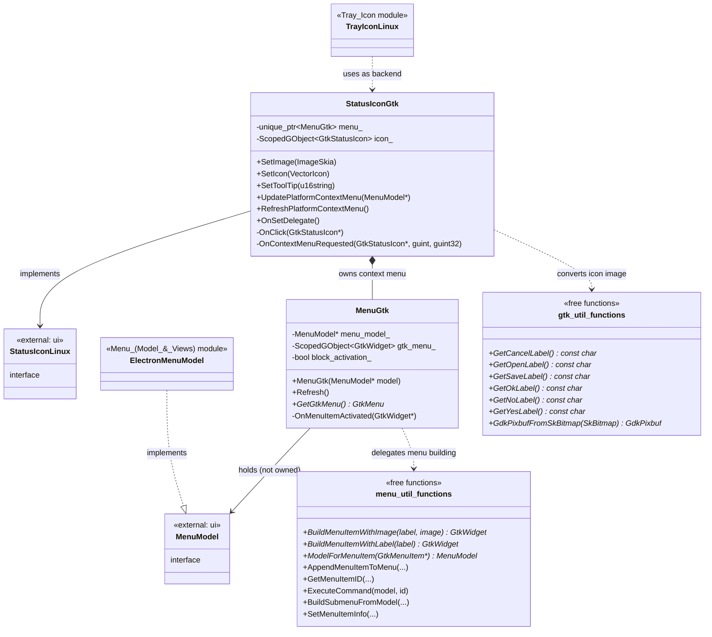
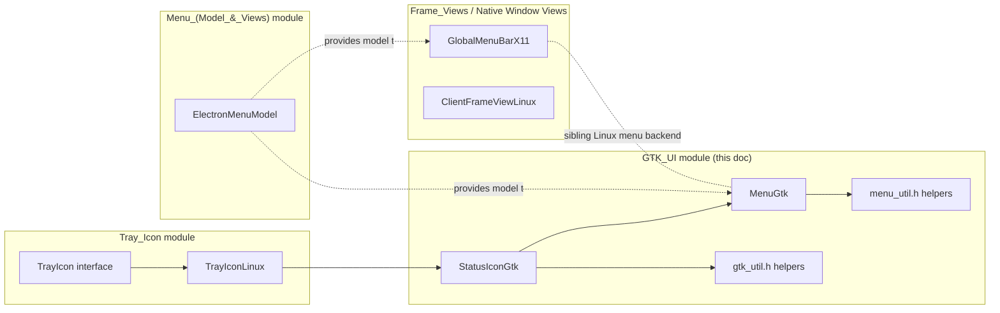
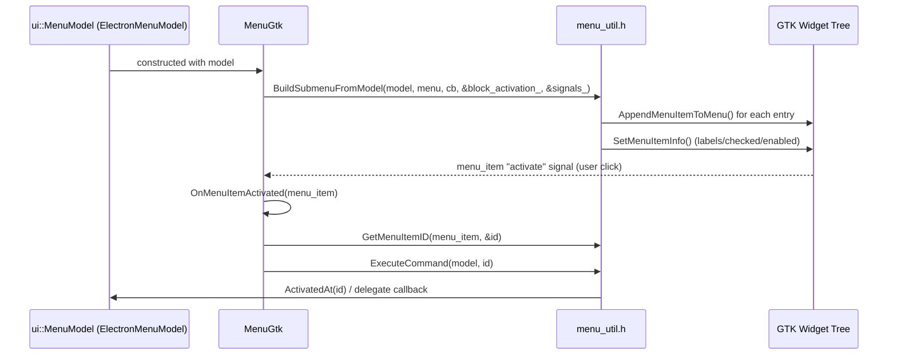
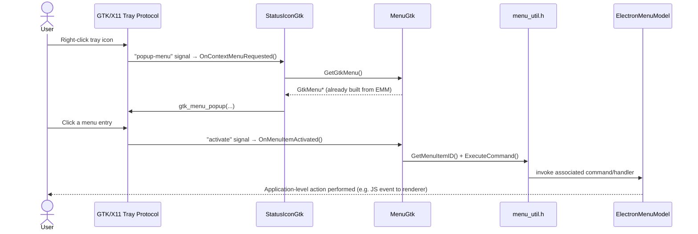

# GTK UI Module

## 1. Purpose

The **GTK_UI** module provides Electron's native integration with the **GTK toolkit** on Linux. It is a small, focused
adapter layer that translates Electron's cross-platform, toolkit-agnostic UI models (menus, icons) into concrete
GTK widgets and GTK/GLib event callbacks.

Concretely, this module is responsible for:

- Building and refreshing native **GTK context menus** (`GtkMenu`/`GtkWidget`) from Electron's platform-independent
  `ui::MenuModel` representation.
- Rendering the Linux **system tray icon** using GTK's legacy `GtkStatusIcon` API, including click and
  context-menu-request handling.
- Providing small **GTK/GDK conversion utilities** (e.g. converting a Skia bitmap into a `GdkPixbuf`, and fetching
  localized stock button labels such as "OK", "Cancel", "Save").

This module is a Linux-only backend that plugs into higher-level, cross-platform abstractions defined elsewhere in
the codebase — it does not define any new business logic or public Electron JS API surface itself. It exists purely
to satisfy the platform contracts required by:

- The [Tray Icon](Tray_Icon.md) module (`ui::StatusIconLinux` interface consumed by `TrayIconLinux`).
- The [Menu (Model & Views)](Menu_(Model_&_Views).md) module (`ui::MenuModel`, implemented by `ElectronMenuModel`).

## 2. Architecture Overview

The module is composed of four tightly-coupled headers/sources living under `shell/browser/ui/gtk*`:

| File | Core Components | Responsibility |
|---|---|---|
| `shell/browser/ui/gtk/menu_gtk.h` | `MenuGtk` | Owns and manages the lifecycle of a native `GtkMenu`, built from a `ui::MenuModel`. |
| `shell/browser/ui/gtk/menu_util.h` | Free functions operating on `MenuModel`/`Image` | Stateless helpers to build/refresh GTK menu item widgets from a menu model. |
| `shell/browser/ui/gtk_util.h` | Free functions operating on `SkBitmap` | Generic GTK/GDK helper utilities (label lookup, bitmap→pixbuf conversion). |
| `shell/browser/ui/status_icon_gtk.h` | `StatusIconGtk` | Implements `ui::StatusIconLinux`; drives the GTK system tray icon and its context menu. |

### Component Diagram

### Relationship to the rest of the system

Note: `GlobalMenuBarX11` (documented in [Menu (Model & Views)](Menu_(Model_&_Views).md)) is a *separate* Linux menu
backend that renders application menus into the Unity/AppMenu D-Bus protocol, whereas `MenuGtk` in this module
renders traditional in-process `GtkMenu` popups (used for tray/context menus). They are siblings that both consume
`ui::MenuModel` but serve different UI surfaces.

## 3. Core Components

### 3.1 `MenuGtk` — GTK Context Menu Wrapper

`shell/browser/ui/gtk/menu_gtk.h`

`MenuGtk` is the central class that owns a native `GtkMenu` built from an Electron/Chromium `ui::MenuModel`. It:

- Stores a non-owning raw pointer to the source `ui::MenuModel`.
- Owns the underlying `GtkWidget*` menu via a `ScopedGObject<GtkWidget>` (RAII wrapper that manages GObject
  reference counting).
- Exposes `Refresh()` to re-synchronize the GTK menu item states (labels, checked/enabled) with the current state of
  the model — used whenever the model changes dynamically at runtime.
- Exposes `GetGtkMenu()` to obtain the raw `GtkMenu*` for popping up (e.g. by `StatusIconGtk`).
- Internally tracks `block_activation_`, a guard flag used while (re)building the menu to prevent spurious
  "activated" signal callbacks from firing during programmatic UI setup — this is a common GTK gotcha where setting
  a checkbox/radio menu item's initial state fires the same signal as a user click.
- Maintains a vector of `ScopedGSignal` — RAII wrappers ensuring GTK/GLib signal handlers are disconnected when the
  object is destroyed, preventing dangling-callback crashes.

### 3.2 `menu_util.h` — Menu Building Helpers

`shell/browser/ui/gtk/menu_util.h`

A collection of free functions in the `electron::gtkui` namespace that implement the mechanics of turning a
`ui::MenuModel` tree into a live `GtkMenu` widget tree:

- `BuildMenuItemWithImage` / `BuildMenuItemWithLabel` — construct individual `GtkWidget*` menu item rows.
- `ModelForMenuItem` — recovers the originating `ui::MenuModel*` from a `GtkMenuItem*` (usually stored via
  `g_object_set_data`), enabling event handlers to map back from GTK widget to Electron menu semantics.
- `AppendMenuItemToMenu` — inserts a built item into a `GtkMenu` at a given index, optionally wiring up the
  `"activate"` signal to `item_activated_cb`, and recording the signal connection for later cleanup.
- `GetMenuItemID` — retrieves the command ID associated with a menu item.
- `ExecuteCommand` — invokes the model's command execution for a given ID (analogous to `MenuModel::ActivatedAt`).
- `BuildSubmenuFromModel` — the top-level entry point used by `MenuGtk` to recursively construct an entire submenu
  tree from a model, using `block_activation` to avoid emitting spurious `activate` signals while items are being
  populated/checked programmatically.
- `SetMenuItemInfo` — synchronizes a menu item's checked state, enabled/disabled state, and dynamic label text with
  the current model state; used both at build time and by `MenuGtk::Refresh()`.

This file has **no state of its own** — it is a stateless toolkit used exclusively by `MenuGtk` (and potentially
other GTK menu consumers) to keep GTK-specific menu-construction logic decoupled from menu lifecycle/ownership
concerns.

### 3.3 `gtk_util.h` — Generic GTK/GDK Utilities

`shell/browser/ui/gtk_util.h`

Small, standalone helper functions in the `gtk_util` namespace:

- `GetCancelLabel`, `GetOpenLabel`, `GetSaveLabel`, `GetOkLabel`, `GetNoLabel`, `GetYesLabel` — return
  toolkit/locale-appropriate stock button labels (e.g. for use in native dialogs; consumed by dialog code in the
  [UI Dialogs](UI_Dialogs.md) module such as `file_dialog_linux_portal`).
- `GdkPixbufFromSkBitmap` — converts a Chromium `SkBitmap` (BGRA) into a `GdkPixbuf` (RGBA) via a `BGRAToRGBA`
  conversion. This is an **expensive, copying** operation, and the caller owns the resulting pixbuf's single
  reference count and must `g_object_unref` it when done. This is the standard bridge used any time Skia-rendered
  image data (icons, tray images) needs to be handed to a native GTK widget.

### 3.4 `StatusIconGtk` — Linux Tray Icon Backend

`shell/browser/ui/status_icon_gtk.h`

`StatusIconGtk` implements the `ui::StatusIconLinux` interface (defined in Chromium/`ui/linux`) using the legacy
GTK `GtkStatusIcon` API. It is the concrete backend instantiated by `TrayIconLinux`
(see [Tray Icon](Tray_Icon.md)) on Linux desktop environments that support the older X11 tray protocol.

Responsibilities:

- `SetImage(gfx::ImageSkia)` / `SetIcon(gfx::VectorIcon)` — update the icon pixmap shown in the system tray,
  internally relying on `gtk_util::GdkPixbufFromSkBitmap` to convert Skia image data to a `GdkPixbuf`.
- `SetToolTip(std::u16string)` — sets the hover tooltip text on the tray icon.
- `UpdatePlatformContextMenu(ui::MenuModel* model)` — (re)builds the icon's right-click context menu by constructing
  a fresh `gtkui::MenuGtk` from the supplied model.
- `RefreshPlatformContextMenu()` — delegates to `MenuGtk::Refresh()` to resync menu item state without a full
  rebuild.
- `OnSetDelegate()` — hook invoked when the `StatusIconLinux` delegate is attached, used to bind
  the icon's initial state.
- `OnClick(GtkStatusIcon*)` — internal handler for left-click activation.
- `OnContextMenuRequested(GtkStatusIcon*, guint button, guint32 activate_time)` — internal handler that pops up the
  owned `MenuGtk`'s `GtkMenu` when the user right-clicks (or otherwise requests the context menu for) the tray icon.

Ownership model:

- `menu_` — a `std::unique_ptr<gtkui::MenuGtk>`, owned exclusively by the `StatusIconGtk` instance; recreated
  whenever `UpdatePlatformContextMenu` is called with a new model.
- `icon_` — a `ScopedGObject<GtkStatusIcon>` managing the native tray icon's GObject lifetime.
- `signals_` — `ScopedGSignal` entries for the icon's own GTK signal connections (click, popup-menu, etc.), ensuring
  clean teardown.

## 4. Typical End-to-End Flow: Tray Icon Right-Click

## 5. Platform Context & Related Modules

GTK_UI is one of several **Linux-specific** UI backends within the broader
[Desktop UI Widgets & Dialogs](UI_Dialogs.md) family. It is consumed by, and should be understood alongside:

- **[Tray Icon](Tray_Icon.md)** — `TrayIconLinux` selects `StatusIconGtk` (or `StatusIconLinuxDbus`) as its backend
  depending on desktop environment capabilities. This module supplies the `StatusIconGtk` implementation.
- **[Menu (Model & Views)](Menu_(Model_&_Views).md)** — supplies `ElectronMenuModel`, the concrete `ui::MenuModel`
  implementation that both `MenuGtk` (this module) and `GlobalMenuBarX11` (D-Bus/Unity global menu) consume as their
  data source. Understanding `ElectronMenuModel`'s command/observer contract is a prerequisite for understanding how
  `menu_util.h`'s `ExecuteCommand`/`SetMenuItemInfo` behave.
- **[UI Dialogs](UI_Dialogs.md)** — native dialog code (e.g. `file_dialog_linux_portal`) relies on
  `gtk_util.h`'s stock-label getters (`GetOkLabel`, `GetCancelLabel`, etc.) for consistent, localized button text.
- **[Frame Views](Frame_Views.md)** — `ClientFrameViewLinux` and the X11 window-decoration code operate at a level
  above this module but share the same Linux/GTK platform assumptions.

## 6. Design Notes & Constraints

- **Linux-only**: All code in this module is guarded to compile only on Linux/GTK builds; it has no Windows/macOS
  equivalents (those are provided by sibling modules such as `Cocoa_UI` and `Windows_UI_(Desktop_Widgets)`).
- **Legacy API surface**: `GtkStatusIcon` is a deprecated GTK API retained for compatibility with desktop
  environments/tray implementations that do not support the newer `StatusNotifierItem`/D-Bus approach (handled by
  `StatusIconLinuxDbus`, outside this module).
- **No ownership of `MenuModel`**: `MenuGtk` never owns the `ui::MenuModel*` it wraps — the model's lifetime is
  managed by its creator (typically `ElectronMenuModel` owned by JS-exposed `Menu`/`Tray` API objects). Callers must
  ensure the model outlives the `MenuGtk`/`StatusIconGtk` instances that reference it.
- **Signal safety**: Both `MenuGtk` and `StatusIconGtk` consistently use `ScopedGSignal` and `ScopedGObject` RAII
  wrappers to avoid the classic GTK pitfalls of dangling signal handlers and manual reference counting bugs.
- **Expensive conversions**: `GdkPixbufFromSkBitmap` is called on every icon update; frequent icon animation (e.g.
  spinner icons) should be mindful of this conversion cost.
