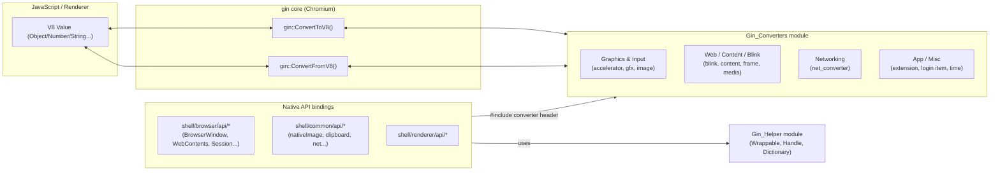
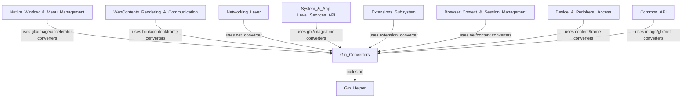

# Gin Converters

## 1. Purpose & Overview

The **Gin Converters** module is the type-marshalling backbone that lets Electron's C++ (browser, renderer, and utility process) code exchange values with JavaScript running on V8. It is a collection of `gin::Converter<T>` template specializations — one (or a family of related ones) per header — that teach [gin](https://chromium.googlesource.com/chromium/src/+/main/gin/) (Chromium's lightweight V8 binding library) how to translate between native C++ types and V8 `Local<Value>`s.

Every Electron native API exposed to JavaScript (`BrowserWindow`, `WebContents`, `net`, `nativeImage`, menu accelerators, notifications, etc.) ultimately relies on converters defined here to:

* **Serialize** (`ToV8`) C++ objects (e.g. `gfx::Rect`, `net::AuthChallengeInfo`, `content::WebContents*`) into JavaScript objects/values returned from native methods or emitted in events.
* **Deserialize** (`FromV8`) JavaScript values (numbers, plain objects, arrays) passed as arguments into strongly-typed C++ structures used by the rest of the codebase.

Because converters are stateless template specializations, this module has **no runtime class hierarchy** of its own — its "architecture" is simply the set of C++ types it knows how to convert, grouped by the subsystem that owns those types (graphics, web/content, networking, misc app types).

This module is one of several sibling modules under **Common Native Gin Infrastructure**, alongside [Gin_Helper](Gin_Helper.md) (which provides the `Wrappable`, `Handle<T>`, `ObjectTemplateBuilder`, `Arguments`, `Promise` etc. building blocks for defining native JS objects/classes) and the [Common_API](Common_API.md), [Node_Bindings](Node_Bindings.md) and [V8_Node_Common_Utils](V8_Node_Common_Utils.md) modules. Gin Converters supplies the **data-level** glue, while Gin Helper supplies the **object/class-level** glue; together they form the foundation used by nearly every native `shell/browser/api/*` and `shell/common/api/*` binding across the codebase.

## 2. Architecture Overview

All converters follow the same pattern defined by gin:

```cpp
namespace gin {
template <>
struct Converter<NativeType> {
  static v8::Local<v8::Value> ToV8(v8::Isolate*, const NativeType&);
  static bool FromV8(v8::Isolate*, v8::Local<v8::Value>, NativeType* out);
};
}
```

Native API bindings (built with `gin_helper::Dictionary`, `gin_helper::ObjectTemplateBuilder`, or `gin::Arguments`, all from [Gin_Helper](Gin_Helper.md)) call `gin::ConvertToV8` / `gin::ConvertFromV8`, which resolve to the appropriate specialization at compile time via ADL/template lookup. This module has no explicit "entry point" — instead, any code that `#include`s a given converter header gains the ability to convert that type.



## 3. Sub-modules

Because every file in this module independently specializes `gin::Converter<T>` for a distinct family of C++ types, the module is organized (for documentation purposes) into four topical groups. Each group is documented in its own file:

| Sub-module | Description | Doc |
|---|---|---|
| **Graphics & Input Converters** | Converters for geometry (`gfx::Point/Rect/Size/Insets/ColorSpace`), images (`gfx::Image`, `gfx::ImageSkia`), and keyboard accelerators (`ui::Accelerator`). Used pervasively by windowing, tray, and menu APIs. | [Gin_Converters_graphics.md](Gin_Converters_graphics.md) |
| **Web / Content / Blink Converters** | Converters for Blink/content input & messaging types (`WebKeyboardEvent`, `WebMouseEvent`, `CloneableMessage`, `ContextMenuParams`, `RenderFrameHost*`, `WebContents*`, `MediaStreamRequest`). Backbone of the `webContents`, context-menu, and IPC/messaging APIs. | [Gin_Converters_web_content.md](Gin_Converters_web_content.md) |
| **Networking Converters** | Converters for `net`/`network` types (`AuthChallengeInfo`, `X509Certificate`, `HttpResponseHeaders`, `ResourceRequest`, DNS resolution options). Used by `net`, `session`, protocol, and certificate APIs. | [Gin_Converters_network.md](Gin_Converters_network.md) |
| **App & Misc Converters** | Converters for smaller, app-level types: `extensions::Extension`, `LoginItemSettings`/`LaunchItem`, and `base::Time`. | [Gin_Converters_misc.md](Gin_Converters_misc.md) |

## 4. How this module fits into the system



* **Native_Window_&_Menu_Management**, **System_&_App-Level_Services_API**, and **Desktop_UI_Widgets_&_Dialogs** rely heavily on the graphics/input converters to marshal window bounds, tray icons, and accelerators.
* **WebContents_Rendering_&_Communication**, **Browser_Context_&_Session_Management**, and **Device_&_Peripheral_Access** rely on the web/content converters to pass `WebContents*`, `RenderFrameHost*`, keyboard/mouse events, and permission/media-stream data across the JS boundary.
* **Networking_Layer** and session/protocol APIs in **Browser_Context_&_Session_Management** rely on the networking converters to expose HTTP headers, certificates, and request/response bodies to JavaScript.
* **Extensions_Subsystem** uses the extension converter to expose `Extension` metadata to JS, and **System_&_App-Level_Services_API** uses the login-item and time converters for auto-launch settings and timestamps.
* All of the above sit on top of [Gin_Helper](Gin_Helper.md), which provides the object/class scaffolding (`Wrappable`, `Handle<T>`, `ObjectTemplateBuilder`, `Arguments`) that *uses* these converters when reading function arguments or building return values.
