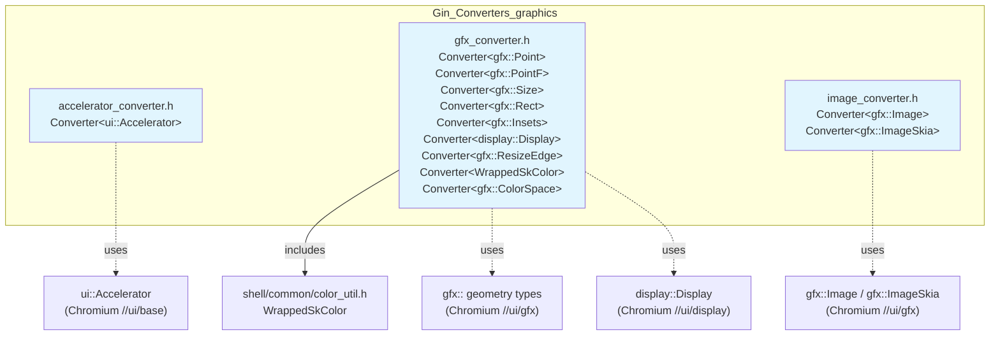
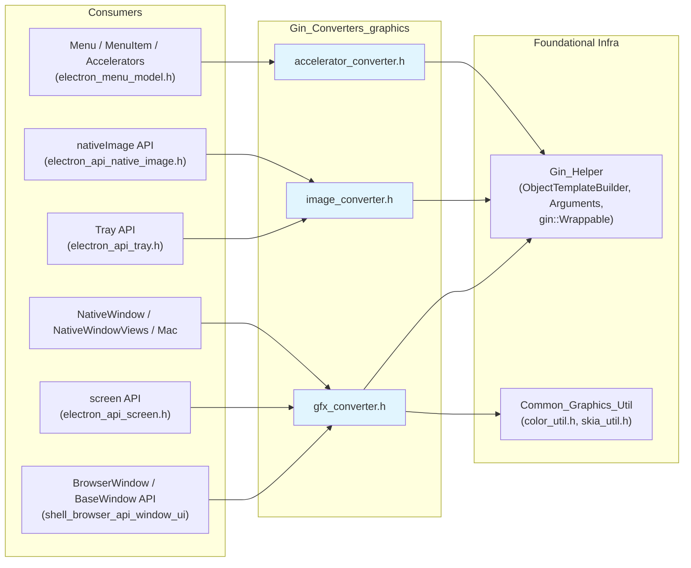
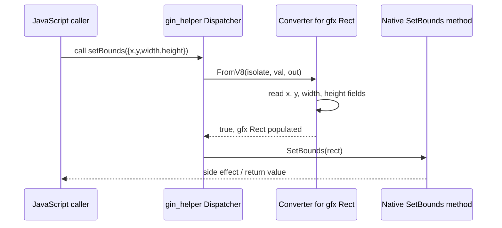
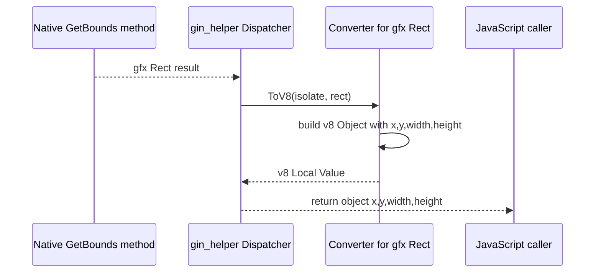
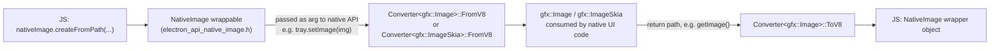

# Gin Converters — Graphics

## Introduction

**Gin Converters — Graphics** is a focused set of C++ header files that teach Chromium's [`gin`](https://chromium.googlesource.com/chromium/src/+/main/gin/) V8-binding library how to translate **graphics-related native types** to and from JavaScript values. It is the bridge that allows Electron's native (C++) window, menu, and image APIs to accept and return plain JavaScript objects such as `{ x, y }`, `{ width, height }`, `{ x, y, width, height }`, hex color strings, and `NativeImage`/`nativeImage` values, without every call site having to hand-write marshalling code.

This module is a leaf child of [Gin_Converters](Gin_Converters.md), which itself lives under [Common_Native_Gin_Infrastructure](Common_Native_Gin_Infrastructure.md). It sits alongside two sibling converter groups:

- [Gin_Converters_web_content](Gin_Converters_web_content.md) — input events, frames, context menus, media streams
- [Gin_Converters_network](Gin_Converters_network.md) — network/certificate/HTTP types
- [Gin_Converters_misc](Gin_Converters_misc.md) — extensions, login items, time

Graphics converters are consumed throughout the codebase wherever native geometry, color, or image data crosses the JS/C++ boundary — most heavily in [Native_Window_&_Menu_Management](Native_Window_%26_Menu_Management.md), [Desktop_UI_Widgets_&_Dialogs](Desktop_UI_Widgets_%26_Dialogs.md), and [System_&_App-Level_Services_API](System_%26_App-Level_Services_API.md) (e.g. `screen`, `nativeImage`, `Tray`, `BrowserWindow`).

---

## 1. Purpose & Scope

| Concern | Description |
|---|---|
| **What** | `gin::Converter<T>` template specializations for geometry (`gfx::Point`, `gfx::PointF`, `gfx::Size`, `gfx::Rect`, `gfx::Insets`), color space (`gfx::ColorSpace`), display info (`display::Display`), resize edges (`gfx::ResizeEdge`), wrapped Skia colors (`WrappedSkColor`), images (`gfx::Image`, `gfx::ImageSkia`), and keyboard accelerators (`ui::Accelerator`). |
| **Why** | Electron's public JS API (`BrowserWindow`, `screen`, `nativeImage`, `Menu`, `Tray`, etc.) exposes plain JS objects/strings for these concepts. Gin needs explicit conversion logic since these are Chromium/Skia C++ types with no built-in gin support. |
| **Where used** | Any native API binding (built with [Gin_Helper](Gin_Helper.md)'s `ObjectTemplateBuilder`, `Arguments`, or `gin::Wrappable`) that accepts or returns one of these types as a method argument/return value. |
| **Not in scope** | Web content/input event converters, network converters, and other misc converters — see sibling modules above. |

---

## 2. File / Component Overview

### 2.1 `accelerator_converter.h`
Defines `gin::Converter<ui::Accelerator>::FromV8`. Converts a JS accelerator string (e.g. `"CmdOrCtrl+Shift+Z"`) into a Chromium `ui::Accelerator`, used by keyboard shortcut parsing (menu items, `globalShortcut`).

> Only `FromV8` is implemented — accelerators are write-only from JS into native structures; Electron never needs to serialize a `ui::Accelerator` back out to JS.

### 2.2 `gfx_converter.h`
The largest file in the module. Provides bidirectional (`ToV8`/`FromV8`) converters for the fundamental 2D geometry primitives used across nearly every native UI API surface:

| Type | JS Shape | Notes |
|---|---|---|
| `gfx::Point` | `{ x: number, y: number }` | Integer point |
| `gfx::PointF` | `{ x: number, y: number }` | Float point |
| `gfx::Size` | `{ width: number, height: number }` | |
| `gfx::Rect` | `{ x, y, width, height }` | Composed of Point + Size |
| `gfx::Insets` | `{ top, left, bottom, right }` | Used for padding/margins |
| `display::Display` | Display info object (`bounds`, `workArea`, `scaleFactor`, etc.) | Backing type for `screen` module |
| `gfx::ResizeEdge` | string enum (`"top"`, `"bottom-right"`, ...) | `ToV8` only |
| `WrappedSkColor` | Hex/CSS color string (`"#RRGGBB"` etc.) | `FromV8` only; wraps `SkColor` (see [`color_util.h`](Common_Graphics_Util.md)) |
| `gfx::ColorSpace` | Color space descriptor object | |

### 2.3 `image_converter.h`
Provides converters for Chromium's image types, layered on top of Electron's own `NativeImage` JS wrapper (see [`electron_api_native_image.h`](Common_API.md)):

- `Converter<gfx::ImageSkia>::FromV8` — extracts a raw `ImageSkia` from a JS `NativeImage` instance.
- `Converter<gfx::Image>` — full bidirectional conversion between `gfx::Image` and the JS `NativeImage` wrapper object.

---

## 3. Dependency Diagram

Key relationships:
- **Gin_Helper** ([doc](Gin_Helper.md)) supplies the generic `gin::Converter` machinery, `ObjectTemplateBuilder`, `Arguments`, and callback dispatching (`function_template.h`) that invoke these converters automatically when native methods are called from JS or return values to JS.
- **Common_Graphics_Util** ([doc](Common_Graphics_Util.md)) supplies `WrappedSkColor` (a thin wrapper enabling gin to disambiguate `SkColor` — a plain `uint32_t` typedef — from other integer types) and Skia scaling helpers used when building `ImageSkia` reps.
- Downstream, essentially every native windowing, menu, tray, and image API described in [Native_Window_&_Menu_Management](Native_Window_%26_Menu_Management.md), [Desktop_UI_Widgets_&_Dialogs](Desktop_UI_Widgets_%26_Dialogs.md), and [System_&_App-Level_Services_API](System_%26_App-Level_Services_API.md) rely on these converters implicitly whenever their bound methods accept/return `gfx::Rect`, `gfx::Point`, `gfx::Size`, colors, images, or accelerators.

---

## 4. Data Flow — JS ↔ Native Conversion

### 4.1 Calling a native method with a plain JS object (`FromV8`)

### 4.2 Returning a native value to JS (`ToV8`)

### 4.3 Color conversion (write-only)

`WrappedSkColor::FromV8` allows any bound setter (e.g. `win.setBackgroundColor('#FFAA00')`) to accept a hex/CSS/named color string and produce a native `SkColor`. Because `SkColor` is just a `typedef uint32_t`, gin cannot distinguish it from other integers — `WrappedSkColor` is the disambiguating wrapper type used solely at the API boundary; internal code continues to use plain `SkColor`.

### 4.4 Image conversion

---

## 5. Component Relationship Diagram

```mermaid
classDiagram
    class GinConverterTemplate {
        <<template>>
        +FromV8(isolate, val, T* out) bool
        +ToV8(isolate, T val) Local~Value~
    }

    class Converter_uiAccelerator {
        +FromV8(isolate, val, Accelerator* out) bool
    }
    class Converter_gfxPoint {
        +ToV8(isolate, Point) Local~Value~
        +FromV8(isolate, val, Point* out) bool
    }
    class Converter_gfxPointF
    class Converter_gfxSize
    class Converter_gfxRect {
        +ToV8(isolate, Rect) Local~Value~
        +FromV8(isolate, val, Rect* out) bool
    }
    class Converter_gfxInsets
    class Converter_displayDisplay
    class Converter_gfxResizeEdge {
        +ToV8(isolate, ResizeEdge) Local~Value~
    }
    class Converter_WrappedSkColor {
        +FromV8(isolate, val, WrappedSkColor* out) bool
    }
    class Converter_gfxColorSpace
    class Converter_gfxImage {
        +FromV8(isolate, val, Image* out) bool
        +ToV8(isolate, Image) Local~Value~
    }
    class Converter_gfxImageSkia {
        +FromV8(isolate, val, ImageSkia* out) bool
    }

    GinConverterTemplate <|-- Converter_uiAccelerator
    GinConverterTemplate <|-- Converter_gfxPoint
    GinConverterTemplate <|-- Converter_gfxPointF
    GinConverterTemplate <|-- Converter_gfxSize
    GinConverterTemplate <|-- Converter_gfxRect
    GinConverterTemplate <|-- Converter_gfxInsets
    GinConverterTemplate <|-- Converter_displayDisplay
    GinConverterTemplate <|-- Converter_gfxResizeEdge
    GinConverterTemplate <|-- Converter_WrappedSkColor
    GinConverterTemplate <|-- Converter_gfxColorSpace
    GinConverterTemplate <|-- Converter_gfxImage
    GinConverterTemplate <|-- Converter_gfxImageSkia

    Converter_gfxRect --> Converter_gfxPoint : composed of
    Converter_gfxRect --> Converter_gfxSize : composed of
    Converter_gfxImage --> Converter_gfxImageSkia : may delegate
    Converter_WrappedSkColor ..> WrappedSkColor : wraps SkColor
```

`WrappedSkColor` is defined in [`color_util.h`](Common_Graphics_Util.md) and included by `gfx_converter.h` specifically to give gin a distinct type to specialize on for color-string parsing.

---

## 6. Integration Points

### 6.1 How converters get invoked
Native API objects are built with [`gin_helper::ObjectTemplateBuilder`](Gin_Helper.md) (`SetMethod`, `SetProperty`) and the `Invoker`/`Dispatcher` templates in `function_template.h`. When a bound function's C++ signature includes `gfx::Rect`, `gfx::Point`, `ui::Accelerator`, `gfx::Image`, etc., the generic invoker automatically calls the matching `gin::Converter<T>::FromV8`/`ToV8` specialization defined in this module — no manual marshalling code is required in the API implementation.

### 6.2 Representative Consumers

| Consumer Area | Doc | Typical Types Used |
|---|---|---|
| BrowserWindow / BaseWindow bounds, resizing | [Native_Window_&_Menu_Management](Native_Window_%26_Menu_Management.md) | `gfx::Rect`, `gfx::Point`, `gfx::Size`, `gfx::ResizeEdge` |
| `screen` module (displays, cursor position) | [System_&_App-Level_Services_API](System_%26_App-Level_Services_API.md) | `display::Display`, `gfx::Point`, `gfx::PointF`, `gfx::Rect` |
| `nativeImage` / `Tray` / `NativeTheme` icons | [System_&_App-Level_Services_API](System_%26_App-Level_Services_API.md), [Native_Window_&_Menu_Management](Native_Window_%26_Menu_Management.md) | `gfx::Image`, `gfx::ImageSkia` |
| Menu accelerators / `globalShortcut` | [Desktop_UI_Widgets_&_Dialogs](Desktop_UI_Widgets_%26_Dialogs.md) | `ui::Accelerator` |
| Window background color, `setVibrancy`, etc. | [Native_Window_&_Menu_Management](Native_Window_%26_Menu_Management.md) | `WrappedSkColor` |

---

## 7. Design Notes

- **Header-only declarations, `.cc` implementations elsewhere**: each header only declares the `gin::Converter<T>` specialization; the actual `FromV8`/`ToV8` bodies live in matching `.cc` files (not part of the public "core component" surface but present in the source tree) to keep the templates lightweight to include.
- **Directional asymmetry is intentional**: `ui::Accelerator` and `WrappedSkColor` only need `FromV8` (JS → native) because Electron's public API never returns these as raw types to JS (accelerators are re-serialized as display strings elsewhere; colors are returned as hex strings via distinct helper code, not through this converter).
- **Composability**: `gfx::Rect`'s converter is conceptually built from the `Point` + `Size` fields, mirroring how the JS object shape flattens both into one object.
- **No business logic**: this module intentionally contains zero application/domain logic — it is purely a serialization boundary layer, keeping it stable and reusable across every feature module that touches graphics primitives.

---

## 8. Related Documentation

- [Gin_Converters (parent)](Gin_Converters.md)
- [Gin_Converters_web_content](Gin_Converters_web_content.md)
- [Gin_Converters_network](Gin_Converters_network.md)
- [Gin_Converters_misc](Gin_Converters_misc.md)
- [Gin_Helper](Gin_Helper.md)
- [Common_Graphics_Util](Common_Graphics_Util.md)
- [Common_API](Common_API.md) (NativeImage JS wrapper)
- [Native_Window_&_Menu_Management](Native_Window_%26_Menu_Management.md)
- [Desktop_UI_Widgets_&_Dialogs](Desktop_UI_Widgets_%26_Dialogs.md)
- [System_&_App-Level_Services_API](System_%26_App-Level_Services_API.md)
