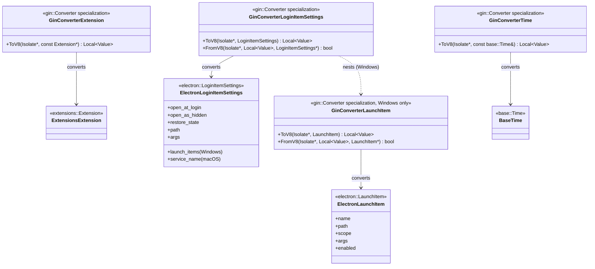
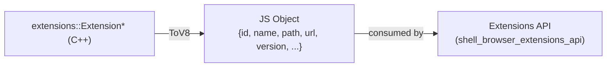
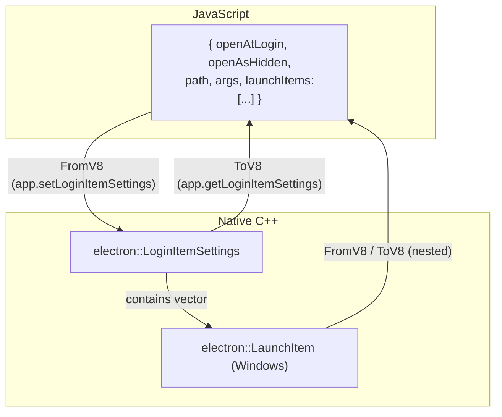
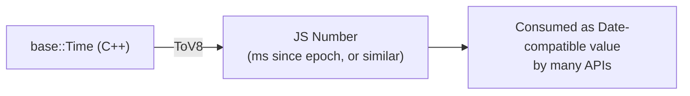
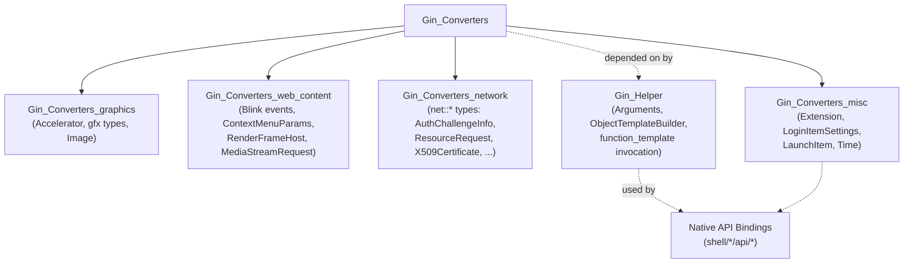
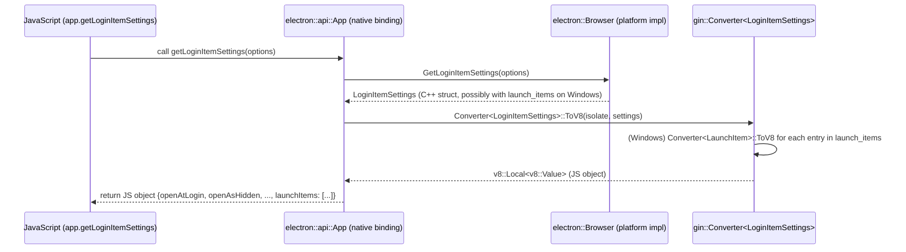
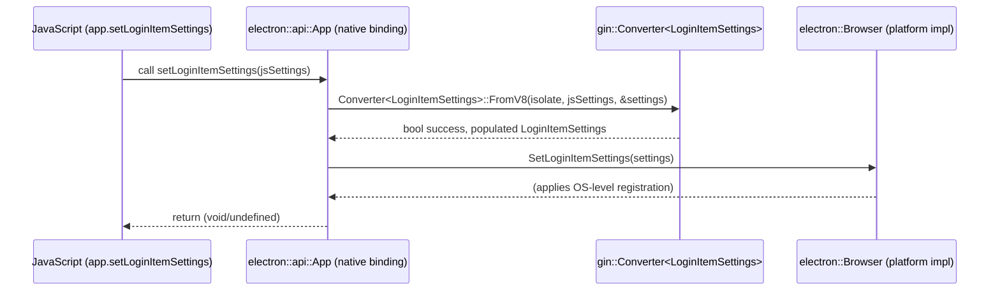

# Gin Converters: Miscellaneous (`Gin_Converters_misc`)

## Introduction

The `Gin_Converters_misc` module is a small but essential part of Electron's native/JavaScript bridge infrastructure. It provides [Gin](https://chromium.googlesource.com/chromium/src/+/main/gin/README.md) type converter specializations for a handful of miscellaneous C++ types that don't fit into the more focused converter categories (graphics, web content, or networking). Specifically, this module converts:

- **`extensions::Extension`** — Chromium's extension metadata object, converted to a JavaScript representation for the Extensions API.
- **`electron::LoginItemSettings`** / **`electron::LaunchItem`** — Structures describing OS-level "login item" / "launch at startup" configuration, used by Electron's `app.setLoginItemSettings()` / `app.getLoginItemSettings()` APIs on Windows and macOS.
- **`base::Time`** — Chromium's time representation, converted to a JavaScript `Date`-compatible numeric value (or similar).

These converters are template specializations of `gin::Converter<T>`, following the standard Gin pattern of providing `ToV8` (C++ → JS) and, where two-way conversion is needed, `FromV8` (JS → C++) static methods. They allow native Electron APIs implemented in C++ to seamlessly exchange these specific data types with JavaScript code running in V8, without each API call site needing to hand-roll serialization logic.

This module is one of several sibling "Gin Converters" modules that together compose the full set of type marshalling utilities used throughout Electron's native API surface. See [Gin_Converters_graphics.md](Gin_Converters_graphics.md), [Gin_Converters_web_content.md](Gin_Converters_web_content.md), and [Gin_Converters_network.md](Gin_Converters_network.md) for the other converter families, and [Gin_Helper.md](Gin_Helper.md) for the broader helper infrastructure (argument parsing, callbacks, object wrapping, etc.) that consumes these converters.

---

## Purpose & Scope

Gin converters are the mechanism by which Electron exposes native C++ data structures to JavaScript (and vice versa) in a strongly-typed, boilerplate-free way. Rather than manually building V8 objects field-by-field at every call site, Electron API implementations declare a parameter or return type, and the Gin converter machinery (via `gin::Converter<T>::ToV8` / `FromV8`) automatically performs the translation.

The "misc" bucket exists because:
1. **`Extension`** conversion is tied to the Extensions subsystem, and is a one-way (C++ → JS) read-only projection of extension metadata.
2. **`LoginItemSettings`/`LaunchItem`** conversion is tied to OS auto-launch configuration APIs (`app.setLoginItemSettings`, `app.getLoginItemSettings`), which are platform-specific (particularly on Windows, where `LaunchItem` enumerates per-item launch entries).
3. **`Time`** conversion is a general-purpose utility used by many unrelated APIs (e.g., file stats, cookie expiration, download timestamps) that need to hand a `base::Time` value to JS as a `Date`-friendly number.

None of these three converters share a natural grouping with the graphics, web-content, or network converter sets, hence their placement in this catch-all module.

---

## Architecture

### Component Overview

### File-to-Type Mapping

| File | Converter(s) | Direction | Notes |
|---|---|---|---|
| `shell/common/gin_converters/extension_converter.h` | `gin::Converter<const extensions::Extension*>` | C++ → JS only | Used by Extensions API bindings to expose extension metadata to JS |
| `shell/common/gin_converters/login_item_settings_converter.h` | `gin::Converter<electron::LoginItemSettings>`, `gin::Converter<electron::LaunchItem>` (Windows only) | Bi-directional | `LaunchItem` conversion is compiled only under `BUILDFLAG(IS_WIN)` |
| `shell/common/gin_converters/time_converter.h` | `gin::Converter<base::Time>` | C++ → JS only | General utility, used broadly across the codebase |

---

## Component Details

### 1. Extension Converter

- **Type:** `gin::Converter<const extensions::Extension*>`
- **Direction:** One-way — only `ToV8` is defined. There is no `FromV8` because extensions are not constructed from arbitrary JS objects; they are loaded from disk/manifest via the extension system.
- **Consumers:** Primarily the [Extensions_Subsystem](Extensions_Subsystem.md) module, notably APIs like `session.getAllExtensions()`, `session.loadExtension()`, and the `Extension` object exposed to JS in `shell/browser/api/electron_api_extensions.h` (`Extensions` class, part of [shell_browser_api_system_device.md](shell_browser_api_system_device.md) / `shell_browser_extensions_core`).
- **Behavior:** Serializes select fields of the native `extensions::Extension` (id, name, path, version, manifest data, etc.) into a plain JS object, allowing extension metadata to be inspected from JavaScript without exposing the full native object.

### 2. Login Item Settings & Launch Item Converters

- **Types:**
  - `gin::Converter<electron::LoginItemSettings>` — bi-directional, all platforms.
  - `gin::Converter<electron::LaunchItem>` — bi-directional, **Windows-only** (`#if BUILDFLAG(IS_WIN)`).
- **Data Structures:**
  - `LoginItemSettings` holds cross-platform fields (`open_at_login`, `open_as_hidden`, `restore_state`, `path`, `args`) plus platform-specific fields:
    - **macOS:** `type`, `service_name`, `status` (login item "service" model), `opened_at_login`, `opened_as_hidden`.
    - **Windows:** `enabled`, `name`, `executable_will_launch_at_login`, and a `std::vector<LaunchItem>` (`launch_items`) enumerating each registered startup entry.
  - `LaunchItem` (Windows only) represents a single startup entry: `name`, `path`, `scope`, `args`, `enabled`.
- **Consumers:** The `App` native binding (`shell/browser/api/electron_api_app.h`, part of [shell_browser_api_system_device_app_process.md](shell_browser_api_system_device_app_process.md)) uses these converters to implement `app.getLoginItemSettings()` (native → JS via `ToV8`) and `app.setLoginItemSettings(settings)` (JS → native via `FromV8`). The underlying OS integration is implemented in `shell/browser/browser.h` / platform-specific `Browser` implementations (see [shell_browser_core_lifecycle.md](shell_browser_core_lifecycle.md)), where these structs are originally defined.
- **Note on ownership:** The struct definitions (`LoginItemSettings`, `LaunchItem`) live in `shell/browser/browser.h` ([Browser_Process_Core_&_Lifecycle](Browser_Process_Core_&_Lifecycle.md)); this module only supplies the Gin marshalling logic that lets those structs cross the native/JS boundary.

### 3. Time Converter

- **Type:** `gin::Converter<base::Time>`
- **Direction:** One-way — only `ToV8` is defined (no `FromV8`). This suggests the converter is used to *expose* timestamps to JS (e.g., as numbers usable with `new Date(...)`), while native code typically constructs `base::Time` values internally rather than parsing them from JS.
- **Consumers:** This is a broadly-used utility converter. Any native API returning a timestamp to JavaScript may depend on it — e.g., cookie expiration/creation timestamps ([shell_browser_api_session_net_cookies_datapipe.md](shell_browser_api_session_net_cookies_datapipe.md)), download item timestamps, process/app launch times ([shell_browser_api_system_device_app_process.md](shell_browser_api_system_device_app_process.md)), and file system stats.

---

## Position in the Gin Converters Family

`Gin_Converters_misc` is one of four sibling modules under `Gin_Converters` (which itself is a child of [Common_Native_Gin_Infrastructure](Common_Native_Gin_Infrastructure.md)):

All converter modules follow the same pattern established by Gin: template specialization of `gin::Converter<T>` with static `ToV8`/`FromV8` methods. The [Gin_Helper](Gin_Helper.md) module's `function_template.h` and `arguments.h` machinery invoke these converters implicitly whenever a bound native function's signature includes one of these types as a parameter or return value.

---

## Data Flow Example: `app.getLoginItemSettings()`

## Data Flow Example: `app.setLoginItemSettings(settings)`

---

## Relationship to Other Modules

- **[Browser_Process_Core_&_Lifecycle](Browser_Process_Core_&_Lifecycle.md):** Defines the `LoginItemSettings` and `LaunchItem` structs (in `shell/browser/browser.h`) that this module's converters marshal. The `Browser` class implements the platform-specific logic for reading/writing OS auto-launch registrations.
- **[Extensions_Subsystem](Extensions_Subsystem.md):** Defines `extensions::Extension` and consumes the `Extension` converter to expose extension objects to JavaScript (e.g., via `session.extensions`).
- **[shell_browser_api_system_device_app_process](shell_browser_api_system_device_app_process.md):** The `App` native binding is the primary consumer of the `LoginItemSettings`/`LaunchItem` converters via its `getLoginItemSettings`/`setLoginItemSettings` methods.
- **[Gin_Helper](Gin_Helper.md):** Provides the generic function-binding and argument-marshalling infrastructure (`function_template.h`, `arguments.h`, `object_template_builder.h`) that automatically invokes these `gin::Converter<T>` specializations when native methods are called from JS.
- **[Gin_Converters_graphics](Gin_Converters_graphics.md), [Gin_Converters_web_content](Gin_Converters_web_content.md), [Gin_Converters_network](Gin_Converters_network.md):** Sibling converter modules covering other type domains; together with this module they form the complete `Gin_Converters` family.

---

## Design Notes

- **Minimal, focused headers:** Each converter file is intentionally small and self-contained, declaring only the `gin::Converter<T>` specialization(s) needed for a specific type or tightly related pair of types (e.g., `LoginItemSettings` + `LaunchItem`).
- **Forward declarations over includes:** Files use forward declarations (`class Extension;`, `class Time;`, `struct LoginItemSettings;`) in the header, keeping compile-time dependencies light. Actual conversion logic lives in corresponding `.cc` files (not shown here) that include the full type definitions.
- **Platform conditioning:** The `LaunchItem` converter is guarded by `BUILDFLAG(IS_WIN)` since the concept of enumerable "launch items" (distinct startup registrations, e.g. multiple Task Scheduler entries) is a Windows-specific detail; on macOS/Linux, `LoginItemSettings` is flatter and doesn't need this nested type.
- **Asymmetric conversion:** `Extension` and `Time` converters are one-way (`ToV8` only) because their native instances are never constructed directly from arbitrary JS input — they originate from trusted native sources (loaded extension manifests, internal clocks/timestamps). `LoginItemSettings`/`LaunchItem`, by contrast, need `FromV8` because users configure them via JS calls to `app.setLoginItemSettings()`.
