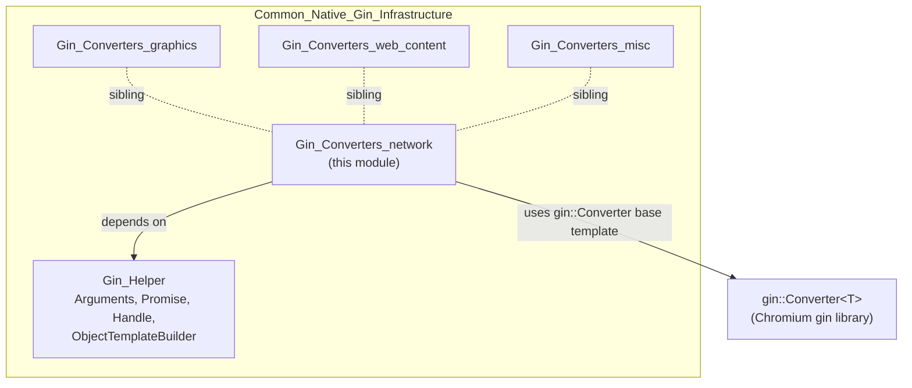
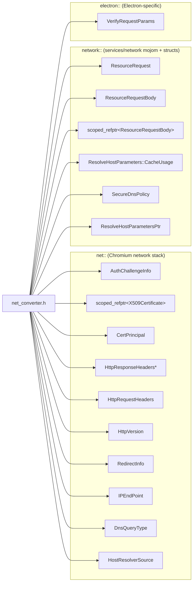
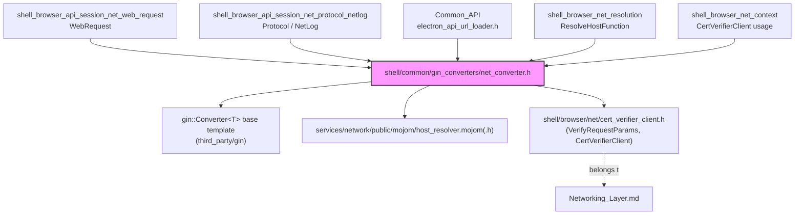
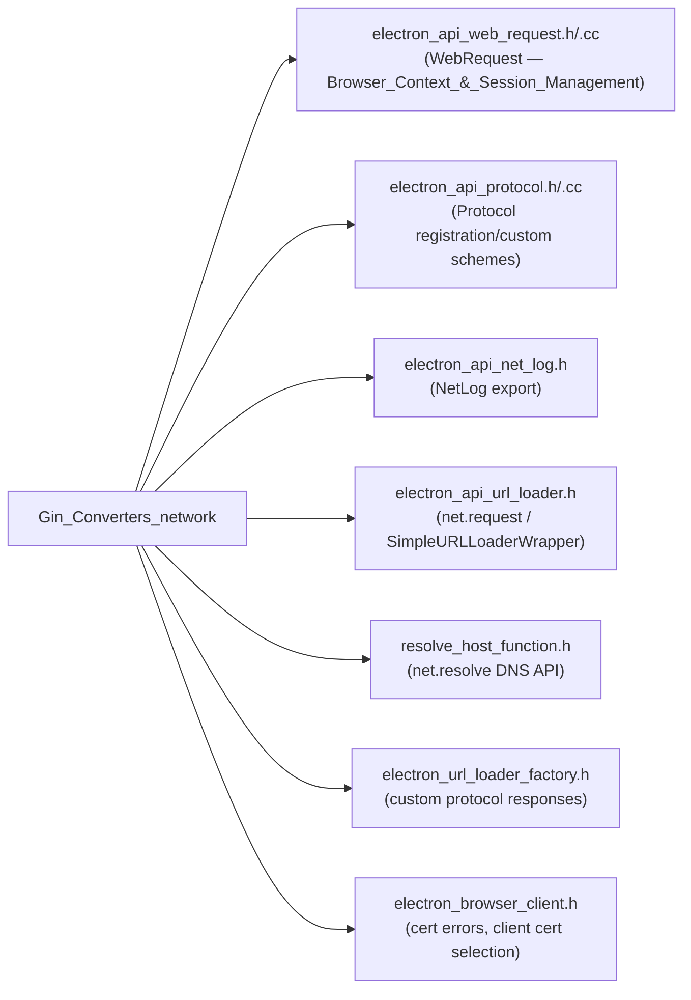
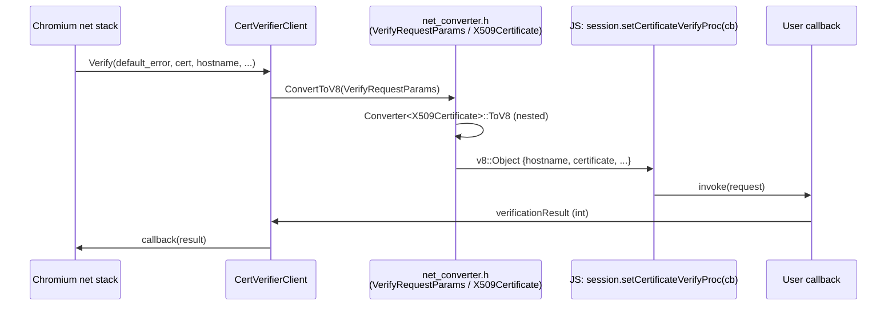
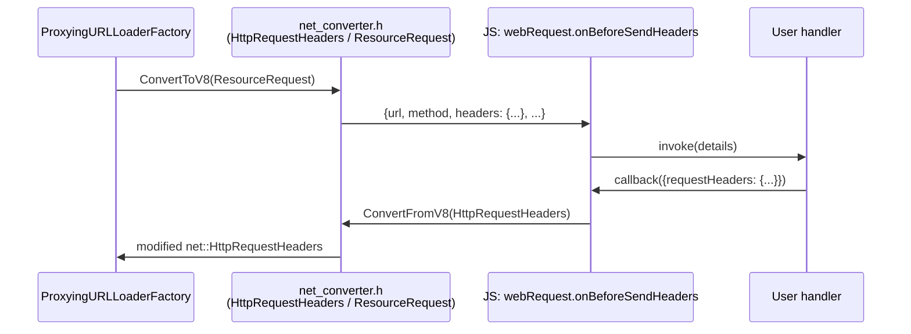
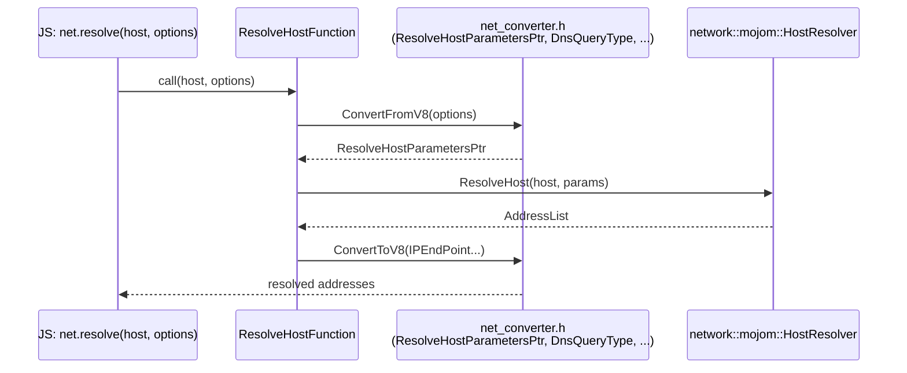

# Gin Converters: Network

## Introduction

The **Gin_Converters_network** module provides the type-marshalling glue that lets Electron's C++ networking primitives cross the V8/JavaScript boundary. It is a thin, header-only layer built on top of Chromium's [`gin::Converter`](https://source.chromium.org/chromium/chromium/src/+/main:gin/converter.h) template mechanism, specializing it for the network-related types used throughout Electron's `net` module (`session.cookies`, `net.request`, `webRequest`, certificate handling, host resolution, etc.).

This module contains a single translation unit — `shell/common/gin_converters/net_converter.h` — but it is exercised from many other subsystems whenever a native network object (a certificate, an HTTP header, a resource request, etc.) needs to be exposed to or constructed from JavaScript.

It is one of several sibling "Gin Converter" modules that partition converter specializations by domain:

| Sibling module | Domain |
|---|---|
| [Gin_Converters_graphics.md](Gin_Converters_graphics.md) | Accelerators, `gfx::Point/Rect/Size`, images |
| [Gin_Converters_web_content.md](Gin_Converters_web_content.md) | Blink input events, context menus, frames, media streams |
| [Gin_Converters_misc.md](Gin_Converters_misc.md) | Extensions, login item settings, time |
| **Gin_Converters_network (this module)** | `net::`/`network::` types: certificates, headers, requests, DNS |

All of these sit under the parent [Common_Native_Gin_Infrastructure.md](Common_Native_Gin_Infrastructure.md) umbrella, alongside [Gin_Helper.md](Gin_Helper.md) (which supplies the underlying `gin_helper::Promise`, `Arguments`, `Handle`, and object-template machinery that many of these converters and their call sites depend on).

## Purpose & Scope

Electron's JavaScript API frequently needs to pass complex native network objects into and out of V8, for example:

- Returning certificate chain details to `app.on('certificate-error', ...)` or `net.request` TLS callbacks.
- Serializing/deserializing HTTP request/response headers for `webRequest` and `protocol` handlers.
- Converting `network::ResourceRequest`/`ResourceRequestBody` (including upload bodies) for custom protocol handlers and `net.ClientRequest`.
- Supplying parameters for `net.resolve()` (DNS resolution options and results).
- Bridging Electron's internal `VerifyRequestParams` (used by the custom certificate verifier) into JS-visible objects.

Rather than writing manual V8 object construction/parsing code at every call site, Electron specializes `gin::Converter<T>` for each of these types once, in this module, so any code that uses `gin::ConvertToV8()` / `gin::ConvertFromV8()` (or the higher-level helpers in [Gin_Helper.md](Gin_Helper.md)) gets automatic, consistent conversion.

## Architecture

### Position in the Gin Converter Family

### Converter Coverage Map

`net_converter.h` declares `gin::Converter<T>` specializations for the following native types, each mapping to (or from) a plain JS object/array/string:

Note some converters are **bidirectional** (`ToV8` and `FromV8`, e.g. `X509Certificate`, `HttpResponseHeaders*`, `HttpRequestHeaders`, `ResourceRequestBody` ref, DNS-related enums/structs), while others are **one-directional**:
- `ToV8`-only: `AuthChallengeInfo`, `CertPrincipal`, `ResourceRequestBody` (value), `ResourceRequest`, `VerifyRequestParams`, `HttpVersion`, `RedirectInfo`, `IPEndPoint` — these represent data flowing *out* of native code into JS callbacks/events.
- `FromV8`-only: `DnsQueryType`, `HostResolverSource`, `ResolveHostParameters::CacheUsage`, `SecureDnsPolicy`, `ResolveHostParametersPtr` — these represent *options* parsed from JS-supplied dictionaries (e.g., `net.resolve()` options).

A generic helper template, `Converter<std::vector<std::pair<K, V>>>`, is also provided in this header to convert a plain JS object into a vector of key/value pairs — used for things like HTTP header maps where ordering and duplicate keys must be preserved (unlike a JS `Map`/object with unique keys).

## Key Components

### `net::AuthChallengeInfo` → JS
Produces the object passed to the `login` event / `app.on('login', ...)` and similar HTTP auth challenge callbacks (realm, scheme, host, port, is-proxy, etc.).

### `net::X509Certificate` (bidirectional)
Used for certificate objects surfaced in `certificate-error`, `select-client-certificate`, and TLS-related APIs. `FromV8` allows JS code (e.g., in `net.request`) to hand back a certificate reference selected by the user.

### `net::CertPrincipal`
Represents the subject/issuer fields of a certificate (common name, org, org unit, country, etc.) — nested inside the `X509Certificate` conversion.

### `net::HttpResponseHeaders*` / `net::HttpRequestHeaders` (bidirectional)
Converts Chromium's raw header containers to/from a JS object mapping header name → value(s). Used extensively by `webRequest`, `protocol`, and `net.ClientRequest`/`IncomingMessage`.

### `network::ResourceRequestBody` / `scoped_refptr<ResourceRequestBody>`
Represents upload data (raw bytes, files, blobs) attached to a request. The `scoped_refptr` variant is bidirectional, enabling custom protocol handlers to both read and construct request bodies.

### `network::ResourceRequest`
Serializes a full network request descriptor (URL, method, headers, referrer, etc.) to JS — used when intercepting/inspecting requests via `protocol.handle`/`webRequest`.

### `electron::VerifyRequestParams`
Bridges Electron's custom certificate-verification hook (see [`CertVerifierClient`](Networking_Layer.md)) to the JS-level `setCertificateVerifyProc` callback, exposing hostname, default result/error code, and the certificate chain.

### `net::HttpVersion`, `net::RedirectInfo`, `net::IPEndPoint`
Small supporting converters used when reporting response metadata (HTTP version string, redirect chain info, and resolved socket addresses) back to JS, notably from `net.request`'s response/redirect events and DNS resolution results.

### DNS / Host Resolution converters
`net::DnsQueryType`, `net::HostResolverSource`, `network::mojom::ResolveHostParameters::CacheUsage`, `network::mojom::SecureDnsPolicy`, and `network::mojom::ResolveHostParametersPtr` are all `FromV8`-only, parsing the options dictionary passed to `net.resolve()` / `ResolveHostFunction` (see [Networking_Layer.md](Networking_Layer.md)) into Chromium's mojom resolution-parameter types.

## Dependencies

- **Upstream dependency**: [`shell/browser/net/cert_verifier_client.h`](Networking_Layer.md) — supplies the `VerifyRequestParams` struct and the `CertVerifierClient` class that this module's converter serializes.
- **Chromium base**: `gin/converter.h` and `services/network/public/mojom/host_resolver.mojom(-forward).h` provide the base template and mojom enum/struct definitions being specialized.
- **Sibling infrastructure**: [Gin_Helper.md](Gin_Helper.md) provides `gin_helper::Dictionary`, `gin_helper::Promise`, and `gin::Wrappable`-based handle types that higher-level API bindings use *together with* these converters (e.g., building a JS options dictionary, then relying on `net_converter.h` to translate individual fields).

## Consumers (Downstream Usage)

The converters declared here are `#include`d wherever native network types must cross into V8. Major consumers include:

For details on these consuming components, see:
- [Browser_Context_&_Session_Management.md](Browser_Context_&_Session_Management.md) — `WebRequest`, `Protocol`, `NetLog`, `Session`
- [Networking_Layer.md](Networking_Layer.md) — `CertVerifierClient`, `ElectronURLLoaderFactory`, `ResolveHostFunction`, `ProxyingURLLoaderFactory`
- [Common_API](Common_Native_Gin_Infrastructure.md) — `electron_api_url_loader.h` (`net.request` implementation)
- [Browser_Process_Core_&_Lifecycle.md](Browser_Process_Core_&_Lifecycle.md) — `ElectronBrowserClient` certificate-error / client-certificate flows

## Data Flow Examples

### Certificate verification callback (native → JS → native)

### Request headers round-trip (webRequest / protocol interception)

### DNS resolution options parsing (`net.resolve()`)

## Design Notes

- **Header-only, declarative style**: Like other Gin converter modules, this file only *declares* the `Converter<T>` specializations; implementations live in the corresponding `.cc` file (`net_converter.cc`, not part of this module's core components but implied by the `ToV8`/`FromV8` static methods declared here).
- **No direct V8 object lifetime management**: These converters do not need to manage V8 handles beyond the immediate call — longer-lived JS-exposed network objects (e.g., `Cookies`, `NetLog`, `ProtocolRegistry`) are implemented as `gin::Wrappable`/`gin_helper::TrackableObject` subclasses documented in [Browser_Context_&_Session_Management.md](Browser_Context_&_Session_Management.md), which *use* these converters internally.
- **Consistency with mojom types**: By specializing converters directly on `network::mojom::*` enums (`SecureDnsPolicy`, `CacheUsage`, `ResolveHostParametersPtr`), the module keeps DNS option parsing in sync with the underlying Network Service IPC contract, reducing drift when Chromium updates.
- **Generic pair-vector converter**: The templated `Converter<std::vector<std::pair<K, V>>>` is a general-purpose utility (not net-specific in principle) but lives here because its first use case is preserving multi-valued/ordered HTTP headers; other modules needing similar semantics may reuse it.
