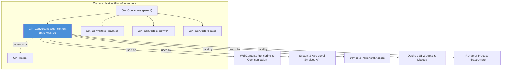
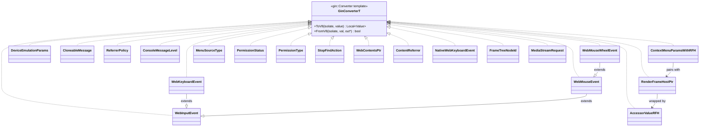
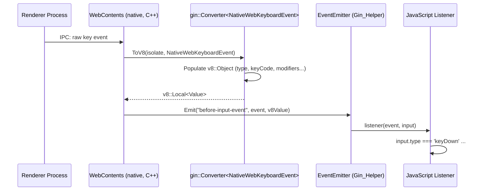
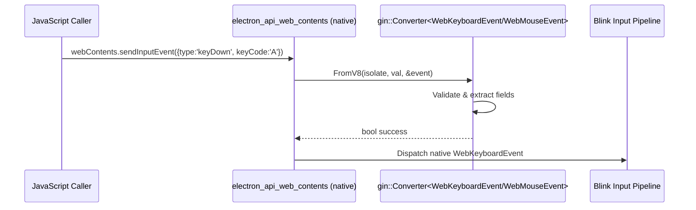
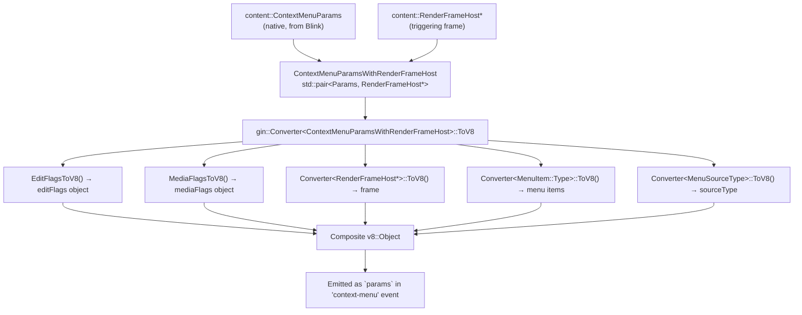
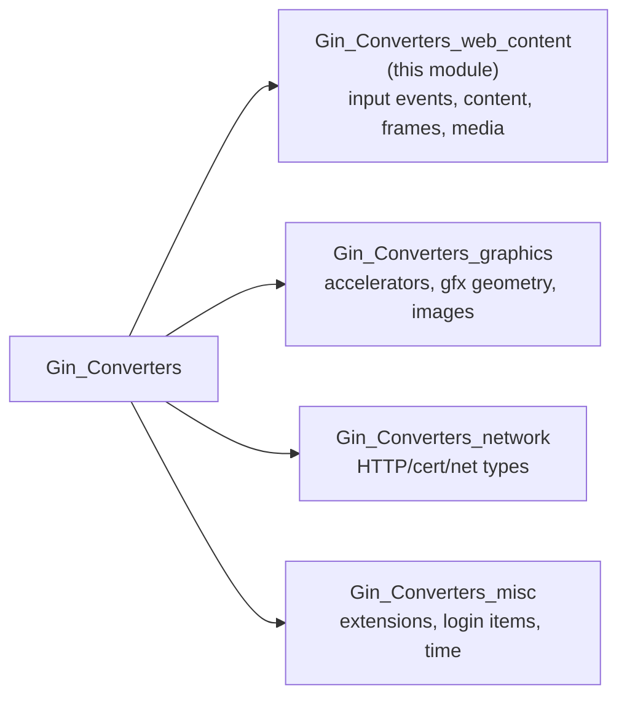

# Gin Converters: Web Content

## Introduction

The **Gin Converters: Web Content** module provides the type conversion "glue" between Chromium/Blink's C++ web-content types and V8/JavaScript values via Google's [`gin`](https://chromium.googlesource.com/chromium/src/+/main/gin/) binding library. It is a focused subset of Electron's broader [Gin Converters](Gin_Converters.md) family, specializing in converters for **input events, DOM/content structures, frame identity, and media stream requests** — the data types most frequently exchanged between Electron's native browser process code and its JavaScript API surface (e.g. `webContents`, `context-menu`, `before-input-event`, `select-bluetooth-device`, permission APIs, etc.).

Every converter in this module is implemented as a specialization of `gin::Converter<T>`, following the standard gin pattern of providing:

- `ToV8(isolate, value)` — converts a native C++ value into a `v8::Local<v8::Value>` for consumption by JavaScript.
- `FromV8(isolate, val, out)` — parses a JavaScript value back into a native C++ struct/enum, returning `true` on success.

This module has **no runtime logic of its own** beyond data marshaling: it is a pure translation layer consumed throughout the codebase wherever native web-content objects need to cross the C++/JS boundary.

---

## Purpose & Scope

| Concern | Description |
|---|---|
| **Input Events** | Converts Blink input event types (`WebInputEvent`, `WebKeyboardEvent`, `WebMouseEvent`, `WebMouseWheelEvent`, `DeviceEmulationParams`) so JS code can construct/inspect synthetic events (`webContents.sendInputEvent`, `before-input-event`). |
| **Context Menu & Content Structures** | Converts `ContextMenuParams` (paired with the originating `RenderFrameHost`), menu item types, referrer policies, permission types/status, find-in-page actions, and `WebContents*` pointers themselves. |
| **Frame Identity** | Converts `RenderFrameHost*` and `FrameTreeNodeId` to/from JS, including an `AccessorValue<RenderFrameHost*>` wrapper used for lazily-evaluated getters. |
| **Media Streams** | Converts `content::MediaStreamRequest` into a JS-consumable object for media/device permission prompts. |

This module sits at the boundary between:
- **Native browser/content internals** (Chromium `content::`, `blink::` types), and
- **Electron's JS-facing APIs**, implemented via [Gin Helper](Gin_Helper.md) (`gin_helper::Arguments`, `ObjectTemplateBuilder`, etc.) and consumed by higher-level modules such as [WebContents Rendering & Communication](WebContents_Rendering_&_Communication.md) and [System & App-Level Services API](System_&_App-Level_Services_API.md).

---

## Module Position in the System

See also: [Gin_Helper.md](Gin_Helper.md) for the underlying object/argument marshaling primitives, and [Gin_Converters_graphics.md](Gin_Converters_graphics.md) / [Gin_Converters_network.md](Gin_Converters_network.md) for sibling converter families.

---

## Components

### 1. `blink_converter.h` — Input Event & Blink-Type Converters

Provides converters for Blink's low-level input event hierarchy and related diagnostic/messaging types.

| Type | Direction | Notes |
|---|---|---|
| `blink::WebInputEvent::Type` | ToV8 / FromV8 | Maps event type enum (`mousedown`, `keyDown`, etc.) to/from string. |
| `blink::WebInputEvent` | ToV8 / FromV8 | Base fields shared by all input events (modifiers, timestamp). |
| `blink::WebKeyboardEvent` | ToV8 / FromV8 | Keyboard-specific fields (`keyCode`, `text`, `isAutoRepeat`). |
| `blink::WebMouseEvent` | ToV8 / FromV8 | Mouse fields (`x`, `y`, `button`, `clickCount`). |
| `blink::WebMouseWheelEvent` | FromV8 only | Wheel delta fields; constructed only from JS input, not serialized back. |
| `blink::DeviceEmulationParams` | FromV8 only | Used by `webContents.enableDeviceEmulation`. |
| `blink::mojom::ContextMenuDataMediaType` | ToV8 only | Media type enum for context menu (image/video/audio/none). |
| `std::optional<blink::mojom::FormControlType>` | ToV8 only | Form control type for context menu (input/select/textarea). |
| `blink::WebCacheResourceTypeStat` / `Stats` | ToV8 only | Used by `webContents` cache-stat reporting APIs. |
| `network::mojom::ReferrerPolicy` | ToV8 / FromV8 | String enum for referrer-policy values. |
| `blink::mojom::Referrer` | ToV8 / FromV8 | Composite `{url, policy}` object. |
| `blink::CloneableMessage` | ToV8 / FromV8 | Structured-clone payload used for `postMessage`/IPC (see [Preload_Script_Infrastructure](Preload_Script_Infrastructure.md) and [Public_JS_API_Bindings](Public_JS_API_Bindings.md)). |
| `blink::mojom::ConsoleMessageLevel` | ToV8 only | Console log level (`console-message` event). |

Free functions:
- `EditFlagsToV8` — converts an edit-capability bitmask (cut/copy/paste availability) into a JS object of booleans, used by context-menu editing flags.
- `MediaFlagsToV8` — converts media-element state bitmask (muted, loop, controls, etc.) into a JS object, used by context-menu media flags.

### 2. `content_converter.h` — Content Layer & Context Menu Converters

Bridges `content::` types related to page navigation, context menus, and permissions.

| Type | Direction | Notes |
|---|---|---|
| `blink::mojom::MenuItem::Type` | ToV8 only | Menu item kind used inside popup-menu data. |
| `ContextMenuParamsWithRenderFrameHost` (`std::pair<content::ContextMenuParams, content::RenderFrameHost*>`) | ToV8 only | The core converter powering the `context-menu` event's `params` object — combines menu parameters with the frame that triggered them. |
| `ui::mojom::MenuSourceType` | ToV8 / FromV8 | How the menu was invoked (mouse, keyboard, touch, etc.). |
| `blink::mojom::PermissionStatus` | FromV8 only | Used when JS resolves/rejects permission requests. |
| `blink::PermissionType` | ToV8 only | Permission kind (camera, geolocation, notifications, etc.) — consumed by [Device_&_Peripheral_Access](Device_&_Peripheral_Access.md) permission flows. |
| `content::StopFindAction` | FromV8 only | Used by `webContents.stopFindInPage`. |
| `content::WebContents*` | ToV8 / FromV8 | Converts between the native `WebContents*` pointer and its JS wrapper object — a critical bridge to [WebContents Rendering & Communication](WebContents_Rendering_&_Communication.md). |
| `content::Referrer` | ToV8 / FromV8 | `{url, policy}` referrer object for navigation APIs. |
| `input::NativeWebKeyboardEvent` | ToV8 / FromV8 | Platform-native keyboard event wrapper used by `before-input-event`. |

### 3. `frame_converter.h` — Frame Identity Converters

Handles conversion of frame-identity types used throughout the multi-frame IPC and navigation APIs.

| Type | Direction | Notes |
|---|---|---|
| `content::FrameTreeNodeId` | ToV8 only | Opaque frame-tree node identifier surfaced to JS. |
| `content::RenderFrameHost*` | ToV8 / FromV8 | Converts between native frame host pointer and its `WebFrameMain` JS wrapper (see [WebContents Rendering & Communication](WebContents_Rendering_&_Communication.md) → `electron_api_web_frame_main.h`). |
| `gin_helper::AccessorValue<content::RenderFrameHost*>` | ToV8 / FromV8 | A wrapper type (from [Gin_Helper](Gin_Helper.md)) enabling lazy/accessor-style property resolution of frame host references, avoiding premature dereferencing of potentially-stale pointers. |

### 4. `media_converter.h` — Media Stream Converters

| Type | Direction | Notes |
|---|---|---|
| `content::MediaStreamRequest` | ToV8 only | Converts a pending getUserMedia-style request into a JS object consumed by the `select-usb-device`-style permission/chooser flow. Used by [Device_&_Peripheral_Access](Device_&_Peripheral_Access.md) (media capture) and [System & App-Level Services API](System_&_App-Level_Services_API.md) (`systemPreferences` media access). |

---

## Architecture Diagram

---

## Data Flow: Native Event → JavaScript

The most common usage pattern is converting a native Blink/content event into a JS object dispatched as an EventEmitter event. Example: dispatching `before-input-event` on a `WebContents`.

## Data Flow: JavaScript → Native (FromV8)

Example: `webContents.sendInputEvent(inputEvent)` converting a JS object into a native `WebMouseEvent`/`WebKeyboardEvent` for injection into Blink.

---

## Context Menu Conversion Flow

`ContextMenuParamsWithRenderFrameHost` is a good illustration of how this module composes multiple converters together to build a rich JS object from several native inputs.

---

## Consumers of This Module

| Consuming Module | Usage |
|---|---|
| [WebContents Rendering & Communication](WebContents_Rendering_&_Communication.md) | `electron_api_web_contents.h/.cc` uses `WebContents*`, `NativeWebKeyboardEvent`, `ContextMenuParamsWithRenderFrameHost`, and `MediaStreamRequest` converters for events like `context-menu`, `before-input-event`, and permission prompts. `electron_api_web_frame_main.h` relies on `RenderFrameHost*` and `FrameTreeNodeId` converters. |
| [Device & Peripheral Access](Device_&_Peripheral_Access.md) | Bluetooth/HID/USB/media permission delegates use `PermissionType`, `PermissionStatus`, and `MediaStreamRequest` converters when surfacing chooser dialogs to JS. |
| [System & App-Level Services API](System_&_App-Level_Services_API.md) | `electron_api_system_preferences.h` and related APIs use media/permission converters for device-access checks. |
| [Renderer Process Infrastructure](Renderer_Process_Infrastructure.md) | Uses `WebKeyboardEvent`/`WebMouseEvent` and `CloneableMessage` converters within renderer-side autofill, spellcheck, and context-bridge messaging. |
| [Desktop UI Widgets & Dialogs](Desktop_UI_Widgets_&_Dialogs.md) | Context-menu and autofill popup views consume `ContextMenuParamsWithRenderFrameHost` and `NativeWebKeyboardEvent` conversions. |
| [Preload_Script_Infrastructure](Preload_Script_Infrastructure.md) | `CloneableMessage` conversions underpin structured-clone message passing between preload/isolated contexts. |

---

## Relationship to Other Gin Converter Modules

This module is one of three siblings under the parent [Gin_Converters](Gin_Converters.md) grouping (itself part of [Common Native Gin Infrastructure](Common_Native_Gin_Infrastructure.md)):

- **[Gin_Converters_graphics](Gin_Converters_graphics.md)** handles `Accelerator`, `gfx::Point/Rect/Size/Insets/ColorSpace`, and `gfx::Image`/`ImageSkia` — geometry and imaging primitives that often appear *alongside* web-content converters (e.g. an `Image` embedded in a `MediaStreamRequest`-adjacent API, or `Rect` in autofill popup bounds).
- **[Gin_Converters_network](Gin_Converters_network.md)** handles `ResourceRequest`, `AuthChallengeInfo`, `X509Certificate`, etc. — used together with content converters in `webContents` network-related events (`did-fail-load`, certificate errors).
- **[Gin_Converters_misc](Gin_Converters_misc.md)** handles `Extension`, `LoginItemSettings`, and `Time` — largely independent of web-content but part of the same converter registration surface.

All four sibling modules build atop the same underlying gin binding machinery documented in **[Gin_Helper](Gin_Helper.md)**, which provides `Arguments`, `ObjectTemplateBuilder`, `Handle<T>`, and the `FunctionTemplate`/`Wrappable` infrastructure that ultimately registers these converters with V8 object/function templates.

---

## Design Notes

- **Directionality asymmetry**: Several converters (`WebMouseWheelEvent`, `DeviceEmulationParams`, `StopFindAction`, `PermissionStatus`) are **FromV8-only**, reflecting that they represent *input* configuration passed from JS into native code with no need to be serialized back. Conversely, several are **ToV8-only** (`ContextMenuParamsWithRenderFrameHost`, `MenuItem::Type`, `MediaStreamRequest`, cache stats, console level), reflecting *output/event* data flowing from native to JS that JS never needs to reconstruct.
- **Composite pair converter**: `ContextMenuParamsWithRenderFrameHost` demonstrates the common Electron pattern of using `std::pair`/tuple types as ad-hoc "converter contexts" when a single native struct lacks sufficient context (here, the originating frame) to build a complete JS object.
- **Forward declarations only**: This header only forward-declares Blink/content types (`namespace blink { class WebMouseEvent; }`, etc.) and defers heavy Chromium includes to the `.cc` implementation, minimizing header-inclusion cost across the large number of translation units that depend on these converters.
- **Accessor wrapper for frame pointers**: `gin_helper::AccessorValue<content::RenderFrameHost*>` (defined in [Gin_Helper](Gin_Helper.md)) allows JS property getters to resolve a `RenderFrameHost*` lazily at access-time rather than at object-construction-time, which is important since frame hosts can be invalidated between the time a JS wrapper object is created and when a property is actually read.
