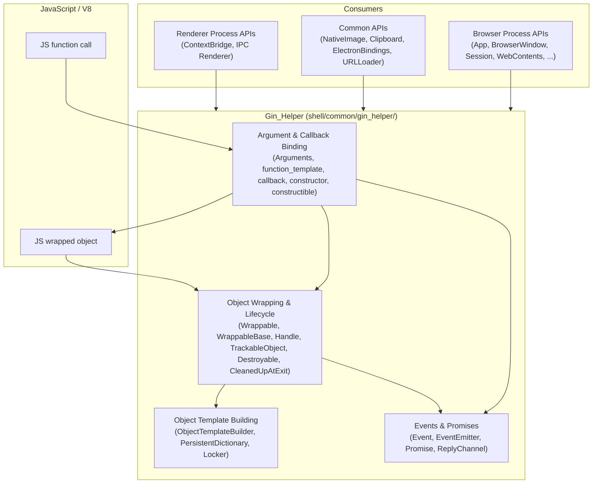
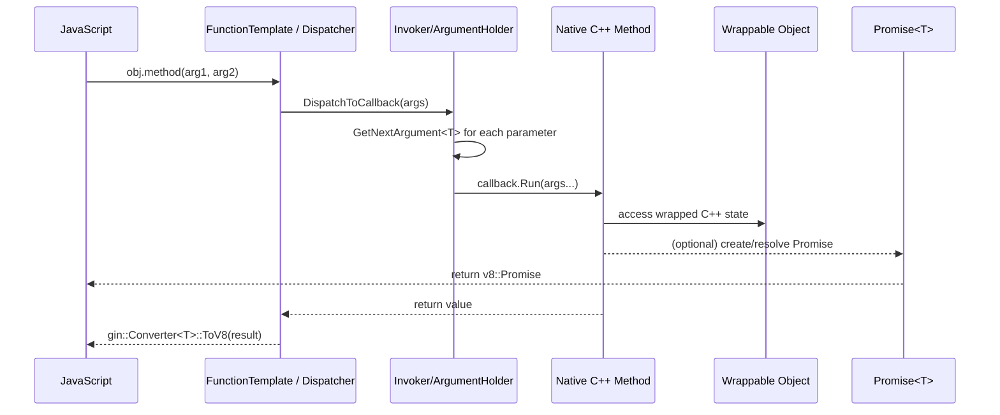

# Gin_Helper

## Introduction

`Gin_Helper` (implemented under `shell/common/gin_helper/`) is Electron's internal
extension layer on top of Chromium's [`gin`](https://chromium.googlesource.com/chromium/src/+/main/gin/)
library. `gin` provides the low-level plumbing for binding C++ objects and
functions to V8/JavaScript; `Gin_Helper` builds on that plumbing to provide the
conventions, helper templates, and object-lifetime machinery that **every**
native (C++) object exposed to Electron's JavaScript API relies on.

In short, `Gin_Helper` is the foundation of Electron's native binding layer.
Almost every class you find under `shell/browser/api/*` and `shell/common/api/*`
(e.g. `BrowserWindow`, `Session`, `WebContents`, `App`) is a `gin_helper::Wrappable`
or `gin_helper::TrackableObject` and uses `gin_helper::ObjectTemplateBuilder`,
`gin_helper::Arguments`, and `gin_helper::Promise` internally.

This module does not implement any single Electron feature; instead it is a
piece of **cross-cutting infrastructure** consumed by virtually all other
modules that expose native functionality to JavaScript.

## Why this module exists

Chromium's `gin` library is designed for Chromium's own use cases and imposes
some limitations that don't fit Electron's needs, e.g.:
- No native support for `std::optional`, `gin_helper::Arguments`, or other
  Electron-specific parameter types in callback signatures.
- No convenient system for constructible ("`new X()`"-able) wrapped classes.
- No built-in support for JS-style `EventEmitter` semantics or cancellable
  events (`event.preventDefault()`).
- No convenient Promise wrapper compatible with `base::OnceCallback`.

`Gin_Helper` forks/extends the relevant pieces of `gin` (function templates,
wrappable base classes, etc.) to close these gaps in one central place, so
individual API implementations do not need to reinvent them.

## Architecture Overview

`Gin_Helper` sits directly beneath the type-conversion layer documented in
[Gin_Converters.md](Gin_Converters.md) (which teaches `gin::Converter` how to
translate specific C++ types like `gfx::Rect` or `base::Time` to/from V8
values) and is itself a sibling of the other utility groups under
[Common_Native_Gin_Infrastructure](Common_Native_Gin_Infrastructure.md), such as
[Common_API.md](Common_API.md), [Common_Infra.md](Common_Infra.md), and
[V8_Node_Common_Utils.md](V8_Node_Common_Utils.md).

## Sub-modules

`Gin_Helper` is split into four closely related sub-modules, mirroring the
natural layering of the binding pipeline: arguments arrive from JS, get
dispatched to native callbacks, are wrapped into objects, and (optionally)
those objects emit events or return promises back to JS.

| Sub-module | Responsibility | Documentation |
|---|---|---|
| **Argument & Callback Binding** | Converts JS call arguments into typed C++ arguments and dispatches to native `base::RepeatingCallback`/member functions; supports constructible (`new`-able) classes. | [Gin_Helper_argument_callback_binding.md](Gin_Helper_argument_callback_binding.md) |
| **Object Wrapping & Lifecycle** | Base classes (`Wrappable`, `WrappableBase`, `Handle<T>`) that bind a C++ object's lifetime to a V8 wrapper object, plus `TrackableObject` (weak-map object registry), `Destroyable`, and process-exit cleanup hooks. | [Gin_Helper_object_wrapping.md](Gin_Helper_object_wrapping.md) |
| **Object Template Building** | Fluent builders (`ObjectTemplateBuilder`) for exposing methods/properties on prototype templates, plus `PersistentDictionary` and the `Locker` RAII helper. | [Gin_Helper_object_template_builder.md](Gin_Helper_object_template_builder.md) |
| **Events & Promises** | JS-style cancellable `Event`/`EventEmitter` support and the `Promise<T>` wrapper used to bridge async C++ operations back to JS Promises, plus `ReplyChannel` for Mojo IPC replies. | [Gin_Helper_events_promises.md](Gin_Helper_events_promises.md) |

## High-Level Data Flow: Calling a Native Method from JavaScript

## Relationship to Other Modules

- **[Gin_Converters.md](Gin_Converters.md)**: Supplies the `gin::Converter<T>`
  specializations that `Gin_Helper`'s argument/return-value marshalling code
  (`function_template.h`, `promise.h`) depends on.
- **[Common_API.md](Common_API.md)**: `ElectronBindings` and other common APIs
  build directly on `gin_helper::Arguments`, `Dictionary`, and `Promise`.
- **[V8_Node_Common_Utils.md](V8_Node_Common_Utils.md)**: Shares the V8/Isolate
  utility layer (`v8_util.h`) that complements `Locker` and object lifetime
  helpers here.
- Nearly every browser-process API module — e.g. those documented under
  **System_&_App-Level_Services_API**, **Native_Window_&_Menu_Management**,
  **Browser_Context_&_Session_Management**, and **WebContents_Rendering_&_Communication**
  — implements its JS-exposed classes as `gin_helper::Wrappable` or
  `gin_helper::TrackableObject` subclasses and uses `ObjectTemplateBuilder` to
  define their JS-visible surface.
- **Renderer_Process_Infrastructure** (e.g. `electron_api_context_bridge.h`)
  reuses `gin_helper::Arguments` and the function template machinery to safely
  bridge callbacks across isolated worlds.

## Summary

`Gin_Helper` is a small, dependency-light, but critically important module: it
defines *how* every native Electron object talks to JavaScript. Understanding
its four sub-modules is a prerequisite for understanding almost any other
native API module in Electron.
