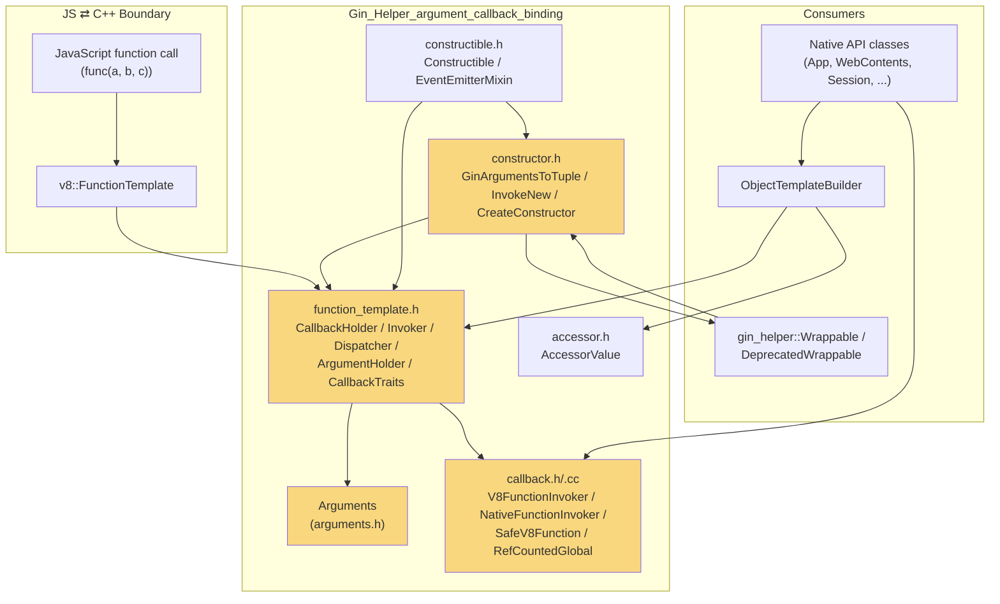
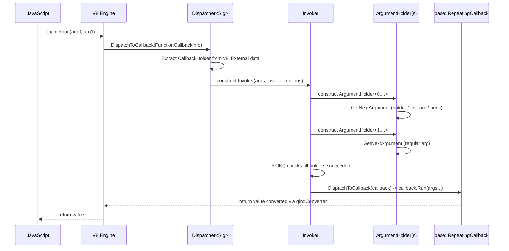
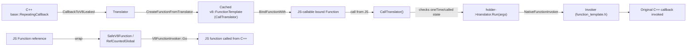
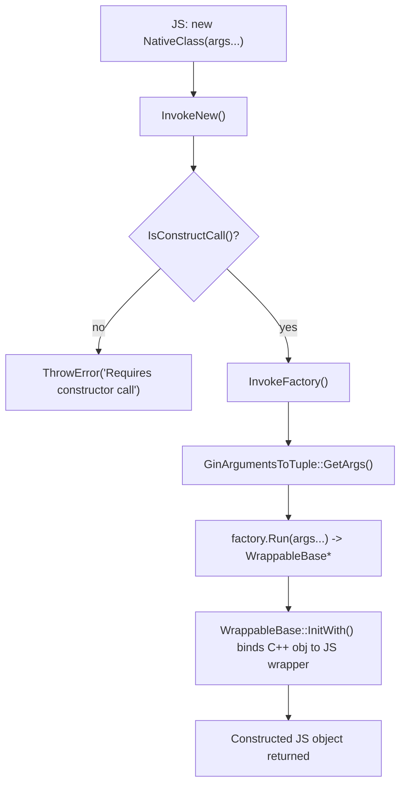
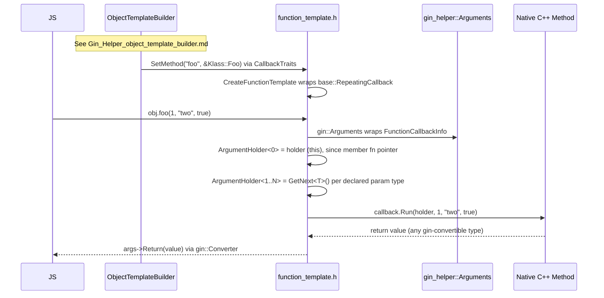
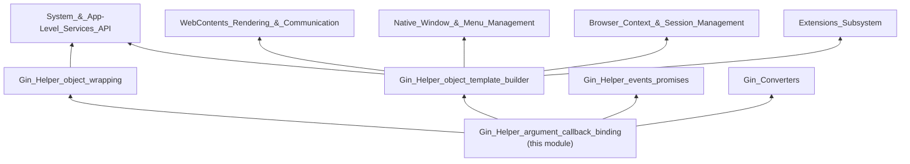

# Gin Helper: Argument & Callback Binding

## Introduction

The **Gin Helper: Argument & Callback Binding** module is the low-level plumbing that allows Electron's C++ codebase to expose native functions, methods, and constructors to JavaScript, and conversely to invoke JavaScript functions from C++. It extends Chromium's `gin` binding library (`gin::Arguments`, `gin::CreateFunctionTemplate`) with Electron-specific behaviors: stricter type coercion, support for `std::optional`, `gin_helper::Arguments`/`ErrorThrower` injection, member-function "holder as first argument" semantics, safe cross-boundary V8 function invocation, and constructor argument marshaling.

This module sits at the very core of Electron's native binding layer (`Gin_Helper`) and is a direct dependency of virtually every native API object in Electron (`shell/browser/api/*`, `shell/common/api/*`, extension APIs, etc.). It does not implement any Electron *feature* itself — it is pure binding infrastructure.

---

## Purpose & Core Functionality

This module answers four related problems that arise when exposing C++ to V8/JavaScript:

1. **How do we read arguments from a JS call safely and correctly?**
   → `shell/common/gin_helper/arguments.h::Arguments`

2. **How do we take an arbitrary C++ function/method signature and turn it into a `v8::FunctionTemplate` that automatically converts arguments/return values?**
   → `shell/common/gin_helper/function_template.h` (`ArgumentHolder`, `Invoker`, `Dispatcher`, `CallbackHolder`, `CallbackTraits`, `InvokerOptions`)

3. **How do we safely hold and invoke a JS `Function` from C++ (the reverse direction), and how do we wrap a C++ callback so it can be handed to JS as a callable value?**
   → `shell/common/gin_helper/callback.h` / `.cc` (`V8FunctionInvoker`, `NativeFunctionInvoker`, `RefCountedGlobal`, `DeleteOnUIThread`, `SafeV8Function`, `CreateFunctionFromTranslator`)

4. **How do we build a JS-invokable native "constructor" (`new Foo()`) from a C++ factory function?**
   → `shell/common/gin_helper/constructor.h::GinArgumentsToTuple`, `InvokeNew`, `CreateConstructor`

A supporting utility, `shell/common/gin_helper/accessor.h::AccessorValue`, provides a small value-wrapper used when exposing accessor-style properties, and `shell/common/gin_helper/constructible.h` (`Constructible`, `EventEmitterMixin`) builds on top of the constructor/function-template machinery to give `gin_helper::Wrappable`-derived classes a `new`-able JS constructor.

---

## Architecture Overview

Related modules referenced above are documented separately:
- Object wrapping base classes: see [Gin_Helper_object_wrapping.md](Gin_Helper_object_wrapping.md)
- `ObjectTemplateBuilder` / `PersistentDictionary`: see [Gin_Helper_object_template_builder.md](Gin_Helper_object_template_builder.md)
- `Event`, `Promise`, `ReplyChannel`: see [Gin_Helper_events_promises.md](Gin_Helper_events_promises.md)
- Value conversion (`gin::Converter` specializations): see [Gin_Converters.md](Gin_Converters.md) and its children
- Consuming native API objects: see [System_&_App-Level_Services_API.md](System_&_App-Level_Services_API.md), [WebContents_Rendering_&_Communication.md](WebContents_Rendering_&_Communication.md), etc.

---

## Component Breakdown

### 1. `gin_helper::Arguments` (`arguments.h`)

Extends `gin::Arguments` with two important corrections to gin's default behavior:

- **`GetNext<T>(T* out)`** — Only advances the internal argument cursor (`next_`) if conversion **succeeds**. This matters because C++ overload-style APIs need to "peek" at an argument, and if it doesn't match the expected type, subsequent argument holders must still see it as unconsumed.
- **`GetNext(bool* out)`** — Unlike gin's default boolean conversion (which coerces *any* JS value into `true`/`false`, e.g. `0` → `false`, `{}` → `true`), this override requires the value to actually be a JS boolean, preventing silent and surprising type coercion bugs in Electron's public API.
- **`ThrowError()` / `ThrowError(message)`** — Convenience wrappers to raise a JS exception with Electron's own error conventions.

This class is intentionally forbidden from adding data members (`// MUST NOT ADD ANY DATA MEMBER`) because instances are frequently `static_cast` from a plain `gin::Arguments*`/`v8::FunctionCallbackInfo` — adding state would break that layout assumption.

### 2. Function Template Machinery (`function_template.h`)

This is the heart of the module — a fork of `gin::function_template.h` with Electron-specific extensions.

**Key types:**

| Component | Responsibility |
|---|---|
| `InvokerOptions` | Configuration struct: whether the JS `this` (holder) should be bound as the *first* C++ argument (`holder_is_first_argument`), and an optional `holder_type` name used for better error messages. |
| `CallbackParamTraits<T>` | Normalizes reference/pointer C++ parameter types (`const T&`, `const T*`) to their "local" storage type for holding a converted value. |
| `CallbackHolderBase` / `CallbackHolder<Sig>` | Wraps a `base::RepeatingCallback<Sig>` in a GC-tracked `v8::External` so it can be attached as data to a `v8::FunctionTemplate`. Cleans itself up either via V8 garbage collection (two-phase weak callback) or when the isolate is disposed (`DisposeObserver`). |
| `ArgumentHolder<index, ArgType>` | Extracts and stores a single positional argument by index, using `GetNextArgument()` overloads (see below). Also checks for "destroyed object" access when `index == 0` and the holder is the first argument. |
| `GetNextArgument()` overloads | A set of free functions dispatched by argument type: plain types delegate to `args->GetNext()`; `std::optional<T>` never fails (leaves the optional empty on conversion failure); `ErrorThrower`, `gin_helper::Arguments*`, `gin::Arguments*`, and `v8::Isolate*` are "magic" types that are populated directly from the call context rather than consumed from the JS argument list. |
| `Invoker<IndexSequence, ArgTypes...>` | Multiply inherits from `ArgumentHolder<i, ArgTypes>` for every argument (guaranteeing correct C++ initialization order = correct JS argument extraction order), and exposes `IsOK()` plus `DispatchToCallback()` to actually invoke the wrapped `base::RepeatingCallback`. |
| `Dispatcher<Sig>` | Static trampoline registered as the actual V8 `FunctionCallback`/`AccessorNameGetterCallback`. Retrieves the `CallbackHolder` from the V8 External data, builds an `Invoker`, and dispatches if argument conversion succeeded. |
| `CreateFunctionTemplate()` | Public entry point: wraps a `base::RepeatingCallback<Sig>` into a cached `v8::FunctionTemplate`. |
| `CreateDataPropertyCallback()` | Same idea but produces an accessor getter callback + data pair (for lazy data properties). |
| `CallbackTraits<T>` | Overload-resolution helper used by `ObjectTemplateBuilder`/consumers to turn raw function pointers, `base::RepeatingCallback`, or **member function pointers** into a `FunctionTemplate`. Member function pointers automatically get `holder_is_first_argument = true` so the JS "receiver" (`this`) is bound as the implicit first argument. |

### 3. Callback Direction: C++ ⇄ JS (`callback.h` / `callback.cc`)

While `function_template.h` handles **JS calling C++**, `callback.h` primarily handles the reverse — **C++ calling a JS function** — plus utilities to hand a `base::RepeatingCallback` to JS as a callable value.

- **`SafeV8Function`** — RAII wrapper around a ref-counted `v8::Global<v8::Function>` (`RefCountedGlobal<v8::Function>`), so a JS function reference can be safely stored in a C++ callback and outlive the immediate call stack without leaking or crashing if the isolate goes away.
- **`RefCountedGlobal<T>`** — A `base::RefCountedThreadSafe` wrapper for `v8::Global<T>`, using a custom `DeleteOnUIThread` trait so the underlying V8 global handle is always destroyed on the UI thread (V8 handles cannot be released from an arbitrary thread).
- **`DeleteOnUIThread`** — Destruction trait: if not already on the browser UI thread, hops the deletion to the UI thread via `content::GetUIThreadTaskRunner`; otherwise deletes immediately.
- **`V8FunctionInvoker<Sig>`** — Given a `SafeV8Function` and C++ arguments, converts arguments to V8 values, invokes the JS function within a `Locker`/`MicrotasksScope`/`Context::Scope`, and converts the result back to C++ (three specializations: `v8::Local<v8::Value>` return, `void` return, and generic `ReturnType`).
- **`NativeFunctionInvoker<Sig>`** — The inverse adapter: given a `base::RepeatingCallback<Sig>` and a `gin::Arguments*`, builds an `Invoker` (reusing the `function_template.h` machinery) to call the C++ callback with converted arguments — used when C++ callbacks need to be dispatched as if they were called directly from JS argument lists.
- **`CreateFunctionFromTranslator()` / `CallbackToV8Leaked()`** — Produces a JS-callable function object backed by an arbitrary `Translator` (`base::RepeatingCallback<void(gin::Arguments*)>`), optionally enforcing "call only once" semantics via a JS-side `oneTime`/`called` state dictionary. `CallbackToV8Leaked` explicitly documents that it has **no lifetime limit protection** and should be used cautiously to avoid memory leaks.
- **`BindFunctionWith()`** — Implements `Function.prototype.bind` semantics in C++ to pre-bind extra arguments onto a JS function (used to attach the External holder + state dictionary to the translator function).

### 4. Constructor Support (`constructor.h`)

Bridges JS's `new Foo(...)` syntax to a C++ factory function returning a `WrappableBase*`.

- **`GinArgumentsToTuple<Types...>::GetArgs()`** — Iteratively pulls each constructor argument out of `gin::Arguments` (using the same `GetNextArgument()` overload set as `function_template.h`) and packs them into a `std::tuple`, with the first argument tagged `holder_is_first_argument = true` (so, e.g., a wrapped `Isolate*`/`Arguments*` "self" parameter can be injected).
- **`InvokeFactory()`** — Applies the tuple to a `base::RepeatingCallback<WrappableBase*(Types...)>` factory to actually construct the native object.
- **`InvokeNew()`** — The V8-facing entry point: verifies the call was made with `new` (`args->IsConstructCall()`), invokes the factory inside a `v8::TryCatch`, and re-throws or throws a generic error on failure.
- **`CreateConstructor<T, Sig>()`** — Public API: builds a `v8::FunctionTemplate` around `InvokeNew`, sets up the instance template's internal field count, calls `T::BuildPrototype()` to attach methods/properties, and returns the resulting `v8::Function`. Enforces (in debug builds) that it is only ever called **once per type** to avoid template/memory leaks.

### 5. `AccessorValue<T>` (`accessor.h`)

A tiny templated struct used to store a value destined for use as a `gin_helper::Dictionary` accessor (getter/setter pair). It normalizes reference/pointer types the same way `CallbackParamTraits` does, keeping accessor value storage consistent with the argument-holder conventions used elsewhere in this module. Uses `RAW_PTR_EXCLUSION` for pointer specialization to opt out of MiraclePtr rewriting where inappropriate for this transient value type.

### 6. `Constructible<T>` / `EventEmitterMixin<T>` (`constructible.h`)

A higher-level convenience built on top of `constructor.h` and `function_template.h`:

- `Constructible<T>::GetConstructor()` builds (and caches, per-isolate, via `gin::PerIsolateData`) a `v8::Function` constructor for `T`, wiring in:
  - `T::New` as the factory (via `gin::CreateConstructorFunctionTemplate`, gin's own equivalent utility),
  - Automatic inheritance from the `EventEmitter` template if `T` derives from `EventEmitterMixin<T>`,
  - `T::FillObjectTemplate` to populate the prototype.
- This class is the primary link between this module and Electron's **event emitter object model**. See [Gin_Helper_events_promises.md](Gin_Helper_events_promises.md) for `Event`/`EventEmitter` details and [Gin_Helper_object_wrapping.md](Gin_Helper_object_wrapping.md) for `Wrappable`/`DeprecatedWrappable`, which typically pair with `Constructible`.

---

## Data Flow: End-to-End Native Method Call

---

## Design Rationale & Notable Behaviors

1. **Strict boolean parsing** — Electron intentionally overrides gin's default (overly permissive) boolean conversion to avoid API foot-guns where any truthy/falsy JS value silently becomes a boolean flag.
2. **Non-destructive `GetNext<T>`** — Enables optional/overloaded native argument signatures (e.g., `foo(a)` vs `foo(a, b)`), since a failed conversion doesn't consume the argument slot.
3. **Two-phase GC + isolate-dispose cleanup for callbacks** — `CallbackHolderBase` guarantees native callback state is eventually freed either via standard V8 GC weak callbacks or forcibly during isolate teardown, preventing leaks/UAF in long-running native modules.
4. **UI-thread-safe V8 handle destruction** — Because V8 handles are not thread-safe, `RefCountedGlobal`/`DeleteOnUIThread` ensure that JS function references retained by background-thread C++ code are always released back on the UI thread.
5. **Member-function-pointer holder binding** — `CallbackTraits`'s specialization for member function pointers automatically arranges for the JS receiver object (`this`) to be passed as argument 0, matching natural C++ method call semantics without extra boilerplate at each call site.
6. **"Magic" injectable parameter types** — Special-cased `GetNextArgument` overloads let native method signatures request `gin::Arguments*`, `gin_helper::Arguments*`, `v8::Isolate*`, or `ErrorThrower` as parameters without consuming actual JS arguments, giving native code ambient access to the calling context.
7. **One-time-callback protection** — `CreateFunctionFromTranslator(..., one_time=true)` plus the JS-side `oneTime`/`called` dictionary state prevents JS code from invoking a "should only fire once" native-backed callback (e.g. dialog result callbacks) more than once.

---

## Usage Context in the Wider System

This module is a **leaf infrastructure module** with no dependencies on higher-level Electron features; nearly all native-facing Electron API surface depends on it, directly or indirectly through:

- [Gin_Helper_object_wrapping.md](Gin_Helper_object_wrapping.md) — `Wrappable`, `TrackableObjectBase`, `Handle<T>` build native objects using `Constructible`/`CreateConstructor`.
- [Gin_Helper_object_template_builder.md](Gin_Helper_object_template_builder.md) — `ObjectTemplateBuilder::SetMethod()` uses `CallbackTraits`/`CreateFunctionTemplate` to register methods and properties.
- [Gin_Helper_events_promises.md](Gin_Helper_events_promises.md) — Promise resolution and event dispatch frequently hand JS callbacks through `V8FunctionInvoker`/`SafeV8Function`.
- [Gin_Converters.md](Gin_Converters.md) — Supplies the actual `gin::Converter<T>` specializations that `GetNextArgument`/`args->Return()` rely on for type marshaling.
- Nearly every concrete native API class across [System_&_App-Level_Services_API.md](System_&_App-Level_Services_API.md), [WebContents_Rendering_&_Communication.md](WebContents_Rendering_&_Communication.md), [Native_Window_&_Menu_Management.md](Native_Window_&_Menu_Management.md), [Browser_Context_&_Session_Management.md](Browser_Context_&_Session_Management.md), and [Extensions_Subsystem.md](Extensions_Subsystem.md) uses these primitives (often transitively via `ObjectTemplateBuilder`) to expose their methods/events/constructors to JavaScript.

