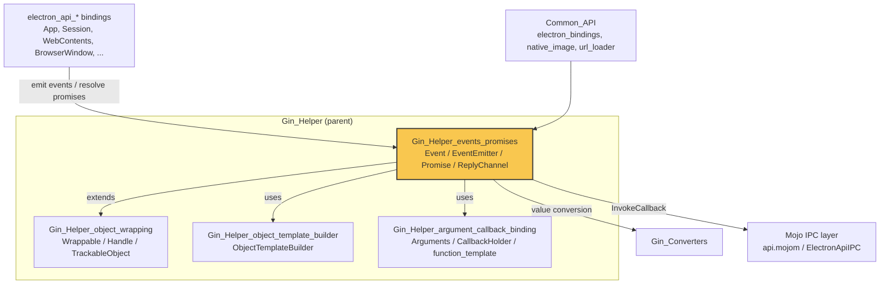
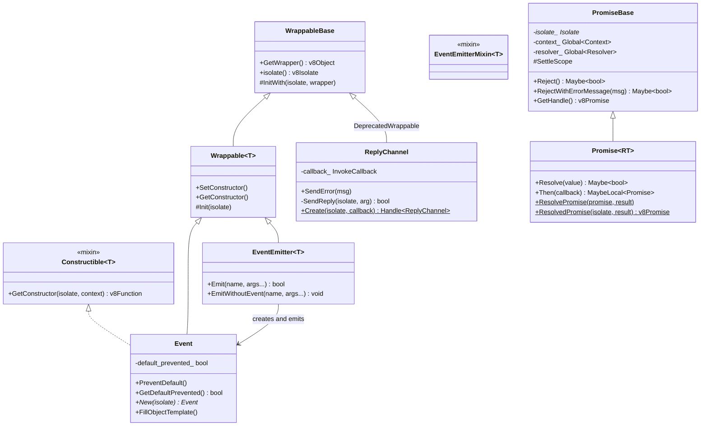
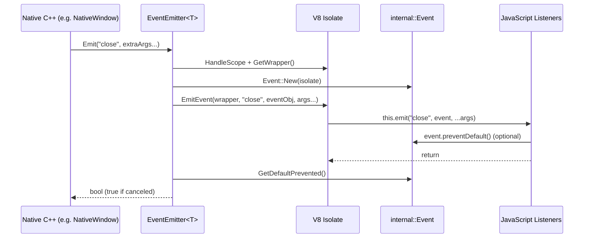
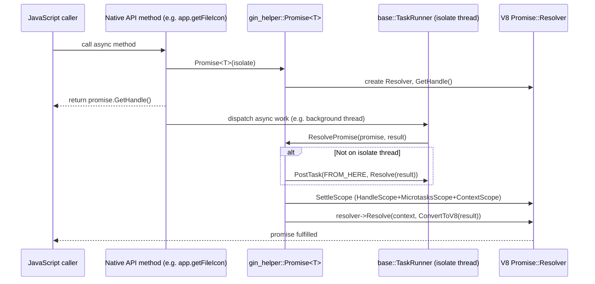
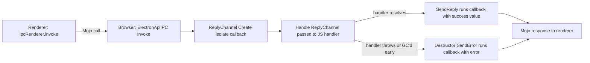
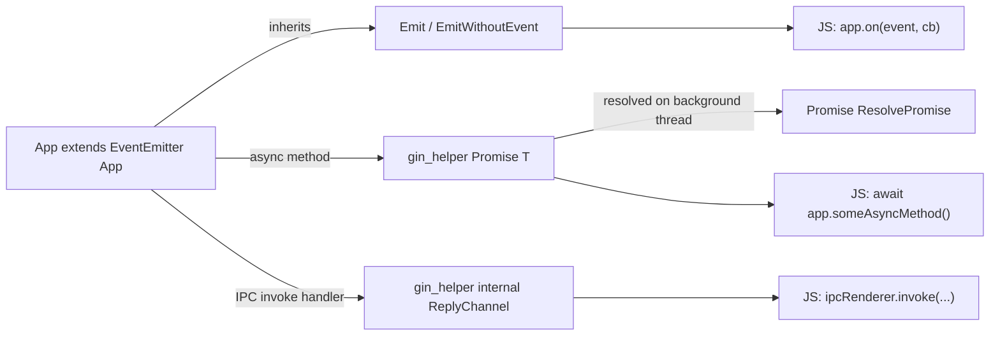

# Gin_Helper_events_promises

## Introduction

`Gin_Helper_events_promises` is a foundational sub-module of Electron's native (C++) [Gin Helper](Gin_Helper.md)
infrastructure. It provides the two most fundamental asynchronous communication primitives that bridge C++ and
JavaScript inside Electron's browser and renderer processes:

1. **Event emission** — a lightweight, allocation-cheap `Event` object (mirroring Node.js/DOM-style events) plus
   an `EventEmitter<T>` mixin that lets any native, V8-wrapped C++ object fire named JavaScript events
   (`this.emit(name, event, ...args)`), complete with `preventDefault()` support.
2. **Promise bridging** — a `PromiseBase`/`Promise<T>` wrapper around `v8::Promise::Resolver` that lets native
   C++ code resolve or reject a JavaScript `Promise` from any thread, safely marshaling back to the V8 isolate's
   task runner when required.

A closely related component, `ReplyChannel`, builds on top of the wrappable infra to safely fulfill a Mojo
`InvokeCallback` even if the corresponding V8 callback object is garbage collected before use — a common pattern
for `ipcRenderer.invoke()`-style two-way IPC.

This module is a leaf dependency consumed pervasively throughout Electron's native API surface: window, session,
webContents, app, and virtually every `electron_api_*` binding described in
[System_&_App-Level_Services_API](System_&_App-Level_Services_API.md),
[Browser_Context_&_Session_Management](Browser_Context_&_Session_Management.md),
[Native_Window_&_Menu_Management](Native_Window_&_Menu_Management.md), and
[WebContents_Rendering_&_Communication](WebContents_Rendering_&_Communication.md) use `EventEmitter` and
`gin_helper::Promise` to expose asynchronous, Node.js-style APIs to JavaScript.

---

## Module Position in the System

For details on the wrapping mechanics referenced above, see:
- [Gin_Helper_object_wrapping](Gin_Helper_object_wrapping.md) — `Wrappable`, `WrappableBase`, `Handle<T>`, `TrackableObjectBase`
- [Gin_Helper_object_template_builder](Gin_Helper_object_template_builder.md) — `ObjectTemplateBuilder`, `PersistentDictionary`
- [Gin_Helper_argument_callback_binding](Gin_Helper_argument_callback_binding.md) — `Arguments`, `CallbackHolder`, `function_template.h` invoker machinery
- [Gin_Converters](Gin_Converters.md) — type conversion used when resolving promises / passing event args

---

## Core Components

| Component | File | Responsibility |
|---|---|---|
| `Event` | `shell/common/gin_helper/event.h` | Minimal V8-wrapped, constructible object exposed to JS as the first argument of an emitted event; tracks `defaultPrevented`. |
| `EventEmitter<T>` | `shell/common/gin_helper/event_emitter.h` | CRTP mixin added to native wrappable classes to provide `Emit()`/`EmitWithoutEvent()` helpers that call into the JS `EventEmitter.prototype.emit`. |
| `GetEventEmitterTemplate` | `shell/common/gin_helper/event_emitter_template.h` | Returns the shared `v8::FunctionTemplate` that supplies Node's `EventEmitter` prototype (on/once/removeListener, etc.) to constructible classes. |
| `PromiseBase` / `Promise<T>` | `shell/common/gin_helper/promise.h` | Non-template base + templated wrapper around `v8::Promise::Resolver`; supports `Resolve`, `Reject`, `RejectWithErrorMessage`, `Then`, and static helpers `ResolvePromise`/`ResolvedPromise` that are thread-runner aware. |
| `ReplyChannel` | `shell/common/gin_helper/reply_channel.h` | `DeprecatedWrappable` object that safely fulfills a Mojo `InvokeCallback` (`SendReply`/`SendError`) even under GC pressure — used for `ipcRenderer.invoke`. |

### Component Relationships

`EventEmitter<T>` is a **mixin**, not used standalone — concrete API classes (e.g. `App`, `WebContents`,
`Session`, `BrowserWindow`) inherit from it alongside `gin_helper::Wrappable<T>` to gain `Emit()`. See
[Gin_Helper_object_wrapping](Gin_Helper_object_wrapping.md) for the `Wrappable`/`Handle` base machinery that both
`Event` and `EventEmitter`-derived classes rely on.

---

## Event Emission Flow

`EventEmitter<T>::Emit()` constructs a fresh `internal::Event`, invokes the object's JS `emit` method with the
event as the first argument, and then reports whether `preventDefault()` was called — allowing native code to
short-circuit default behavior (e.g. cancel a window close).

Key points:
- `Event` is created via the `Constructible<T>` pattern (`FillObjectTemplate`/`GetClassName`/`New`), and its
  constructor function template inherits from `GetEventEmitterTemplate()` when the target type mixes in
  `EventEmitterMixin<T>` — unifying event dispatch with Node's `EventEmitter` API surface exposed to JS
  (`.on`, `.once`, `.removeListener`, etc.), which is actually installed by
  `event_emitter_template.cc` (declared here, implemented alongside JS bootstrap code).
- `EmitWithoutEvent()` skips `Event` construction entirely for cases where no cancellation semantics are needed
  (pure notifications).
- Both variants guard against an empty wrapper (e.g., the object has already begun GC teardown).

---

## Promise Resolution Flow

`gin_helper::Promise<T>` wraps a `v8::Promise::Resolver`, allowing C++ code — potentially running on a background
thread — to resolve/reject a JS promise that was already returned to script. This is the standard mechanism behind
Electron async APIs (`dialog.showOpenDialog()`, `session.resolveProxy()`, `net.fetch()`, etc.), and is used by
components in [Browser_Context_&_Session_Management](Browser_Context_&_Session_Management.md),
[System_&_App-Level_Services_API](System_&_App-Level_Services_API.md), and
[Desktop_UI_Widgets_&_Dialogs](Desktop_UI_Widgets_&_Dialogs.md).

### `SettleScope`

`PromiseBase::SettleScope` is an RAII helper bundling `v8::HandleScope`, `v8::MicrotasksScope`, and
`v8::Context::Scope`, guaranteeing that every `Resolve`/`Reject`/`Then` call establishes the correct V8 execution
environment regardless of the calling thread's ambient scopes. All settlement paths (`Resolve`, `Reject`, `Then`)
go through this scope.

### Specializations

- `Promise<RT>` (generic): requires a conversion for `RT` via [Gin_Converters](Gin_Converters.md)
  (`gin::ConvertToV8`) to marshal the resolved value into JS.
- `Promise<void>`: specialization with no payload — used for fire-and-forget async completion signals.
- `gin::Converter<Promise<T>>`: allows a `Promise<T>` to be returned directly from a native function bound via
  [Gin_Helper_argument_callback_binding](Gin_Helper_argument_callback_binding.md)'s `CallbackHolder`/`Invoker`
  machinery — the promise's `v8::Local<v8::Promise>` handle is what's actually handed back to JS.

---

## ReplyChannel — Bridging Mojo Callbacks and V8

`ReplyChannel` addresses a narrower but critical problem: Mojo's `InvokeCallback` (part of
`electron::mojom::ElectronApiIPC`, used for `ipcRenderer.invoke`) **must** be invoked before destruction or Mojo
will `DCHECK`. Because the callback is wrapped in a `gin_helper::Handle<ReplyChannel>` exposed to JS as a
"resolve/reject" callback pair, it's possible for V8's GC to collect the wrapping object before script ever calls
it (e.g., an error or an early return in the handler). `ReplyChannel`'s destructor guarantees `callback_` still
gets run (via `SendError`) in that scenario.

`ReplyChannel` is a `gin_helper::DeprecatedWrappable`, so its lifecycle and V8 object template construction follow
the same patterns documented in [Gin_Helper_object_wrapping](Gin_Helper_object_wrapping.md).

---

## Usage Pattern in API Bindings

A typical `electron_api_*.cc` binding (e.g., `App`, `WebContents`, `Session` — see
[System_&_App-Level_Services_API](System_&_App-Level_Services_API.md) and
[Browser_Context_&_Session_Management](Browser_Context_&_Session_Management.md)) combines all pieces from this
module:

This lets native code:
1. Fire cancellable lifecycle events (`will-quit`, `before-quit`, window `close`) via `EventEmitter::Emit`.
2. Return real JS `Promise` objects for async operations via `gin_helper::Promise<T>`.
3. Safely complete two-way renderer↔browser IPC invocations via `ReplyChannel`.

---

## Related Modules

- [Gin_Helper_object_wrapping](Gin_Helper_object_wrapping.md) — base `Wrappable`/`Handle`/`TrackableObjectBase` classes that `Event`, `EventEmitter`, and `ReplyChannel` build upon.
- [Gin_Helper_object_template_builder](Gin_Helper_object_template_builder.md) — builds the V8 object templates exposing methods/properties (used by `ReplyChannel::GetObjectTemplateBuilder`).
- [Gin_Helper_argument_callback_binding](Gin_Helper_argument_callback_binding.md) — the `Arguments`/`CallbackHolder`/`function_template.h` invocation layer that native methods (returning `Promise<T>` or calling `Emit`) are bound through.
- [Gin_Converters](Gin_Converters.md) — type conversions (`gin::ConvertToV8`) used when resolving promises and passing event arguments.
- [Common_API](Common_API.md) — higher-level bindings (`electron_bindings.h`, `electron_api_url_loader.h`) that consume promises and events extensively.
- [Node_Bindings](Node_Bindings.md) — provides the underlying `Environment`/`IsolateData` in which these V8 constructs operate.
