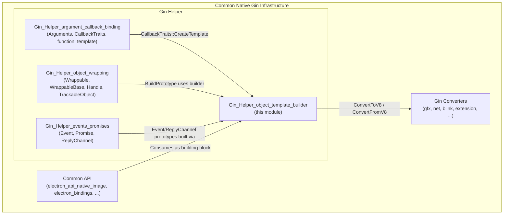
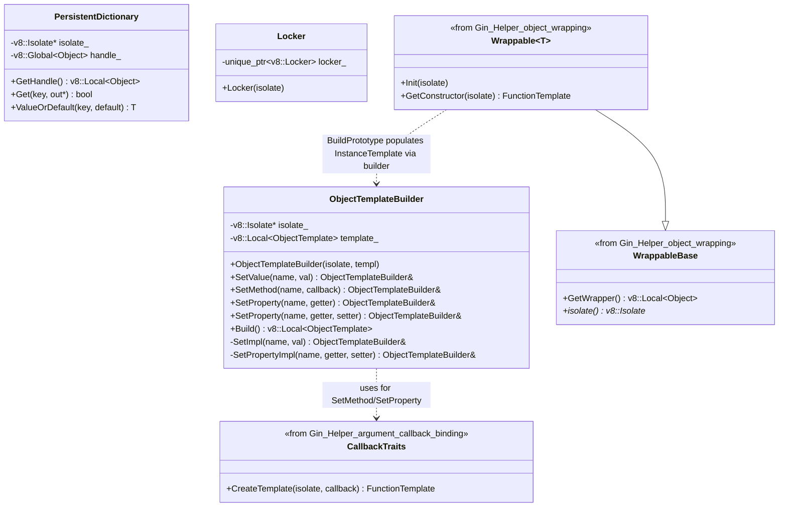
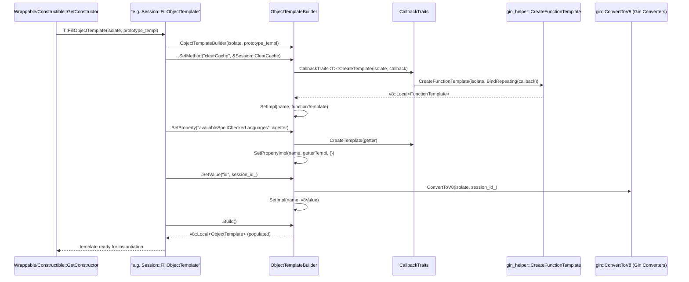
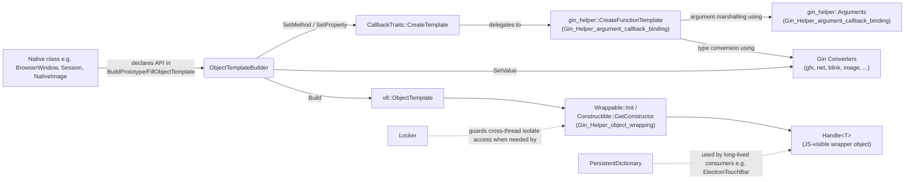
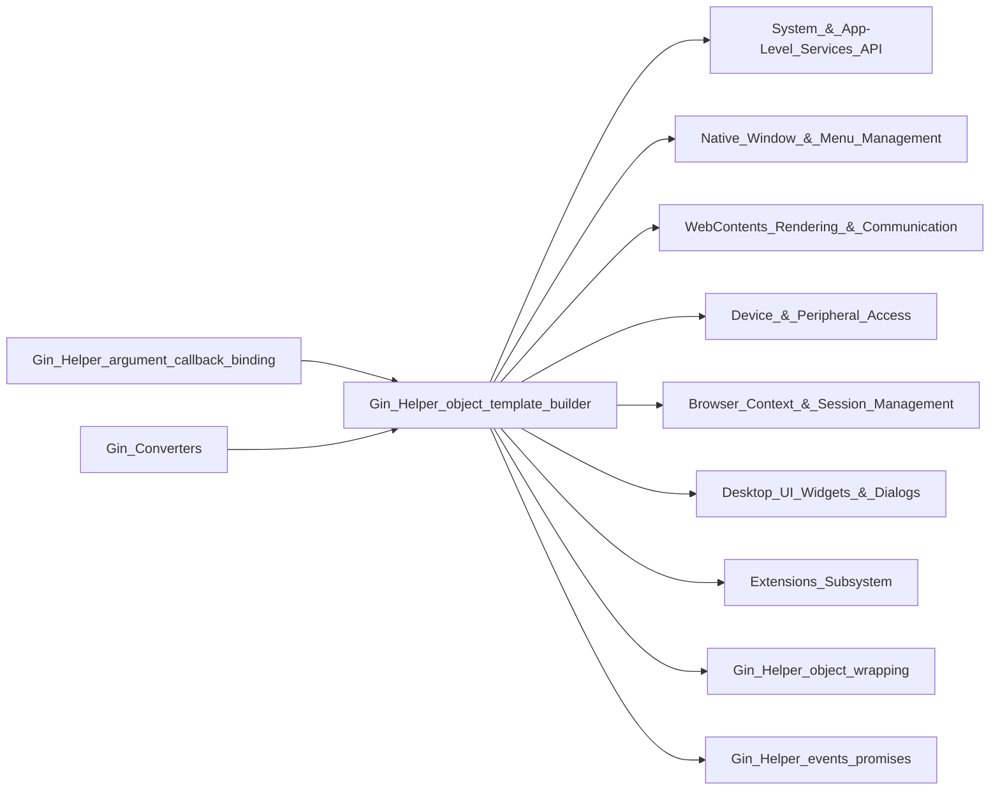

# Gin Helper: Object Template Builder

## Introduction

`Gin_Helper_object_template_builder` is a small, foundational module inside Electron's native (C++) codebase that provides the primary mechanism for **declaratively populating V8 `ObjectTemplate`s** with methods, properties, and values. It is the "glue" layer that lets C++ classes expose a fluent, chainable API (`Set...().Set...().Set...()`) for building the JavaScript-visible surface of native objects, without requiring every binding author to hand-write V8 template boilerplate.

This module is part of the broader [Gin Helper](Common_Native_Gin_Infrastructure.md) family, which itself lives under the [Common Native Gin Infrastructure](Common_Native_Gin_Infrastructure.md) umbrella. It is consumed by virtually every native object exposed to JavaScript in Electron — from `BrowserWindow` and `WebContents` to `app`, `session`, and dozens of other `electron_api_*` classes.

The module contains three tightly related components:

| Component | File | Responsibility |
|---|---|---|
| `ObjectTemplateBuilder` | `shell/common/gin_helper/object_template_builder.h` | Fluent builder that attaches methods/properties/values onto an existing `v8::ObjectTemplate` |
| `PersistentDictionary` | `shell/common/gin_helper/persistent_dictionary.h` | A `Dictionary`-like wrapper that holds a **persistent** (heap-safe) handle to a V8 object, used when a native object outlives the current V8 handle scope |
| `Locker` | `shell/common/gin_helper/locker.h` | A thin, opt-in wrapper around `v8::Locker` for thread-safe isolate access, used sparingly when multiple threads may touch the same isolate |

---

## 1. Purpose and Core Functionality

### 1.1 `ObjectTemplateBuilder`

V8's native `gin::ObjectTemplateBuilder` always **creates a new** `v8::ObjectTemplate`. Electron's `gin_helper::ObjectTemplateBuilder` instead **operates on an existing template** (typically the prototype template of a class already being constructed via [`Wrappable`](Gin_Helper_object_wrapping.md) or [`Constructible`](Gin_Helper_argument_callback_binding.md)). This allows Electron's binding classes to incrementally add members across multiple `BuildPrototype`/`FillObjectTemplate` calls (including base-class contributions) rather than being restricted to a single template-creation call site.

Its second major difference is that it delegates function-pointer/member-function/`base::RepeatingCallback` conversion to `gin_helper::CallbackTraits`, which in turn calls [`gin_helper::CreateFunctionTemplate`](Gin_Helper_argument_callback_binding.md) — the module responsible for advanced argument marshalling (`gin_helper::Arguments`, optional args, `Dictionary`, etc.). This lets `ObjectTemplateBuilder`-bound methods support the richer calling conventions used throughout Electron's native API surface (e.g., accepting `gin_helper::Arguments*` as the first parameter, or throwing V8 exceptions naturally).

Key operations:

- **`SetValue(name, val)`** — sets a plain converted value (string, number, object, etc.) as a property.
- **`SetMethod(name, callback)`** — exposes a C++ function pointer, member function pointer, or `base::RepeatingCallback` as a JS-callable function.
- **`SetProperty(name, getter [, setter])`** — installs a JS accessor property backed by C++ getter/setter functions.
- **`Build()`** — returns the finished `v8::Local<v8::ObjectTemplate>` (the same template instance passed to the constructor, now populated).

### 1.2 `PersistentDictionary`

Most Gin bindings use short-lived, stack-only `gin::Dictionary` handles that are only valid within the current `v8::HandleScope`. `PersistentDictionary` instead stores its target object in a `v8::Global<v8::Object>`, making it safe to store as a class member and use across handle scopes / event loop turns. It exposes a `Get<K, V>()` template mirroring `gin::Dictionary::Get`, plus a convenience `ValueOrDefault()` helper. It also registers a `gin::Converter<gin_helper::PersistentDictionary>` specialization so it can be used transparently as an argument/return type in `gin_helper`-bound functions.

As noted in the source, its only remaining consumer is `ElectronTouchBar` (see [Menu (Model & Views)](Desktop_UI_Widgets_%26_Dialogs.md)), which needs to retain JS-supplied configuration dictionaries beyond the initial call.

### 1.3 `Locker`

A minimal RAII wrapper that only actually acquires a `v8::Locker` when Electron's locking is enabled for the current thread configuration (its constructor decides this internally). It disables copy and heap allocation (stack-only), matching the pattern used by `ObjectTemplateBuilder` (also stack-only, as documented in its header). It is used in code paths that may run off the V8-owning thread and need to safely re-enter the isolate.

---

## 2. Architecture

### 2.1 Position within Gin Helper / Common Native Gin Infrastructure



### 2.2 Class Relationships



---

## 3. Data Flow: Building a Native Object's JS API

Most native, JS-exposed classes in Electron (e.g. `Session`, `WebContents`, `Tray`, `NativeImage`) implement a `BuildPrototype` / `FillObjectTemplate` static or virtual method. That method typically wraps the incoming `v8::ObjectTemplate` in a `gin_helper::ObjectTemplateBuilder` and chains `SetMethod`/`SetProperty`/`SetValue` calls to declare the public JS API.



Once the template is built, [`Wrappable::Init`](Gin_Helper_object_wrapping.md) (or the `Constructible`/`EventEmitterMixin` path) instantiates a real JS object from it and binds it to the C++ instance via `WrappableBase::InitWith`, at which point the object becomes a fully-functional JS-facing wrapper (`Handle<T>`).

---

## 4. Component Interaction Diagram



---

## 5. How It Fits into the Overall System

- **Upstream dependency**: `ObjectTemplateBuilder` depends on `CallbackTraits`/`CreateFunctionTemplate` from [Gin_Helper_argument_callback_binding](Gin_Helper_argument_callback_binding.md) for turning raw C++ callables into V8 function templates, and on the [Gin Converters](Common_Native_Gin_Infrastructure.md) for `SetValue`'s type conversion.
- **Downstream consumers**: Nearly all JS-exposed native objects use it, including:
  - [Gin_Helper_object_wrapping](Gin_Helper_object_wrapping.md) (`Wrappable`, `TrackableObjectBase`) — the base classes that call into `BuildPrototype` where builders are typically used.
  - [Gin_Helper_events_promises](Gin_Helper_events_promises.md) (`Event`, `ReplyChannel`) — build their small prototype surfaces with the same builder.
  - Feature modules such as [System & App-Level Services API](System_%26_App-Level_Services_API.md), [Native Window & Menu Management](Native_Window_%26_Menu_Management.md), [WebContents Rendering & Communication](WebContents_Rendering_%26_Communication.md), and [Device & Peripheral Access](Device_%26_Peripheral_Access.md) — every `electron_api_*.h` class in these modules ultimately relies on `ObjectTemplateBuilder` (directly or via `Wrappable`/`Constructible`) to expose its JS API.
- **`PersistentDictionary`** bridges into the [Desktop UI Widgets & Dialogs](Desktop_UI_Widgets_%26_Dialogs.md) module (specifically `ElectronTouchBar`), where JS-supplied configuration must be retained beyond a single call.
- **`Locker`** supports any module that may access a V8 isolate from a non-owning thread, most notably components under [Node Utility Services](Node_Utility_Services.md) and [Renderer Process Infrastructure](Renderer_Process_Infrastructure.md) where multiple execution contexts may interact with V8 state.



---

## 6. Usage Pattern (Illustrative)

Although this documentation does not duplicate consumer-module code, the canonical usage pattern that recurs across the codebase looks like:

```cpp
// Inside some Electron API class (e.g., shell/browser/api/electron_api_*.cc)
gin::ObjectTemplateBuilder MyApiClass::GetObjectTemplateBuilder(
    v8::Isolate* isolate) {
  return gin_helper::ObjectTemplateBuilder(isolate, GetWrapper()->...)
      .SetMethod("doSomething", &MyApiClass::DoSomething)
      .SetProperty("someProp", &MyApiClass::GetProp, &MyApiClass::SetProp)
      .SetValue("CONSTANT_NAME", 42)
      .Build();
}
```

This pattern is the standard entry point used by [Gin_Helper_object_wrapping](Gin_Helper_object_wrapping.md)'s `Wrappable::BuildPrototype` overrides and by `Constructible::FillObjectTemplate` implementations throughout the codebase.

---

## 7. Design Notes & Constraints

- **Stack-only types**: Both `ObjectTemplateBuilder` and `Locker` are intentionally restricted to stack allocation (`Locker` explicitly deletes `operator new`; `ObjectTemplateBuilder`'s header comment states the same intent for its internal `v8::Local` template handle). This reflects V8's handle-scope safety requirements — these objects must not outlive the enclosing `HandleScope`/call frame.
- **Chainable/fluent API**: All `Set*` methods return `ObjectTemplateBuilder&` to allow method chaining, deliberately diverging from strict Google C++ style (as noted in the source comments) for ergonomic binding declarations.
- **Legacy/limited-use component**: `PersistentDictionary` is explicitly marked in source comments as having a single remaining consumer (`ElectronTouchBar`) and is a candidate for future removal/migration — new code should generally prefer non-persistent `gin::Dictionary` or `gin_helper::Dictionary` unless persistence across handle scopes is truly required.
- **Compatibility layer**: The `ObjectTemplateBuilder` header explicitly frames itself as a stand-in for `gin::ObjectTemplateBuilder`, pending an upstream patch — maintainers should be aware this class may eventually be deprecated in favor of the standard Gin builder once `function_template.h` is phased out.

---

## 8. Related Documentation

- [Common_Native_Gin_Infrastructure](Common_Native_Gin_Infrastructure.md) — parent module covering all Gin/V8/Node native infrastructure.
- [Gin_Helper_argument_callback_binding](Gin_Helper_argument_callback_binding.md) — `Arguments`, `CallbackTraits`, `CreateFunctionTemplate`, and the invocation/dispatch machinery this module depends on.
- [Gin_Helper_object_wrapping](Gin_Helper_object_wrapping.md) — `Wrappable`, `WrappableBase`, `Handle<T>`, `TrackableObjectBase`: the classes that typically drive template construction using this module.
- [Gin_Helper_events_promises](Gin_Helper_events_promises.md) — `Event`, `Promise`, `ReplyChannel`: consumers with small, focused prototypes built via this module.
- [Desktop_UI_Widgets_&_Dialogs](Desktop_UI_Widgets_%26_Dialogs.md) — home of `ElectronTouchBar`, the primary consumer of `PersistentDictionary`.
