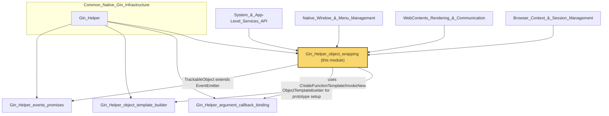
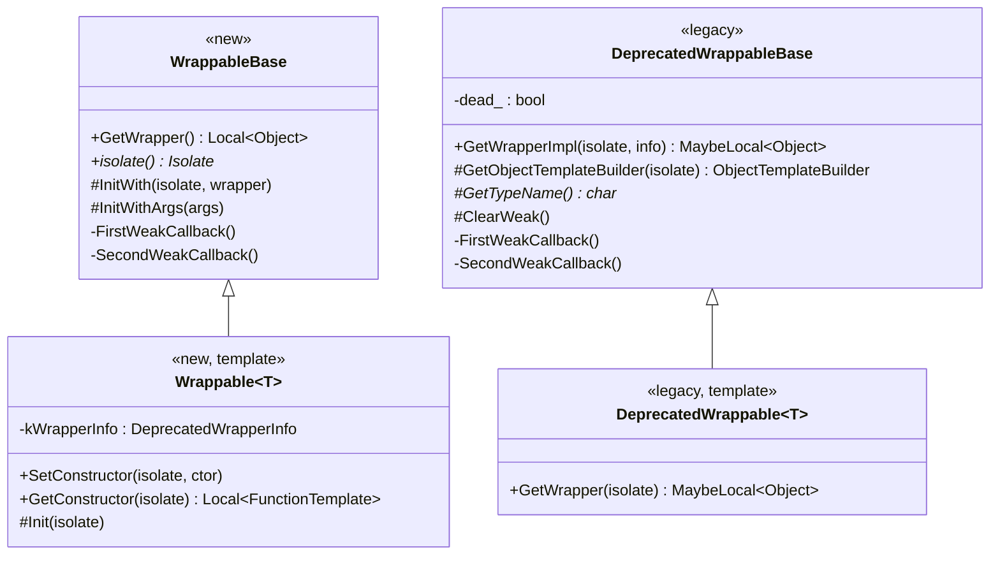
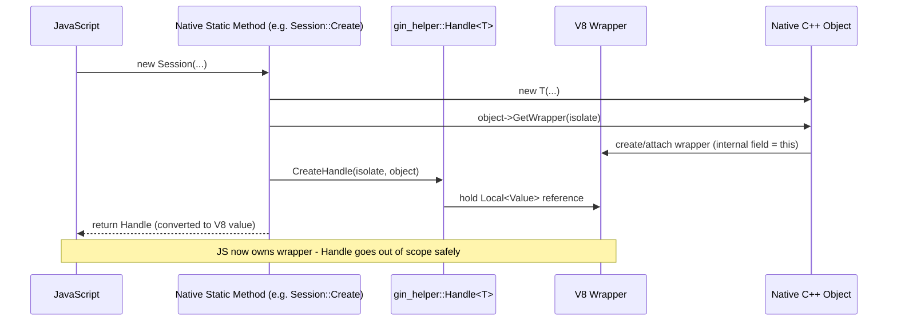
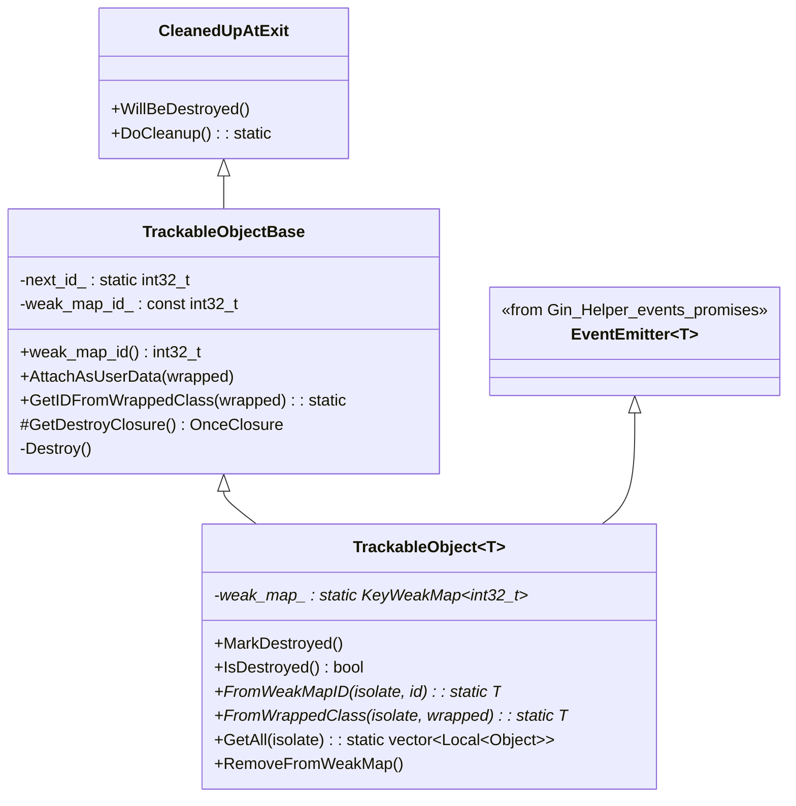
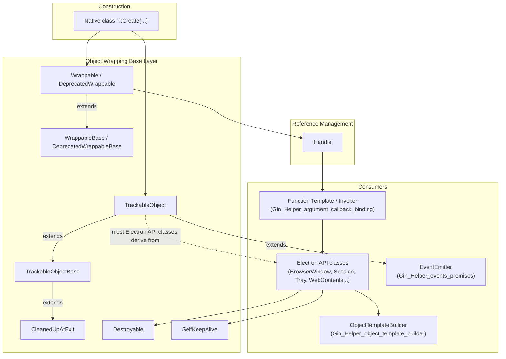
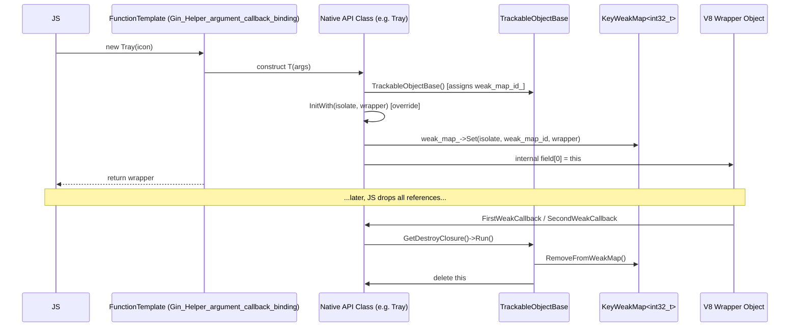

# Gin Helper: Object Wrapping

## Introduction

The **Gin Helper: Object Wrapping** module is the foundational infrastructure that Electron uses to expose native C++ objects to JavaScript through V8's [`gin`](https://chromium.googlesource.com/chromium/src/+/main/gin/) binding library. It defines the core base classes, memory-management primitives, and lifecycle helpers that every native-backed JS object in Electron (e.g. `BrowserWindow`, `WebContents`, `Session`, `Tray`, etc.) ultimately derives from.

This module answers three fundamental questions for any native object that needs a JavaScript-visible counterpart:

1. **How is the C++ object bound to a V8 wrapper object?** (`Wrappable`, `WrappableBase`, `DeprecatedWrappable`, `DeprecatedWrappableBase`)
2. **How do we safely hold a reference to that object on the C++ stack without leaking memory?** (`Handle`)
3. **How do we track, look up, and clean up these objects over their lifetime?** (`TrackableObjectBase`, `IDUserData`, `CleanedUpAtExit`, `Destroyable`, `SelfKeepAlive`)

It sits at the very bottom of Electron's native/JS bridge stack and is depended upon by virtually every other native API module in the codebase (see [System & App-Level Services API](shell_browser_api_system_device.md), [Native Window & Menu Management](Native_Window_&_Menu_Management.md), [WebContents Rendering & Communication](WebContents_Rendering_&_Communication.md), etc.).

---

## Module Position in the System

This module is a child of [Gin Helper](Gin_Helper.md), which itself lives under [Common Native Gin Infrastructure](Common_Native_Gin_Infrastructure.md). Its sibling modules are:

- [Gin_Helper_argument_callback_binding](Gin_Helper_argument_callback_binding.md) — argument parsing and native callback/constructor invocation.
- [Gin_Helper_object_template_builder](Gin_Helper_object_template_builder.md) — fluent builder API (`ObjectTemplateBuilder`) used by `DeprecatedWrappableBase::GetObjectTemplateBuilder` to declare JS-visible methods/properties.
- [Gin_Helper_events_promises](Gin_Helper_events_promises.md) — `EventEmitter`, `Event`, and `Promise` abstractions, which are combined with the object-wrapping primitives here (e.g. `TrackableObject` inherits from `EventEmitter<T>`).

---

## Core Concepts

### 1. Two Generations of Wrapping: `Wrappable` vs. `DeprecatedWrappable`

Electron is in the middle of migrating its native/JS binding layer away from a legacy Chromium `gin::Wrappable`-style implementation toward a newer pattern upstreamed from Chromium (tracked in [electron/electron#47922](https://github.com/electron/electron/issues/47922)). Consequently this module currently contains **both** generations side by side:

| | New (`Wrappable`) | Legacy (`DeprecatedWrappable`) |
|---|---|---|
| Base class | `WrappableBase` | `DeprecatedWrappableBase` |
| Wrapper info type | `gin::DeprecatedWrapperInfo` (shared, static per-`T`) | `gin::DeprecatedWrapperInfo` (per-`T`, defined by subclass as `kWrapperInfo`) |
| Prototype setup | `T::BuildPrototype(isolate, templ)` | `GetObjectTemplateBuilder(isolate)` (virtual, override marked `final`) |
| Construction | `SetConstructor` / `GetConstructor` + `Init` | Constructed directly, wrapper fetched via `GetWrapper` |
| Status | Actively used going forward | Being phased out; most current Electron classes still use this |

Both share the same underlying idea: an internal V8 field on the wrapper object stores a pointer back to the native C++ instance, and a weak callback chain destroys the C++ object once V8 garbage-collects the wrapper (unless something else, like `TrackableObject`, keeps it alive by other means).

### 2. `Handle<T>` — Stack-Only Strong Reference

Because the C++ object's lifetime is tied to its V8 wrapper (a *weak* global), you cannot safely hold a raw `T*` across V8 garbage-collection points. `gin_helper::Handle<T>` solves this by pairing the raw pointer with a `v8::Local<v8::Value>` reference to the wrapper, keeping the wrapper (and therefore the object) alive for as long as the `Handle` is on the stack.

- `CreateHandle<T>(isolate, object)` is the standard factory used throughout Electron's API classes (`Session::Create`, `Tray::New`, etc.) to return a newly constructed native object to JS.
- `gin::Converter<Handle<T>>` allows `Handle<T>` to be used directly as a return type or parameter type in `gin_helper` bound methods, and integrates with the [Gin_Helper_argument_callback_binding](Gin_Helper_argument_callback_binding.md) function-template machinery.

### 3. `TrackableObjectBase` / `TrackableObject<T>` — ID-based Global Registry

Some native objects need to be discoverable by an opaque integer ID (for example, restoring references across IPC boundaries, or enumerating "all windows"/"all webContents"). `TrackableObjectBase` (in `trackable_object.h`) provides:

- A monotonically increasing `weak_map_id_` assigned at construction.
- `AttachAsUserData` / `GetIDFromWrappedClass`, which stash the ID on an arbitrary `base::SupportsUserData`-derived object (e.g. `content::WebContents`) via `IDUserData` (defined in `trackable_object.cc`), enabling reverse lookup of the Electron wrapper object from a Chromium content object.
- `GetDestroyClosure()`, used by the [Gin_Helper_argument_callback_binding](Gin_Helper_argument_callback_binding.md) callback machinery to schedule safe destruction.

The `TrackableObject<T>` template (declared in the same header) layers on top:

- Inherits from **both** `TrackableObjectBase` and `EventEmitter<T>` (see [Gin_Helper_events_promises](Gin_Helper_events_promises.md)), unifying ID-tracking with event-emission — this is the base class used by most of Electron's long-lived native API objects.
- Maintains a static, per-`T` `electron::KeyWeakMap<int32_t>` (see [V8_Node_Common_Utils](V8_Node_Common_Utils.md)) mapping `weak_map_id()` → V8 wrapper, enabling `FromWeakMapID`, `FromWrappedClass`, and `GetAll`.
- `MarkDestroyed` / `IsDestroyed` manipulate the wrapper's internal field directly to signal to JS-side code that the underlying native object is gone, without necessarily freeing the wrapper itself.

### 4. `CleanedUpAtExit` — Deterministic Isolate-Teardown Cleanup

V8's weak-callback finalizers are **not guaranteed to run** when the `v8::Isolate` itself is being torn down. Since many `gin_helper::Wrappable` objects rely on those finalizers to free native resources, `CleanedUpAtExit` provides an explicit, deterministic hook: objects that need guaranteed cleanup register themselves (implicitly, via construction) and `CleanedUpAtExit::DoCleanup()` is invoked by Electron's shutdown sequence (see [Browser_Process_Core_&_Lifecycle](Browser_Process_Core_&_Lifecycle.md) / `ElectronBrowserMainParts`) prior to `Isolate` disposal, calling `WillBeDestroyed()` on every live instance.

### 5. `Destroyable` — Explicit JS-Facing Destruction API

`Destroyable::MakeDestroyable` injects `destroy()` and `isDestroyed()` methods onto a `FunctionTemplate`'s prototype chain, giving JavaScript code the ability to explicitly and synchronously destroy a wrapped native object (rather than waiting for GC). `Destroyable::IsDestroyed` inspects the wrapper's internal field state (set to `nullptr` upon destruction) to answer `isDestroyed()` queries. This is commonly layered on top of `Wrappable`/`DeprecatedWrappable`-derived classes that expose a manual disposal API to script (e.g. `webContents.destroy()`).

### 6. `SelfKeepAlive<Self>` — GC-Root Self-Reference

`SelfKeepAlive<Self>` (built on `cppgc::Persistent`) lets an object keep **itself** alive against garbage collection during operations where premature collection would be unsafe (e.g. while an async native operation is in flight that will later call back into the object). Calling `Clear()` releases the strong reference, allowing normal GC to proceed. This is a targeted escape hatch distinct from the `TrackableObject` weak-map mechanism — it creates a genuine strong GC root rather than an ID-indexed lookup table entry.

---

## Component Interaction Overview

### Typical Lifecycle of a `TrackableObject`-derived API Class

---

## Key Relationships to Other Modules

| Dependency | Relationship |
|---|---|
| [Gin_Helper_argument_callback_binding](Gin_Helper_argument_callback_binding.md) | Supplies `CreateFunctionTemplate`, `InvokeNew`, and `GinArgumentsToTuple` used by `Wrappable<T>::SetConstructor`/`GetConstructor` to build V8 `FunctionTemplate`s that construct wrapped objects. |
| [Gin_Helper_object_template_builder](Gin_Helper_object_template_builder.md) | `DeprecatedWrappableBase::GetObjectTemplateBuilder` returns a `gin::ObjectTemplateBuilder` (declared in `wrappable_base.h` as a forward-declared dependency) used to declaratively register methods/properties on the prototype. |
| [Gin_Helper_events_promises](Gin_Helper_events_promises.md) | `TrackableObject<T>` multiply-inherits from `EventEmitter<T>`, unifying event dispatch with object tracking for nearly all long-lived Electron API objects. |
| [V8_Node_Common_Utils](V8_Node_Common_Utils.md) | `electron::KeyWeakMap<int32_t>` (defined in `shell/common/key_weak_map.h`) backs the static per-type registry inside `TrackableObject<T>`. |
| [Browser_Process_Core_&_Lifecycle](Browser_Process_Core_&_Lifecycle.md) | Drives `CleanedUpAtExit::DoCleanup()` during shutdown of `ElectronBrowserMainParts`/`JavascriptEnvironment`, ensuring wrappables are cleaned up before the V8 `Isolate` is destroyed. |
| Nearly all native API modules (e.g. [System_&_App-Level_Services_API](shell_browser_api_system_device.md), [Native_Window_&_Menu_Management](Native_Window_&_Menu_Management.md), [Browser_Context_&_Session_Management](Browser_Context_&_Session_Management.md), [WebContents_Rendering_&_Communication](WebContents_Rendering_&_Communication.md)) | Every gin-bound native class (e.g. `App`, `BrowserWindow`, `Session`, `WebContents`, `Tray`, `Menu`) derives — directly or via `TrackableObject<T>` — from the base classes defined in this module, and returns instances to JS wrapped in `gin_helper::Handle<T>`. |

---

## Design Notes & Migration Context

- The presence of **both** `Wrappable`/`WrappableBase` and `DeprecatedWrappable`/`DeprecatedWrappableBase` reflects an in-progress migration (tracked in electron/electron#47922) copying a newer wrapping pattern from a specific Chromium CL. New code should prefer the non-deprecated `Wrappable` path where feasible; the deprecated path remains because most existing Electron native classes have not yet been migrated.
- `gin::Converter<T*>` specializations are provided for **both** hierarchies (constrained via SFINAE / C++20 `requires` clauses on `WrappableBase*`/`DeprecatedWrappableBase*` convertibility), so that gin's automatic argument/return-value conversion transparently works regardless of which base a given class uses.
- `Handle<T>` intentionally has **no** heap-allocation or destructor logic — it is a thin, copyable, stack-only view. Callers must not store a `Handle<T>` as a long-lived member; for long-lived native-side references to the JS wrapper, other mechanisms (`v8::Global`, `SelfKeepAlive`) are used instead.
- `TrackableObjectBase`'s ID counter (`next_id_`) is a simple monotonically increasing `static` integer, scoped per-process — it is explicitly documented as browser-process-only via a `DCHECK(electron::IsBrowserProcess())` in the constructor.
