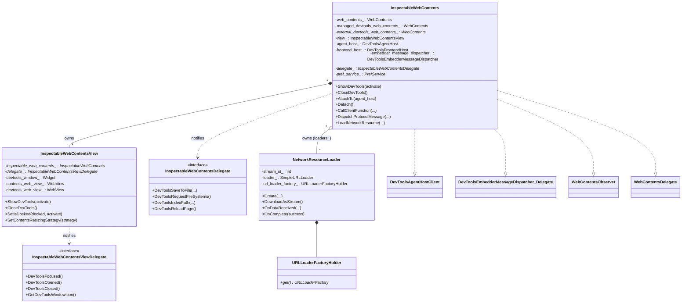
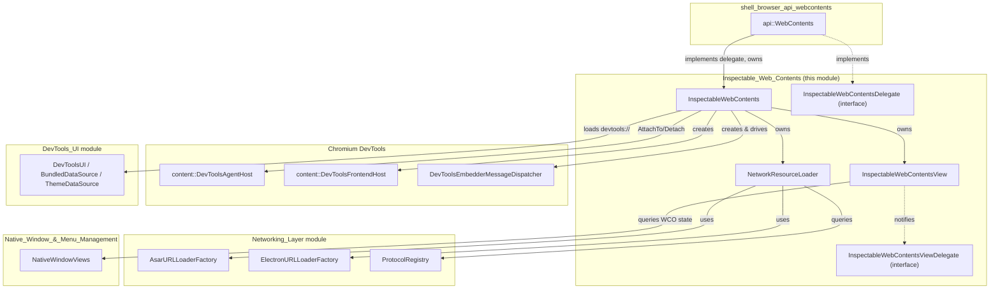
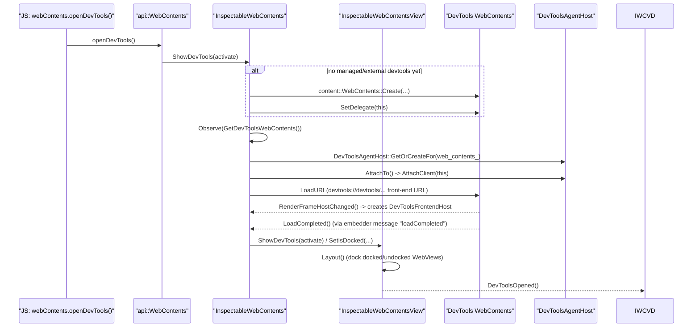
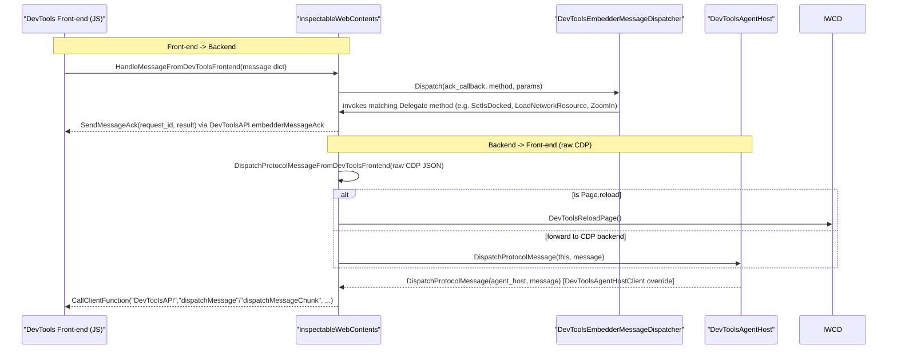
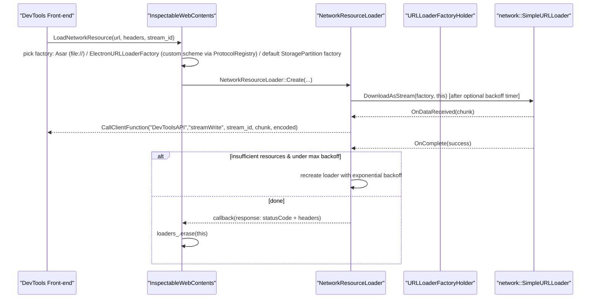

# Inspectable Web Contents

## 1. Purpose & Overview

The **Inspectable Web Contents** module is the C++ core that powers Electron's built-in **Chromium DevTools** integration. It provides the glue layer between:

- A "target" `content::WebContents` that a developer wants to inspect (e.g. a `BrowserWindow`'s page, a `<webview>`, or an offscreen-rendered page), and
- A second, dedicated `content::WebContents` that renders the actual **DevTools front-end UI** (the `devtools://devtools/...` page).

It implements the Chromium `DevToolsAgentHostClient` and `DevToolsEmbedderMessageDispatcher::Delegate` interfaces, which means it is responsible for:

- Creating/attaching to a `content::DevToolsAgentHost` for the inspected page.
- Hosting the DevTools front-end `WebContents` either **docked** (embedded inside the app's window via a `views::View`) or **undocked** (its own top-level window).
- Bridging JS-originated protocol messages from the DevTools front-end to the Chrome DevTools Protocol (CDP) backend, and vice versa.
- Implementing embedder-specific DevTools front-end host bindings such as file system access, "save to file", zoom control, preference persistence, and network resource loading for source maps.
- Persisting DevTools UI state (window bounds, zoom level, and arbitrary front-end preferences) via a `PrefService`.

This module is a leaf component consumed directly by [shell_browser_api_webcontents](shell_browser_api_webcontents.md) (specifically `WebContents::InspectableWebContents` member used to implement `webContents.openDevTools()` and related JS APIs), and it is closely related to the higher-level [DevTools_UI](DevTools_UI.md) module (which supplies WebUI data sources such as `devtools://` bundle/theme resources) and to [Native_Window_&_Menu_Management](Native_Window_&_Menu_Management.md) for docking/undocking inside native window frames.

## 2. Architecture Overview

### 2.1 Core Components

| Component | File | Responsibility |
|---|---|---|
| `InspectableWebContents` | `inspectable_web_contents.h/.cc` | Central controller: owns/references the inspected and DevTools `WebContents`, implements `DevToolsAgentHostClient` and `DevToolsEmbedderMessageDispatcher::Delegate`, manages preferences, protocol message dispatch, and lifecycle. |
| `InspectableWebContents::NetworkResourceLoader` (private nested class) | `inspectable_web_contents.cc` | Handles `LoadNetworkResource` requests from the DevTools front-end (e.g., fetching source maps) using `network::SimpleURLLoader`, with retry/backoff logic and streaming chunked responses back to the front-end via `DevToolsAPI.streamWrite`. |
| `URLLoaderFactoryHolder` | `inspectable_web_contents.cc` (nested in `NetworkResourceLoader`) | Small utility that type-erases either an owned `network::mojom::URLLoaderFactory` or a `scoped_refptr<network::SharedURLLoaderFactory>`, so the loader can use file-scheme, custom-protocol, or default network factories uniformly. |
| `InspectableWebContentsView` | `inspectable_web_contents_view.h` | A `views::View` subclass that owns the visual layout for docked/undocked DevTools: manages `views::WebView`s for both the inspected contents and DevTools contents, an optional floating `views::Widget` for undocked mode, and applies `DevToolsContentsResizingStrategy`. |
| `InspectableWebContentsDelegate` | `inspectable_web_contents_delegate.h` | Interface implemented by the embedder (typically `api::WebContents`) to handle high-level DevTools actions that need app-level context: save/append to file, file-system requests, indexing/search, reload, opening URLs in new tabs, eye-dropper activation. |
| `InspectableWebContentsViewDelegate` | `inspectable_web_contents_view_delegate.h` | Interface implemented by the embedder to react to view-level events (focus/open/close/resize) and supply platform bits like the DevTools window icon or (Linux) WM_CLASS. |
| `RegisterOptions`, `PrefRegistrySimple`, `PrefService` | forward-declared | Chromium preference infrastructure used to persist DevTools bounds, zoom level, and front-end preferences dictionary across sessions. |

### 2.2 Component Relationship Diagram

### 2.3 System Context

## 3. Key Workflows

### 3.1 Opening DevTools

### 3.2 Protocol Message Round-Trip (CDP)

### 3.3 Loading a Network Resource (e.g. Source Map)

## 4. Detailed Component Notes

### 4.1 `InspectableWebContents`
- Constructed with the **inspected** `content::WebContents`, a `PrefService*` for persisting DevTools UI state, and an `is_guest` flag (used for `<webview>` tags where display/screen lookup differs).
- On construction, restores devtools window bounds from the `electron.devtools.bounds` pref, clamping to a sane minimum size and re-centering if the last known position is off-screen.
- Supports both **managed** DevTools (`managed_devtools_web_contents_`, created internally) and **externally supplied** DevTools (`SetDevToolsWebContents`), which is used e.g. for remote debugging scenarios.
- Implements three important Chromium interfaces:
  - `content::DevToolsAgentHostClient` — receives raw CDP messages destined for the front-end (`DispatchProtocolMessage`), chunking large payloads (over `IPC::Channel::kMaximumMessageSize / 4`) into `dispatchMessageChunk` calls.
  - `content::WebContentsObserver` — observes the DevTools WebContents for `RenderFrameHostChanged` (to (re)create the `DevToolsFrontendHost`), `WebContentsDestroyed` (cleanup), `OnWebContentsFocused`, and navigation events (used to inject devtools extension APIs on `chrome-extension://` navigations, gated by `BUILDFLAG(ENABLE_ELECTRON_EXTENSIONS)`).
  - `content::WebContentsDelegate` — forwards keyboard events, eye-dropper requests, and file chooser/directory enumeration back to the *inspected* WebContents' own delegate (so that DevTools reuses the app's native dialogs).
  - `DevToolsEmbedderMessageDispatcher::Delegate` — the largest interface, implementing dozens of "embedder host" bindings the front-end JS calls into (docking, zoom, preferences, file system requests, indexing/search, telemetry stubs that are no-ops in Electron).
- Preference-backed settings:
  - `electron.devtools.bounds` — window `Rect` dictionary.
  - `electron.devtools.zoom` — double zoom level, adjusted via `ZoomIn`/`ZoomOut`/`ResetZoom` snapping to a preset factor table.
  - `electron.devtools.preferences` — a free-form dictionary the front-end reads/writes via `GetPreference(s)`/`SetPreference`/`RemovePreference`/`ClearPreferences`.
- Devtools front-end URL is either the bundled `devtools://devtools/bundled/...` or a remote Chrome DevTools frontend fetched from `chrome-devtools-frontend.appspot.com` keyed by the embedded Chromium git revision — see `GetDevToolsURL`/`GetRemoteBaseURL`.
- `AddDevToolsExtensionsToClient()` (extensions build only) enumerates enabled extensions with a `devtools_page`, grants them origin request permissions in the DevTools renderer process, and informs the front-end via `DevToolsAPI.addExtensions`.

### 4.2 `NetworkResourceLoader` & `URLLoaderFactoryHolder`
- A private nested class of `InspectableWebContents`, instantiated per network fetch requested by the DevTools front-end (typically to fetch source maps referenced by inspected scripts/stylesheets).
- Chooses the correct `network::mojom::URLLoaderFactory`:
  - `file://` URLs → `AsarURLLoaderFactory` (to transparently read files packed inside `.asar` archives) — see [Networking_Layer](Networking_Layer.md) → `shell_browser_net_asar`.
  - Custom registered schemes → looked up via `ProtocolRegistry::FindRegistered` and served through `ElectronURLLoaderFactory` — see [Networking_Layer](Networking_Layer.md) → `Protocol_Registry` / `shell_browser_api_session_net_protocol_netlog`.
  - Everything else → the browser context's default `StoragePartition` URL loader factory.
- Implements retry with exponential backoff (starting at 250ms, capped at 10s, factor 1.3x) specifically for `net::ERR_INSUFFICIENT_RESOURCES` failures.
- Streams response bytes to the front-end incrementally via `DevToolsAPI.streamWrite`, base64-encoding non-UTF8 chunks.
- `URLLoaderFactoryHolder` is a minimal variant-like wrapper allowing the loader to hold either an owned factory instance or a ref-counted shared factory without needing a full `std::variant`.

### 4.3 `InspectableWebContentsView`
- A `views::View` (Views toolkit — see [Native_Window_&_Menu_Management](Native_Window_&_Menu_Management.md)) that lays out up to three `views::WebView`s: the inspected contents, the docked DevTools contents, and (for undocked mode) a separate `devtools_window_web_view_` hosted in its own `views::Widget`.
- `SetContentsResizingStrategy` applies a `DevToolsContentsResizingStrategy` (from Chromium's `chrome/browser/devtools`) to compute the split between inspected page and DevTools panel.
- `SetCornerRadii` supports rounded corners for the hosted views (relevant on platforms/styles that render window content with rounded corners).
- Delegates window-icon and (Linux) WM_CLASS lookups to `InspectableWebContentsViewDelegate`, and notifies it of focus/open/close/resize events, allowing the owning `NativeWindow` implementation to react (e.g., adjusting layered window state).

### 4.4 Delegate Interfaces
- **`InspectableWebContentsDelegate`**: Implemented by `api::WebContents` (see [shell_browser_api_webcontents](shell_browser_api_webcontents.md)) to bridge file I/O (`DevToolsSaveToFile`, `DevToolsAppendToFile`), file-system panel requests, indexing/searching workspace folders, page reload requests triggered from within DevTools, and eye-dropper activation (color picker tool).
- **`InspectableWebContentsViewDelegate`**: Implemented by the platform-specific window/view glue to react to DevTools show/hide/focus/resize and to supply the DevTools window's icon and Linux WM_CLASS metadata.

## 5. Relationship to Other Modules

- **[shell_browser_api_webcontents](shell_browser_api_webcontents.md)** — `api::WebContents` owns an `InspectableWebContents` instance and implements both delegate interfaces to expose `webContents.openDevTools()`, `closeDevTools()`, `isDevToolsOpened()`, `toggleDevTools()`, etc. to JavaScript.
- **[DevTools_UI](DevTools_UI.md)** — Supplies the `devtools://` WebUI (`DevToolsUI`, `BundledDataSource`, `ThemeDataSource`) that the DevTools `WebContents` navigates to; `InspectableWebContents` is the consumer that drives navigation and message dispatch against that UI.
- **[Networking_Layer](Networking_Layer.md)** — `NetworkResourceLoader` depends on `AsarURLLoaderFactory`, `ElectronURLLoaderFactory`, and `ProtocolRegistry` to resolve DevTools' network resource requests (e.g. source maps) across custom schemes and packaged archives.
- **[Native_Window_&_Menu_Management](Native_Window_&_Menu_Management.md)** — `InspectableWebContentsView` is a `views::View` hosted within a `NativeWindowViews`; docking logic also queries `IsWindowControlsOverlayEnabled()` on Windows/Linux to avoid overlapping window controls.
- **[Extensions_Subsystem](Extensions_Subsystem.md)** — When extensions support is compiled in, `InspectableWebContents::AddDevToolsExtensionsToClient` integrates enabled extensions' `devtools_page` manifest entries into the DevTools front-end.
- **[Common_Native_Gin_Infrastructure](Common_Native_Gin_Infrastructure.md)** — Uses `gin_helper` and V8 interop indirectly through `api::WebContents::FromOrCreate`, which wraps the managed DevTools `WebContents` as a JS-visible object.

## 6. Summary

Inspectable Web Contents is a small but architecturally pivotal module: it is the sole bridge between Electron's native window/`WebContents` hosting layer and Chromium's DevTools protocol/front-end machinery. Because the module consists of a handful of tightly coupled classes revolving around a single `InspectableWebContents` controller (rather than several independently meaningful sub-domains), it is documented here as a single cohesive unit without further sub-module decomposition.
