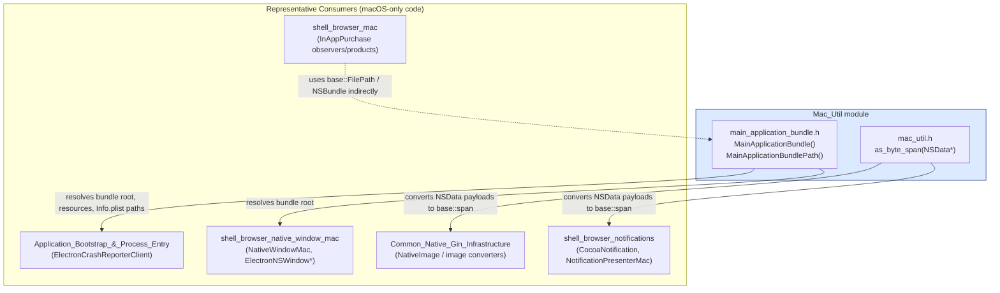
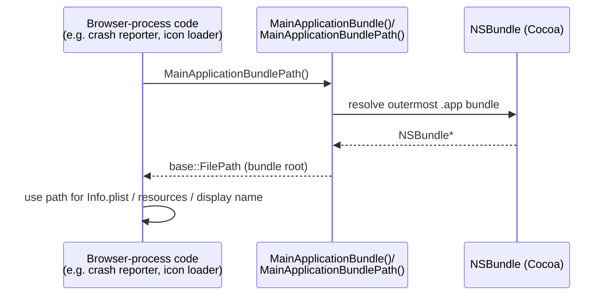
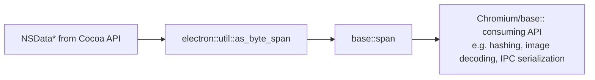

# Mac_Util

## 1. Purpose & Overview

`Mac_Util` is a small, focused collection of **macOS-only C++ utility functions** used throughout Electron's browser and common code. It provides two narrowly-scoped services:

1. **Application bundle introspection** — locating the outermost (main) `.app` bundle for the running process, as opposed to any nested helper-app bundle (e.g. the GPU/renderer/utility helper apps that Electron/Chromium spawn on macOS).
2. **`NSData` byte-span interop** — a thin bridge that exposes the bytes of an Objective-C `NSData` object as a `base::span<const uint8_t>`, allowing Objective-C-owned buffers to be consumed safely and idiomatically by modern C++ (base/Chromium) APIs without manual pointer/length bookkeeping.

Because of its small surface area, `Mac_Util` has no internal sub-modules; it is documented as a single flat unit.

This module belongs to the broader **Platform-Specific Integration** area of the codebase, alongside sibling modules such as:
- [Platform_Util.md](Platform_Util.md) — cross-platform OS shell operations (open file/URL, move to trash, etc.), which is the natural counterpart to `Mac_Util` at the OS-integration layer.
- [shell_browser_mac.md](shell_browser_mac.md) — macOS in-app purchase (StoreKit) integration.
- [shell_browser_linux.md](shell_browser_linux.md) and [Win_Scoped_HString.md](Win_Scoped_HString.md) — the Linux and Windows analogues of small platform-glue utility modules.

## 2. Architecture Overview

`Mac_Util` consists of two independent header-declared utility surfaces. They do not depend on each other, but both are consumed by higher-level macOS-specific browser code (window management, native image/icon loading, crash reporting, notifications, etc.) that needs to bridge Objective-C/Cocoa types and Chromium's `base` primitives.

### Design rationale

- **Minimal, dependency-light headers**: both headers avoid pulling in heavy Objective-C or Chromium headers where possible, using forward declarations (`@class NSBundle;` / `struct NSBundle;`, `@class NSData;`) so that plain C++ translation units can include them without requiring Objective-C++ compilation, except where the underlying `.mm` implementation is actually compiled.
- **`base` type reuse**: Return/parameter types (`base::FilePath`, `base::span<const uint8_t>`) integrate directly with the rest of the Chromium-derived `base` library used across Electron, minimizing friction when passing bundle paths or binary data further into platform-agnostic code paths.

## 3. Core Components

### 3.1 `shell/common/mac/main_application_bundle.h`

| Component | Description |
|---|---|
| `electron::MainApplicationBundle()` | Returns the `NSBundle*` for the **main** application bundle — i.e., the outermost `.app` bundle for the logical application, regardless of which particular executable (main app vs. a nested helper app such as `MyApp Helper.app`) is currently executing. This mirrors a common Chromium pattern needed because macOS apps that embed helper processes (GPU, renderer, utility, code-signing helpers) each have their own bundle, but callers usually want to reach back to the top-level user-facing bundle (e.g., to read `Info.plist`, find app icons, or resolve display name/version). |
| `electron::MainApplicationBundlePath()` | Convenience wrapper that returns the **file-system path** (`base::FilePath`) of the main application bundle, instead of the live `NSBundle*` object. Useful for code that needs a path string/FilePath for logging, resource loading, or interacting with `base::File`-based APIs rather than Objective-C bundle APIs directly. |

Forward-declared dependent types: `NSBundle` (Objective-C class, forward-declared for both `__OBJC__` and plain C++ compilation contexts) and `base::FilePath` (declared via forward declaration of the `base` namespace).

**Typical usage pattern:**

### 3.2 `shell/common/mac_util.h`

| Component | Description |
|---|---|
| `electron::util::as_byte_span(NSData* data)` | Converts an Objective-C `NSData*` buffer into a `base::span<const uint8_t>`, giving safe, bounds-aware, zero-copy read access to the underlying bytes from C++ code. This avoids manual use of `[data bytes]` / `[data length]` pairs scattered across the codebase and reduces the risk of length/pointer mismatches. |

Forward-declared dependent type: `NSData` (Objective-C class).

**Typical usage pattern:** Any code that receives binary data from Cocoa/macOS system APIs (e.g., image data, security/keychain data, IPC payloads bridged from Objective-C) and needs to hand that data to a `base`-style API (which commonly accepts `base::span<const uint8_t>`) uses `as_byte_span` as the single point of conversion.

## 4. How Mac_Util Fits Into the Overall System

`Mac_Util` sits at the lowest, most platform-specific layer of the codebase — it has no outgoing dependencies on other Electron modules, and is instead a **leaf utility dependency** consumed by higher-level macOS-specific modules:

- **[shell_browser_native_window_mac](shell_browser_native_window_mac.md)** and other Cocoa UI code may rely on bundle path resolution for locating resources (icons, nib/xib-equivalent assets) relative to the main application bundle.
- **[shell_browser_notifications](shell_browser_notifications.md)** (`CocoaNotification`, `NotificationPresenterMac`) and native image/clipboard code in **[Common_Native_Gin_Infrastructure](Common_Native_Gin_Infrastructure.md)** (e.g., `electron_api_native_image.h`, `electron_api_clipboard.h`) commonly need to move data between `NSData` and C++ buffers — a natural use case for `as_byte_span`.
- **[Application_Bootstrap_&_Process_Entry](Application_Bootstrap_&_Process_Entry.md)** components (e.g., crash reporter client, main delegate) may use main-bundle resolution to correctly identify the top-level app identity even when running inside a helper process.
- **[shell_browser_mac](shell_browser_mac.md)** (In-App Purchase / StoreKit integration) operates within the same "macOS platform integration" family of modules and shares the general pattern of bridging Objective-C system frameworks into Electron's C++ core.

Because `Mac_Util` contains only two small, independent headers with no cross-references to each other, there was no need to further decompose it into sub-modules — the single documentation file above fully covers its component surface.

## 5. Summary

| Aspect | Detail |
|---|---|
| Scope | macOS-only (`Cocoa`/`NSBundle`/`NSData` interop) |
| Files | `shell/common/mac/main_application_bundle.h`, `shell/common/mac_util.h` |
| Key responsibilities | (1) Resolve the main/outer app bundle & its path; (2) Convert `NSData` to `base::span<const uint8_t>` |
| Dependencies | `base::FilePath`, `base::span`, Objective-C `NSBundle`/`NSData` (forward-declared) |
| Consumers | macOS native window/UI code, notifications, native image/clipboard handling, crash reporting, app bootstrap |
| Related modules | [Platform_Util.md](Platform_Util.md), [shell_browser_mac.md](shell_browser_mac.md), [shell_browser_linux.md](shell_browser_linux.md), [Win_Scoped_HString.md](Win_Scoped_HString.md) |
