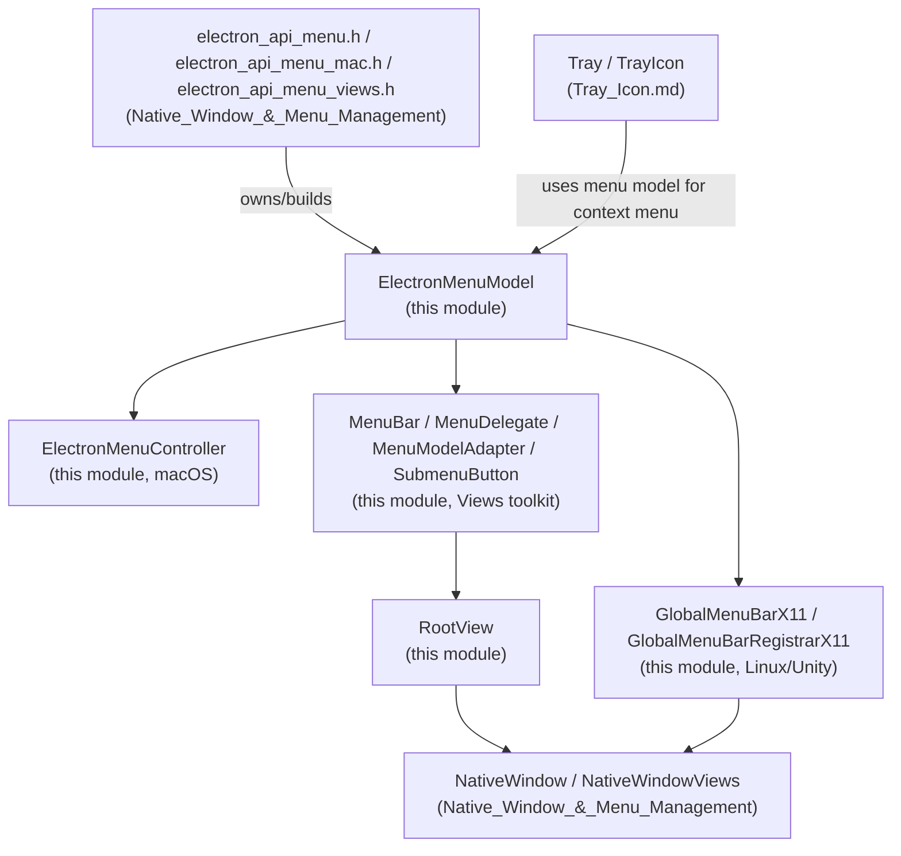
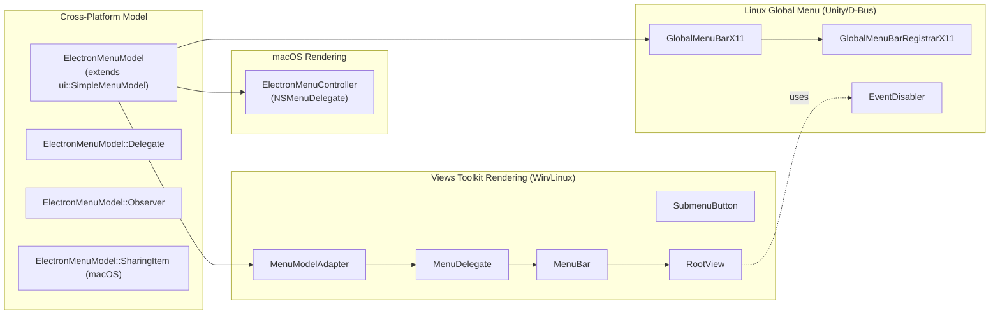
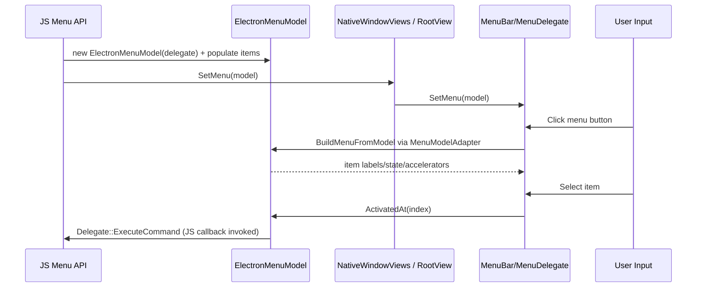

# Menu (Model & Views)

## Introduction

The **Menu (Model & Views)** module implements Electron's cross-platform application/context menu
system. It provides a single, platform-agnostic **menu data model** (`ElectronMenuModel`) plus the
platform-specific **presentation layers** that turn that model into an actual on-screen menu:

- A native **Cocoa** menu controller for macOS.
- A **Views**-based in-window menu bar (used on Windows and non-Unity Linux desktops when frameless
  or custom-drawn windows are used).
- A **D-Bus/Unity global menu bar** integration for Linux desktop environments that support the
  `com.canonical.AppMenu` global menu protocol (e.g., Ubuntu Unity).

This module is purely about *modeling menu structure/state and rendering it*; it does not expose
the JavaScript API surface itself (that lives in `shell/browser/api/electron_api_menu*.h`, part of
the [Native Window & Menu Management](shell_browser_api_window_ui_menu.md) module) nor does it own
window chrome (see [Native Window & Menu Management](shell_browser_native_window_views.md) and
[Frame Views](Frame_Views.md)).

## Role in the Overall System

The `ElectronMenuModel` is created and populated by the JS-facing `Menu` API
(see [Native_Window_&_Menu_Management](shell_browser_api_window_ui_menu.md)), then handed off to
whichever platform renderer is appropriate. `Tray` icons ([Tray_Icon](Tray_Icon.md)) and context
menus on `WebContents` also reuse the same `ElectronMenuModel`/renderer stack.

## Architecture Overview

## Sub-modules

This module is organized into four focused areas, each documented in detail in its own file:

| Sub-module | Description | Documentation |
|---|---|---|
| **Menu Model** | The cross-platform `ElectronMenuModel` class, its `Delegate`/`Observer` interfaces, and the macOS-only `SharingItem` struct. This is the single source of truth for menu structure/state consumed by every renderer. | [Menu_(Model_&_Views)_model.md](Menu_(Model_&_Views)_model.md) |
| **macOS Menu Controller** | `ElectronMenuController`, an `NSMenuDelegate`/`NSSharingServiceDelegate` Objective-C++ class that builds a native `NSMenu` from an `ElectronMenuModel`. | [Menu_(Model_&_Views)_macos.md](Menu_(Model_&_Views)_macos.md) |
| **Views Menu Bar** | The Views-toolkit renderer used on Windows and Linux: `MenuBar`, `MenuDelegate`, `MenuModelAdapter`, `SubmenuButton`, and `RootView`, which together render an in-window menu bar and dropdown submenus. | [Menu_(Model_&_Views)_views.md](Menu_(Model_&_Views)_views.md) |
| **Linux Global Menu (X11/Unity)** | `GlobalMenuBarX11` and `GlobalMenuBarRegistrarX11`, which publish the menu model over D-Bus using `libdbusmenu-glib` so desktop shells like Unity can render it as a global menu bar, plus the `EventDisabler` helper used to suppress native events while such menus are open. | [Menu_(Model_&_Views)_x11.md](Menu_(Model_&_Views)_x11.md) |

## Key Interaction Flow

On macOS the same `ElectronMenuModel` is instead consumed by `ElectronMenuController`, which builds
a native `NSMenu`; on Linux desktops offering a global menu, `GlobalMenuBarX11` publishes it over
D-Bus instead of (or in addition to) the in-window `MenuBar`.

## Related Modules

- [Native_Window_&_Menu_Management](shell_browser_api_window_ui_menu.md) — owns the JS-exposed `Menu`, `BaseWindow`, `BrowserWindow` APIs that create and attach `ElectronMenuModel` instances.
- [Native Window Views](shell_browser_native_window_views.md) — the `NativeWindowViews` class that hosts a `RootView`/`MenuBar` for frameless/custom windows on Windows and Linux.
- [Tray_Icon](Tray_Icon.md) — tray context menus reuse `ElectronMenuModel` and platform renderers.
- [Frame_Views](Frame_Views.md) — window frame/caption views that coexist with the in-window `MenuBar`.
- [Gin_Helper](Gin_Helper.md) / [Gin_Converters](Gin_Converters.md) — used by the JS API layer to marshal menu templates into `ElectronMenuModel` calls (not part of this module).
