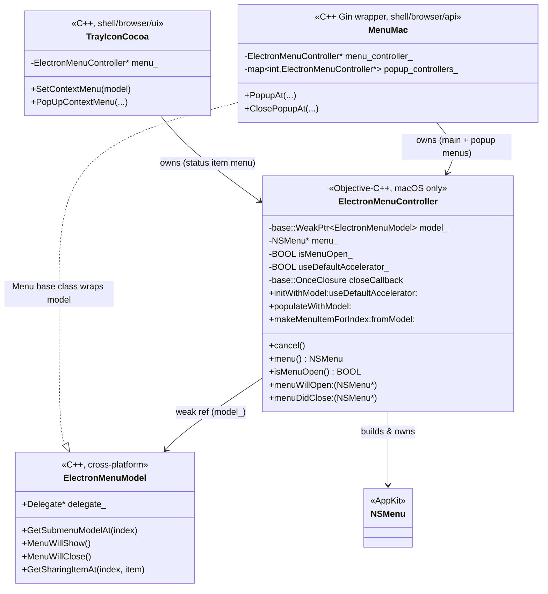
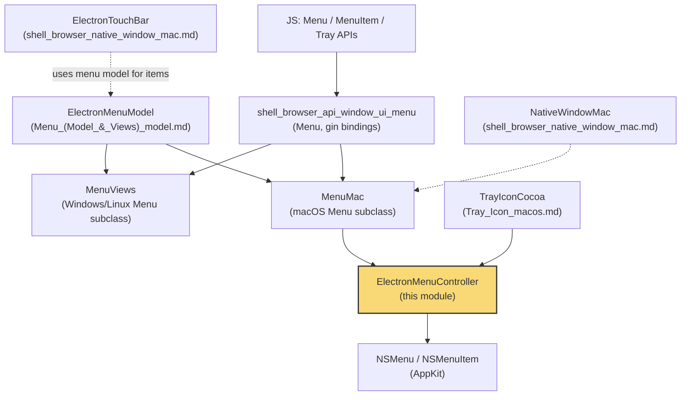
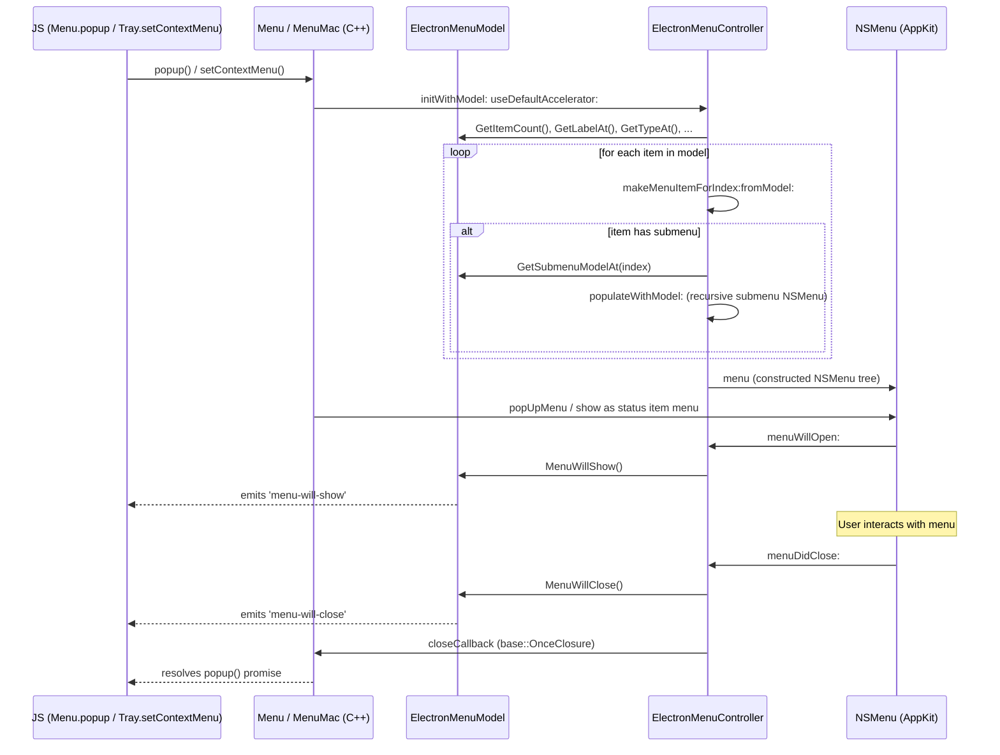
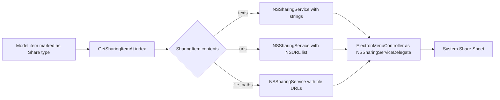

# Menu (Model & Views) — macOS

## Introduction

The **Menu (Model & Views) — macOS** module provides the Cocoa-specific implementation that translates Electron's cross-platform, C++ menu model (`ElectronMenuModel`) into a native `NSMenu` hierarchy that macOS understands. It is the bridge between Electron's platform-agnostic menu API surface (used from JavaScript via `Menu`, `MenuItem`, `Tray`, etc.) and Apple's AppKit menu system.

This module contains a single, focused component:

- **`ElectronMenuController`** — an `NSObject` (Objective-C++) class conforming to `NSMenuDelegate` and `NSSharingServiceDelegate` that builds and manages an `NSMenu` from an `ElectronMenuModel`.

It sits alongside sibling platform implementations for Views-based platforms (Windows/Linux) and X11 global menu bars, all of which consume the same cross-platform `ElectronMenuModel`. See [Menu_(Model_&_Views)_model.md](Menu_(Model_&_Views)_model.md) for the model definition, [Menu_(Model_&_Views)_views.md](Menu_(Model_&_Views)_views.md) for the Views (Windows/Linux) menu bar implementation, and [Menu_(Model_&_Views)_x11.md](Menu_(Model_&_Views)_x11.md) for the Linux global (DBus) menu bar.

---

## Purpose & Core Functionality

On macOS, native application menus, context menus, and the Dock/status-bar (tray) menus are all `NSMenu` instances. Electron's JavaScript `Menu` API, however, is implemented in C++ using `ui::SimpleMenuModel` (subclassed as `ElectronMenuModel`) so that the same JS-facing behavior can be shared across platforms. `ElectronMenuController` is the adapter that:

1. **Builds** an `NSMenu` tree from an `ElectronMenuModel`, including nested submenus, by iterating model items and creating one `NSMenuItem` per model entry (`makeMenuItemForIndex:fromModel:`).
2. **Associates** state with each `NSMenuItem` — using its `tag` for the model index and its `representedObject` (an `NSValue`-wrapped model pointer) so hierarchical structures and lookups work correctly.
3. **Delegates menu lifecycle events** (`menuWillOpen:` / `menuDidClose:`) back into the `ElectronMenuModel`'s `MenuWillShow()` / `MenuWillClose()` hooks, keeping JS-side `will-show`/`menu-will-close` events in sync with actual AppKit menu interaction.
4. **Supports macOS Sharing Services** by implementing `NSSharingServiceDelegate`, enabling the "Share" submenu items (populated from `ElectronMenuModel::SharingItem`) to hand off text, URLs, or files to the system share sheet.
8. **Supports programmatic dismissal** of an open menu via `cancel`, and a completion callback (`setCloseCallback:`) invoked when the menu closes — used to resolve JS promises returned by `Menu.popup()`.

Because `ElectronMenuController` only holds a `base::WeakPtr<electron::ElectronMenuModel>`, the model must outlive the controller instance — the model is owned by the C++ side (typically a `MenuMac` or `TrayIconCocoa` instance), while the controller's lifetime is tied to the visible `NSMenu`.

---

## Architecture

### Component Relationship

### Ownership & Ecosystem Context

---

## Data Flow: Building & Showing a Menu

---

## Sharing Service Integration

`ElectronMenuController` implements `NSSharingServiceDelegate` so that menu items backed by `ElectronMenuModel::SharingItem` (texts, URLs, or file paths) can invoke the native macOS Share menu.

---

## Key Interactions with Other Modules

| Consumer | Relationship |
|---|---|
| [`MenuMac`](Menu_(Model_&_Views)_macos.md) (`shell/browser/api/electron_api_menu_mac.h`) | Owns one `ElectronMenuController` for the application/window menu and a map of controllers keyed by window ID for popup context menus (`PopupAt`/`ClosePopupAt`). This is the primary consumer, part of [shell_browser_api_window_ui_menu](shell_browser_api_window_ui_menu.md). |
| [`TrayIconCocoa`](Tray_Icon_macos.md) | Owns an `ElectronMenuController` to present the status-bar (tray) icon's right-click context menu, driven by `SetContextMenu`/`PopUpContextMenu`. |
| [`ElectronMenuModel`](Menu_(Model_&_Views)_model.md) | Cross-platform data model this controller renders; provides labels, types, accelerators, tooltips, roles, and (on macOS) `SharingItem` data. The controller only holds a weak pointer, so model lifetime is managed elsewhere (typically by the JS-exposed `Menu`/`Tray` wrapper). |
| [`Menu_(Model_&_Views)_views`](Menu_(Model_&_Views)_views.md) | Equivalent implementation for Windows/Linux using `views::MenuRunner`/`MenuModelAdapter` instead of `NSMenu`. Not used on macOS. |
| [`Menu_(Model_&_Views)_x11`](Menu_(Model_&_Views)_x11.md) | Equivalent for Linux global (DBus) application menu bars. Not used on macOS. |
| [`NativeWindowMac` / `ElectronTouchBar`](shell_browser_native_window_mac.md) | The macOS native window layer that may host a `MenuMac`-driven application menu, and separately the Touch Bar (a different UI surface that also reads from menu-like models but is not part of this module). |

---

## API Surface Summary

| Method | Responsibility |
|---|---|
| `initWithModel:useDefaultAccelerator:` | Designated initializer; builds the `NSMenu` from the given model immediately. |
| `populateWithModel:` | Fills the controller's current `NSMenu` with items from a model (used for both top-level and recursive submenu construction). |
| `makeMenuItemForIndex:fromModel:` | Constructs a single `NSMenuItem` for a given model index, wiring up title, state, accelerator, tag (index), and represented object (model pointer). |
| `cancel` | Programmatically closes the menu (e.g., when the underlying model or window is destroyed). |
| `model` / `setModel:` | Accessor/mutator for the weakly-held model pointer. |
| `menu` | Lazily creates and/or returns the constructed `NSMenu*`. |
| `isMenuOpen` | Reports whether the menu is currently displayed. |
| `setCloseCallback:` | Registers a `base::OnceClosure` fired from `menuDidClose:`, used to signal completion to the C++/JS caller (e.g., resolving a `Menu.popup()` promise). |
| `menuWillOpen:` / `menuDidClose:` | `NSMenuDelegate` callbacks forwarding open/close lifecycle to the model's `MenuWillShow()`/`MenuWillClose()`. |

---

## Design Notes

- **Weak model reference**: The controller never owns the `ElectronMenuModel`; it uses `base::WeakPtr` to safely handle model destruction while a menu might still be transitioning closed.
- **Represented object pattern**: Each `NSMenuItem`'s `representedObject` stores an `NSValue`-boxed pointer back to the `ElectronMenuModel` level it belongs to, and its `tag` stores the index within that model — this is what allows recursively nested submenus to be resolved back to the correct model/item pair when AppKit invokes actions.
- **Default accelerator toggle**: `useDefaultAccelerator_` controls whether macOS's automatic key-equivalent assignment is used versus explicit accelerators supplied by the model (relevant for popup/context menus vs. the main app menu).
- **Single-purpose Objective-C++ class**: Unlike the Views implementation (which involves several classes — `MenuBar`, `MenuDelegate`, `MenuModelAdapter`, `SubmenuButton`), the macOS implementation is intentionally consolidated into one class because `NSMenu`/`NSMenuItem` already provide most of the necessary hierarchical and event-delegate behavior natively.
