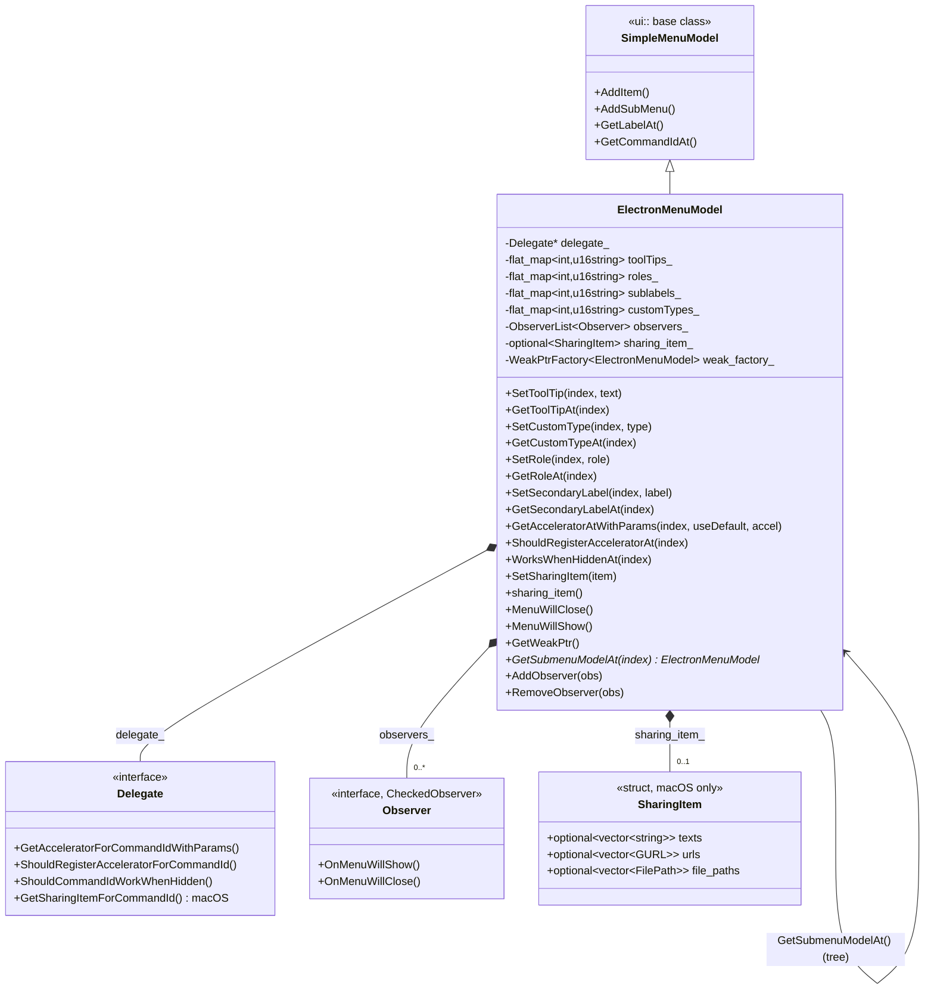
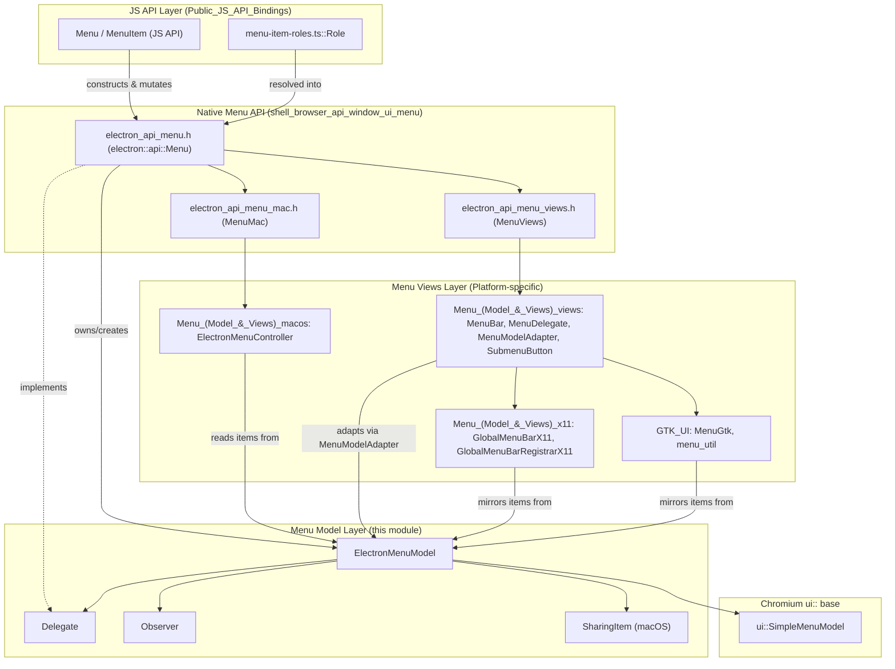
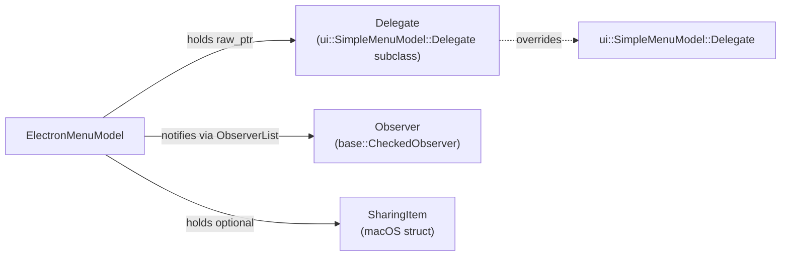
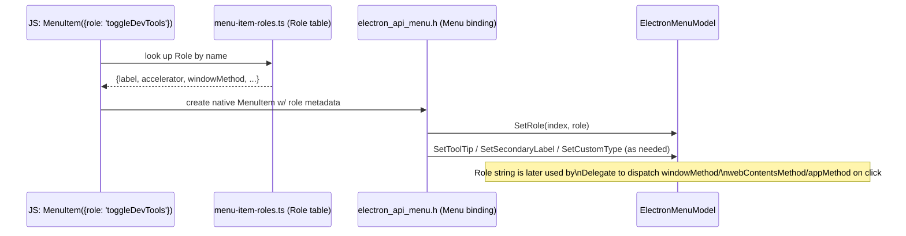
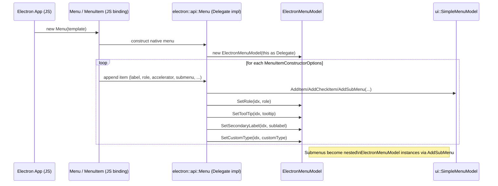
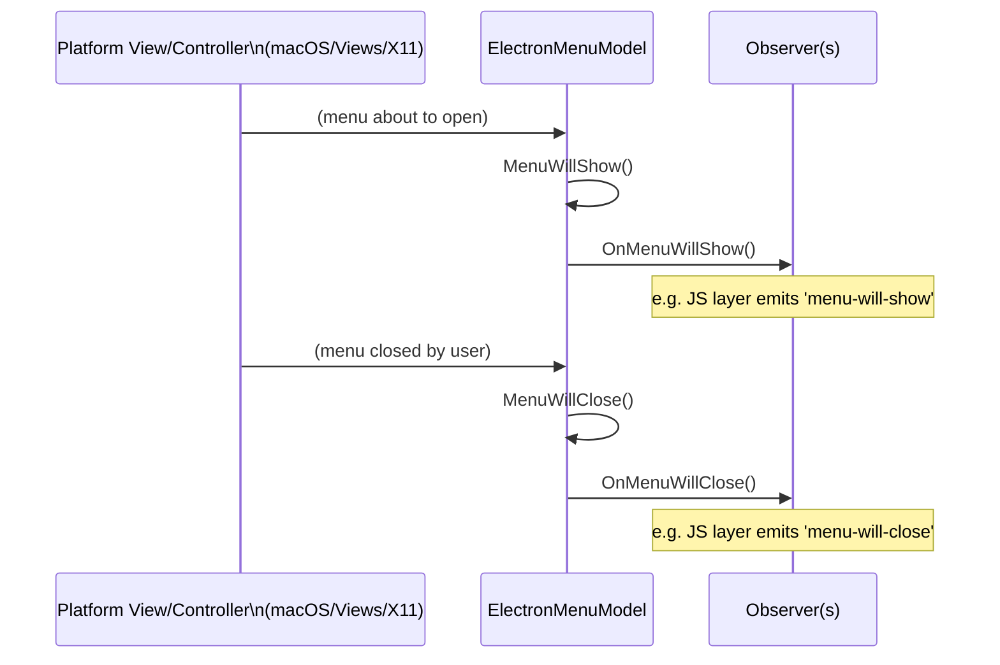
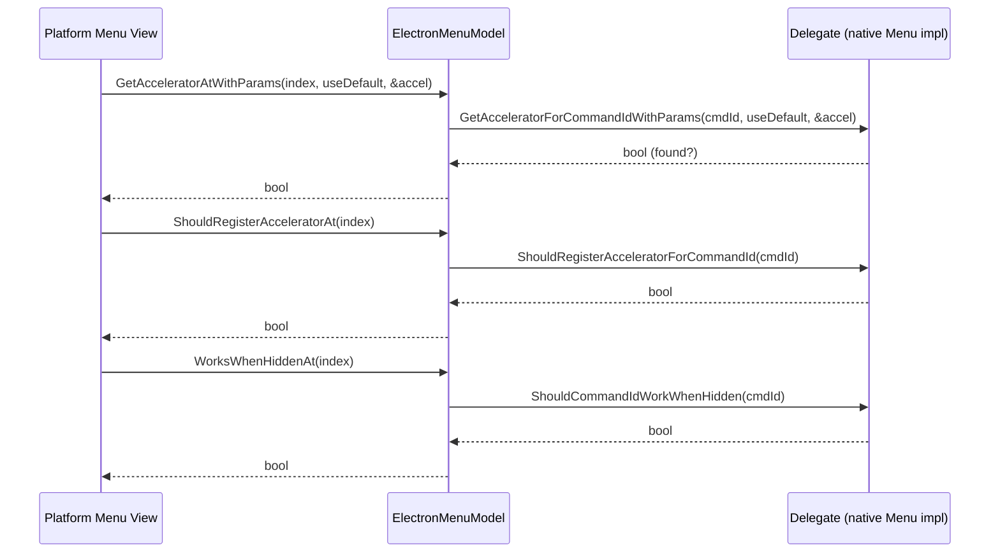
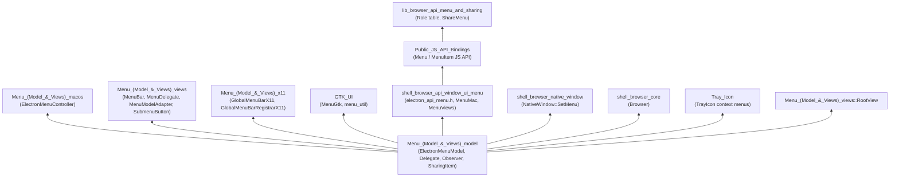

# Menu (Model & Views) — Model

## Introduction

The **Menu (Model & Views) Model** module defines the core, platform-agnostic data model used by Electron to represent application and context menus. It is centered on a single class, `electron::ElectronMenuModel`, which extends Chromium's `ui::SimpleMenuModel` with Electron-specific behavior such as custom tooltips, roles, sublabels, custom types, macOS sharing items, and accelerator/visibility policy hooks driven by a `Delegate` interface.

This model is the foundation upon which all platform-specific menu rendering is built. It does not draw or manage any native UI itself — instead, it is consumed by platform view/controller layers (macOS `NSMenu` controllers, Chromium Views-based menu widgets, and Linux/X11 global menu integrations), and it is populated and controlled from the JavaScript API layer (`Menu`, `MenuItem`) exposed to Electron applications.

Understanding this module is essential for anyone working on menu construction, menu item behavior, native menu integration, or the JS `Menu`/`MenuItem` API surface, since virtually every menu-related feature flows through `ElectronMenuModel`.

---

## Purpose & Core Functionality

`ElectronMenuModel` is a decorator/extension of `ui::SimpleMenuModel` (from `ui/menus/simple_menu_model.h`), Chromium's generic, platform-independent menu-model abstraction. Electron extends it to support:

- **Per-item metadata** not present in the base Chromium model:
  - Tooltips (`SetToolTip` / `GetToolTipAt`)
  - Custom types (`SetCustomType` / `GetCustomTypeAt`) — used to distinguish special item kinds (e.g., palette items)
  - Roles (`SetRole` / `GetRoleAt`) — string identifiers tying a menu item to a predefined behavior (see [Relationship to Role interface](#relationship-to-role-interface-js-api) below)
  - Secondary labels/sublabels (`SetSecondaryLabel` / `GetSecondaryLabelAt`)
- **Delegate-driven policy hooks** via the nested `Delegate` class:
  - `GetAcceleratorForCommandIdWithParams` — resolves the keyboard accelerator for a command, optionally applying a "default accelerator" fallback
  - `ShouldRegisterAcceleratorForCommandId` — controls whether an accelerator should be globally registered for a given command
  - `ShouldCommandIdWorkWhenHidden` — allows a menu command to still fire even when the associated menu item is hidden (important for global shortcuts/roles)
  - `GetSharingItemForCommandId` (macOS only) — supplies native "Share" sheet content for a command
- **Observer notifications** via the nested `Observer` class (`base::CheckedObserver`):
  - `OnMenuWillShow()` / `OnMenuWillClose()` — lifecycle notifications consumed by higher layers (e.g., JS `Menu` emitting `'menu-will-show'`/`'menu-will-close'` events)
- **macOS Sharing Support** via the `SharingItem` struct (guarded by `BUILDFLAG(IS_MAC)`), holding optional text, URL, and file-path payloads for native share-sheet integration.
- **Submenu access**: `GetSubmenuModelAt(size_t index)` returns an `ElectronMenuModel*` (rather than the base `ui::MenuModel*`), preserving Electron-specific typing through the submenu hierarchy.
- **Weak-pointer safety**: exposes `GetWeakPtr()` so owning/observing code (e.g., native window or menu controllers) can safely hold a reference without keeping the model alive.

The class stores its Electron-specific per-item metadata in `base::flat_map<int, std::u16string>` maps keyed by command ID (`toolTips_`, `roles_`, `sublabels_`, `customTypes_`), and keeps a raw (non-owning) pointer to its `Delegate`.

---

## Architecture

### Class Structure

### Position in the Menu Subsystem

The Model layer sits below the platform-specific view/controller implementations and above the pure Chromium `ui::SimpleMenuModel`:

---

## Component Relationships

### `ElectronMenuModel` and its Nested Types

- **`Delegate`**: Implemented by the owning native menu object (see [Menu (Model & Views) — macOS](Menu_(Model_&_Views)_macos.md), [Menu (Model & Views) — Views](Menu_(Model_&_Views)_views.md), and ultimately by the `electron::api::Menu` wrapper in [shell_browser_api_window_ui_menu](shell_browser_api_window_ui_menu.md)). It privately overrides the base `ui::SimpleMenuModel::Delegate::GetAcceleratorForCommandId` and forwards it to the richer `GetAcceleratorForCommandIdWithParams`, allowing Electron to pass extra context (e.g., whether default accelerators should apply).
- **`Observer`**: Any component wanting menu open/close lifecycle notifications (e.g., to pause/resume other UI, or to forward JS events) registers via `AddObserver`/`RemoveObserver`.
- **`SharingItem`**: Populated on macOS to drive the native "Share" menu integration; conceptually related to (but distinct from) the higher-level `ShareMenu` JS API in `lib/browser/api/share-menu.ts` (see [lib_browser_api_menu_and_sharing](lib_browser_api_menu_and_sharing.md)).

### Relationship to `Role` Interface (JS API)

The `roles_` map (`SetRole` / `GetRoleAt`) stores a string role identifier per menu item command ID. This is the native-side counterpart to the TypeScript `Role` interface defined in `lib/browser/api/menu-item-roles.ts` (module: [lib_browser_api_menu_and_sharing](lib_browser_api_menu_and_sharing.md)):

The `Role` interface (`windowMethod`, `webContentsMethod`, `appMethod`, `accelerator`, `registerAccelerator`, `nonNativeMacOSRole`) is resolved at the JS layer, but the resulting **role name string** is persisted into the native `ElectronMenuModel` so that native code (accelerator registration, visibility policy) can consult it without round-tripping into JS.

---

## Data Flow

### Menu Item Construction & Metadata Population

### Menu Show/Close Lifecycle

### Accelerator & Visibility Resolution

---

## How This Module Fits Into the Overall System

`ElectronMenuModel` is a leaf dependency consumed widely across the menu ecosystem but has no dependency on any Electron-specific higher-level module itself (it only depends on Chromium's `ui::SimpleMenuModel`, `base::`, and `url::GURL`). This makes it the stable, shared "contract" for all platform menu implementations.

Key consumer relationships:

- **[shell_browser_api_window_ui_menu](shell_browser_api_window_ui_menu.md)** — `electron_api_menu.h` defines `electron::api::Menu`, which implements `ElectronMenuModel::Delegate` and owns an `ElectronMenuModel` instance; `electron_api_menu_mac.h`/`electron_api_menu_views.h` (`MenuMac`, `MenuViews`) bridge the model to platform-native menu presentation.
- **[Menu (Model & Views) — macOS](Menu_(Model_&_Views)_macos.md)** — `ElectronMenuController` (Cocoa) reads `ElectronMenuModel` state to build and drive an `NSMenu`.
- **[Menu (Model & Views) — Views](Menu_(Model_&_Views)_views.md)** — `MenuModelAdapter`, `MenuDelegate`, `MenuBar`, and `SubmenuButton` consume `ElectronMenuModel` to render Chromium Views-based menus (used on Windows/Linux non-global-menu paths), and `RootView` uses `ElectronMenuModel` for window-level menu bars.
- **[Menu (Model & Views) — X11](Menu_(Model_&_Views)_x11.md)** — `GlobalMenuBarX11`/`GlobalMenuBarRegistrarX11` mirror `ElectronMenuModel` contents into the Unity/DBusMenu global menu protocol on Linux.
- **[shell_browser_native_window](shell_browser_native_window.md)** — `NativeWindow` holds a pointer to an `ElectronMenuModel` (application/window menu) via `native_window.h`.
- **[shell_browser_core](shell_browser_core.md)** — `Browser` references `ElectronMenuModel` for the application-level menu (e.g., macOS app menu, dock menu).
- **[Tray Icon](Tray_Icon.md)** — Tray context menus are `ElectronMenuModel` instances presented by platform tray implementations.
- **[lib_browser_api_menu_and_sharing](lib_browser_api_menu_and_sharing.md)** — The JS-side `Role` table and `ShareMenu` correspond conceptually to the native `roles_` map and `SharingItem` struct respectively; JS role/sharing configuration is translated into native model state through the `Menu`/`MenuItem` bindings.

---

## Summary

| Aspect | Description |
|---|---|
| **Primary class** | `electron::ElectronMenuModel` |
| **Base class** | `ui::SimpleMenuModel` (Chromium) |
| **Nested types** | `Delegate`, `Observer`, `SharingItem` (macOS) |
| **Key responsibilities** | Per-item metadata (tooltip, role, sublabel, custom type), accelerator/visibility policy delegation, show/close lifecycle notification, macOS sharing payload, weak-pointer safe access, typed submenu traversal |
| **Consumed by** | Native `Menu`/`MenuItem` API binding, macOS `ElectronMenuController`, Views-based menu widgets, X11 global menu bar, Tray context menus, `NativeWindow`, `Browser` |
| **Depends on** | Chromium `ui::SimpleMenuModel`, `base::flat_map`, `base::ObserverList`, `url::GURL`, `base::FilePath` |
| **Related JS-facing concepts** | `Role` interface (`lib/browser/api/menu-item-roles.ts`), `ShareMenu` (`lib/browser/api/share-menu.ts`) |

For platform-specific rendering built on top of this model, see:
- [Menu (Model & Views) — macOS](Menu_(Model_&_Views)_macos.md)
- [Menu (Model & Views) — Views](Menu_(Model_&_Views)_views.md)
- [Menu (Model & Views) — X11](Menu_(Model_&_Views)_x11.md)

For the JS-facing API and role/sharing definitions, see:
- [Public JS API Bindings — Menu & Sharing](lib_browser_api_menu_and_sharing.md)

For the native binding layer that owns and mediates access to `ElectronMenuModel`, see:
- [Native Window & Menu Management — Window UI Menu](shell_browser_api_window_ui_menu.md)
