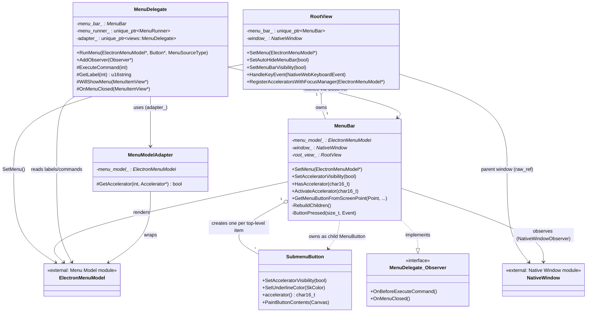
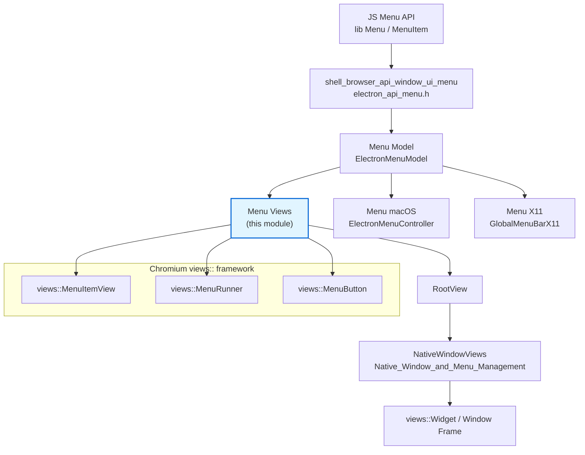
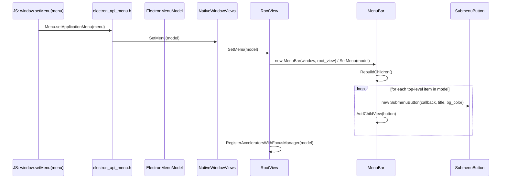
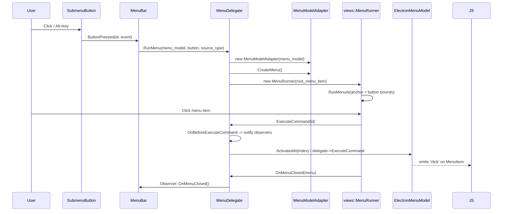
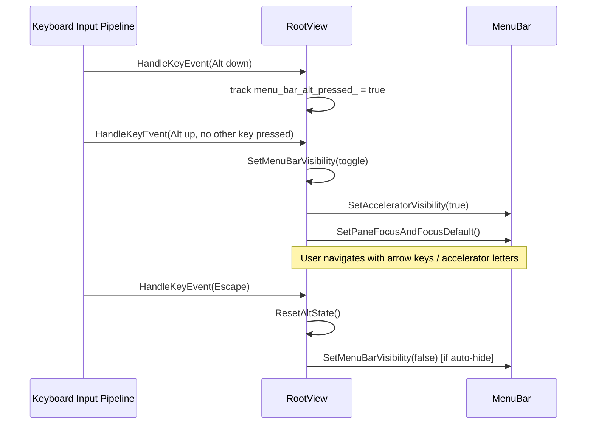
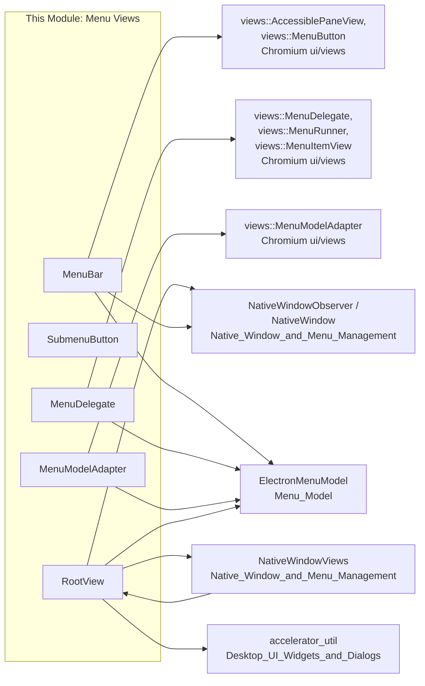

# Menu (Model & Views) — Views

## Introduction

The **Menu (Model & Views) — Views** module implements Electron's **cross-platform, Chromium-Views-based menu bar** — the in-window application menu bar used on platforms where the native OS menu bar is not used for a given `BrowserWindow` (primarily Windows and Linux, when Electron falls back to a `views::Widget`-hosted menu instead of the OS-native menu system).

It sits at the intersection of:

* **[`Menu_(Model_&_Views)_model`](Menu_(Model_&_Views)_model.md)** — the platform-agnostic `ElectronMenuModel` that stores menu structure, items, and delegate callbacks (produced by the JS `Menu` API in [`shell_browser_api_window_ui_menu`](Native_Window_&_Menu_Management.md)).
* **Chromium's `views::` menu framework** (`views::MenuDelegate`, `views::MenuModelAdapter`, `views::MenuButton`, `views::MenuRunner`) which provides the low-level widget rendering, event handling, and popup logic.
* **[`Native_Window_&_Menu_Management`](Native_Window_&_Menu_Management.md)** — specifically `NativeWindowViews` and `RootView`, which host the `MenuBar` inside the window's view hierarchy.

This module translates the abstract `ElectronMenuModel` tree into interactive, themed, keyboard-navigable UI widgets: a horizontal menu bar (`MenuBar`), individual top-level buttons (`SubmenuButton`), the glue code that opens native `views::MenuItemView` dropdowns (`MenuDelegate`, `MenuModelAdapter`), and the root container that manages focus/accelerators for the whole window (`RootView`).

It is a sibling of:
* [`Menu_(Model_&_Views)_macos`](Menu_(Model_&_Views)_macos.md) — the Cocoa-native equivalent (`ElectronMenuController`) used on macOS.
* [`Menu_(Model_&_Views)_x11`](Menu_(Model_&_Views)_x11.md) — the D-Bus/Unity global menu bar integration for Linux desktop environments that support it (used *instead of* this module's in-window menu bar when available).

---

## Module Purpose & Core Functionality

| Responsibility | Component |
|---|---|
| Render the horizontal row of top-level menu labels (File, Edit, View, …) inside the window | `MenuBar` |
| Render a single clickable top-level menu label with accelerator underline support | `SubmenuButton` |
| Bridge `ElectronMenuModel` into Chromium's native `views::MenuItemView` widget tree | `MenuModelAdapter` |
| Own the lifecycle of an open dropdown (`views::MenuRunner`), dispatch command execution, and notify observers | `MenuDelegate` |
| Own the `MenuBar` instance within a window, manage keyboard-driven Alt-key menu access, and route accelerators | `RootView` |

Together these implement the feature commonly described in Electron's docs as "auto-hide menu bar," Alt-key mnemonic navigation, and the fallback in-app menu bar for frameless/non-native-menu windows.

---

## Architecture

### Component Relationships

### Where this module fits in the overall system

---

## Detailed Component Descriptions

### `MenuBar` (`shell/browser/ui/views/menu_bar.h`)

The `MenuBar` is a `views::AccessiblePaneView` that renders the horizontal strip of top-level menu buttons at the top of a window (below the title bar / caption buttons managed by [`Frame_Views`](Frame_Views.md)).

Key responsibilities:
* **Model binding** — `SetMenu(ElectronMenuModel*)` triggers `RebuildChildren()`, which destroys and recreates one `SubmenuButton` per top-level item in the model.
* **Keyboard mnemonics** — `HasAccelerator`/`ActivateAccelerator`/`FindAccelChild` implement Alt+letter navigation (e.g., `Alt+F` opens "File").
* **Theming** — `RefreshColorCache`/`UpdateViewColors`/`OnThemeChanged` recompute colors (notably platform-specific enabled/disabled text colors on Linux) whenever the `ui::NativeTheme` changes.
* **Window focus integration** — implements `NativeWindowObserver::OnWindowBlur/OnWindowFocus` to hide accelerator underlines or return focus appropriately.
* **Delegate observation** — implements `MenuDelegate::Observer` to know when a submenu is about to execute a command or has closed, so it can reset visual state (e.g., pressed button appearance).
* **Hit testing** — `GetMenuButtonFromScreenPoint` lets `RootView`/window code find which submenu is under the mouse, used for menu-bar mouse-drag traversal between adjacent menus.

### `SubmenuButton` (`shell/browser/ui/views/submenu_button.h`)

A specialized `views::MenuButton` representing a single top-level entry (e.g., "File"). It knows how to:
* Detect and underline an accelerator character embedded in its title (`&File` → `F` underlined) via `GetUnderlinePosition`/`GetCharacterPosition`.
* Toggle underline visibility (`SetAcceleratorVisibility`) — used so underlines only appear once the user starts using Alt-key navigation.
* Custom paint its label with the theme's background/underline colors (`PaintButtonContents`).

### `MenuModelAdapter` (`shell/browser/ui/views/menu_model_adapter.h`)

A thin subclass of `views::MenuModelAdapter` that overrides `GetAccelerator` to source accelerator key data directly from `ElectronMenuModel` rather than the default `ui::MenuModel` accelerator storage. This is the adapter that walks the `ElectronMenuModel` tree and builds the actual `views::MenuItemView` hierarchy used for rendering dropdown/submenu popups.

### `MenuDelegate` (`shell/browser/ui/views/menu_delegate.h`)

Implements `views::MenuDelegate`, the interface Chromium's menu widget system calls into for label text, enabled/checked state, and command execution. Responsibilities:
* **`RunMenu`** — given a top-level `ElectronMenuModel*` and the `SubmenuButton` that was clicked, constructs a `MenuModelAdapter`, wraps it in a `views::MenuRunner`, and shows the popup anchored to the button.
* **Command dispatch** — `ExecuteCommand` overloads forward to the underlying `ElectronMenuModel`'s command execution (ultimately invoking the JS-registered menu item `click` handlers).
* **Sibling menu traversal** — `GetSiblingMenu` implements the behavior where hovering over an adjacent top-level button while a dropdown is open switches directly to that button's menu (standard desktop menu-bar UX), coordinating with `MenuBar::GetMenuButtonFromScreenPoint`.
* **Observer notifications** — fires `OnBeforeExecuteCommand`/`OnMenuClosed` to its `Observer` list (implemented by `MenuBar`) so the menu bar can update its visual/focus state.

### `RootView` (`shell/browser/ui/views/root_view.h`)

`RootView` is the top-level content view installed inside `NativeWindowViews`' `views::Widget` (see [`Native_Window_&_Menu_Management`](Native_Window_&_Menu_Management.md)). It owns the optional `MenuBar` instance and coordinates:
* **Menu bar lifecycle** — `SetMenu` creates/destroys the `MenuBar` child view as needed.
* **Auto-hide behavior** — `SetAutoHideMenuBar`/`is_menu_bar_auto_hide` and `SetMenuBarVisibility`/`is_menu_bar_visible` implement the "auto-hide menu bar until Alt is pressed" feature common on Windows/Linux Electron apps.
* **Keyboard routing** — `HandleKeyEvent` inspects raw `NativeWebKeyboardEvent`s (forwarded from renderer/browser input pipeline) to detect the Alt key press/release sequence that toggles menu-bar visibility and focus, and `ResetAltState` clears that tracking.
* **Accelerator table** — `RegisterAcceleratorsWithFocusManager`/`UnregisterAcceleratorsWithFocusManager` build an `accelerator_util::AcceleratorTable` from the `ElectronMenuModel` and register it with the Views `FocusManager`, so menu accelerators (e.g., `Ctrl+S`) work even when the menu bar itself isn't focused.
* **Layout** — exposes `GetMainView()` for the window's actual web-contents view, and computes `GetMinimumSize`/`GetMaximumSize` accounting for the menu bar's height (`GetMenuBarHeight`).
* **Focus restoration** — `RestoreFocus`/`last_focused_view_tracker_` remember and restore the previously focused view after closing a menu, so keyboard focus returns to the web page correctly.

---

## Data Flow

### Menu Bar Construction Flow

### Opening a Dropdown & Executing a Command

### Alt-Key Auto-hide Menu Bar Flow

---

## Dependencies

**Upstream consumers:**
* [`Native_Window_&_Menu_Management`](Native_Window_&_Menu_Management.md) — `NativeWindowViews` instantiates a `RootView`, which in turn owns a `MenuBar`, giving every non-macOS/non-global-menu window its in-app menu bar.
* [`Desktop_UI_Widgets_&_Dialogs`](Desktop_UI_Widgets_&_Dialogs.md) (Frame Views submodule) — window frame views (`OpaqueFrameView`, `ClientFrameViewLinux`, `WinFrameView`, etc.) lay out around the `RootView`/`MenuBar` area, since the menu bar occupies space below the caption area.

**Downstream/sibling relationship:**
* [`Menu_(Model_&_Views)_model`](Menu_(Model_&_Views)_model.md) — supplies `ElectronMenuModel`, the sole data source rendered by every class in this module.
* [`Menu_(Model_&_Views)_macos`](Menu_(Model_&_Views)_macos.md) and [`Menu_(Model_&_Views)_x11`](Menu_(Model_&_Views)_x11.md) — alternative renderers of the same `ElectronMenuModel` for macOS native menu bar and Linux global (D-Bus) menu bar respectively. Only one of the three "views" renderers is active per platform/window configuration.

---

## Platform Context

This module is used specifically when Electron renders menus using the Chromium Views toolkit rather than a native OS menu API:

| Platform | Typical Renderer |
|---|---|
| macOS | [`Menu_(Model_&_Views)_macos`](Menu_(Model_&_Views)_macos.md) (native NSMenu via `ElectronMenuController`) |
| Linux (with global menu support, e.g. Unity/GNOME) | [`Menu_(Model_&_Views)_x11`](Menu_(Model_&_Views)_x11.md) (`GlobalMenuBarX11`) |
| Linux (no global menu support) / Windows | **This module** — in-window `MenuBar` rendered via `views::` |

`NativeWindowViews` decides at runtime which strategy to use and wires the chosen renderer to the shared `ElectronMenuModel`.

---

## Summary

The Menu (Model & Views) — Views module is the **Views-toolkit rendering backend** for Electron's application menu on Windows and non-global-menu Linux configurations. It cleanly separates:
* **Presentation** (`MenuBar`, `SubmenuButton`) — what the user sees and clicks,
* **Widget bridging** (`MenuModelAdapter`, `MenuDelegate`) — translating the platform-agnostic model into Chromium's native menu widgets and routing command execution back to it, and
* **Window integration** (`RootView`) — hosting the menu bar within the window's view tree, managing auto-hide/Alt-key behavior, and wiring keyboard accelerators through the Views `FocusManager`.

For the data model these components render, see [`Menu_(Model_&_Views)_model`](Menu_(Model_&_Views)_model.md). For how windows embed this module's `RootView`, see [`Native_Window_&_Menu_Management`](Native_Window_&_Menu_Management.md).
