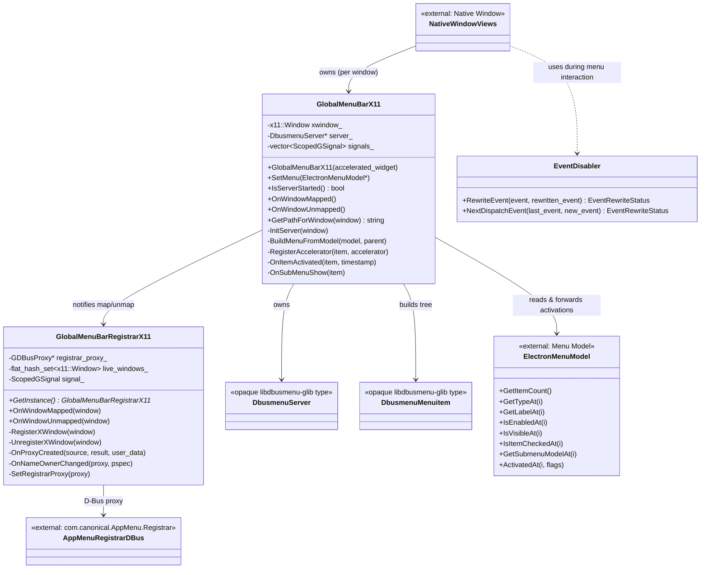
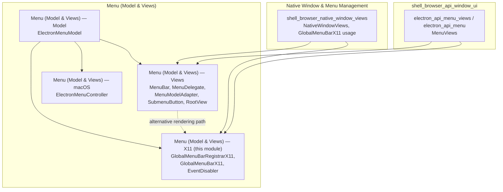
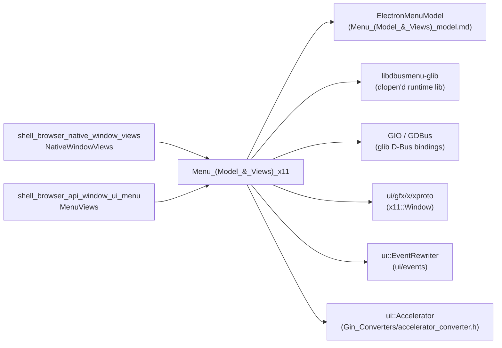
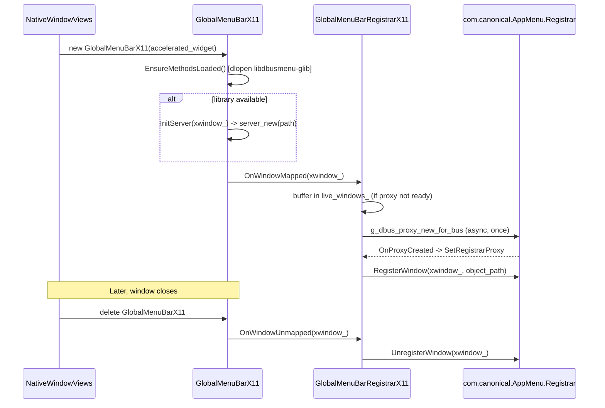
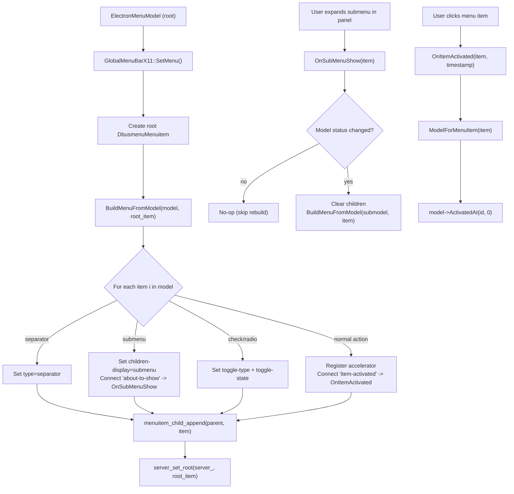
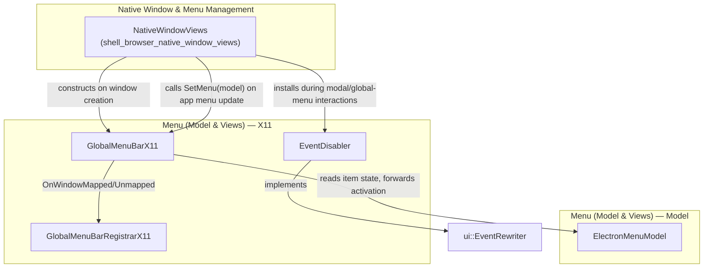
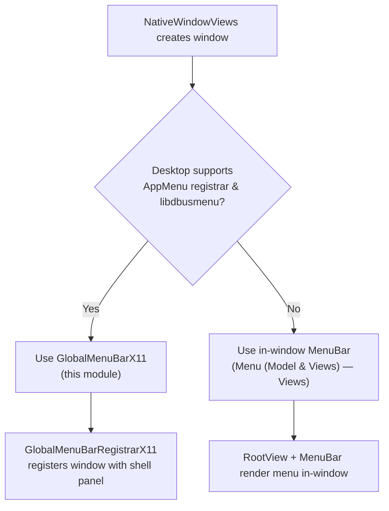

# Menu (Model & Views) — X11 Global Menu Bar Integration

## Introduction

The **Menu_(Model_&_Views)_x11** module implements Electron's integration with the Unity/Ubuntu **global application menu bar** protocol on Linux (X11 windowing systems). Rather than drawing an in-window menu bar, this module publishes an application's `ElectronMenuModel` over D-Bus using `libdbusmenu-glib`, so desktop environments that support the `com.canonical.AppMenu.Registrar` interface (classically Unity, and compatible shells) can render the menu bar in a system-level panel instead of inside the window itself.

This module is a Linux/X11-specific sibling of the platform-agnostic [Menu (Model & Views) — Model](Menu_(Model_&_Views)_model.md) and the Views-based [Menu (Model & Views) — Views](Menu_(Model_&_Views)_views.md) submodules, which together compose the parent **Menu (Model & Views)** feature area. It is only compiled/active on Linux desktop environments using X11 with the AppMenu D-Bus registrar available; on other platforms/desktops the standard Views-based [`MenuBar`](Menu_(Model_&_Views)_views.md) or [macOS `ElectronMenuController`](Menu_(Model_&_Views)_macos.md) code paths are used instead.

The module has four core components:

| Component | File | Responsibility |
|---|---|---|
| `GlobalMenuBarRegistrarX11` | `global_menu_bar_registrar_x11.h` | Singleton that owns the D-Bus connection to `com.canonical.AppMenu.Registrar` and (un)registers per-window menu mappings. |
| `GlobalMenuBarX11` | `global_menu_bar_x11.h` / `.cc` | Per-window object that owns a `DbusmenuServer`, converts an `ElectronMenuModel` tree into `DbusmenuMenuitem` objects, and relays activation/submenu events back into the menu model. |
| `_DbusmenuMenuitem` / `_DbusmenuServer` | `global_menu_bar_x11.h` / `.cc` | Opaque forward-declared C types from `libdbusmenu-glib`, dynamically loaded via `dlopen`/`dlsym` since the library is an optional runtime dependency. |
| `EventDisabler` | `event_disabler.h` | A `ui::EventRewriter` used to swallow/disable input events on X11, typically while global menu interactions (e.g., submenu popups) are in progress. |

---

## Purpose & Core Functionality

### Why a separate X11 global menu module?

On classic GNOME/Unity-style desktops, applications don't draw their own menu bar; instead they advertise a D-Bus object implementing the `com.canonical.dbusmenu` interface, and the desktop shell (top panel) renders the menu itself, using accelerator/keysym data supplied over D-Bus. This module exists purely to bridge Electron's cross-platform `ElectronMenuModel` abstraction to this Linux-specific, D-Bus-based system, without requiring Electron to link `libdbusmenu-glib` at build/link time — the library is loaded dynamically at runtime with graceful degradation if unavailable.

### Key responsibilities

1. **Registrar/session management** (`GlobalMenuBarRegistrarX11`)
   - Maintains a single, process-wide `GDBusProxy` for `com.canonical.AppMenu.Registrar`.
   - Buffers windows that want registration while the proxy is still being asynchronously created (`live_windows_`).
   - Registers (`RegisterXWindow`) and unregisters (`UnregisterXWindow`) `x11::Window` handles as `NativeWindow`s are mapped/unmapped, associating each with its per-window `DbusmenuServer` object path.

2. **Per-window menu publishing** (`GlobalMenuBarX11`)
   - Constructed with the window's `gfx::AcceleratedWidget`; derives the `x11::Window` and computes a unique D-Bus object path (`GetPathForWindow`), e.g. `/com/canonical/menu/<hex window id>`.
   - Dynamically resolves `libdbusmenu-glib` symbols once per process (`EnsureMethodsLoaded`).
   - `SetMenu()` converts an `ElectronMenuModel` into a tree of `DbusmenuMenuitem`s (`BuildMenuFromModel`) and publishes it as the D-Bus server's root item.
   - Lazily builds submenus only when they're about to be shown (`OnSubMenuShow`), diffing model state via a serialized status string to avoid unnecessary rebuilds.
   - Converts `ui::Accelerator` key combinations into the D-Bus `shortcut` property format expected by AppMenu-compatible shells (`RegisterAccelerator`).
   - Relays activation events from the D-Bus menu back into the `ElectronMenuModel` (`OnItemActivated` → `model->ActivatedAt`).
   - Notifies the registrar of window map/unmap lifecycle transitions (`OnWindowMapped`/`OnWindowUnmapped`).

3. **Event suppression** (`EventDisabler`)
   - Implements `ui::EventRewriter` to intercept and rewrite/drop events, used to prevent input from leaking through to the underlying window while global-menu-driven UI (e.g., a native submenu popup) has effective focus.

### Design notes

- **Optional runtime dependency**: `libdbusmenu-glib` is loaded via `dlopen`, so Electron binaries run correctly on systems lacking this library — global menu simply never activates (`server_new` stays `nullptr`, `IsServerStarted()` returns `false`).
- **Singleton registrar, per-window server**: There is one `GlobalMenuBarRegistrarX11` for the whole process but one `GlobalMenuBarX11`/`DbusmenuServer` per top-level window, matching the AppMenu protocol's requirement that each window register its own object path.
- **Model-driven, not owned**: `GlobalMenuBarX11` does not own the `ElectronMenuModel`; it merely mirrors it into dbusmenu objects and forwards user-driven activation back through model callbacks — keeping menu logic centralized in the platform-neutral [`ElectronMenuModel`](Menu_(Model_&_Views)_model.md).

---

## Architecture

### Component Relationships

### Module Position within Menu (Model & Views)

### Dependency Diagram

---

## Data Flow

### Window Lifecycle → Registration Flow

### Menu Model → Dbusmenu Tree Conversion

### Accelerator Translation

```mermaid
flowchart LR
    A["ui::Accelerator<br/>(key_code, modifiers)"] --> B["RegisterAccelerator()"]
    B --> C["GVariantBuilder: add 'Control'/'Alt'/'Shift' as present"]
    C --> D["XKeysymForWindowsKeyCode(key_code)"]
    D --> E["GetUnicodeCharacterFromXKeySym(keysym)"]
    E --> F["Append key name string to GVariant array"]
    F --> G["Wrap in outer array (dbusmenu shortcut format)"]
    G --> H["menuitem_property_set_variant(item, 'shortcut', variant)"]
```

---

## Component Interaction with Native Window & Input System

Key points:
- `NativeWindowViews` (documented in [Native Window & Menu Management](shell_browser_native_window_views.md)) is the primary consumer: it instantiates a `GlobalMenuBarX11` per top-level window (typically only when running under a Unity/AppMenu-capable desktop) and calls `SetMenu()` whenever the application's menu (`ElectronMenuModel`, see [Menu Model](Menu_(Model_&_Views)_model.md)) changes.
- `EventDisabler` is a lower-level input utility that can be composed into the X11 window's event pipeline to suppress stray events, independent of the dbusmenu plumbing itself, but colocated in this module because it is part of the same Linux/X11 UI toolkit surface as the global menu bar.

---

## Integration with the Rest of the System

| Related Module | Relationship |
|---|---|
| [Menu (Model & Views) — Model](Menu_(Model_&_Views)_model.md) | Supplies the `ElectronMenuModel` that `GlobalMenuBarX11::SetMenu()`/`BuildMenuFromModel()` consume. This module never mutates the model directly except via `ActivatedAt()` callbacks. |
| [Menu (Model & Views) — Views](Menu_(Model_&_Views)_views.md) | Alternative, platform-neutral in-window rendering path (`MenuBar`, `MenuModelAdapter`, `RootView`) used on desktops without AppMenu/D-Bus support. `NativeWindowViews` typically chooses between this module and the Views path at runtime. |
| [Menu (Model & Views) — macOS](Menu_(Model_&_Views)_macos.md) | Equivalent per-platform mirror of `ElectronMenuModel` for the native macOS menu bar via `ElectronMenuController`; conceptually parallel to this module but using Cocoa APIs instead of D-Bus. |
| [Native Window & Menu Management](shell_browser_native_window_views.md) | Owns/drives the lifecycle of `GlobalMenuBarX11` instances, tied to `NativeWindowViews` window creation/destruction and menu assignment. |
| [Desktop UI Widgets & Dialogs — Tray Icon (Linux)](Tray_Icon_linux.md) | Shares the general Linux desktop-integration theme (GTK/D-Bus) though it is a separate concern (status/tray icon vs. application menu bar). |
| Common Native Gin Infrastructure — Gin Converters | `ui::Accelerator` (used in `RegisterAccelerator`) is produced from JS-defined accelerators via the [accelerator converter](Gin_Converters.md). |

---

## Platform Activation Conditions

This module is only meaningfully active when **all** of the following hold:
1. Electron is running on Linux with the Views (Ozone/X11) backend — see `shell_browser_native_window_views`.
2. The desktop environment exposes `com.canonical.AppMenu.Registrar` on the session D-Bus (Unity and select derivatives).
3. `libdbusmenu-glib` (or `libdbusmenu-glib.so.4`) is present on the system and successfully `dlopen`'d.

If any condition fails, `GlobalMenuBarX11::IsServerStarted()` remains `false`, `SetMenu()` becomes a no-op, and Electron falls back to the standard in-window [Views menu bar](Menu_(Model_&_Views)_views.md).

---

## Summary

The **Menu_(Model_&_Views)_x11** module is a small, focused, platform-specific bridge that:
- Converts the shared `ElectronMenuModel` tree into `libdbusmenu-glib` objects (`GlobalMenuBarX11`).
- Manages the process-wide D-Bus registration lifecycle with the desktop's AppMenu registrar (`GlobalMenuBarRegistrarX11`).
- Provides a supporting input-event utility (`EventDisabler`) used during menu-driven interactions on X11.

It complements — rather than replaces — the [Model](Menu_(Model_&_Views)_model.md) and [Views](Menu_(Model_&_Views)_views.md) submodules, and is invoked from [`NativeWindowViews`](shell_browser_native_window_views.md) as one of several possible per-platform menu rendering strategies within Electron's broader [Native Window & Menu Management](shell_browser_native_window_views.md) and [Desktop UI Widgets & Dialogs](Menu_(Model_&_Views)_model.md) architecture.
