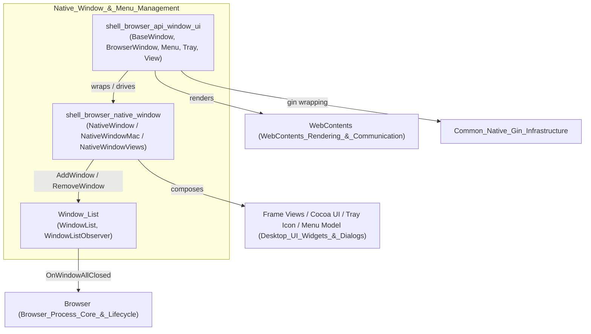
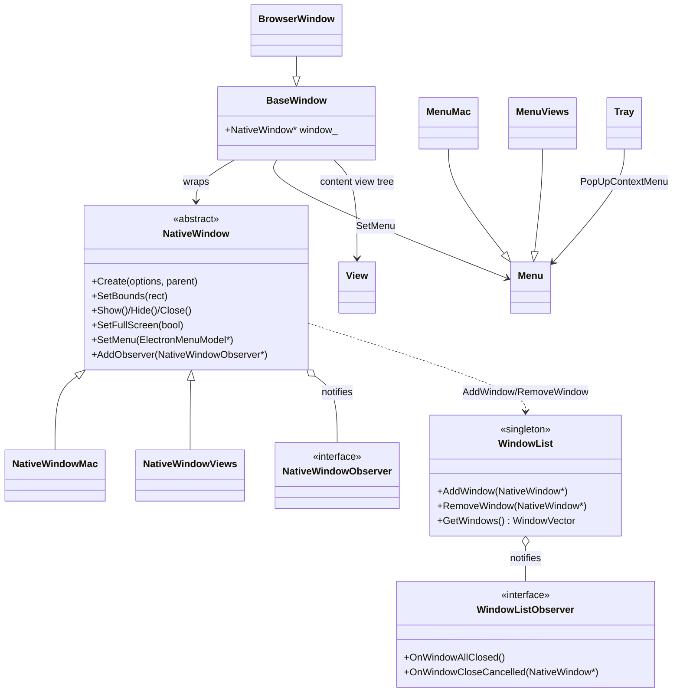
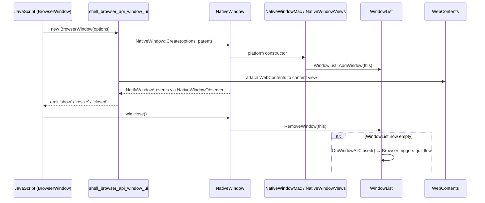

# Native Window & Menu Management

## 1. Purpose

The **Native_Window_&_Menu_Management** module is Electron's C++ implementation of desktop windowing and its associated chrome: native windows, menus, tray icons, and composable UI views. It provides the platform-abstracted foundation on top of which Electron's JavaScript `BrowserWindow`, `BaseWindow`, `Menu`, `Tray`, and `View` APIs are built.

Concretely, this module is responsible for:

- **Native window lifecycle** — creating, showing, resizing, focusing, and closing OS-level windows, abstracted via the `NativeWindow` base class with concrete `NativeWindowMac` (Cocoa) and `NativeWindowViews` (Chromium Views, used on Windows/Linux) implementations.
- **JS-facing window/menu/tray/view bindings** — the `gin`/`gin_helper`-based wrapper classes (`BaseWindow`, `BrowserWindow`, `Menu`, `MenuMac`, `MenuViews`, `Tray`, `View`, `ImageView`) that expose native windowing capabilities to application JavaScript.
- **Global window registry** — `WindowList`, a process-wide singleton tracking every live `NativeWindow` and notifying observers (most notably `Browser`) when all windows have closed, driving app-quit semantics.
- **Supporting infrastructure** — tracking of child web contents spawned via `window.open()` (`ChildWebContentsTracker`), and bridging `WebContentsDelegate`-only events into observer notifications (`ExtendedWebContentsObserver`).

This module is central to Electron's desktop UI stack: virtually every user-visible feature (menus, tray icons, frame decorations, drag & drop, fullscreen, taskbar/dock integration) is layered on top of the abstractions defined here.

## 2. Architecture

### 2.1 Sub-module Composition

### 2.2 Class Relationships

### 2.3 Window Creation & Lifecycle Flow

## 3. Core Components

| Sub-module | Description | Documentation |
|---|---|---|
| **shell_browser_native_window** | Platform-agnostic `NativeWindow` base class and `NativeWindowObserver` interface, plus concrete platform implementations `NativeWindowMac` (Cocoa/NSWindow) and `NativeWindowViews` (Chromium `views::Widget`, Windows/Linux), and supporting utilities (`ChildWebContentsTracker`, `ExtendedWebContentsObserver`). | [shell_browser_native_window](shell_browser_native_window.md) |
| **shell_browser_api_window_ui** | JS/Gin-facing bindings: `BaseWindow`/`BrowserWindow` (window API surface), `Menu`/`MenuMac`/`MenuViews` (menu model and platform popups), `Tray` (system tray icon), and `View`/`ImageView`/`JSLayoutManager` (composable UI primitives). | [shell_browser_api_window_ui](shell_browser_api_window_ui.md) |
| **Window_List** | Process-wide singleton registry (`WindowList`) of all live `NativeWindow` instances, with an observer interface (`WindowListObserver`) used by `Browser` to detect when all windows have closed and drive app-quit logic. | [Window_List](Window_List.md) |

## 4. Relationships to Other Modules

- **[Browser_Process_Core_&_Lifecycle](Browser_Process_Core_%26_Lifecycle.md)** — `Browser`/`ElectronBrowserMainParts` create and orchestrate windows during startup, and `Browser` observes `WindowList` to trigger quit flow.
- **[WebContents_Rendering_&_Communication](WebContents_Rendering_&_Communication.md)** — `WebContents` is hosted inside a `NativeWindow`/`BrowserWindow` and uses `NativeWindowRelay` to locate its owning window.
- **[Desktop_UI_Widgets_&_Dialogs](Desktop_UI_Widgets_%26_Dialogs.md)** — supplies the concrete frame views, menu bars (`ElectronMenuModel`, `GlobalMenuBarX11`), tray icon backends, and dialogs that the platform `NativeWindow`/`Menu`/`Tray` implementations compose.
- **[Common_Native_Gin_Infrastructure](Common_Native_Gin_Infrastructure.md)** — provides `gin_helper` wrapping/constructing infrastructure (`Wrappable`, `EventEmitterMixin`, `Handle`, `Dictionary`, `PersistentDictionary`) and converters used throughout window/menu/tray/view option parsing.
- **[Public_JS_API_Bindings](Public_JS_API_Bindings.md)** — the TypeScript layer surfacing `BrowserWindow`, `Menu`, `Tray`, etc. to end-user JavaScript, backed by this module's native implementations.