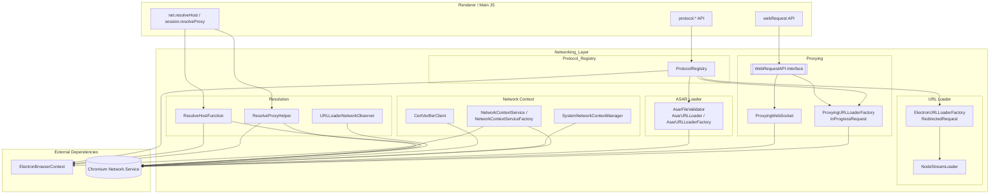
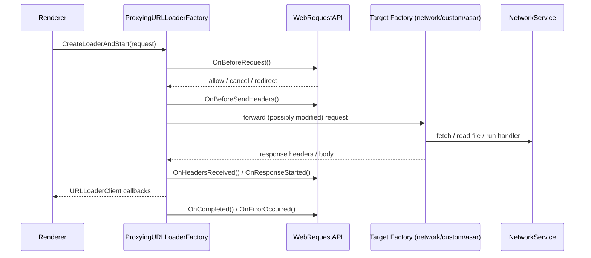

# Networking Layer

## Purpose

The `Networking_Layer` module implements Electron's browser-process networking subsystem, forming the bridge between Chromium's Network Service and Electron's higher-level JavaScript APIs (`protocol`, `session`, `net`, `webRequest`). It provides the native C++ infrastructure that:

- Serves files packed inside **ASAR archives** through the standard `file://` URL loading pipeline, including cryptographic integrity validation.
- Implements **custom protocol registration** (`protocol.handle`/`registerXXXProtocol`) via generic `URLLoaderFactory` implementations that can serve buffers, strings, files, HTTP responses, or Node.js streams.
- **Intercepts and proxies** network requests and WebSocket handshakes so the `webRequest` API (`onBeforeRequest`, `onHeadersReceived`, etc.) and custom protocol interception can observe/modify traffic before it reaches the network.
- Manages **per-BrowserContext and system-wide `NetworkContext`** instances, including proxy configuration and TLS/cert-verifier wiring.
- Provides **DNS resolution** (`net.resolveHost`) and **proxy resolution** (`session.resolveProxy`) helpers backed by the Network Service's Mojo interfaces.
- Tracks the registry of custom/intercepted protocol handlers (`ProtocolRegistry`) that drive non-network URL loading during navigation and subresource fetches.
- Observes network-level events (auth challenges, SSL errors, clear-site-data) through `URLLoaderNetworkObserver`.

This module is central to how Electron apps interact with the network at a low level, underpinning the `protocol`, `session`, `net`, and `webRequest` public JS APIs.

## Architecture

### Request Flow

## Sub-modules

| Sub-module | Description |
|---|---|
| **shell_browser_net** (parent) | Root grouping of native networking components in `shell/browser/net`. |
| `shell_browser_net_asar` | Serves files from ASAR archives through the `file://` scheme, with streaming integrity (hash) validation. |
| `shell_browser_net_url_loader` | Generic `URLLoaderFactory` implementation backing the JS `protocol` API (buffer/string/file/http/stream responses) and Node.js `Readable` stream bridging. |
| `shell_browser_net_proxying` | Intercepts HTTP(S) requests and WebSocket handshakes to implement the `webRequest` API and custom-protocol interception. |
| `shell_browser_net_context` | Per-`BrowserContext` and system-wide `NetworkContext` creation/configuration, including proxy config and cert verification wiring. |
| `shell_browser_net_resolution` | DNS host resolution, proxy resolution, and network-service-level event observation (auth, SSL errors, clear-site-data). |
| **Protocol_Registry** | Central bookkeeping component (`ProtocolRegistry`) recording registered/intercepted custom URL schemes, owned per `ElectronBrowserContext`. |

## Core Components Documentation

- **[shell_browser_net](#)** — Detailed documentation of the core networking primitives (ASAR loading, URL loader factories, proxying, network context management, and resolution helpers). See inline docs for architecture diagrams covering request interception, `webRequest` integration, and network context lifecycle.
- **[Protocol_Registry](#)** — Documentation of the `ProtocolRegistry` class, which manages registered and intercepted protocol handler maps consumed by `ElectronURLLoaderFactory` and `AsarURLLoaderFactory`, and its integration with `ElectronBrowserContext`, `api::Protocol`, and `ElectronBrowserClient`.

## Related Modules

- **Browser_Context_&_Session_Management** — owns `ElectronBrowserContext`, `ResolveProxyHelper`, and the `session`/`net`/`protocol` JS API surface that drives this module.
- **Browser_Process_Core_&_Lifecycle** — `ElectronBrowserClient` wires `ProxyingURLLoaderFactory`, `ProxyingWebSocket`, and `URLLoaderNetworkObserver` into Content's URL-loading and WebSocket-creation hooks.
- **Extensions_Subsystem** — shares the `WebRequestAPI` interface consumed by the proxying components.
- **Common_Native_Gin_Infrastructure** — provides the `asar::Archive`/`IntegrityPayload` types used by the ASAR loader/validator.