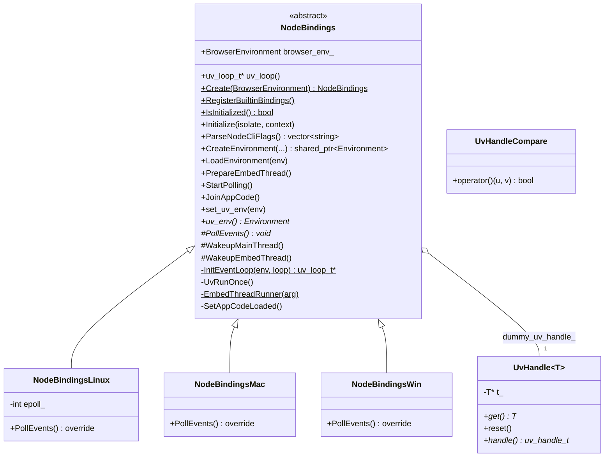
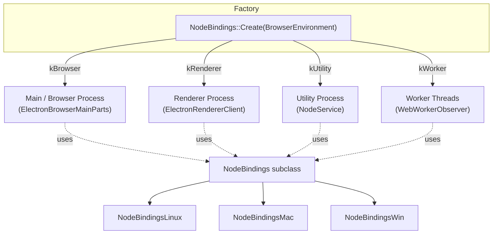
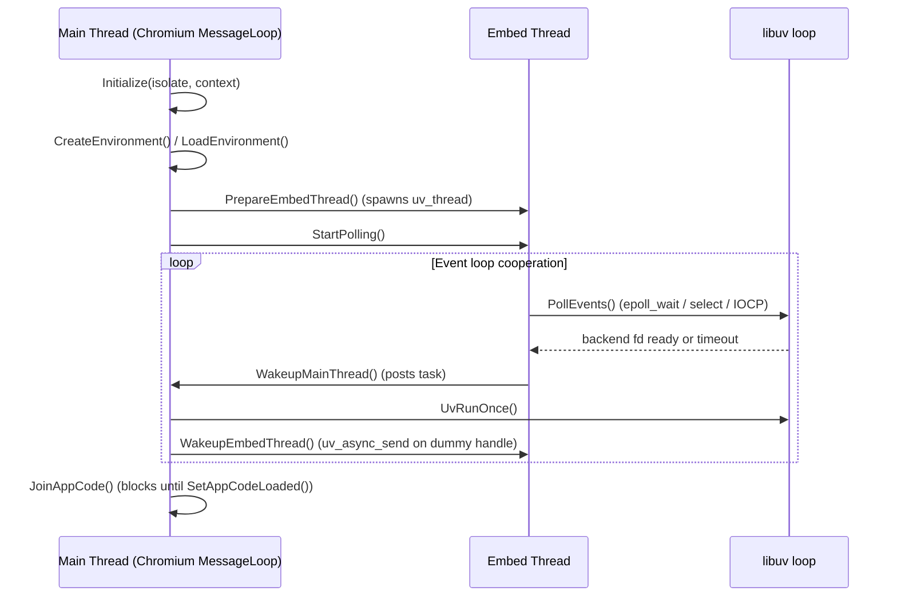
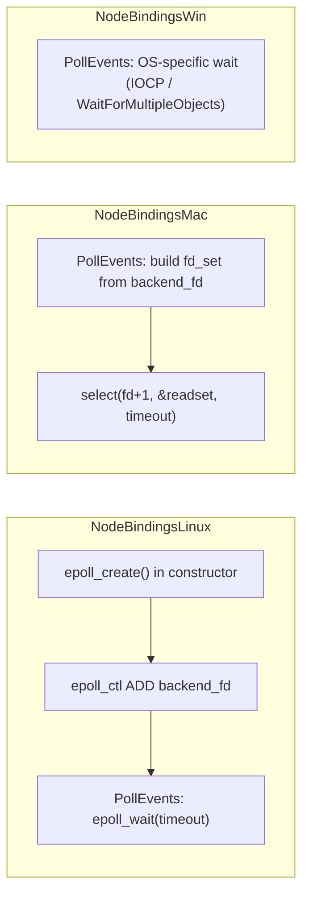

# Node Bindings

## 1. Purpose

The **Node Bindings** module is the glue layer that embeds the Node.js runtime (libuv event loop + V8 isolate/environment) inside every Electron process type — the browser (main) process, renderer processes, utility processes, and worker threads. It is one of the most foundational pieces of Electron's architecture: without it, Node.js APIs (`require`, `process`, `fs`, timers, etc.) would not be available alongside Chromium's own Blink/V8 message loop.

Concretely, this module is responsible for:

- Creating and initializing a `node::Environment` bound to a V8 isolate/context.
- Reconciling **two competing event loops** — libuv's loop (used by Node.js) and Chromium's `base::MessageLoop`/`SingleThreadTaskRunner` (used by Chromium) — so that both can run on the same OS thread without starving each other.
- Providing a **platform-specific polling strategy** (Linux epoll, macOS `select()`, Windows IOCP) to detect when libuv has pending work, using a dedicated "embed thread" that wakes up the main thread when needed.
- Exposing lifecycle hooks (`Initialize`, `CreateEnvironment`, `LoadEnvironment`, `PrepareEmbedThread`, `StartPolling`, `JoinAppCode`) that are called by higher-level process bootstrap code across the codebase.
- Supplying `OnNodePreload`, the mechanism used to inject Electron's preload scripts into every Node environment (main process, renderer, utility, worker, sandboxed).

This module sits at the very bottom of Electron's Node/V8 integration stack — it is a **direct dependency** of the [Common Native Gin Infrastructure](Common_Native_Gin_Infrastructure.md) module (its parent) and is consumed by higher-level modules that spin up Node environments in different processes (see [Related Modules](#5-related-modules) below).

## 2. Architecture Overview

### 2.1 Class Hierarchy

`NodeBindings` is an abstract base class. Each supported OS provides a concrete subclass that implements the platform-specific `PollEvents()` method used to efficiently block the embed thread until libuv has work to do.



### 2.2 Where It Fits in the Process Model

`NodeBindings::Create()` is a factory selected via `NodeBindings::BrowserEnvironment`, which distinguishes the four contexts in which Node.js is embedded:



The concrete subclass returned depends on the compile-time target OS: `node_bindings_linux.cc`, `node_bindings_mac.cc`, and the Windows equivalent each define their own static `NodeBindings::Create()` overload, so only one implementation is compiled per platform.

### 2.3 Dual Event Loop Integration

The central architectural challenge solved by this module is running libuv's loop *cooperatively* with Chromium's message loop on the same thread. This is achieved with an **embed thread** pattern:



- **`dummy_uv_handle_`** (a `UvHandle<uv_async_t>`) exists purely to keep the libuv loop alive/interruptible; `UvHandleCompare` provides transparent comparison so `uv_handle_t*`-keyed containers can be searched with raw pointers or `UvHandle` instances.
- **`WakeupMainThread()`** posts a task to the associated `base::SingleThreadTaskRunner`, causing Chromium's message loop to run a libuv iteration (`UvRunOnce`).
- **`WakeupEmbedThread()`** sends an async signal to break the embed thread out of its blocking poll, typically used to force an immediate loop tick after new work is scheduled.
- **`JoinAppCode()`** allows browser-process startup code to block until the primary script's import chain (including async ESM) has fully resolved.

## 3. Core Components

| Component | File | Responsibility |
|---|---|---|
| `NodeBindings` | `shell/common/node_bindings.h` | Abstract base defining the full Node/libuv/Chromium integration lifecycle: environment creation, loading, embed-thread management, and app-code readiness tracking. |
| `NodeBindings::BrowserEnvironment` | `shell/common/node_bindings.h` | Enum (`kBrowser`, `kRenderer`, `kUtility`, `kWorker`) that parameterizes loop initialization behavior per process type. |
| `UvHandle<T>` | `shell/common/node_bindings.h` | RAII template wrapper around libuv handle types (`uv_async_t`, `uv_timer_t`, etc.) that guarantees safe, deferred memory release via `uv_close`. |
| `UvHandleCompare` | `shell/common/node_bindings.h` | Transparent comparator enabling heterogeneous lookup of `UvHandle`/raw uv pointer keys in ordered containers. |
| `NodeBindingsLinux` | `shell/common/node_bindings_linux.{h,cc}` | Linux implementation of `PollEvents()` using `epoll_wait` on libuv's backend fd. |
| `NodeBindingsMac` | `shell/common/node_bindings_mac.{h,cc}` | macOS implementation of `PollEvents()` using `select()` on libuv's backend fd. |
| `NodeBindingsWin` | `shell/common/node_bindings_win.h` | Windows implementation of `PollEvents()` (IOCP-based backend polling). |
| `OnNodePreload` | `shell/common/node_bindings.h` | Free function invoked for every Node environment (main, renderer, utility, worker) to execute Electron's preload/bootstrap script before user code runs. |

### 3.1 Platform Polling Strategies

Each subclass implements `PollEvents()` differently, tailored to the primitives available on its OS, but all follow the same contract: **block until libuv's backend file descriptor indicates pending work, or until the backend timeout elapses.**



- **Linux (`NodeBindingsLinux`)**: creates an `epoll` instance once at construction time, registers libuv's backend fd for `EPOLLIN`, then repeatedly calls `epoll_wait` in `PollEvents()`, retrying on `EINTR`.
- **macOS (`NodeBindingsMac`)**: uses the simpler POSIX `select()` call each time `PollEvents()` runs, computing the timeout from `uv_backend_timeout()` and retrying on `EINTR`.
- **Windows (`NodeBindingsWin`)**: declared in `node_bindings_win.h`; the implementation (not shown here) integrates with the Windows message pump to wait on libuv's backend handle.

In every case, the corresponding platform `.cc` file also defines the static factory override:

```cpp
// static
std::unique_ptr<NodeBindings> NodeBindings::Create(BrowserEnvironment env) {
  return std::make_unique<NodeBindingsLinux>(env); // (or ...Mac / ...Win)
}
```

This ensures callers throughout the codebase can remain platform-agnostic and simply call `NodeBindings::Create(browser_env)`.

## 4. Lifecycle Summary

1. **Create** — `NodeBindings::Create(BrowserEnvironment)` instantiates the correct platform subclass and initializes the libuv loop (`InitEventLoop`), taking into account whether it is a dedicated worker loop.
2. **Initialize** — `Initialize(isolate, context)` sets up V8/libuv interop for the given isolate/context pair.
3. **CreateEnvironment** — builds a `std::shared_ptr<node::Environment>`, optionally accepting CLI args/exec-args and an `on_app_code_ready` callback.
4. **LoadEnvironment** — actually loads and runs Node.js bootstrap code inside the environment.
5. **PrepareEmbedThread / StartPolling** — spins up the embed thread and begins the cooperative polling loop described in [§2.3](#23-dual-event-loop-integration).
6. **JoinAppCode** — (browser process only) blocks the calling thread until the app's main script (including async ESM imports) has fully executed, signaled via `SetAppCodeLoaded()`.

## 5. Related Modules

- **[Common_Native_Gin_Infrastructure](Common_Native_Gin_Infrastructure.md)** — the parent module; provides the broader Gin/V8/Node utility layer (`ElectronBindings`, Gin converters, Gin helpers) that works alongside `NodeBindings` to expose native APIs to JavaScript.
- **Node_Service** (under `Node_Utility_Services`) — `shell/services/node/node_service.h` uses `NodeBindings` (with `BrowserEnvironment::kUtility`) to run a standalone Node.js environment inside a utility process.
- **Renderer_Client** (under `Renderer_Process_Infrastructure`) — `electron_renderer_client.h` and `web_worker_observer.h` use `NodeBindings` (`kRenderer` / `kWorker`) to embed Node.js in renderer processes and web worker threads (e.g., for `nodeIntegration`/`nodeIntegrationInWorker`).
- **Browser Process Core & Lifecycle** — `ElectronBrowserMainParts` drives the main process's `NodeBindings` instance (`kBrowser`) as part of application startup, coordinating with `JavascriptEnvironment`/`MicrotasksRunner`.
- **Preload_Script / Preload_ServiceWorker_(Renderer)** (under `Preload_Script_Infrastructure`) — consumers of `OnNodePreload`, which is invoked for every Node environment created by this module to run Electron's internal preload bootstrap before user preload scripts.
