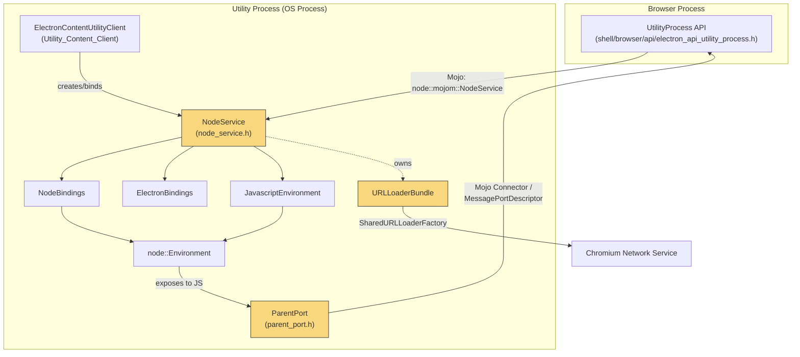
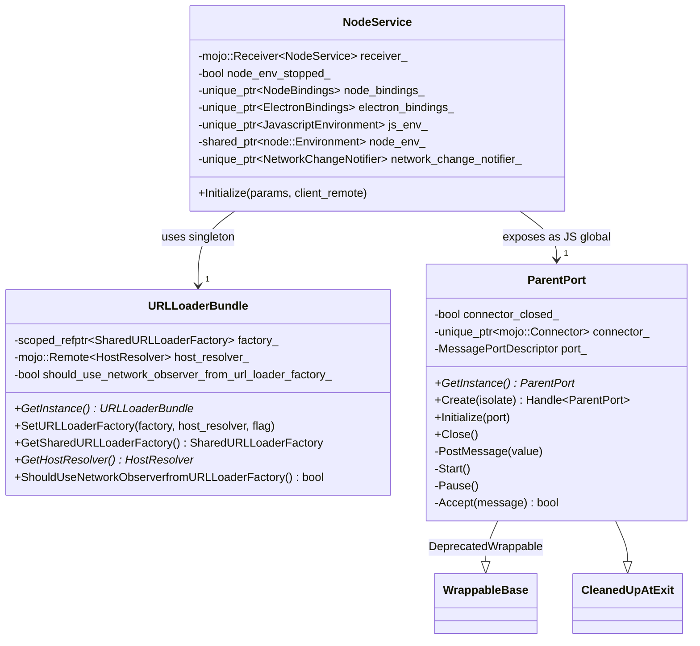
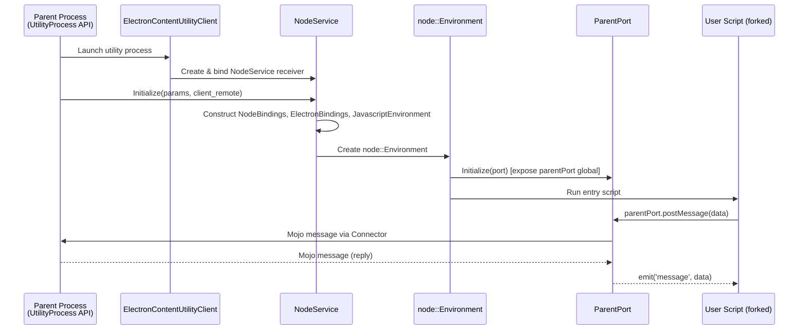

# Node Service

## Introduction

The **Node Service** module implements Electron's standalone **Node.js Utility Process** runtime. It is the Mojo-facing service that allows Electron to spawn an isolated OS process running a full Node.js environment (as started from `UtilityProcess.fork()` in the main-process JS API), completely decoupled from the Chromium browser/renderer process model.

This module is responsible for:

- Bootstrapping a Node.js environment (`node::Environment`) and a V8 isolate inside a Chromium **utility process**.
- Exposing a Mojo IPC interface (`node::mojom::NodeService`) so the browser process can initialize and configure the utility process (arguments, environment variables, URL loader factory, host resolver, etc.).
- Providing a bridge (`ParentPort`) that lets the JavaScript code running inside the forked Node.js process communicate back to its parent (the process that called `UtilityProcess.fork()`) via `MessagePort`-style message passing.
- Supplying a shared, process-wide `network::SharedURLLoaderFactory` (`URLLoaderBundle`) so that Node.js networking primitives (e.g. `fetch`, `net` module usage bridged through Electron) can perform network I/O through Chromium's network service instead of Node's own sockets stack, when configured to do so.

Node Service sits at the boundary between Electron's C++ infrastructure and the Node.js runtime, and is a sibling of the **Utility_Content_Client** module (see [Utility_Content_Client.md](Utility_Content_Client.md)), which is responsible for registering/creating this and other services inside Chromium's generic Utility Process host.

## Architecture Overview

### Component Relationships

## Sub-Components

Node Service is a small, cohesive module consisting of two tightly related headers. Rather than split it into separately generated sub-module docs, both are described in depth below since they represent two halves of the same process lifecycle: **service bootstrap/IPC** and **in-process JS message bridging**.

### 1. `NodeService` — Utility Process Bootstrap & Mojo Interface

`NodeService` (in `shell/services/node/node_service.h`) implements the `node::mojom::NodeService` Mojo interface. It is instantiated once per forked Node.js utility process (created by `ElectronContentUtilityClient`, see [Utility_Content_Client.md](Utility_Content_Client.md)) and is responsible for:

- Receiving `Initialize()` calls from the browser process with `NodeServiceParamsPtr` (containing startup arguments, environment variables, and a `NodeServiceClient` remote for callbacks).
- Constructing, in careful dependency order:
  1. `NodeBindings` — wraps the libuv event loop and Node.js bindings (documented in [Node_Bindings.md](Node_Bindings.md)).
  2. `ElectronBindings` — exposes Electron-specific native bindings to the JS context (documented in [Common_API.md](Common_API.md)).
  3. `JavascriptEnvironment` — owns the V8 `Isolate` and creates the `node::Environment` (documented in [shell_browser_main_parts_js_environment.md](shell_browser_main_parts_js_environment.md)).
  4. `node::Environment` (from Node.js core) — the actual JS execution environment.
- Owning a `net::NetworkChangeNotifier` for the isolated process.
- Tearing down these objects in strict reverse-dependency order on destruction (the class comment explicitly documents this ordering to avoid use-after-free/crash-reporting issues).

Because destruction order matters for crash reporting fidelity, the `mojo::Receiver` is declared first in the class (so it is destroyed last), ensuring that any crash occurring while tearing down the Node environment is still observable through Mojo/crash infrastructure.

#### `URLLoaderBundle` — Shared Networking State

`URLLoaderBundle` is a process-wide singleton (`GetInstance()`) that holds:
- A `network::SharedURLLoaderFactory` used by Node.js/Electron networking code running in the utility process to route requests through Chromium's network service.
- A `network::mojom::HostResolver` remote for DNS resolution via the browser's network service.
- A flag indicating whether network change notifications should be sourced from the URL loader factory itself rather than the OS.

This bundle is populated during `NodeService::Initialize()` from parameters supplied by the browser process, decoupling the forked Node.js process from having to set up its own independent networking stack.

### 2. `ParentPort` — Renderer-Side JS Message Bridge

`ParentPort` (in `shell/services/node/parent_port.h`) is exposed into the Node.js JavaScript context of the utility process as the native backing for the `parentPort` object used by scripts started via `UtilityProcess.fork()`. It allows the forked process to exchange messages with its parent using the standard `postMessage`/`on('message')` pattern familiar from Node's `worker_threads` API.

Key characteristics:
- **Singleton for process lifetime**: `GetInstance()` returns the single instance; garbage collection is intentionally not a concern since the object lives as long as the process.
- **Mojo message channel**: Wraps a `blink::MessagePortDescriptor` and a `mojo::Connector`, implementing `mojo::MessageReceiver::Accept()` to receive raw Mojo messages and translate them into JS values delivered to script listeners.
- **Gin/V8 integration**: Inherits from `gin_helper::DeprecatedWrappable<ParentPort>` (see [Gin_Helper_object_wrapping.md](Gin_Helper_object_wrapping.md)) to expose itself as a V8 object with methods like `postMessage`, `start`, `pause`, and `close`, built via `GetObjectTemplateBuilder`.
- **Clean shutdown**: Inherits `gin_helper::CleanedUpAtExit` (also part of [Gin_Helper_object_wrapping.md](Gin_Helper_object_wrapping.md)) so that its Mojo connector is properly torn down when the process exits, avoiding dangling IPC endpoints.

## How Node Service Fits Into the Overall System

- **Parent module**: `Node_Utility_Services`, alongside [Utility_Content_Client.md](Utility_Content_Client.md), which is the Chromium `ServiceFactory`/`ElectronContentUtilityClient` entry point that creates `NodeService` instances when the browser process requests a Node.js-backed utility process.
- **Triggered by**: The `UtilityProcess` JS API (`shell/browser/api/electron_api_utility_process.h`, part of [shell_browser_api_system_device_app_process.md](shell_browser_api_system_device_app_process.md)), which is the main-process-facing API (`UtilityProcess.fork()`) that spawns the OS process hosting this service.
- **Relies on**:
  - [Node_Bindings.md](Node_Bindings.md) for the libuv/Node.js event loop integration.
  - [Common_API.md](Common_API.md) for `ElectronBindings`, exposing native Electron functionality to the forked process's JS context.
  - [shell_browser_main_parts_js_environment.md](shell_browser_main_parts_js_environment.md) for `JavascriptEnvironment`/`MicrotasksRunner`, shared with the main browser process's own V8 isolate management.
  - [Gin_Helper_object_wrapping.md](Gin_Helper_object_wrapping.md) for the `Wrappable`/`CleanedUpAtExit` base classes used by `ParentPort` to integrate with V8's object model and process shutdown sequence.
  - Chromium's network service (via `URLLoaderBundle`) and Mojo IPC primitives (`PendingReceiver`, `PendingRemote`, `Connector`) for cross-process communication, shared conventions documented across networking modules such as [shell_browser_net.md](shell_browser_net.md).

## Summary

| Component | Responsibility |
|---|---|
| `NodeService` | Mojo service entry point; bootstraps and tears down the Node.js/V8 environment inside a utility process |
| `URLLoaderBundle` | Process-wide singleton providing shared networking (URL loader factory, host resolver) to Node.js code |
| `ParentPort` | JS-exposed native object bridging `postMessage`-style communication between the forked process and its parent |

Node Service is intentionally minimal and focused: it does not implement business logic itself, but wires together Node.js, V8, Electron's Gin bindings, and Chromium's Mojo/network infrastructure so that arbitrary Node.js scripts can run safely and communicate within Electron's multi-process architecture.
