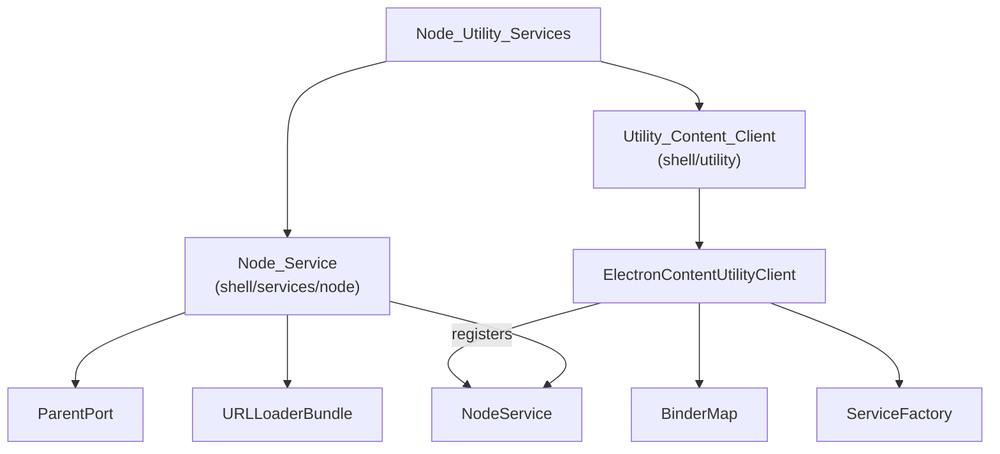
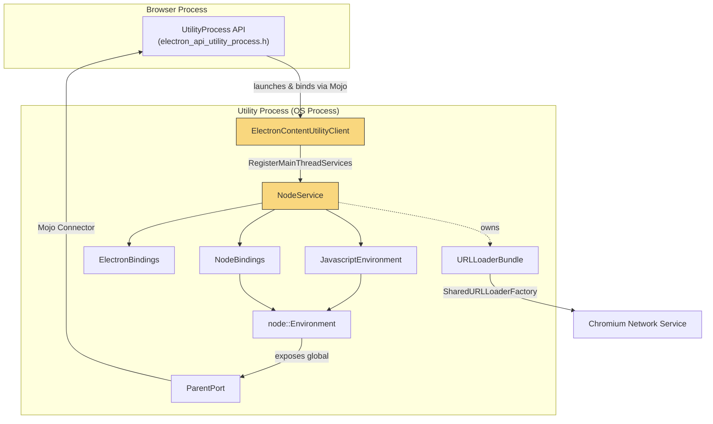
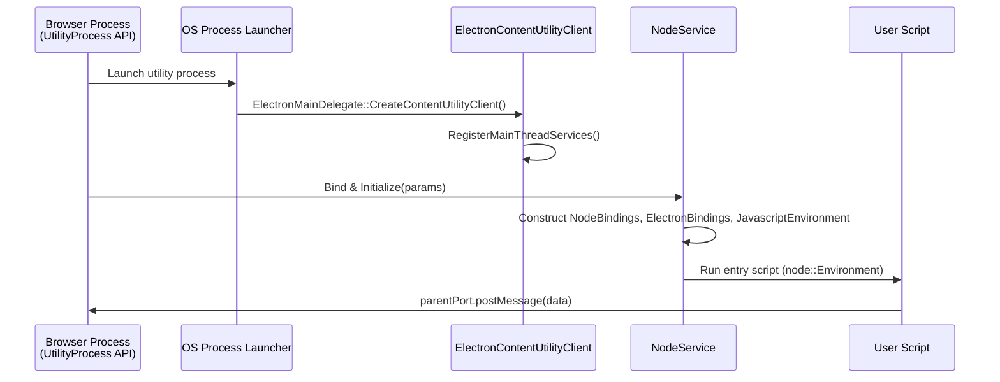

# Node Utility Services

## Introduction

The **Node Utility Services** module is Electron's infrastructure for running Node.js inside a dedicated, isolated Chromium **utility process**. It bridges two worlds:

1. **Chromium's utility-process framework** — via `ElectronContentUtilityClient`, the embedder hook that Chromium invokes when spawning a utility process, responsible for registering Mojo services/interfaces available to that process.
2. **Electron's Node.js runtime** — via `NodeService` and `ParentPort`, which bootstrap a full Node.js (`node::Environment`) + V8 (`JavascriptEnvironment`) instance inside that process and provide a `postMessage`-style communication channel back to the process that spawned it.

Together, these components implement the backend for Electron's `UtilityProcess.fork()` JavaScript API, allowing arbitrary Node.js scripts to run in a separate, sandboxable OS process fully decoupled from the browser and renderer process models, while still being able to exchange messages and share networking infrastructure (via `URLLoaderBundle`) with the rest of the application.

This module sits at the boundary between low-level Chromium process/service plumbing and Electron's higher-level `UtilityProcess` API surface, and has no business logic of its own beyond wiring, lifecycle management, and IPC bridging.

## Purpose

- **Process bootstrap hook**: Expose the single entry point (`ElectronContentUtilityClient`) that Chromium calls to configure a newly launched utility process, registering Mojo `BinderMap` interfaces and `ServiceFactory` service implementations (main-thread and IO-thread).
- **Node.js environment hosting**: Instantiate and tear down, in strict dependency order, the `NodeBindings`, `ElectronBindings`, `JavascriptEnvironment`, and `node::Environment` needed to execute JavaScript inside the utility process (`NodeService`).
- **Shared networking**: Provide a process-wide `URLLoaderBundle` singleton so Node.js/Electron networking code in the utility process can route requests through Chromium's network service instead of maintaining an independent stack.
- **Parent/child messaging bridge**: Expose a native `parentPort` object (`ParentPort`) into the forked process's JS context, implementing `postMessage`/`on('message')` semantics over a Mojo `Connector` and `MessagePortDescriptor`.

## Architecture

### Module Composition

### Process & Component Interaction

### Lifecycle Sequence

## Core Components

| Component | Path | Responsibility |
|---|---|---|
| **Node_Service** | `shell/services/node` | Implements `node::mojom::NodeService`, bootstraps and tears down the Node.js/V8 environment in the utility process; hosts `ParentPort` for message passing and `URLLoaderBundle` for shared networking. |
| **Utility_Content_Client** | `shell/utility` | Implements `content::ContentUtilityClient` via `ElectronContentUtilityClient`; registers Mojo interfaces/services (including `NodeService`) for the utility process, and tracks elevated-privilege state. |

### Component Details

- **Node_Service** — See detailed documentation covering `NodeService` (Mojo service bootstrap/teardown ordering), `URLLoaderBundle` (shared `SharedURLLoaderFactory`/`HostResolver` singleton), and `ParentPort` (V8-exposed `parentPort` object bridging Mojo messages to JS `postMessage`/`message` events).

- **Utility_Content_Client** — See detailed documentation covering `ElectronContentUtilityClient`, the Chromium embedder hook that exposes interfaces to the browser process and registers `NodeService` (and other services) on the main and IO threads of the utility process.

## Relationship to Other Modules

- **[Application_Bootstrap_&_Process_Entry](Application_Bootstrap_&_Process_Entry.md)** — `ElectronMainDelegate` creates `ElectronContentUtilityClient` when the process type is `"utility"`.
- **[System_&_App-Level_Services_API](System_&_App-Level_Services_API.md)** — The browser-process-facing `UtilityProcess` JS API (`electron_api_utility_process.h`) drives creation of utility processes and communicates with `NodeService`/`ParentPort`.
- **[Common_Native_Gin_Infrastructure](Common_Native_Gin_Infrastructure.md)** — Supplies `NodeBindings`, `ElectronBindings`, and `gin_helper` wrapping primitives (`DeprecatedWrappable`, `CleanedUpAtExit`) used by `NodeService` and `ParentPort`.
- **[Browser_Process_Core_&_Lifecycle](Browser_Process_Core_&_Lifecycle.md)** — Shares the `JavascriptEnvironment`/`MicrotasksRunner` pattern used for V8 isolate management across process types.
- **[Networking_Layer](Networking_Layer.md)** — `URLLoaderBundle` integrates with Chromium's network service and Mojo networking conventions used elsewhere in the codebase.