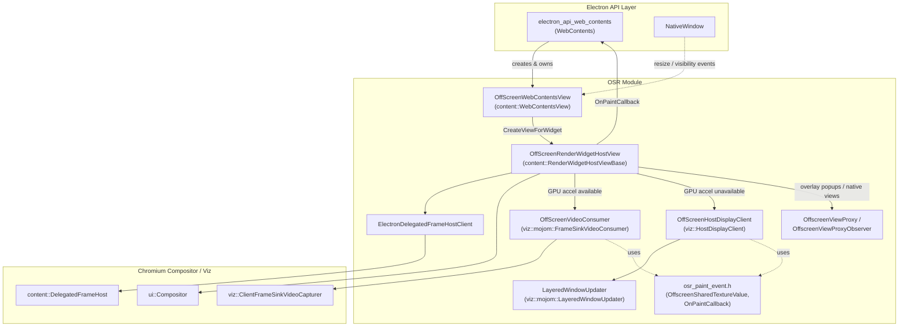
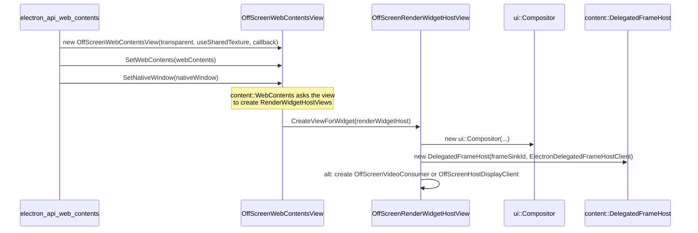
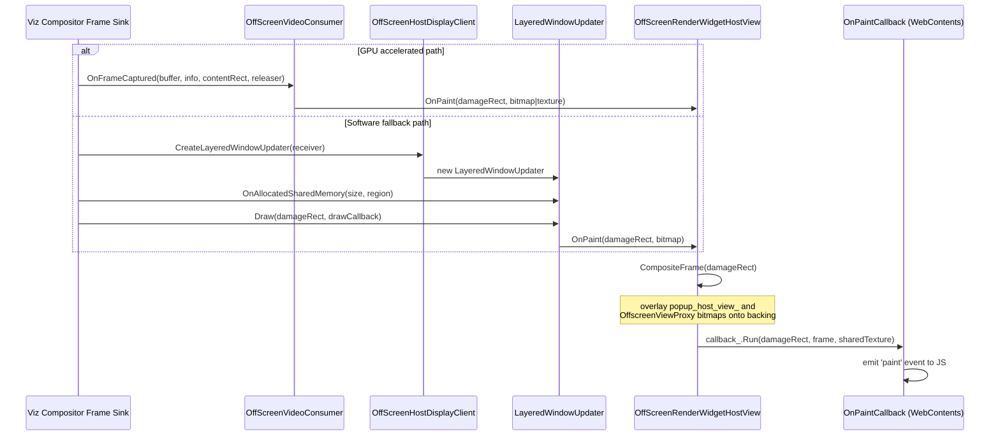

# OSR (Offscreen Rendering)

## 1. Purpose

The **OSR (Offscreen Rendering)** module implements Electron's *offscreen rendering* feature — the ability to render a `WebContents` (a `BrowserWindow` created with `webPreferences.offscreen: true`, or a `<webview>`/guest view) entirely into an in-memory buffer instead of onto a visible, platform-native window. Instead of a native `HWND`/`NSView`/`GtkWidget` receiving compositor output, this module intercepts Chromium's compositing pipeline and delivers each painted frame back to the browser process as:

* a raw `SkBitmap` (CPU pixels), or
* a GPU **shared texture** handle (zero-copy path: `HANDLE`/`IOSurface`/dma-buf, depending on platform),

which is ultimately surfaced to JavaScript through the `paint` event of `WebContents` (see [shell_browser_api_webcontents_core](shell_browser_api_webcontents_core.md)).

This module is a leaf component of the broader [WebContents_Rendering_&_Communication](Web_Contents.md) area of the browser process and plugs directly into Chromium's `content::WebContentsView` / `content::RenderWidgetHostView` abstractions, replacing the platform-specific implementations that would otherwise be used.

Typical use cases enabled by this module:
* Rendering Electron content into custom native UI toolkits.
* Video-wall / streaming / remote-desktop style embedding of web content.
* Automated testing/screenshotting without a visible window.
* Compositing Electron content inside game engines or non-Chromium GUI stacks.

## 2. Architecture Overview

The module sits between Chromium's content layer (`RenderWidgetHost`, `viz` compositor/display services) and Electron's own `WebContents`/`NativeWindow` abstractions.

### Key relationships
* **`OffScreenWebContentsView`** is Electron's replacement for the platform `WebContentsView`. It is instantiated by the `WebContents` API layer and is responsible for creating an `OffScreenRenderWidgetHostView` for every `RenderWidgetHost` (main frame, popups, child frames, guest views).
* **`OffScreenRenderWidgetHostView`** is the heart of the module — it drives an internal `ui::Compositor` and `content::DelegatedFrameHost`, and chooses one of two capture strategies depending on GPU availability:
  * `OffScreenVideoConsumer` (preferred, GPU-accelerated, supports the zero-copy shared-texture path).
  * `OffScreenHostDisplayClient` + `LayeredWindowUpdater` (software fallback, shared-memory bitmap path).
* **`OffscreenViewProxy`** allows arbitrary `views::View` content (e.g. autofill popups, native overlays — see [Autofill_Popup](Autofill_Popup.md)) to be composited into the offscreen frame alongside the web page content.
* **`osr_paint_event.h`** defines the shared vocabulary (`OnPaintCallback`, `OffscreenSharedTextureValue`, `OffscreenReleaserHolder`) used across all the above components to describe a painted frame.

## 3. Rendering Pipeline / Data Flow

### 3.1 Setup

### 3.2 Frame capture & delivery

Two alternative capture paths exist, chosen automatically based on `GpuDataManager::HardwareAccelerationEnabled()`:

* **GPU path (`OffScreenVideoConsumer`)** – uses a `viz::ClientFrameSinkVideoCapturer` to receive `OnFrameCaptured` callbacks with either a CPU bitmap or (when `offscreen_use_shared_texture` is enabled) a GPU-backed buffer, described by `OffscreenSharedTextureValue`. The `OffscreenReleaserHolder` keeps the GPU buffer/releaser alive until Electron/JS finishes consuming the frame.
* **Software path (`OffScreenHostDisplayClient` / `LayeredWindowUpdater`)** – used when hardware acceleration is unavailable; the compositor writes pixels into shared memory which `LayeredWindowUpdater` wraps in an `SkCanvas`, then reports the drawn region back through the `OnPaintCallback`.
* Regardless of path, `OffScreenRenderWidgetHostView::CompositeFrame()` is the single point where the main frame's backing bitmap is combined with any active popup view (`popup_host_view_`) and any registered `OffscreenViewProxy` overlays before invoking the final `OnPaintCallback`.

### 3.3 Popups, child frames, and guest views

`OffScreenRenderWidgetHostView` maintains parent/child/popup/guest relationships mirroring Chromium's `RenderWidgetHostView` tree:

* `parent_host_view_` / `child_host_view_` — used for `InitAsChild` (child frame widgets sharing a page).
* `popup_host_view_` — used for `InitAsPopup` (e.g. `<select>` dropdowns), painted at `popup_position_` on top of the parent's frame.
* `guest_host_views_` — used for `<webview>` guest content embedded in a page (see [Web_View](Web_View.md)).

Mouse and wheel events (`SendMouseEvent`, `SendMouseWheelEvent`) are routed to the correct nested view/proxy by hit-testing bounds before being forwarded to the underlying `RenderWidgetHostImpl`.

## 4. Core Components

### 4.1 `OffScreenWebContentsView` (`osr_web_contents_view.h`)
Electron's offscreen implementation of `content::WebContentsView` and `content::RenderViewHostDelegateView`. Responsibilities:
* Bridges a `content::WebContents` to the OSR pipeline; created and owned indirectly through the `WebContents` API wrapper (see [shell_browser_api_webcontents_core](shell_browser_api_webcontents_core.md)).
* Implements `CreateViewForWidget` / `CreateViewForChildWidget` to produce `OffScreenRenderWidgetHostView` instances.
* Observes an associated `NativeWindow` (`NativeWindowObserver`) to react to resize/close events even though no real native window backs the content — this is used when an offscreen `WebContents` is still logically associated with a window (e.g. `BrowserWindow` in offscreen mode). See [shell_browser_native_window_core](shell_browser_native_window_core.md).
* Exposes `SetPainting` / `IsPainting` / `SetFrameRate` / `GetFrameRate`, which back the `webContents.startPainting()`, `stopPainting()`, and `setFrameRate()` JS APIs.
* Implements drag-and-drop entry points (`StartDragging`) required by `RenderViewHostDelegateView`, even though there is no real OS-level drag surface.

### 4.2 `OffScreenRenderWidgetHostView` (`osr_render_widget_host_view.h/.cc`)
The central class of the module; a full `content::RenderWidgetHostViewBase` implementation that never attaches to a real platform window:
* Owns a `ui::Layer` root layer and a private `ui::Compositor` (`compositor_`) targeting `gfx::kNullAcceleratedWidget`.
* Owns a `content::DelegatedFrameHost` via `ElectronDelegatedFrameHostClient`, which implements the small set of callbacks (`DelegatedFrameHostGetLayer`, `DelegatedFrameHostIsVisible`, `GetDeviceScaleFactor`, eviction hooks, etc.) needed to let Chromium's delegated-frame machinery operate without a real OS surface.
* Chooses and manages one of the two capture back-ends described in §3.2 (`video_consumer_` or `host_display_client_`), toggling their active state (`SetPainting`) in sync with the view's own painting flag.
* Implements `CreateHostDisplayClient` (`ui::CompositorDelegate`) to supply `OffScreenHostDisplayClient` to the compositor when the software fallback path is needed.
* Handles popup/child/guest view lifecycle (`InitAsPopup`, `InitAsChild`, `AddGuestHostView`, `CancelWidget`, `Destroy`) and proxy-view compositing (`AddViewProxy`, `RemoveViewProxy`, `OnProxyViewPaint`).
* `CompositeFrame()` is the frame-assembly routine: it starts from the main backing bitmap, and if any popup or proxy views are active, draws them at their correct pixel-space offsets into a new composed `SkBitmap` before invoking `callback_`.
* Frame-rate throttling is implemented via `SetFrameRate`/`SetupFrameRate`, which configures the compositor's simulated vsync interval (`SetDisplayVSyncParameters`).

`ElectronDelegatedFrameHostClient` (declared/defined in the `.cc` file) is a small private helper class dedicated to adapting `OffScreenRenderWidgetHostView` to the `content::DelegatedFrameHostClient` interface; it is not intended to be used outside this file.

### 4.3 `OffScreenHostDisplayClient` & `LayeredWindowUpdater` (`osr_host_display_client.h`)
The **software/CPU fallback path**:
* `OffScreenHostDisplayClient` implements `viz::HostDisplayClient`. When the Viz display compositor needs a place to write pixels (no GPU acceleration), it calls `CreateLayeredWindowUpdater`, which instantiates a `LayeredWindowUpdater`.
* `LayeredWindowUpdater` implements `viz::mojom::LayeredWindowUpdater`: it receives a shared-memory region (`OnAllocatedSharedMemory`) and, on every `Draw` request, wraps the region in an `SkCanvas` and forwards the drawn `damage_rect` back through the `OnPaintCallback`.
* On Windows, GDI-based layered-window semantics are handled slightly differently (`#if !defined(WIN32)` guards around the shared-memory mapping).
* Both classes support `SetActive`, allowing painting to be paused/resumed without tearing down the mojo connection (used by `WebContents.stopPainting()`/`startPainting()`).

### 4.4 `OffScreenVideoConsumer` (`osr_video_consumer.h`)
The **GPU-accelerated / zero-copy path**:
* Implements `viz::mojom::FrameSinkVideoConsumer` and wraps a `viz::ClientFrameSinkVideoCapturer` to subscribe to the compositor's `FrameSinkVideoCapture` service.
* `OnFrameCaptured` receives either a CPU `VideoBufferHandle` or a GPU buffer handle plus a `releaser` remote; frames are translated into the `OnPaintCallback` shape defined in `osr_paint_event.h`.
* `SetActive` / `SetFrameRate` control capture cadence, mirroring the controls exposed by `OffScreenRenderWidgetHostView`.
* This is the path that supports Electron's **shared-texture OSR mode** (`offscreen_use_shared_texture`), letting consumers (e.g. WebGL/GPU compositing integrations) receive a native GPU handle instead of copying pixels to the CPU.

### 4.5 `OffscreenViewProxy` / `OffscreenViewProxyObserver` (`osr_view_proxy.h`)
A lightweight bridge that lets a native `views::View` (not itself part of the web page) be captured as a bitmap and composited into the OSR output stream:
* `OffscreenViewProxy` wraps a `views::View*`, tracks its `bounds()` and rendered `bitmap()`, and forwards input events (`OnEvent`) to the wrapped view.
* `OffscreenViewProxyObserver` (implemented by `OffScreenRenderWidgetHostView`) is notified via `OnProxyViewPaint` whenever the proxy's content changes, and via `ProxyViewDestroyed` on teardown, triggering re-composition (`Invalidate()`).
* Used for embedding views-based native controls into the offscreen output — most notably the [Autofill_Popup](Autofill_Popup.md) view, which needs to appear "on top of" the offscreen page content sent to JS.

### 4.6 `osr_paint_event.h` — shared paint data types
Defines the data contracts shared by every component above:
* `OnPaintCallback` — `base::RepeatingCallback<void(const gfx::Rect&, const SkBitmap&, const OffscreenSharedTexture&)>`, the universal signature used to report a painted region, whether via CPU bitmap or GPU shared texture.
* `OffscreenSharedTextureValue` — describes a GPU-backed frame: pixel format, coded/visible/content rects, color space, capture metadata, and a platform-specific handle:
  * Windows/macOS: a single `shared_texture_handle` (`HANDLE` or `IOSurfaceRef` cast to `uintptr_t`).
  * Linux: a list of `OffscreenNativePixmapPlaneInfo` (dma-buf plane stride/offset/size/fd) plus a `modifier`.
* `OffscreenReleaserHolder` — keeps the `GpuMemoryBufferHandle` and the Viz `FrameSinkVideoConsumerFrameCallbacks` releaser remote alive for the lifetime of a shared-texture frame, ensuring the GPU buffer isn't recycled by the compositor before JS has finished with it.

## 5. Platform Considerations

| Platform | Software path notes | Shared-texture path notes |
|---|---|---|
| Windows | Shared memory bitmap via GDI-independent mapping | `HANDLE` to a shared D3D11 texture |
| macOS | Standard shared-memory mapping | `IOSurfaceRef` shared across processes |
| Linux | Standard shared-memory mapping | List of dma-buf planes (`OffscreenNativePixmapPlaneInfo`) + format modifier; optional zero-copy WebGPU import support flag |

## 6. Integration with the Rest of Electron

* **Creation & JS surface** — `OffScreenWebContentsView` and `OffScreenRenderWidgetHostView` are instantiated and driven by the `WebContents` native binding in [shell_browser_api_webcontents_core](shell_browser_api_webcontents_core.md), which exposes `paint`, `startPainting`, `stopPainting`, and `setFrameRate` to JavaScript.
* **Window association** — When an offscreen `WebContents` is hosted inside a `BrowserWindow`, `OffScreenWebContentsView` observes the associated [NativeWindow](shell_browser_native_window_core.md) for resize/close notifications.
* **Guest views / `<webview>`** — Offscreen guest content managed by [Web_View](Web_View.md) reuses the same `OffScreenRenderWidgetHostView` guest-host-view mechanism to composite embedded content.
* **Native UI overlays** — Components such as [Autofill_Popup](Autofill_Popup.md) leverage `OffscreenViewProxy` to render native `views::View`-based UI on top of offscreen page content.
* **Gin/V8 bridging of paint data** — the `SkBitmap`/`NativeImage` conversions used when delivering frames to JS rely on helpers documented in [Gin_Converters](Gin_Converters.md) and [Common_Graphics_Util](Common_Graphics_Util.md).

## 7. Summary

The OSR module is a self-contained adapter layer that re-implements the minimum set of Chromium `content`/`viz` interfaces necessary to redirect a `WebContents`'s compositor output away from a native window and into Electron's own callback-based paint pipeline, supporting both a portable CPU-bitmap path and a high-performance GPU shared-texture path, while still supporting the full feature set (popups, child frames, guest views, native overlays) expected of a normal windowed `WebContents`.
