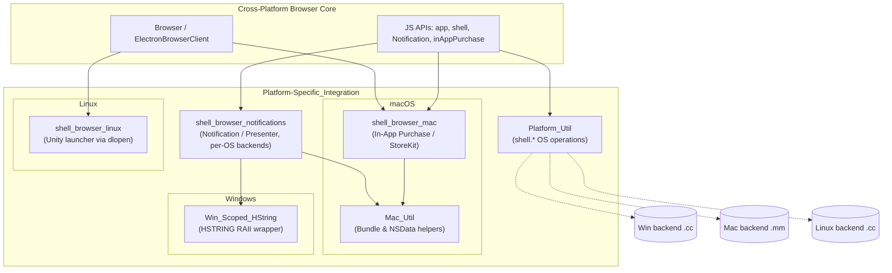
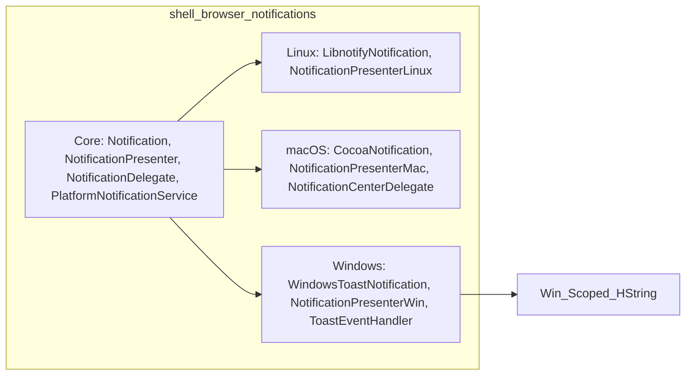
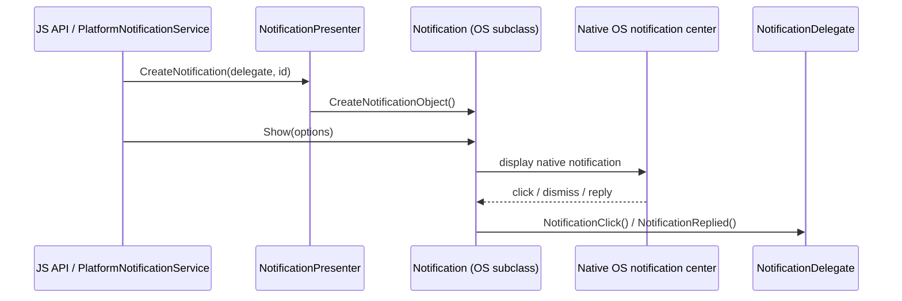

<OVERVIEW>
# Platform-Specific_Integration

## Purpose

The `Platform-Specific_Integration` module is Electron's dedicated layer for bridging cross-platform browser-process logic to native, OS-specific APIs. Rather than scattering `#ifdef`-guarded platform code throughout the core browser process, Electron isolates macOS (Cocoa/StoreKit), Linux (Unity/D-Bus), and Windows (WinRT/COM) integration details into focused sub-modules under `shell/browser/{mac,linux,win}`, `shell/common/{mac,mac_util.h,platform_util.h}`, and `shell/browser/notifications/*`.

This module provides:

- **macOS App Store integration** — StoreKit-backed In-App Purchase (IAP) observers and product lookups (`shell_browser_mac`).
- **Linux desktop shell integration** — Unity launcher badge counts and progress indicators, loaded dynamically via `dlopen`/`dlsym` (`shell_browser_linux`).
- **Windows WinRT string interop** — an RAII `HSTRING` wrapper used by COM/WinRT API calls (`Win_Scoped_HString`).
- **macOS bundle & data utilities** — resolving the main application bundle and converting `NSData` to `base::span` (`Mac_Util`).
- **Cross-platform OS shell operations** — reveal-in-folder, open-with-default-handler, open-external-URL, and trash operations, with platform-specific backends selected at compile time (`Platform_Util`).
- **Native desktop notifications** — a presenter/factory abstraction (`NotificationPresenter`/`Notification`/`NotificationDelegate`) with concrete implementations for Linux (libnotify), macOS (Notification Center), and Windows (WinRT Toast Notifications) (`shell_browser_notifications`).

Collectively, these components let the platform-agnostic core (e.g. `Browser`, `ElectronBrowserClient`, the `app`/`shell`/`Notification`/`inAppPurchase` JS APIs) delegate OS-specific behavior without leaking Objective-C, COM, or GLib/D-Bus concerns into shared code.

## Architecture

### Sub-module relationships

### Notification lifecycle (representative interaction)

## Core Components

| Sub-module | Path | Key Components | Docs |
|---|---|---|---|
| **shell_browser_mac** | `shell/browser/mac` | `TransactionObserver`, `Payment`, `Transaction`, `Product`, `ProductDiscount`, `GetProducts` | [shell_browser_mac.md](shell_browser_mac.md) |
| **shell_browser_linux** | `shell/browser/linux` | `unity::IsRunning/SetDownloadCount/SetProgressFraction`, `UnityInspector`, `UnityLauncherEntry` | [shell_browser_linux.md](shell_browser_linux.md) |
| **Win_Scoped_HString** | `shell/browser/win/scoped_hstring.h` | `ScopedHString` | [Win_Scoped_HString.md](Win_Scoped_HString.md) |
| **Mac_Util** | `shell/common` | `MainApplicationBundle()`, `MainApplicationBundlePath()`, `as_byte_span()` | [Mac_Util.md](Mac_Util.md) |
| **Platform_Util** | `shell/common` | `ShowItemInFolder`, `OpenPath`, `OpenExternal`, `TrashItem`, `Beep`, `OpenExternalOptions` | [Platform_Util.md](Platform_Util.md) |
| **shell_browser_notifications** | `shell/browser/notifications` | `Notification`, `NotificationPresenter`, `NotificationDelegate`, `PlatformNotificationService`, `LibnotifyNotification`, `NotificationPresenterLinux`, `CocoaNotification`, `NotificationPresenterMac`, `WindowsToastNotification`, `NotificationPresenterWin` | [shell_browser_notifications.md](shell_browser_notifications.md) |

## Relationships to Other Modules

- **[Browser_Process_Core_&_Lifecycle](shell_browser_core_lifecycle.md)** — `Browser` (Linux) calls into `shell_browser_linux`'s `unity::*` functions and owns/uses `PlatformNotificationService`/`NotificationPresenter` via `ElectronBrowserClient`.
- **[System_&_App-Level_Services_API](shell_browser_api_system_device.md)** — JS-facing `app`, `Notification`, and `inAppPurchase` APIs consume this module's platform backends.
- **[Common_Native_Gin_Infrastructure](Common_Native_Gin_Infrastructure.md)** — shares RAII utility conventions (e.g., `ScopedTemporaryFile`) with `Win_Scoped_HString`, and provides `NativeImage`/clipboard converters that interoperate with `Mac_Util`'s `NSData` bridging.
- **[Desktop_UI_Widgets_&_Dialogs](Desktop_UI_Widgets_&_Dialogs.md)** — hosts Windows taskbar/jump-list widgets analogous to Unity launcher integration, and defines dialog/menu native UI consumed alongside notifications.