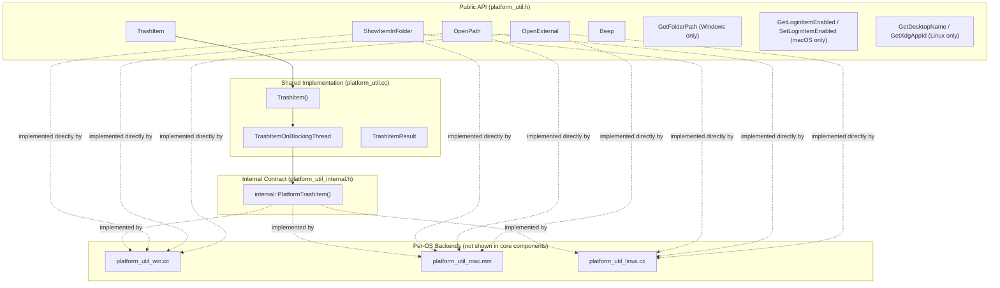
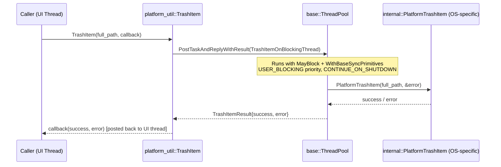
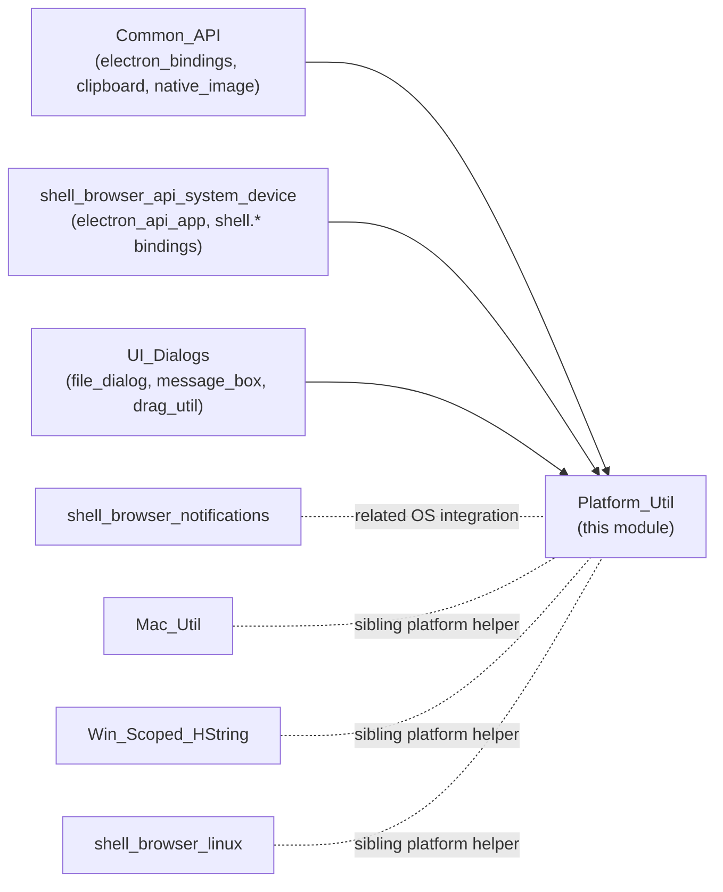

# Platform_Util

## 1. Purpose & Overview

`Platform_Util` is a small, focused C++ utility module in Electron's `shell/common/` layer that provides a **cross-platform abstraction for OS shell integration primitives**. It exposes a single, uniform API (`platform_util::*`) to the rest of the browser process while delegating the actual, OS-specific implementation to per-platform `.cc` files (Windows, macOS, Linux) that are compiled in behind the scenes.

Typical operations exposed by this module include:

- Revealing a file in the native file manager (Finder / Explorer / Nautilus, etc.)
- Opening a file with its default OS handler
- Opening an external URL/protocol (e.g. `mailto:`) with the OS default handler
- Moving a file to the trash/recycle bin asynchronously
- Playing the system "beep" sound
- Platform-specific helpers (Windows special folder paths, macOS login-item management, Linux desktop entry/XDG App ID discovery)

Because these operations touch the filesystem and OS shell APIs — which can block — the module is carefully designed so that blocking work is dispatched to background thread pools and results are delivered back via callbacks, keeping the browser UI thread responsive.

This module is a leaf utility consumed by many higher-level modules (see [Relationship to Other Modules](#5-relationship-to-other-modules)) rather than the other way around; it has no internal children/sub-modules given its small size (3 files).

## 2. File Structure

| File | Core Component(s) | Responsibility |
|---|---|---|
| `shell/common/platform_util.h` | `GURL`, `OpenExternalOptions` | Public API surface declaring all cross-platform functions and platform-guarded (`BUILDFLAG`) extras. |
| `shell/common/platform_util.cc` | `TrashItemResult` | Cross-platform implementation of `TrashItem()`, which schedules the platform-specific trash operation on a background thread pool and posts the result back via callback. |
| `shell/common/platform_util_internal.h` | `FilePath` | Internal-only interface (`platform_util::internal::PlatformTrashItem`) implemented separately per-OS (e.g. `platform_util_win.cc`, `platform_util_mac.mm`, `platform_util_linux.cc`) and invoked by `platform_util.cc`. |

> Note: The per-platform `.cc`/`.mm` implementation files (e.g. `platform_util_win.cc`, `platform_util_mac.mm`, `platform_util_linux.cc`) are not part of the documented "core components" set for this module but are the actual backends invoked through the internal interface described below.

## 3. Architecture

### 3.1 Public/Internal Separation

The module cleanly separates its **public cross-platform contract** (`platform_util.h`) from an **internal, platform-injected contract** (`platform_util_internal.h`). This allows `platform_util.cc` to implement shared, platform-agnostic logic (thread hopping, callback plumbing) once, while each OS provides only the minimal primitive it must fulfill.



### 3.2 Asynchronous Trash Flow

`TrashItem()` is the only function whose cross-platform orchestration logic lives in this module's `.cc` file (the rest are implemented entirely per-platform). Its flow illustrates the general pattern used to keep blocking shell operations off the UI thread:



Key design points:
- **`base::MayBlock()` + `WithBaseSyncPrimitives()`**: acknowledges that trashing a file may require blocking syscalls or synchronization primitives not normally allowed on Chromium sequences.
- **`TaskPriority::USER_BLOCKING`**: the operation is user-visible (e.g. triggered by "Move to Trash" in a menu), so it is scheduled with high priority.
- **`TaskShutdownBehavior::CONTINUE_ON_SHUTDOWN`**: the trash operation is allowed to continue even if the browser is shutting down, avoiding partial/corrupt file states.
- **`TrashItemResult`**: a simple aggregate struct (`success`, `error`) used purely to bundle the two output values through `PostTaskAndReplyWithResult`.

### 3.3 `OpenExternalOptions`

`OpenExternal()` accepts an `OpenExternalOptions` struct rather than a long parameter list:

```cpp
struct OpenExternalOptions {
  bool activate = true;          // Whether to bring the target app to foreground
  base::FilePath working_dir;    // Working directory for the launched handler
  bool log_usage = false;        // Whether to log this action for usage metrics
};
```

This keeps the public function signature stable as new options are added, and mirrors the JS-facing `shell.openExternal(url, options)` API surface (see [Common_API](Common_API.md) for the Node/V8 binding layer that ultimately calls into this function).

## 4. Platform-Specific Surface

`platform_util.h` uses `BUILDFLAG` guards to expose OS-specific helper functions alongside the common cross-platform ones:

| Platform | Extra Functions | Purpose |
|---|---|---|
| Windows (`IS_WIN`) | `GetFolderPath(int key, base::FilePath* result)` | Wraps `SHGetFolderPath` calls not already covered by Chromium's own abstractions. |
| macOS (`IS_MAC`) | `GetLoginItemEnabled(type, service_name)`, `SetLoginItemEnabled(type, service_name, enabled)` | Query/modify macOS "Login Items" (start-at-login) registration. |
| Linux (`IS_LINUX`) | `GetDesktopName()`, `GetXdgAppId()` | Determine desktop entry name / XDG application ID for correct desktop integration (taskbar grouping, icon, `.desktop` matching). Notably, unlike libgtkui, it does **not** fall back to `"chromium-browser.desktop"`. |

These platform-guarded declarations keep a single header as the authoritative contract, while implementation details remain isolated in the corresponding platform source files.

## 5. Relationship to Other Modules

`Platform_Util` sits within the broader **Platform-Specific Integration** family of modules and is consumed by many higher layers of Electron rather than depending on them:



- **[Common_API](Common_API.md)** and the broader **[Common_Native_Gin_Infrastructure](Common_Native_Gin_Infrastructure.md)** family expose Electron's `shell` module (`shell.showItemInFolder`, `shell.openPath`, `shell.openExternal`, `shell.trashItem`, `shell.beep`) to JavaScript; these bindings are thin wrappers that call directly into `platform_util::*` functions documented here.
- **[shell_browser_api_system_device](shell_browser_api_system_device.md)** (part of System_&_App-Level_Services_API) uses platform helpers like login-item and folder-path queries (e.g. `app.setLoginItemSettings`, `app.getPath`) that parallel/complement the macOS and Windows helpers in this module.
- **[UI_Dialogs](UI_Dialogs.md)** (file dialogs, drag-and-drop) and other desktop UI code frequently need to reveal or open resulting files, relying on `ShowItemInFolder`/`OpenPath`.
- **[shell_browser_notifications](shell_browser_notifications.md)**, **[Mac_Util](Mac_Util.md)**, **[Win_Scoped_HString](Win_Scoped_HString.md)**, and **[shell_browser_linux](shell_browser_linux.md)** are sibling modules under the same *Platform-Specific Integration* parent group; they provide complementary OS-specific facilities (notifications, macOS bundle/NSData helpers, Windows `HSTRING` RAII wrapper, Linux Unity launcher integration) but do not directly depend on `Platform_Util`.

## 6. Design Notes & Extension Points

- **Adding a new cross-platform operation**: declare it in `platform_util.h`, implement the OS-agnostic orchestration (if any) in `platform_util.cc`, and add the required primitive to `platform_util_internal.h` if per-OS behavior needs to be injected (following the `PlatformTrashItem` pattern). Otherwise, implement it directly and identically-named in each platform `.cc`/`.mm` file.
- **Callback contract**: All asynchronous entry points (`OpenPath`, `OpenExternal`, `TrashItem`) use `base::OnceCallback`, following Chromium's ownership and threading conventions — callbacks are guaranteed to run in a manner that respects the calling sequence's threading model (typically posted back to the UI thread).
- **No direct state**: The module holds no persistent state or singletons; every function is a stateless, callable utility, making it safe to call from any part of the browser process UI thread.
