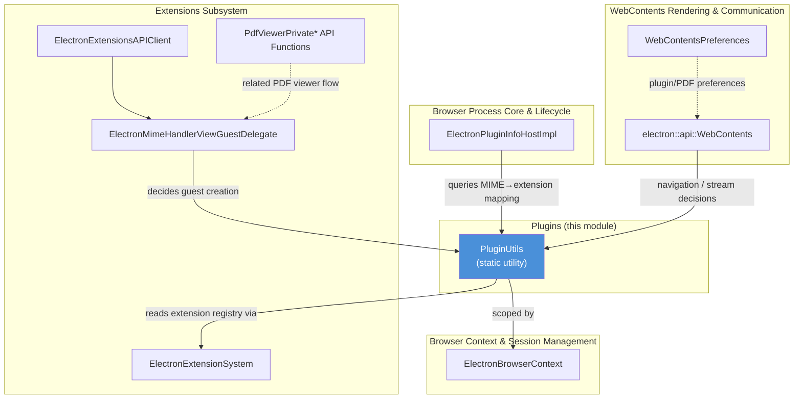
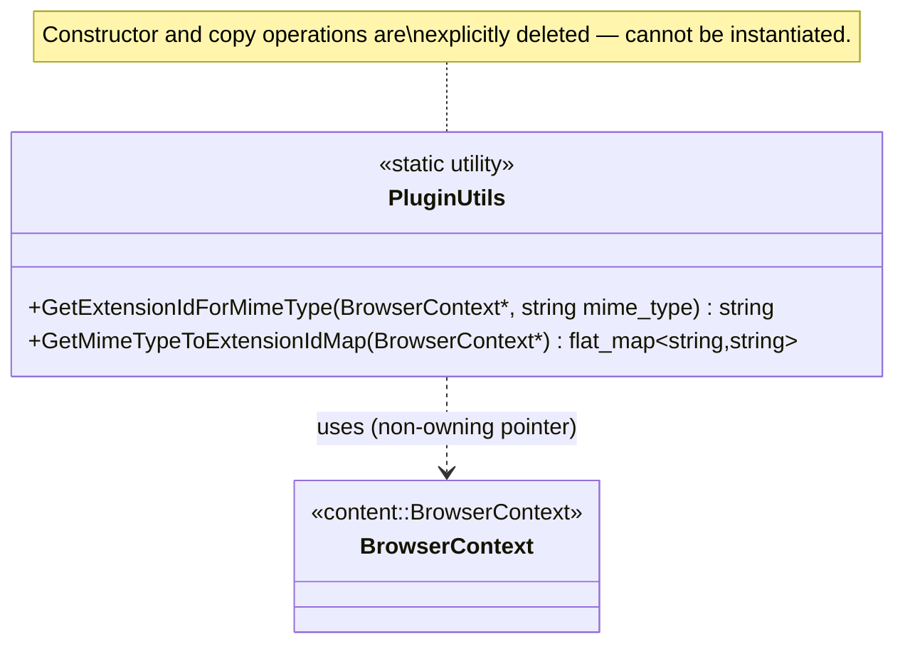
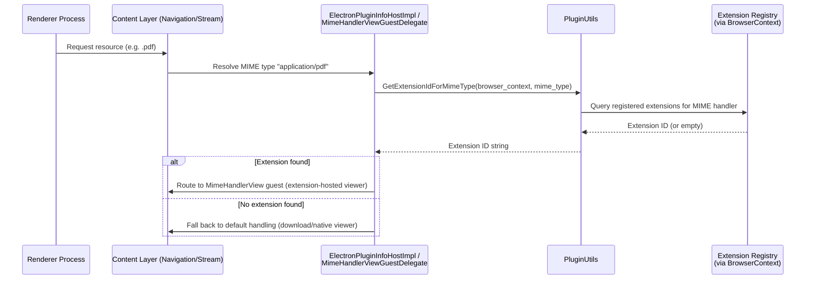
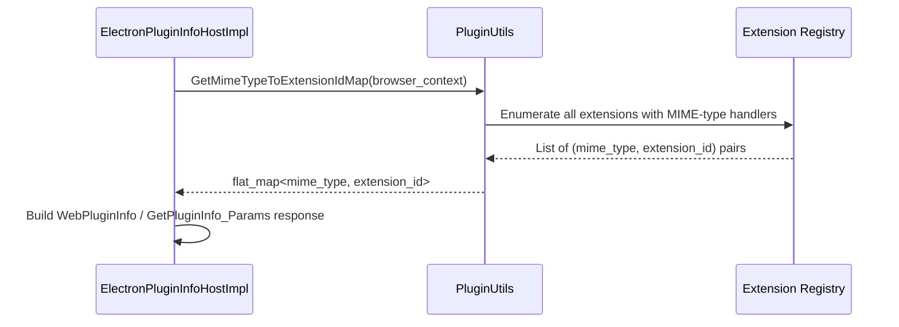
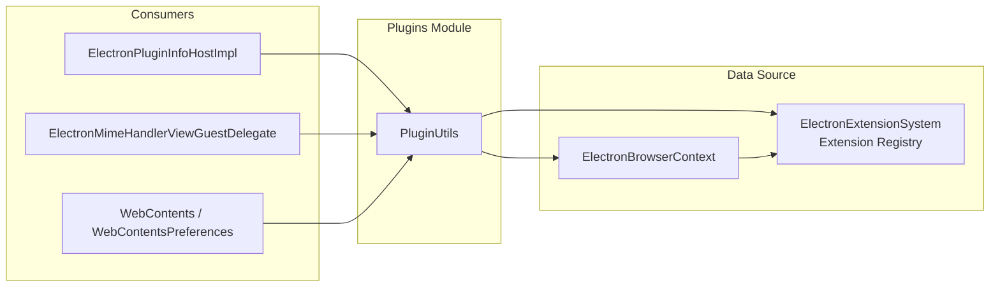

# Plugins Module

## Introduction

The **Plugins** module is a small but pivotal utility layer in Electron's browser process that answers one focused question: *"Which extension (if any) should handle a given MIME type for a given `BrowserContext`?"*. It is the glue that lets Electron route document types — most notably PDF files — to registered extension-based viewers (such as the built-in PDF viewer extension) instead of falling back to Chromium's native plugin/stream handling.

The module consists of a single static utility class, `PluginUtils`, defined in `shell/browser/plugins/plugin_utils.h`. Despite its small footprint, it sits at an important intersection between the [Extensions_Subsystem](Extensions_Subsystem.md) (which registers MIME-type handlers via extension manifests) and the [WebContents_Rendering_&_Communication](WebContents_Rendering_%26_Communication.md) module (which needs to decide, at navigation/stream time, whether content should be handed off to a `MimeHandlerView` guest).

---

## Purpose & Core Functionality

`PluginUtils` exposes two static, stateless helper functions:

| Function | Responsibility |
|---|---|
| `GetExtensionIdForMimeType(BrowserContext*, mime_type)` | Looks up whether any installed/registered extension declares itself as a handler for `mime_type` within the given `BrowserContext`, and returns its extension ID (or an empty string if none is found). |
| `GetMimeTypeToExtensionIdMap(BrowserContext*)` | Builds and returns a full `base::flat_map<std::string, std::string>` of MIME type → extension ID, aggregating every MIME-type-handling extension currently registered in the given `BrowserContext`. |

Because the class only exposes static methods and explicitly deletes its constructor/copy operations, `PluginUtils` is a pure **namespace-like utility** — it holds no state and cannot be instantiated. This keeps the API side-effect free and easy to call from any part of the browser process that has access to a `content::BrowserContext`.

### Why this exists

Chromium's content layer historically routed unknown/plugin-like MIME types (PDF, certain media types, etc.) through the `PluginService`/`WebPluginInfo` machinery. Electron replaces most of this with its own Extensions-based `MimeHandlerView` mechanism (e.g., for the bundled PDF viewer extension). `PluginUtils` is the small decision-making shim that:

1. Is queried by the [Extensions_Subsystem](Extensions_Subsystem.md)'s guest-view delegate (`ElectronMimeHandlerViewGuestDelegate`) and related extensions API client code to determine whether a `MimeHandlerView` guest should be created for a given resource.
2. Is queried by higher-level content delegates (e.g., `ElectronPluginInfoHostImpl` in [Browser_Process_Core_&_Lifecycle](Browser_Process_Core_%26_Lifecycle.md)) when the renderer asks the browser process "what plugin info is available for this MIME type?".
3. Feeds into `WebContentsPreferences` / `WebContents` MIME-type–driven navigation decisions in [WebContents_Rendering_&_Communication](WebContents_Rendering_%26_Communication.md).

---

## Architecture

### Position in the System

### Class Structure

`PluginUtils` intentionally has **no member state**. Both methods take a `content::BrowserContext*` as an input parameter, meaning all persistent state (which extensions are installed, which MIME types they claim) lives in the `BrowserContext`'s associated extension registry — not in `PluginUtils` itself.

---

## Data Flow

The typical flow that exercises `PluginUtils` begins with a browser-process component needing to resolve MIME type ownership, usually triggered by a navigation response or a renderer IPC request for plugin info.

For bulk lookups (e.g., populating plugin metadata answered over IPC to legacy renderer plugin queries):

---

## Component Interactions

`PluginUtils` is consumed by (but does not itself depend on) several other modules:

- **[Browser_Process_Core_&_Lifecycle](Browser_Process_Core_%26_Lifecycle.md)** — `ElectronPluginInfoHostImpl` (declared in `shell/browser/electron_plugin_info_host_impl.h`) implements the Mojo/IPC interface that answers renderer requests for `GetPluginInfo_Params` / `WebPluginInfo`. It uses `PluginUtils::GetMimeTypeToExtensionIdMap` (or the single-MIME-type variant) to determine whether a MIME type should be reported as extension-handled.
- **[Extensions_Subsystem](Extensions_Subsystem.md)** — The extension registry that `PluginUtils` queries is owned and maintained by `ElectronExtensionSystem`. The `ElectronMimeHandlerViewGuestDelegate` (from `electron_extensions_api_client.cc`) and the `pdf_viewer_private` API functions (`PdfViewerPrivateGetStreamInfoFunction`, `PdfViewerPrivateSetPdfPluginAttributesFunction`, etc.) represent the extension-side counterpart: they rely on the same underlying MIME-type-to-extension association that `PluginUtils` surfaces to browser-process consumers.
- **[WebContents_Rendering_&_Communication](WebContents_Rendering_%26_Communication.md)** — `electron::api::WebContents` and `WebContentsPreferences` consult MIME-type/plugin decisions when determining how to render or hand off a navigation response (e.g., whether `plugins` preference should allow extension-hosted viewers for a given resource).
- **[Browser_Context_&_Session_Management](Browser_Context_%26_Session_Management.md)** — Every `PluginUtils` call is scoped to a `content::BrowserContext` (concretely, an `ElectronBrowserContext`/`Session` in Electron), ensuring MIME-type-to-extension resolution respects per-session extension installations (important for `session.fromPartition` isolation).

---

## Key Design Characteristics

1. **Stateless & Static** — `PluginUtils` has a deleted default constructor and deleted copy constructor/assignment, enforcing pure static-utility usage. There is no lifecycle to manage and no ownership concerns.
2. **BrowserContext-Scoped** — All queries take a `content::BrowserContext*`, ensuring correctness across multiple sessions/partitions managed by [Browser_Context_&_Session_Management](Browser_Context_%26_Session_Management.md).
3. **Read-Only Queries** — The class never mutates extension state; it purely reads from the extension registry to answer MIME-type routing questions.
4. **Minimal Surface Area** — Only two methods are exposed, keeping the coupling between the plugin/MIME resolution logic and its callers as thin as possible.

---

## Related Modules

- [Extensions_Subsystem](Extensions_Subsystem.md) — Owns the extension registry and manifest-declared MIME type handlers that `PluginUtils` queries.
- [Browser_Process_Core_&_Lifecycle](Browser_Process_Core_%26_Lifecycle.md) — Hosts `ElectronPluginInfoHostImpl`, a primary caller of `PluginUtils` for legacy plugin-info IPC.
- [WebContents_Rendering_&_Communication](WebContents_Rendering_%26_Communication.md) — Uses MIME/plugin resolution during navigation and content-type handling, including `MimeHandlerView` guest creation.
- [Browser_Context_&_Session_Management](Browser_Context_%26_Session_Management.md) — Provides the `BrowserContext`/`Session` scoping required by every `PluginUtils` call.
