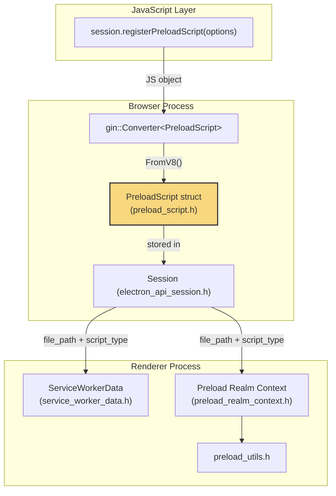
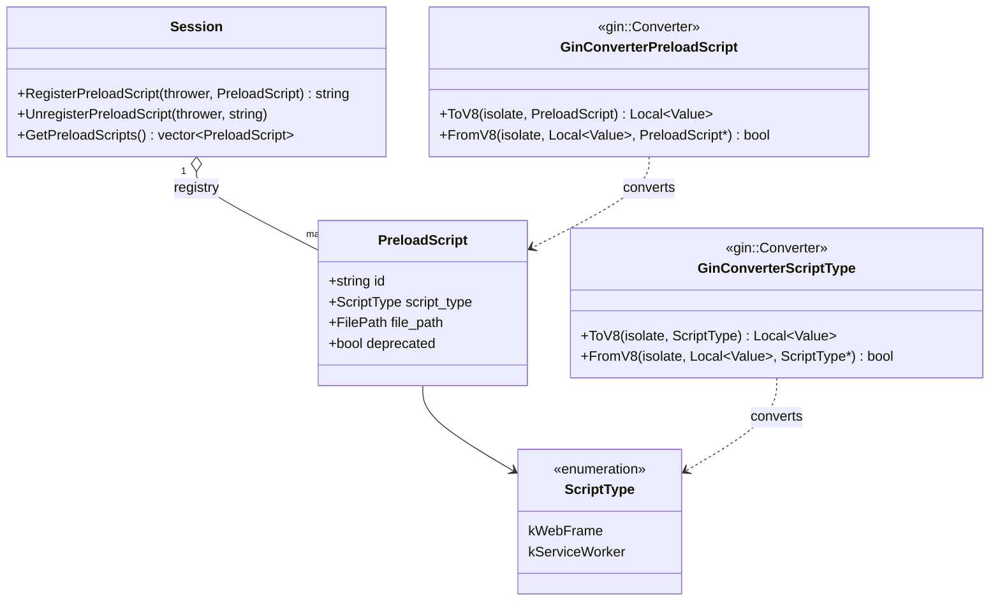
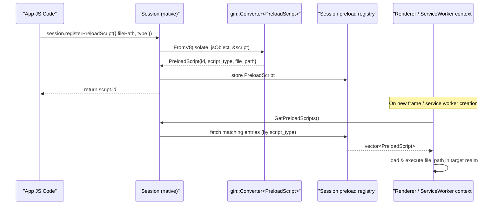
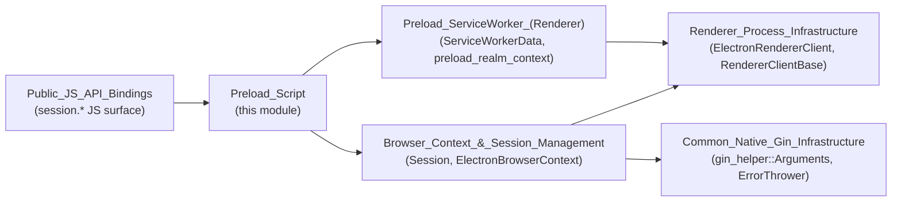

# Preload Script

## Introduction

The **Preload Script** module defines the core data structure used by Electron's browser process to describe *preload scripts* — JavaScript files that are injected into a renderer context (either a normal web frame or a service worker) before any other script runs. This structure, `electron::PreloadScript`, is the canonical, serializable representation of a preload script's identity, type, and location on disk, and it is the vehicle by which preload script configuration flows from JavaScript (via the `Session` API) down into the C++ browser process and, eventually, out to the renderer/preload execution environment.

This module is intentionally small and focused: it contains a single header (`shell/browser/preload_script.h`) that declares the `PreloadScript` struct along with `gin::Converter` specializations that allow the struct (and its nested `ScriptType` enum) to be converted transparently between native C++ and V8/JavaScript values. Despite its small size, it plays a structural role connecting several other subsystems, which are documented separately and linked below.

---

## Purpose & Core Functionality

### What is a `PreloadScript`?

```cpp
struct PreloadScript {
  enum class ScriptType { kWebFrame, kServiceWorker };

  std::string id;
  ScriptType script_type;
  base::FilePath file_path;

  // If set, use the deprecated validation behavior of Session.setPreloads
  bool deprecated = false;
};
```

| Field | Description |
|---|---|
| `id` | A unique identifier for the preload script (used for later lookup/removal via `Session.unregisterPreloadScript`). |
| `script_type` | Determines whether the script targets a normal web frame (`kWebFrame`) or a service worker context (`kServiceWorker`). |
| `file_path` | Absolute filesystem path to the JavaScript file to be loaded and executed in the target context. |
| `deprecated` | A backward-compatibility flag indicating the script was registered through the older, deprecated `Session.setPreloads` API rather than the newer `registerPreloadScript` API. This affects validation behavior. |

### Gin Conversion Layer

Because `PreloadScript` instances are created and manipulated primarily from JavaScript (through the `Session` API surface), the header also declares `gin::Converter` template specializations:

- `Converter<PreloadScript::ScriptType>` — converts the enum to/from a JS string (e.g., `"frame"` / `"service-worker"`).
- `Converter<PreloadScript>` — converts an entire preload script descriptor to/from a plain JS object (with fields matching the struct members), enabling native code to accept and return `PreloadScript` values directly in V8-bound function signatures.

These converters allow C++ APIs such as `Session::RegisterPreloadScript` and `Session::GetPreloadScripts` (see below) to use `PreloadScript` as a first-class parameter/return type without manual marshalling code at each call site.

---

## Architecture & Component Relationships

`PreloadScript` sits at the intersection of the browser-side `Session` API and the renderer-side preload execution infrastructure. It does not itself perform any script loading or execution — it is a pure data-transfer object. Responsibility for *using* the descriptor is split across two areas:

1. **Browser Process (`Session` API)** — owns the registry of preload scripts per session/partition, exposes `registerPreloadScript()` / `unregisterPreloadScript()` / `getPreloadScripts()` to JavaScript, and is responsible for validating and persisting `PreloadScript` entries. See [Browser_Context_&_Session_Management](Browser_Context_&_Session_Management.md) for the full `Session` class documentation.
2. **Renderer Process (Preload/Service-Worker Realm)** — consumes the file path recorded in a `PreloadScript` to actually load and execute the script inside the correct isolated/main-world context, particularly for the service-worker preload case. See the sibling module [Preload_ServiceWorker_(Renderer)](Preload_ServiceWorker_(Renderer).md).



### Ownership & Lifecycle

`PreloadScript` values are owned by the `Session` object (one `Session` per `ElectronBrowserContext` / partition). The `Session` class maintains an internal collection of registered `PreloadScript` entries and provides the following relevant methods (see [Browser_Context_&_Session_Management](Browser_Context_&_Session_Management.md) for the complete `Session` API):

- `RegisterPreloadScript(ErrorThrower, const PreloadScript&) -> std::string` — validates and stores a new preload script descriptor, returning its `id`.
- `UnregisterPreloadScript(ErrorThrower, const std::string& script_id)` — removes a previously registered script by id.
- `GetPreloadScripts() const -> std::vector<PreloadScript>` — returns all currently registered scripts (used, for example, to enumerate scripts for a newly created renderer/service-worker context).



---

## Data Flow

The typical lifecycle of a `PreloadScript` traverses JS → native struct → renderer consumption:



- For **web frame** preloads (`ScriptType::kWebFrame`), the `file_path` is passed to the renderer's main-world/isolated-world bootstrap logic (part of [Renderer_Process_Infrastructure](Renderer_Process_Infrastructure.md), e.g. `electron_render_frame_observer.h` and `electron_renderer_client.h`).
- For **service worker** preloads (`ScriptType::kServiceWorker`), the `file_path` and associated metadata flow into the service-worker-specific preload realm, represented by `ServiceWorkerData` and the preload realm context — documented in the sibling module [Preload_ServiceWorker_(Renderer)](Preload_ServiceWorker_(Renderer).md).

---

## How It Fits Into the Overall System

`PreloadScript` is a small but pivotal contract between several larger subsystems:



### Related Modules

| Module | Relationship |
|---|---|
| [Browser_Context_&_Session_Management](Browser_Context_&_Session_Management.md) | Owns the `Session` class, which stores/manages collections of `PreloadScript` and exposes the JS-facing `registerPreloadScript`/`unregisterPreloadScript`/`getPreloadScripts` methods. This is the primary consumer of the `PreloadScript` struct in the browser process. |
| [Preload_ServiceWorker_(Renderer)](Preload_ServiceWorker_(Renderer).md) | Sibling module in the same parent group (`Preload_Script_Infrastructure`). Contains `ServiceWorkerData`, `preload_realm_context.h`, and `preload_utils.h`, which are responsible for actually executing preload scripts described by `PreloadScript` inside service-worker V8 contexts. |
| [Common_Native_Gin_Infrastructure](Common_Native_Gin_Infrastructure.md) | Supplies the underlying `gin`/`gin_helper` primitives (`gin::Converter`, `gin_helper::Arguments`, `gin_helper::ErrorThrower`) that the `PreloadScript` converters and the `Session` API build upon. |
| [Renderer_Process_Infrastructure](Renderer_Process_Infrastructure.md) | Consumes preload script file paths for regular web-frame contexts, bootstrapping the isolated/main world via `ElectronRendererClient` and related renderer client classes. |

---

## Summary

The `Preload_Script` module provides a minimal, well-defined data contract (`PreloadScript`) plus the V8 conversion glue necessary to move that contract seamlessly between JavaScript and native code. It has no runtime behavior of its own; instead, it standardizes how preload script *metadata* (id, type, path, deprecation status) is represented so that the `Session` API (browser process) and the preload/service-worker execution machinery (renderer process) can interoperate reliably. Understanding this struct is essential context before diving into the `Session` preload-registration methods or the service-worker preload realm implementation referenced above.
