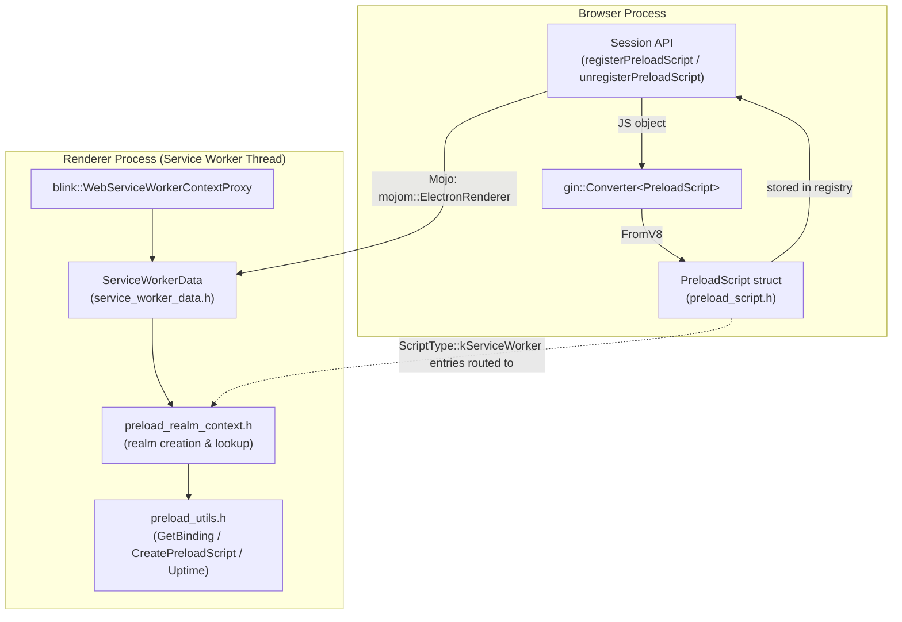
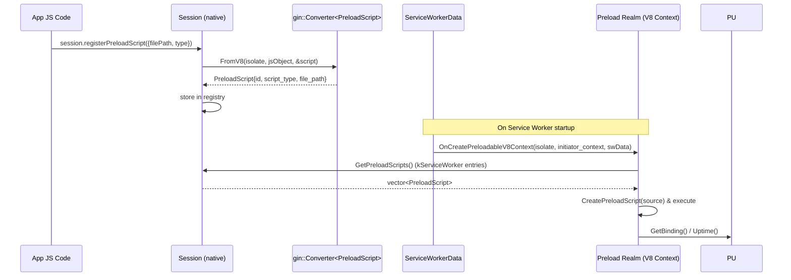
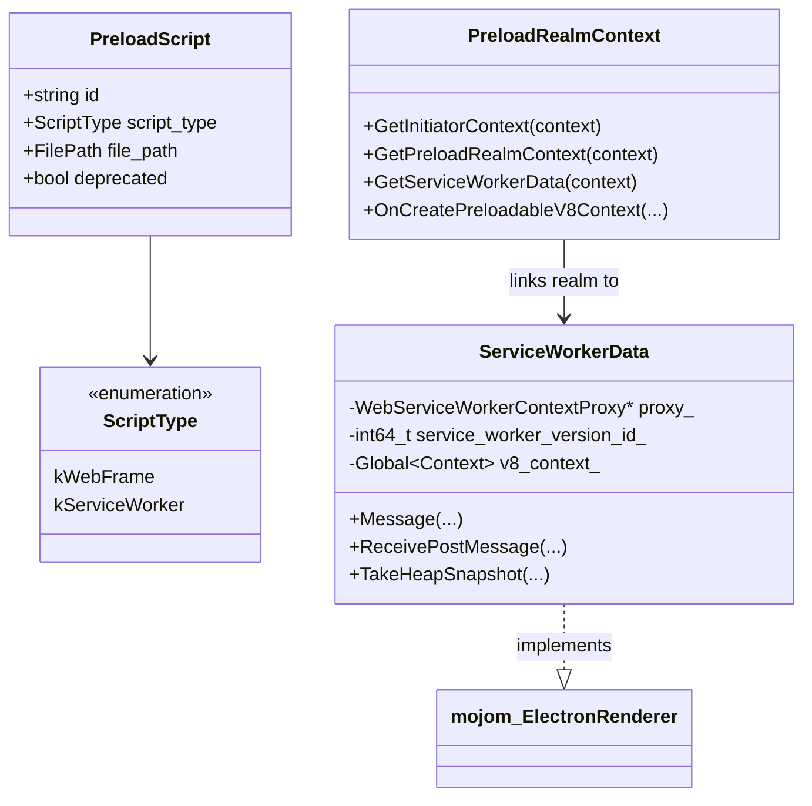

# Preload_Script_Infrastructure

## Purpose

The `Preload_Script_Infrastructure` module defines Electron's core mechanism for describing and executing **preload scripts** — JavaScript files that are injected into a renderer-side execution context before any other page/worker script runs. It provides:

1. **A canonical data contract** (`PreloadScript`) used by the browser process to describe a preload script's identity (`id`), target type (`ScriptType::kWebFrame` or `ScriptType::kServiceWorker`), file location, and legacy/deprecated status. This struct is exposed to JavaScript through `gin::Converter` specializations, allowing it to flow seamlessly from the `session.registerPreloadScript()` JS API into native code.
2. **A Service-Worker-specific execution environment** on the renderer side, responsible for creating an isolated V8 "preload realm" tied to a Service Worker's context, tracking per-worker state (`ServiceWorkerData`) for Mojo IPC with the browser process, and exposing utility bindings (`GetBinding`, `CreatePreloadScript`, `Uptime`) that preload code can call.

Together, these two halves ensure that preload scripts — whether targeting an ordinary web frame or a Service Worker — can be reliably registered, transported across process boundaries, and safely executed in an isolated JavaScript context.

## Architecture

The module is split into two closely related sub-components: the shared preload script descriptor (owned by the browser process) and the Service-Worker preload realm machinery (owned by the renderer process).

### Data flow: registering & executing a preload script

### Component relationships

## Sub-modules

| Sub-module | Description |
|---|---|
| [Preload_Script](./Preload_Script.md) | Defines the `PreloadScript` struct (`shell/browser/preload_script.h`) and its `gin::Converter` specializations — the browser-process data contract for preload script metadata (id, type, file path, deprecation flag). |
| [Preload_ServiceWorker_(Renderer)](./Preload_ServiceWorker_(Renderer).md) | Implements renderer-side Service Worker preload execution: `ServiceWorkerData` (per-worker IPC/state holder), `preload_realm_context.h` (isolated V8 realm creation/lookup), and `preload_utils.h` (binding/utility functions exposed to preload code). |

## Related Modules

- [Browser_Context_&_Session_Management](./Browser_Context_&_Session_Management.md) — owns the `Session` API (`registerPreloadScript`, `unregisterPreloadScript`, `getPreloadScripts`) that creates, stores, and distributes `PreloadScript` entries.
- [Renderer_Process_Infrastructure](./Renderer_Process_Infrastructure.md) — provides the general renderer client/bootstrap machinery (`ElectronRendererClient`, `WebWorkerObserver`) used for regular web-frame preload injection, complementing the Service-Worker-specific path in this module.
- [Common_Native_Gin_Infrastructure](./Common_Native_Gin_Infrastructure.md) — supplies the underlying `gin`/`gin_helper` primitives (`gin::Converter`, `gin_helper::Arguments`) used both by the `PreloadScript` converters and by `preload_utils.h`.