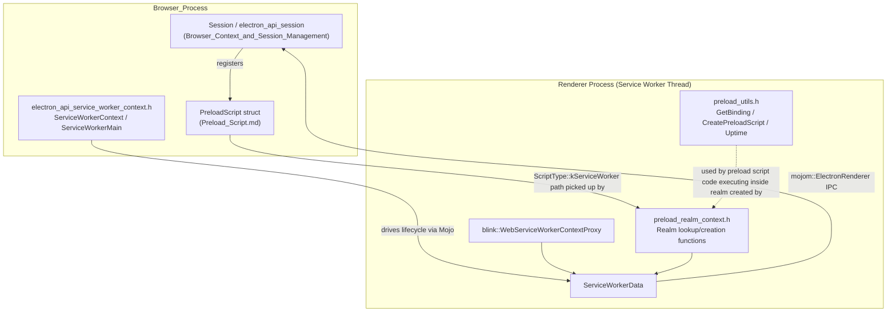
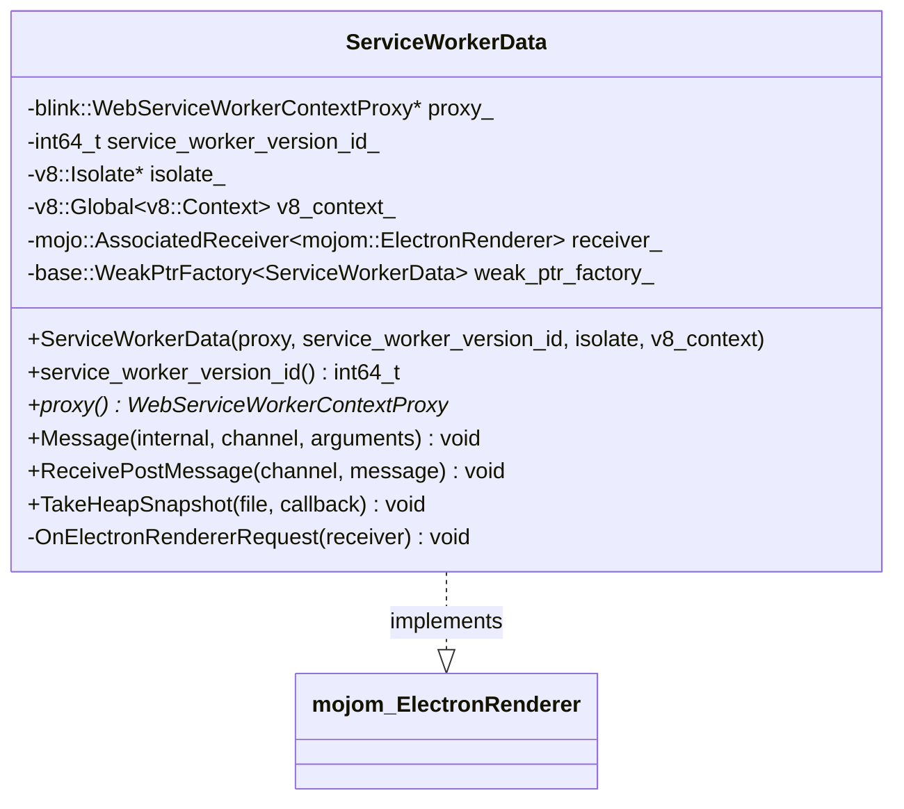
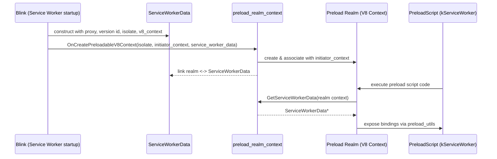

# Preload ServiceWorker (Renderer)

## Introduction

The **Preload ServiceWorker (Renderer)** module implements Electron's support for running
**preload scripts inside Service Worker execution contexts**. Service Workers in Chromium run
in their own isolated V8 context/thread, separate from a document's main world. To let Electron
apps use `session.setPreloads()`/`webContents.session` preload scripts and expose privileged
Node-like bindings (`process`, IPC, etc.) to Service Worker code, Electron needs a parallel,
lightweight infrastructure to:

1. Track per-Service-Worker renderer-side state (the worker's V8 isolate/context, its Mojo
   connection back to the browser process, and the Blink proxy object that represents the
   worker).
2. Create and locate a **preload realm** — an auxiliary V8 context associated with a Service
   Worker's "initiator" context — where preload script code actually executes, isolated from the
   worker's own global scope.
3. Provide small utility functions (`GetBinding`, `CreatePreloadScript`, `Uptime`) that preload
   scripts running in this realm can call into, mirroring the utilities available to ordinary
   (window/webFrame) preload scripts.

This module is the Service-Worker-specific counterpart to the more general
[Preload_Script](Preload_Script.md) infrastructure (which defines the `PreloadScript` descriptor
used by both web-frame and service-worker preload scripts) and to the renderer process
infrastructure documented in [Renderer_Process_Infrastructure](Renderer_Process_Infrastructure.md).

## Position in the System

The module has no sub-directory hierarchy of its own beyond three closely related headers, all
under `shell/renderer/`. Because they form one cohesive unit — managing the V8 realm and IPC
plumbing for Service Worker preload execution — they are documented together below rather than
split into further sub-modules.

## Core Components

| Component | File | Responsibility |
|---|---|---|
| `ServiceWorkerData` | `shell/renderer/service_worker_data.h` | Per-Service-Worker state holder; implements the `mojom::ElectronRenderer` Mojo interface for browser→renderer messaging into a Service Worker. |
| Preload realm context functions | `shell/renderer/preload_realm_context.h` | Create/locate the auxiliary V8 "preload realm" context tied to a Service Worker's initiator context, and fetch the `ServiceWorkerData` associated with it. |
| Preload utility functions | `shell/renderer/preload_utils.h` | Expose bindings (`GetBinding`), preload-script wrapping (`CreatePreloadScript`), and process uptime (`Uptime`) to code running inside a preload realm. |

### `ServiceWorkerData`

`ServiceWorkerData` is created once per running Service Worker on the renderer side. It:

- Stores a reference to the Blink-provided `WebServiceWorkerContextProxy`, which is the engine's
  handle to the worker's execution environment.
- Records the `service_worker_version_id`, used by the browser process to correlate this worker
  instance with its `ServiceWorkerMain` counterpart (see
  [Browser_Context_&_Session_Management](Browser_Context_&_Session_Management.md) —
  `shell/browser/api/electron_api_service_worker_main.h`).
- Keeps a persistent (`v8::Global`) handle to the worker's V8 context so it can be recovered later
  (e.g., when routing an incoming IPC message that must be dispatched into worker JavaScript).
- Implements `mojom::ElectronRenderer`, the same Mojo interface implemented by ordinary renderer
  frames, so that the browser process can transparently send IPC (`Message`), `postMessage`
  payloads (`ReceivePostMessage`), and heap-snapshot requests (`TakeHeapSnapshot`) to a worker
  exactly as it would to a document's main frame. The receiver is bound lazily via
  `OnElectronRendererRequest` when the browser establishes the associated Mojo pipe.

### Preload Realm Context (`preload_realm_context.h`)

Service Workers do not have a "preload" world the way documents do (isolated worlds), so Electron
creates a **separate V8 context** — the *preload realm* — that:

- Is distinct from the worker's own global execution context (the "initiator context").
- Hosts the code of preload scripts (`PreloadScript` entries with
  `ScriptType::kServiceWorker`, see [Preload_Script](Preload_Script.md)) so that user preload code
  cannot pollute or be observed by the worker's own script, mirroring the isolated-world guarantees
  given to window preload scripts.

Exposed functions:

| Function | Purpose |
|---|---|
| `GetInitiatorContext(context)` | Given a preload realm context, returns the worker's own ("initiator") V8 context. |
| `GetPreloadRealmContext(context)` | Inverse lookup: given the worker's initiator context, returns its associated preload realm context (if one has been created). |
| `GetServiceWorkerData(context)` | Given a preload realm context, retrieves the `ServiceWorkerData*` for the owning worker so preload code / bindings can access worker-scoped state (IPC, version id, proxy). |
| `OnCreatePreloadableV8Context(isolate, initiator_context, service_worker_data)` | Hook invoked when a Service Worker context becomes eligible for preload script injection; sets up and links the new preload realm context to the initiator context and to the supplied `ServiceWorkerData`. |

### Preload Utilities (`preload_utils.h`)

These free functions are bound into the preload realm's global object (or an internal binding
object) so preload script code executing in a Service Worker context has access to the same
primitives available to ordinary preload scripts:

| Function | Purpose |
|---|---|
| `GetBinding(isolate, key, args)` | Looks up and returns a native binding module by name (analogous to `process.binding`/internal module resolution used by window preload scripts), using `gin_helper::Arguments` (extended `Arguments` type, see [Common_Native_Gin_Infrastructure](Common_Native_Gin_Infrastructure.md)) for flexible V8↔C++ argument conversion. |
| `CreatePreloadScript(isolate, source)` | Compiles/wraps a preload script source string into a callable V8 value/function ready for execution inside the realm. |
| `Uptime()` | Returns process uptime in seconds/milliseconds, mirroring `process.uptime()` available to normal preload scripts. |

These utilities depend on `gin_helper::Arguments` defined in
[Common_Native_Gin_Infrastructure](Common_Native_Gin_Infrastructure.md)
(`shell/common/gin_helper/arguments.h`), which extends `gin::Arguments` with safer, non-mutating
`GetNext<T>()` semantics and custom error throwing — used throughout Electron's native API
surface for parsing JS-supplied arguments.

## Relationship to Other Modules

- **[Preload_Script](Preload_Script.md)** — defines the `PreloadScript` struct
  (`shell/browser/preload_script.h`) with `ScriptType::kServiceWorker`/`kWebFrame` enumerants.
  The browser-side `Session`/`ServiceWorkerContext` APIs
  (see [Browser_Context_&_Session_Management](Browser_Context_&_Session_Management.md)) decide
  *which* scripts to inject; this module is responsible for *where and how* the
  `kServiceWorker`-typed scripts actually run once they reach the renderer/worker thread.
- **[Renderer_Process_Infrastructure](Renderer_Process_Infrastructure.md)** — hosts the broader
  renderer-side client machinery (`ElectronRendererClient`, `WebWorkerObserver`,
  `ElectronApiServiceImpl`) that governs non-Service-Worker renderer contexts (main world, worker
  threads, extensions renderer). `ServiceWorkerData`/`preload_realm_context` are the
  Service-Worker-specific analogues to `WebWorkerObserver`/renderer client bootstrap performed for
  ordinary frames and dedicated workers.
- **[Common_Native_Gin_Infrastructure](Common_Native_Gin_Infrastructure.md)** — supplies the
  `gin_helper::Arguments` base class and other Gin/V8 helper utilities (`Handle`,
  `ObjectTemplateBuilder`, `Promise`, etc.) that `preload_utils.h` and the broader binding surface
  build upon.
- **[Browser_Context_&_Session_Management](Browser_Context_&_Session_Management.md)** —
  `shell/browser/api/electron_api_service_worker_main.h` / `electron_api_service_worker_context.h`
  represent the browser-process view of a Service Worker; `mojom::ElectronRenderer` (implemented by
  `ServiceWorkerData`) is the IPC counterpart that lets the browser send messages down into the
  worker's preload/renderer environment.

## Typical Lifecycle

1. A page or the app registers a Service Worker whose scope matches one or more configured
   `PreloadScript` entries of type `kServiceWorker`.
2. When Blink starts the Service Worker, Electron's renderer bootstrap constructs a
   `ServiceWorkerData` for it, wiring up the Mojo `mojom::ElectronRenderer` receiver so the browser
   process can communicate with this worker instance.
3. `OnCreatePreloadableV8Context` is invoked with the worker's initiator context and the new
   `ServiceWorkerData`, causing a dedicated preload realm V8 context to be created and associated
   with both.
4. Configured preload scripts are compiled via `CreatePreloadScript` and executed inside the realm;
   during execution they may call `GetBinding` to pull in native modules and `Uptime` for process
   information.
5. At runtime, code running in the realm (or native binding implementations) can call
   `GetServiceWorkerData`/`GetInitiatorContext`/`GetPreloadRealmContext` to cross between the
   preload realm and the worker's own context as needed.
6. IPC originating from the browser process (e.g., `webContents.send`-style APIs targeting a
   Service Worker, or heap snapshot requests) arrives through `ServiceWorkerData::Message`,
   `ReceivePostMessage`, or `TakeHeapSnapshot`, and is routed into the appropriate V8 context.

## Notes on Scope

This module intentionally contains only renderer-thread, Service-Worker-specific glue code. It has
no further meaningful sub-module decomposition: the three headers are small, tightly coupled, and
together implement a single concern (Service Worker preload realm + its IPC/data anchor). For
details on the data describing *which* scripts get loaded (shared with window preload scripts),
see [Preload_Script](Preload_Script.md).
