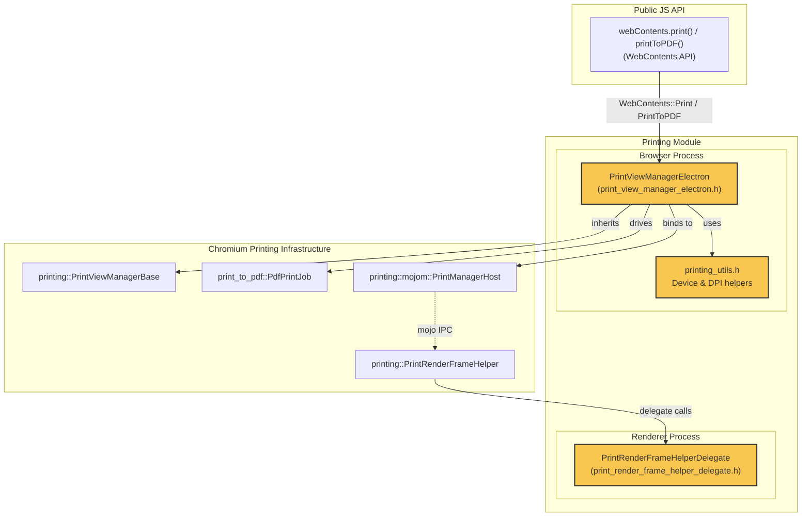
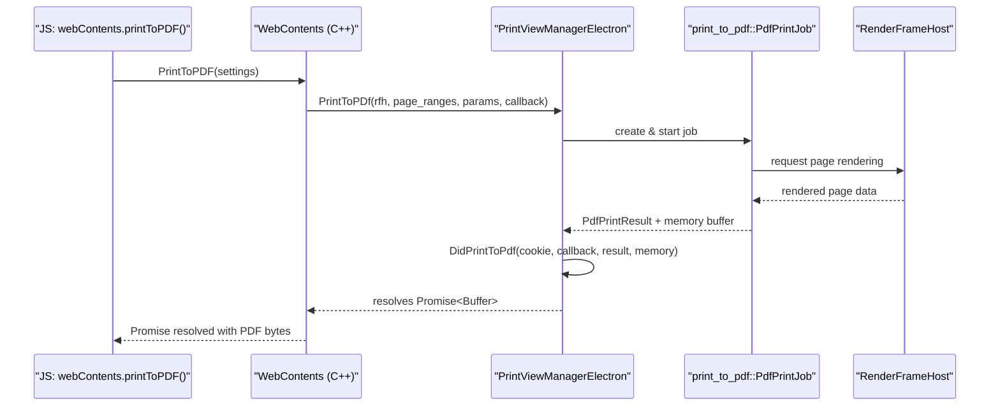
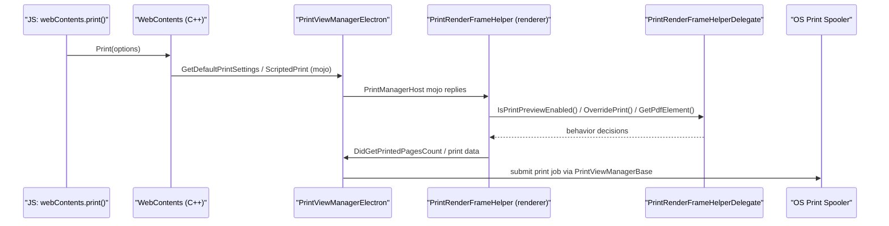

# Printing Module

## Introduction

The **Printing** module implements Electron's native printing pipeline — the plumbing that connects a web page rendered inside a `WebContents` to the operating system's print subsystem (physical printers, print preview, and "Print to PDF"). It is a thin, Electron-specific integration layer built on top of Chromium's `//components/printing` and `//chrome/browser/printing` infrastructure, adapting the generic Chromium printing stack to Electron's single-`WebContents`-per-window model and its `webContents.print()` / `webContents.printToPDF()` JavaScript APIs.

The module is split across the two Chromium process types involved in printing:

- **Browser process** — orchestrates print jobs, resolves printer/device settings, and drives PDF generation for a given frame.
- **Renderer process** — supplies a delegate that customizes how Chromium's generic `PrintRenderFrameHelper` behaves inside an Electron renderer (e.g., disabling the built-in print-preview UI since Electron implements its own).

## Architecture Overview

### How printing fits into the wider system

- **[WebContents_Rendering_&_Communication](WebContents_Rendering_&_Communication.md)** — `WebContents` (see `shell_browser_api_webcontents_core`) owns the `PrintViewManagerElectron` instance (via `content::WebContentsUserData`) and exposes the `Print()` / `PrintToPDF()` methods invoked from JavaScript. This module supplies the printing back-end that those calls delegate to.
- **[Renderer_Process_Infrastructure](Renderer_Client.md)** — the renderer-side `RendererClientBase` and related renderer client classes wire up `PrintRenderFrameHelperDelegate` into Chromium's `PrintRenderFrameHelper` when a renderer frame is created.
- **[Common_Native_Gin_Infrastructure](Gin_Helper.md)** — printing settings passed from JS (page ranges, margins, device name, etc.) travel through `gin`/`gin_helper` argument and dictionary conversion utilities before reaching `PrintViewManagerElectron`.
- **Mojo IPC** — the browser and renderer sides communicate over the `printing::mojom::PrintManagerHost` Mojo interface; `PrintViewManagerElectron` is the browser-side endpoint, and `printing::PrintRenderFrameHelper` (customized via `PrintRenderFrameHelperDelegate`) is the renderer-side endpoint.

## Sub-modules

| Sub-module | Description | Documentation |
|---|---|---|
| Printing (Browser) | Browser-process print job orchestration, PDF generation, and device/DPI resolution utilities. | [Printing_browser.md](Printing_browser.md) |
| Printing (Renderer) | Renderer-process delegate customizing Chromium's generic print rendering helper for Electron. | [Printing_renderer.md](Printing_renderer.md) |

## Data Flow: Print to PDF

## Data Flow: Print to Physical Printer (Simplified)

## Key Responsibilities Summary

| Component | File | Responsibility |
|---|---|---|
| `PrintViewManagerElectron` | `shell/browser/printing/print_view_manager_electron.h` | Browser-side `PrintManagerHost` implementation; manages the lifecycle of print/print-preview/print-to-PDF requests for a `WebContents`, keyed off `content::WebContentsUserData`. |
| `printing_utils.h` functions | `shell/browser/printing/printing_utils.h` | Free functions for resolving default printer DPI, validating device names, choosing a target `RenderFrameHost`, and creating a dedicated task runner for printing tasks. |
| `PrintRenderFrameHelperDelegate` | `shell/renderer/printing/print_render_frame_helper_delegate.h` | Renderer-side delegate for Chromium's `printing::PrintRenderFrameHelper`, disabling Chromium's built-in print preview UI and customizing PDF-element detection and print overriding. |

## Cross-Cutting Concerns

- **Feature flag gating**: Most printing entry points on `WebContents` (see `shell_browser_api_webcontents_core` in [WebContents_Rendering_&_Communication](WebContents_Rendering_&_Communication.md)) are compiled only when `BUILDFLAG(ENABLE_PRINTING)` (and `ENABLE_PRINT_PREVIEW` for preview-specific mojo methods) is enabled.
- **Task scheduling**: Printer enumeration and DPI queries can block, so `CreatePrinterHandlerTaskRunner()` provides an appropriately configured `base::TaskRunner` to keep such work off the UI thread.
- **Ownership model**: `PrintViewManagerElectron` follows the `content::WebContentsUserData` pattern — one instance per `WebContents`, created lazily and destroyed with its owning `WebContents`.
