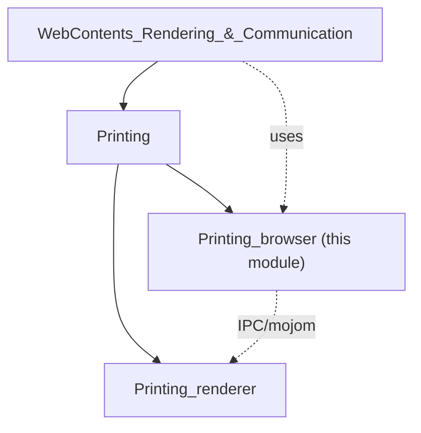
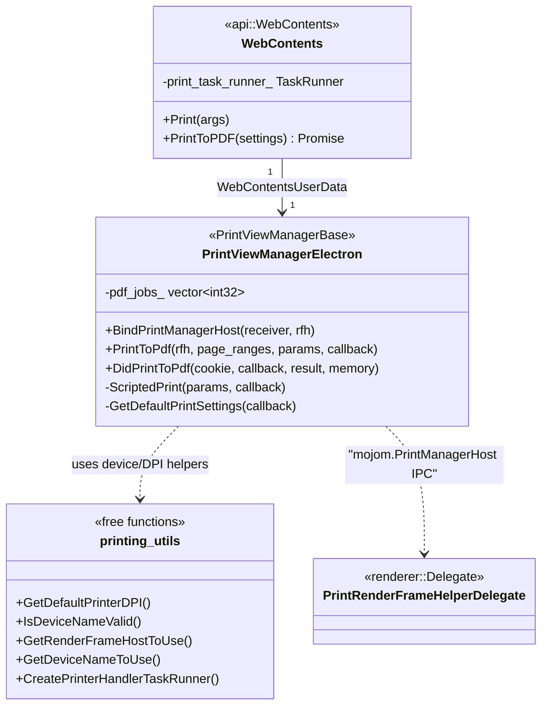
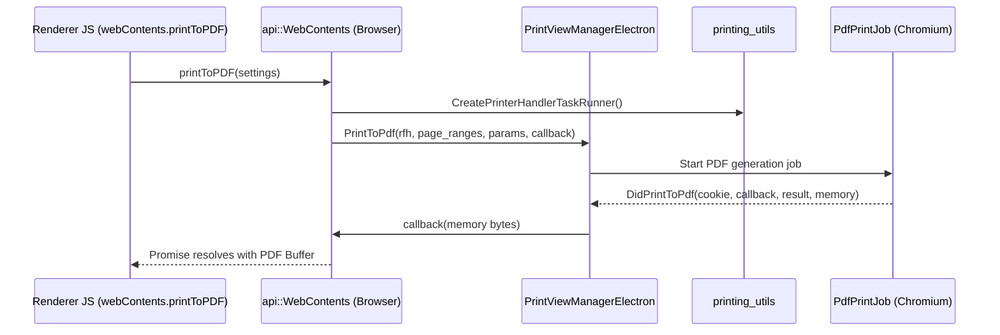
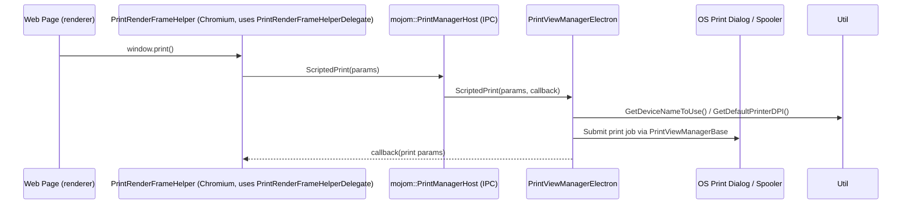
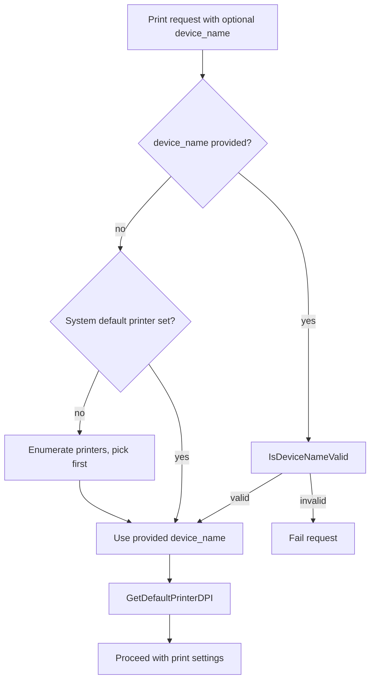

# Printing (Browser Process)

## Introduction

The **Printing_browser** module implements Electron's browser-process-side printing infrastructure. It bridges the Chromium `printing` component with Electron's `WebContents` API, enabling features such as:

- Native OS print dialogs (`webContents.print()`)
- Silent/programmatic "Print to PDF" (`webContents.printToPDF()`)
- Print preview support (when compiled with `ENABLE_PRINT_PREVIEW`)
- Cross-process subframe printing for out-of-process iframes
- Printer/device discovery and validation utilities (default DPI, device name resolution, printer task runner)

This module lives at `shell/browser/printing/` and is the browser-side counterpart to the [Printing_renderer](Printing_renderer.md) module, which supplies the renderer-process delegate used by Chromium's `PrintRenderFrameHelper`. Together they form the complete printing pipeline for Electron apps, consumed primarily through the [WebContents_Rendering_&_Communication](WebContents_Rendering_&_Communication.md) module's `WebContents` class.

## Module Position in the System

Printing_browser is a child of the broader **Printing** grouping, itself nested under **WebContents_Rendering_&_Communication**, reflecting that printing is fundamentally a per-`WebContents`/per-frame operation orchestrated from the browser process.

## Core Components

### `PrintViewManagerElectron`
*(shell/browser/printing/print_view_manager_electron.h)*

The central browser-side controller for a single `WebContents`'s printing lifecycle. It:

- Subclasses Chromium's `printing::PrintViewManagerBase` and mixes in `content::WebContentsUserData<PrintViewManagerElectron>`, meaning **one instance is attached per `WebContents`** and retrieved via the standard `WebContentsUserData` pattern (`FromWebContents` / `CreateForWebContents`, exposed indirectly through `PrintViewManagerElectron::BindPrintManagerHost`).
- Implements the `printing::mojom::PrintManagerHost` Mojo interface — the browser-side endpoint that receives print-related IPC from the renderer's `PrintRenderFrameHelper` (see [Printing_renderer](Printing_renderer.md)).
- Drives **Print to PDF**: `PrintToPdf()` initiates a headless PDF print job for a given `RenderFrameHost` and page range, and `DidPrintToPdf()` is the completion callback that receives the rendered PDF bytes (`base::RefCountedMemory`) and forwards them via a `PrintToPdfCallback` (aliased from `print_to_pdf::PdfPrintJob::PrintToPdfCallback`).
- Tracks in-flight PDF print jobs by cookie (`pdf_jobs_`) to support concurrent/overlapping print requests.
- When compiled with `ENABLE_PRINT_PREVIEW`, implements the scripted print-preview handshake: `SetupScriptedPrintPreview`, `ShowScriptedPrintPreview`, `RequestPrintPreview`, and `CheckForCancel`.
- Implements the mandatory `PrintManagerHost` callbacks: `DidGetPrintedPagesCount`, `GetDefaultPrintSettings`, and `ScriptedPrint` (invoked when a page calls `window.print()`).

**Static binding entry point**: `BindPrintManagerHost()` is the factory function that wires a renderer's Mojo `PendingAssociatedReceiver<PrintManagerHost>` to the `PrintViewManagerElectron` instance owned by the `WebContents` that owns the given `RenderFrameHost`. This is typically called from Electron's mojo interface registration code during frame binder setup.

### `printing_utils.h` — Free Functions

Utility functions supporting printer/device resolution, independent of any specific `WebContents` instance, though several accept one:

| Function | Purpose |
|---|---|
| `GetDefaultPrinterDPI(device_name)` | Returns the platform-specific default DPI (`gfx::Size`) for a named printer. |
| `IsDeviceNameValid(device_name)` | Validates that a printer device name is recognized on the system/network before use — guards against Chromium crashing on invalid names. |
| `GetRenderFrameHostToUse(contents)` | Resolves the correct `content::RenderFrameHost*` to target for a print operation on the given `WebContents` (handles frame/subframe selection). |
| `GetDeviceNameToUse(device_name)` | Resolves a validated device name: honors an explicit request, falls back to the system default printer, or the first enumerated printer; returns a `{status, name}` pair. |
| `CreatePrinterHandlerTaskRunner()` | Creates a `base::TaskRunner` suitable for blocking printer-enumeration/IO work off the UI thread. |

## Architecture & Relationships

### Relationship to `WebContents`

`shell/browser/api/electron_api_web_contents.h::WebContents` (documented in [WebContents_Rendering_&_Communication](WebContents_Rendering_&_Communication.md)) is the JS-facing entry point:

- `WebContents::Print(gin::Arguments*)` — triggers the native print dialog / direct print flow, ultimately routed through the `PrintViewManagerElectron` attached to the same `content::WebContents`.
- `WebContents::PrintToPDF(const base::Value& settings)` — returns a JS `Promise` that resolves with PDF bytes; internally calls into `PrintViewManagerElectron::PrintToPdf`, using `print_task_runner_` (built via `CreatePrinterHandlerTaskRunner()`) to avoid blocking the UI thread.
- `WebContents::PrintCrossProcessSubframe(...)` — delegate override invoked by Chromium print machinery when a document contains out-of-process iframes that must contribute content to the same print job.
- `WebContents::PDFReadyToPrint()` — signals that a PDF viewer's content is ready, relevant for printing PDF documents rendered via Electron's built-in PDF viewer (see `ElectronPDFDocumentHelperClient` in [Browser_Process_Core_&_Lifecycle](Browser_Process_Core_&_Lifecycle.md)).

These `#if BUILDFLAG(ENABLE_PRINTING)`-guarded members are the primary call sites through which JavaScript print requests reach `PrintViewManagerElectron`.

## Data & Control Flow

### 1. Print to PDF (`webContents.printToPDF()`)

### 2. Native Print Dialog / `window.print()`

### 3. Device/Printer Resolution

## Interfaces & Boundaries

- **Renderer counterpart**: [Printing_renderer](Printing_renderer.md) supplies `PrintRenderFrameHelperDelegate`, which customizes Chromium's `printing::PrintRenderFrameHelper` behavior in the renderer (e.g., PDF element detection, whether print preview is enabled, and print override hooks). The two modules communicate exclusively through the `printing::mojom::PrintManagerHost` Mojo interface — `PrintViewManagerElectron` is the host-side implementation, and the renderer-side helper is the client.
- **WebContents integration**: See [WebContents_Rendering_&_Communication](WebContents_Rendering_&_Communication.md) for how `PrintViewManagerElectron` is created/owned as `WebContentsUserData` and how JS-level print APIs map to internal calls.
- **Gin/V8 bridging**: The `Promise` returned by `WebContents::PrintToPDF` is constructed using helpers from [Common_Native_Gin_Infrastructure](Common_Native_Gin_Infrastructure.md) (`gin_helper::Promise`).
- **Browser process services**: `PrintJobManager` (declared in `shell/browser/browser_process_impl.h`, see [Browser_Process_Core_&_Lifecycle](Browser_Process_Core_&_Lifecycle.md)) is the global Chromium-provided manager that tracks outstanding print jobs process-wide; `PrintViewManagerElectron` instances interact with the printing subsystem that this manager coordinates.

## Key Design Notes

- **Per-WebContents lifetime**: Using `content::WebContentsUserData` ensures `PrintViewManagerElectron` is automatically destroyed when its owning `WebContents` is destroyed, avoiding manual lifecycle management.
- **Async PDF generation**: PDF printing is asynchronous and cookie-tracked (`pdf_jobs_`) to correctly correlate completion callbacks (`DidPrintToPdf`) with the originating request, since multiple `printToPDF()` calls could be in flight concurrently for different frames/cookies.
- **Task runner isolation**: Printer enumeration and validation (`IsDeviceNameValid`, `GetDeviceNameToUse`) are potentially blocking OS calls; `CreatePrinterHandlerTaskRunner()` provides a dedicated runner so these don't block the browser's UI thread.
- **Preview support is conditional**: The `ENABLE_PRINT_PREVIEW` build flag gates an entire secondary Mojo protocol surface (`SetupScriptedPrintPreview`, `ShowScriptedPrintPreview`, `RequestPrintPreview`, `CheckForCancel`), since Electron does not always ship Chromium's full print preview UI.
- **Cross-process subframes**: Printing must aggregate content from multiple `RenderFrameHost`s when a page has out-of-process iframes; this is handled jointly by `WebContents::PrintCrossProcessSubframe` and Chromium's printing pipeline that `PrintViewManagerElectron` participates in as `PrintViewManagerBase`.
