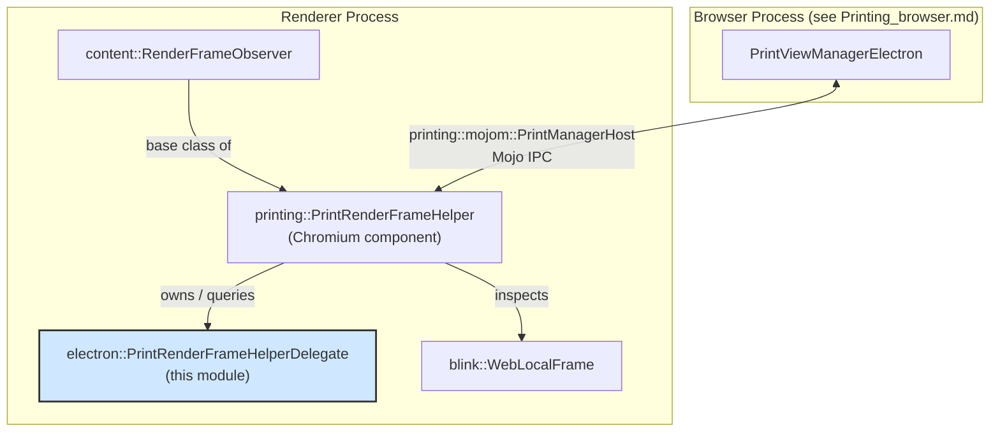
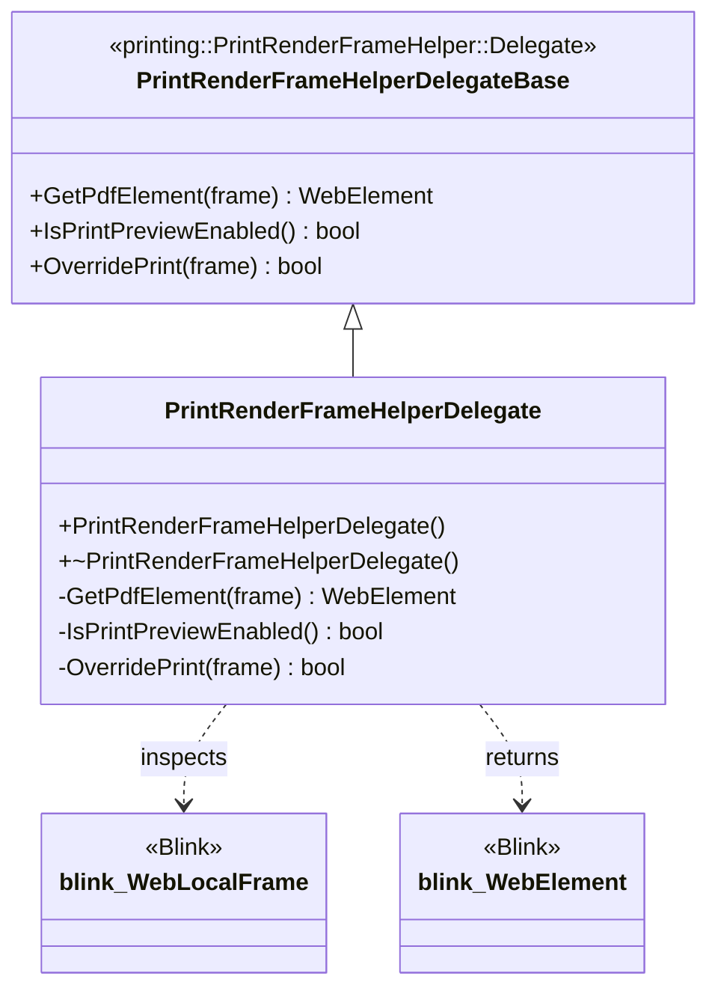
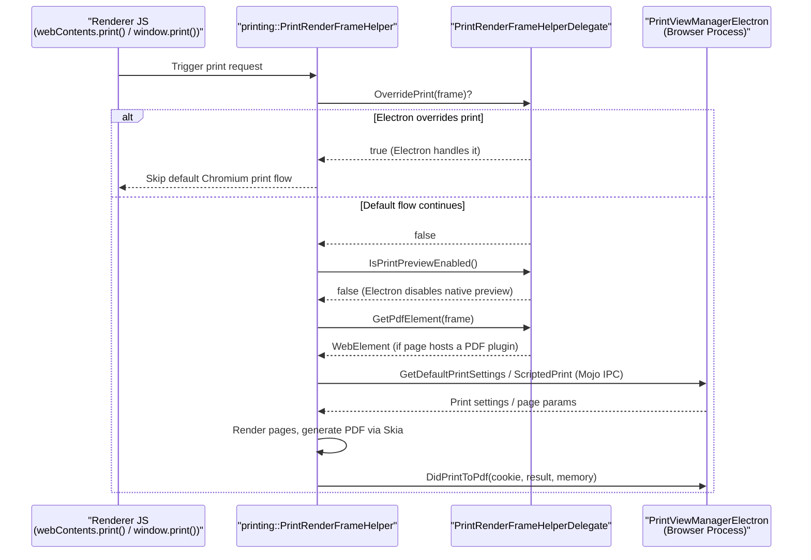
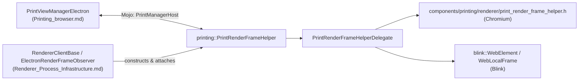

# Printing_renderer

## Introduction

The **Printing_renderer** module is the renderer-process counterpart of Electron's printing subsystem. It contains a single, focused component — `PrintRenderFrameHelperDelegate` — which customizes Chromium's `printing::PrintRenderFrameHelper` for use inside Electron's renderer process.

`PrintRenderFrameHelperDelegate` implements the `Delegate` interface expected by Chromium's shared printing code (`components/printing/renderer/print_render_frame_helper.h`), allowing Electron to plug into Chromium's existing print pipeline (page rendering, PDF generation, print preview) while overriding a small set of Electron-specific behaviors (such as disabling the built-in Print Preview UI and PDF plugin detection).

This module is intentionally minimal — most of the print-related heavy lifting (print settings, script-initiated printing, PDF conversion) happens on the browser side in the [Printing_browser](Printing_browser.md) module and inside Chromium's own `PrintRenderFrameHelper` class, which `PrintRenderFrameHelperDelegate` merely configures.

---

## 1. Purpose & Core Functionality

| Aspect | Description |
|---|---|
| **Role** | Renderer-side delegate that customizes Chromium's generic print-rendering helper for Electron. |
| **Scope** | Single class: `electron::PrintRenderFrameHelperDelegate`. |
| **Lifecycle** | Instantiated once per `RenderFrame` when printing support is wired into the renderer (see [Renderer_Process_Infrastructure](Renderer_Process_Infrastructure.md)). |
| **Key Responsibilities** | 1. Report whether a frame contains a PDF `<embed>`/plugin element (`GetPdfElement`).<br>2. Indicate whether Chromium's built-in Print Preview feature should be enabled (`IsPrintPreviewEnabled`).<br>3. Allow Electron to intercept/override the print flow before Chromium's default handling runs (`OverridePrint`). |

### Component Table

| Component | Type | Description |
|---|---|---|
| `PrintRenderFrameHelperDelegate` | C++ class | Implements `printing::PrintRenderFrameHelper::Delegate`. Non-copyable. Provides the three delegate hooks used by Chromium's shared printing renderer code. |

---

## 2. Architecture

`PrintRenderFrameHelperDelegate` does not implement printing logic itself. Instead, it is injected into Chromium's `printing::PrintRenderFrameHelper`, a `content::RenderFrameObserver` that Chromium attaches to every `RenderFrame` to handle print-related IPC/Mojo messages (`PrintManagerHost`, `PrintManager` mojom interfaces) coming from the browser process.



### Class Relationship



---

## 3. How It Fits Into the Overall System

Printing in Electron spans both the browser and renderer processes, mirroring the split used throughout Chromium:

* **Browser process** — [Printing_browser](Printing_browser.md) hosts `PrintViewManagerElectron`, which extends Chromium's `PrintViewManagerBase` and services the `printing::mojom::PrintManagerHost` Mojo interface (`GetDefaultPrintSettings`, `ScriptedPrint`, `RequestPrintPreview`, `DidPrintToPdf`, etc.). It is a `content::WebContentsUserData`, meaning there is one instance per `WebContents`.
* **Renderer process (this module)** — `PrintRenderFrameHelperDelegate` is attached to Chromium's `printing::PrintRenderFrameHelper`, which lives alongside each `RenderFrame` and communicates with `PrintViewManagerElectron` over the `PrintManagerHost` Mojo interface.



### Integration Points

| Related Module | Relationship |
|---|---|
| [Printing_browser](Printing_browser.md) | Browser-side peer that owns `PrintViewManagerElectron`; communicates with the renderer's `PrintRenderFrameHelper` (configured by this module's delegate) over Mojo. |
| [Renderer_Process_Infrastructure](Renderer_Process_Infrastructure.md) | Hosts renderer client classes (e.g., `ElectronRenderFrameObserver`, `RendererClientBase`) responsible for constructing and wiring up `PrintRenderFrameHelperDelegate` into a `RenderFrame`. |
| [WebContents_Rendering_and_Communication](WebContents_Rendering_and_Communication.md) *(parent grouping)* | The broader rendering/printing/OSR feature area that both `Printing_browser` and `Printing_renderer` belong to. |
| Chromium `components/printing/renderer` | Upstream code that defines `PrintRenderFrameHelper` and the `Delegate` interface implemented here; not part of Electron's own codebase. |

---

## 4. Component Details

### `PrintRenderFrameHelperDelegate`

```cpp
class PrintRenderFrameHelperDelegate
    : public printing::PrintRenderFrameHelper::Delegate {
 public:
  PrintRenderFrameHelperDelegate();
  ~PrintRenderFrameHelperDelegate() override;

  PrintRenderFrameHelperDelegate(const PrintRenderFrameHelperDelegate&) = delete;
  PrintRenderFrameHelperDelegate& operator=(const PrintRenderFrameHelperDelegate&) = delete;

 private:
  blink::WebElement GetPdfElement(blink::WebLocalFrame* frame) override;
  bool IsPrintPreviewEnabled() override;
  bool OverridePrint(blink::WebLocalFrame* frame) override;
};
```

**Method Semantics:**

| Method | Purpose |
|---|---|
| `GetPdfElement(frame)` | Returns the `blink::WebElement` corresponding to an embedded PDF viewer plugin within the given frame, if any. Used by Chromium's helper to decide whether to print the raw PDF stream directly instead of rasterizing HTML. |
| `IsPrintPreviewEnabled()` | Tells `PrintRenderFrameHelper` whether Chromium's native (Print Preview UI-driven) preview flow should be used. Electron typically disables this in favor of its own JS-driven printing APIs (`webContents.print()`, `webContents.printToPDF()`). |
| `OverridePrint(frame)` | Gives Electron the opportunity to intercept a print request entirely before Chromium's default handling proceeds — e.g., to route it through Electron's custom print APIs. |

**Design Notes:**
- The class is copy-disabled, consistent with Electron's convention for delegate/observer classes that are owned exclusively by a single `PrintRenderFrameHelper` instance.
- It contains no state; all logic resides in the three overridden virtual methods (implemented in the corresponding `.cc` file, not shown here).
- It depends on Blink types (`blink::WebElement`, `blink::WebLocalFrame`) and the Chromium-provided base class `printing::PrintRenderFrameHelper::Delegate`, both external to Electron's own component tree.

---

## 5. Dependency Summary



**External dependencies** (outside Electron's own module tree):
- `printing::PrintRenderFrameHelper` and its `Delegate` interface (Chromium `//components/printing`).
- Blink DOM/frame types (`blink::WebElement`, `blink::WebLocalFrame`).

**Internal dependencies** (within Electron's module tree):
- Paired at the browser-process level with `PrintViewManagerElectron` ([Printing_browser](Printing_browser.md)).
- Instantiated/attached as part of renderer bootstrap logic in [Renderer_Process_Infrastructure](Renderer_Process_Infrastructure.md).
