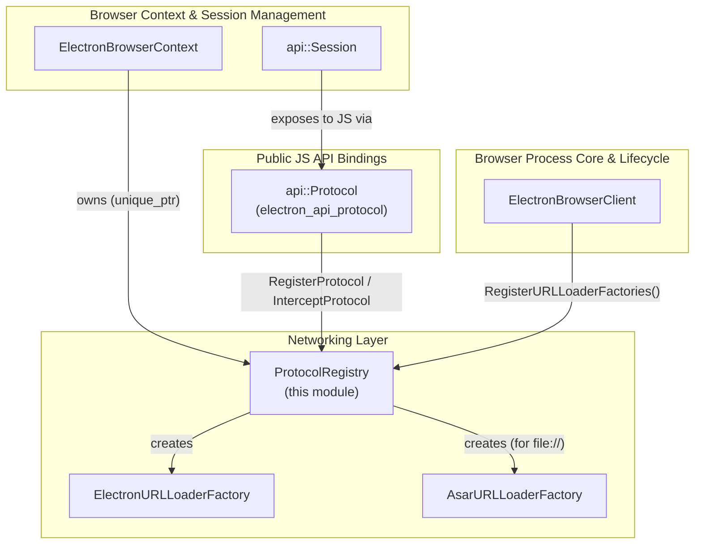
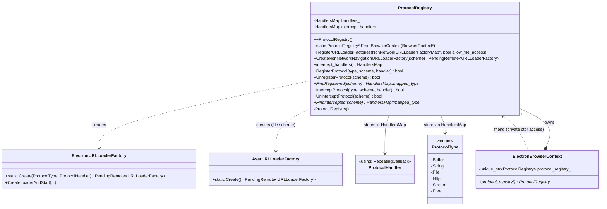
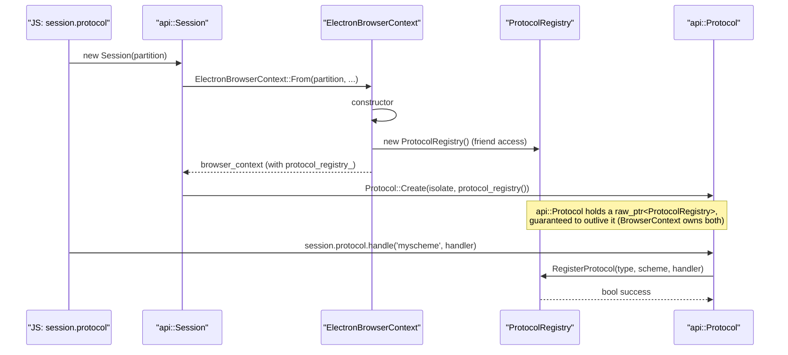
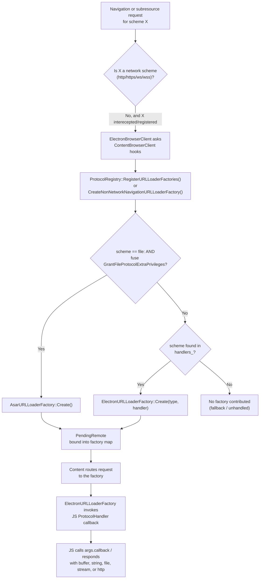
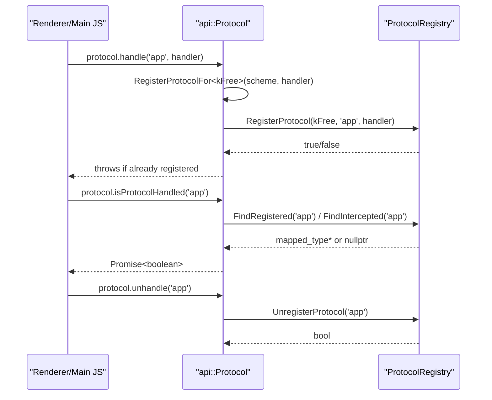
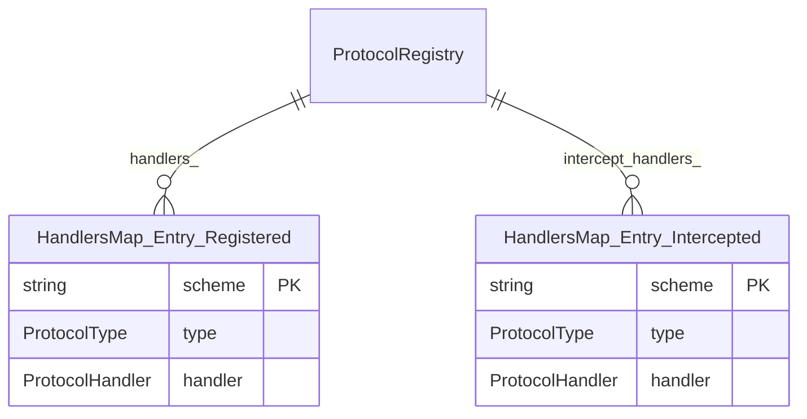

# Protocol Registry

## Introduction

The **Protocol Registry** module is the central bookkeeping component that powers Electron's custom-protocol (`protocol` module) system. It lives at `shell/browser/protocol_registry.{h,cc}` and is owned per-`BrowserContext` (i.e., per Electron `Session`). Its sole responsibility is to record which URL schemes have been **registered** or **intercepted** by JavaScript code, and to translate that bookkeeping into the Chromium `network::mojom::URLLoaderFactory` instances that the content layer needs in order to actually route network requests for those schemes.

In short, `ProtocolRegistry` is the glue between:

- the **public/renderer-facing JS API** (`protocol.registerSchemesAsPrivileged`, `protocol.handle`, `protocol.registerStringProtocol`, etc.) implemented by `api::Protocol` (part of the [Browser_Context_&_Session_Management](Browser_Context_%26_Session_Management.md) module), and
- the **Content/Network layer** integration performed inside `ElectronBrowserClient` (see [Browser_Process_Core_&_Lifecycle](Browser_Process_Core_%26_Lifecycle.md)) and `ElectronBrowserContext` (see [Browser_Context_&_Session_Management](Browser_Context_%26_Session_Management.md)), which asks the registry to populate `NonNetworkURLLoaderFactoryMap`s during navigation and subresource loading.

This document focuses on the `ProtocolRegistry` class itself: its data model, its lifecycle, and how it interacts with the surrounding networking and browser-context subsystems.

---

## Module Position in the System

`ProtocolRegistry` sits inside the broader **Networking Layer** area of Electron's native codebase, but its ownership and lifetime are tied to **Browser Context & Session Management**. It is deliberately small and stateless from a behavioral standpoint — it is essentially a pair of maps plus factory-creation glue code.

See [Browser_Context_&_Session_Management](Browser_Context_%26_Session_Management.md) for how `ElectronBrowserContext` and the `Session` API surface relate to `ProtocolRegistry`, and [Browser_Process_Core_&_Lifecycle](Browser_Process_Core_%26_Lifecycle.md) for how `ElectronBrowserClient` consumes it during navigation.

---

## Core Responsibilities

1. **Bookkeeping of custom schemes.** Maintains two `HandlersMap`s:
   - `handlers_` — schemes registered via `protocol.handle()` / `protocol.registerXProtocol()`.
   - `intercept_handlers_` — schemes *intercepted* via `protocol.interceptXProtocol()`, which override built-in (including `http`/`https`) scheme handling.
2. **Factory creation.** Converts a registered `(ProtocolType, ProtocolHandler)` pair into a live `network::mojom::URLLoaderFactory` (`ElectronURLLoaderFactory`) that Content can bind and use to service requests.
3. **`file://` / ASAR integration.** When the "grant file protocol extra privileges" fuse is enabled, it upgrades or injects an `AsarURLLoaderFactory` for the `file:` scheme so that reads from `.asar` archives are transparent.
4. **Per-BrowserContext singleton access.** Exposes `ProtocolRegistry::FromBrowserContext()` so any part of the browser process holding a `content::BrowserContext*` can reach the associated registry without needing to downcast manually.

---

## Class Structure

### Key Types

| Type | Defined in | Description |
|---|---|---|
| `ProtocolRegistry` | `shell/browser/protocol_registry.h` | The registry itself; core of this module. |
| `HandlersMap` | `shell/browser/net/electron_url_loader_factory.h` | `std::map<std::string, std::pair<ProtocolType, ProtocolHandler>>` — scheme → (type, handler). |
| `ProtocolType` | `shell/browser/net/electron_url_loader_factory.h` | Enum describing how a response should be produced (`kBuffer`, `kString`, `kFile`, `kHttp`, `kStream`, `kFree`). |
| `ProtocolHandler` | `shell/browser/net/electron_url_loader_factory.h` | `base::RepeatingCallback<void(const network::ResourceRequest&, StartLoadingCallback)>` — the JS-backed callback invoked per request. |
| `ElectronURLLoaderFactory` | `shell/browser/net/electron_url_loader_factory.h` | Concrete `network::mojom::URLLoaderFactory` created by the registry for each registered/intercepted scheme. See [Networking_Layer](Networking_Layer.md). |
| `AsarURLLoaderFactory` | `shell/browser/net/asar/asar_url_loader_factory.h` | Specialized factory for `file:` URLs that transparently resolves paths inside `.asar` archives. See [Networking_Layer](Networking_Layer.md). |

For full detail on `ElectronURLLoaderFactory` and other networking primitives (proxying, ASAR loading, DNS/proxy resolution), see [Networking_Layer](Networking_Layer.md).

---

## Ownership and Lifecycle

`ProtocolRegistry` has a **private constructor** and declares `ElectronBrowserContext` as a `friend class`, meaning only an `ElectronBrowserContext` can instantiate it. Each `ElectronBrowserContext` (i.e., each Electron `Session`) owns exactly one `ProtocolRegistry` via a `std::unique_ptr<ProtocolRegistry> protocol_registry_` member, and exposes it publicly through `ElectronBrowserContext::protocol_registry()`.

Because `ProtocolRegistry::FromBrowserContext()` simply performs a `static_cast<ElectronBrowserContext*>(context)->protocol_registry()`, callers throughout the browser process (e.g., `ElectronBrowserClient`, navigation throttles) never need to store a pointer to `ProtocolRegistry` themselves — they always look it up through the current `content::BrowserContext`.

---

## Registration vs. Interception

The registry keeps registration and interception as **two independent maps** with parallel APIs:

| Operation | Registration API | Interception API |
|---|---|---|
| Add | `RegisterProtocol(type, scheme, handler)` | `InterceptProtocol(type, scheme, handler)` |
| Remove | `UnregisterProtocol(scheme)` | `UninterceptProtocol(scheme)` |
| Lookup | `FindRegistered(scheme)` | `FindIntercepted(scheme)` |
| Backing store | `handlers_` | `intercept_handlers_` |

- **Registration** is used to add brand-new custom schemes (e.g., `app://`) that did not previously exist.
- **Interception** is used to override the behavior of *existing* schemes, including built-in ones such as `http:`/`https:`/`file:`, redirecting their traffic through a JS handler instead of the network stack.

Both operations use `std::map::try_emplace`, so calling `RegisterProtocol`/`InterceptProtocol` twice for the same scheme without unregistering first will **fail silently** (return `false`) rather than overwrite the existing entry — callers (see `api::Protocol` in [Browser_Context_&_Session_Management](Browser_Context_%26_Session_Management.md)) are responsible for translating this into a JS-visible error (`Error::kRegistered` / `Error::kIntercepted`).

---

## Interaction with the Content/Network Layer

The registry is not used directly to serve requests; instead, Content asks it — at well-defined points in the navigation/subresource loading lifecycle — to contribute non-network `URLLoaderFactory` instances.

### Two entry points from Content

1. **`RegisterURLLoaderFactories(factories, allow_file_access)`** — called (typically from `ElectronBrowserClient::RegisterNonNetworkSubresourceURLLoaderFactories` and similar hooks) to bulk-populate a `NonNetworkURLLoaderFactoryMap` with an entry for every registered scheme, plus special-cased `file:` handling.
2. **`CreateNonNetworkNavigationURLLoaderFactory(scheme)`** — called for a single scheme during **navigation** (as opposed to subresource loading), returning a single `PendingRemote<URLLoaderFactory>` for that scheme, or an empty remote if unhandled.

Both entry points funnel into the same handler storage (`handlers_`) and the same `ElectronURLLoaderFactory::Create` factory function — the "intercept" map (`intercept_handlers_`) is instead consulted by lower-level networking code (proxying factories/handlers) that decides whether to divert existing network traffic; see [Networking_Layer](Networking_Layer.md) for `ProxyingURLLoaderFactory` and related interception mechanics.

---

## Relationship to the JS `protocol` API

The `api::Protocol` gin-wrappable class (`shell/browser/api/electron_api_protocol.h`, part of [Browser_Context_&_Session_Management](Browser_Context_%26_Session_Management.md)) is the JS-facing wrapper exposed as `session.protocol`. It holds a `raw_ptr<ProtocolRegistry>` and forwards all mutating/query calls directly onto the registry:

Because `Protocol` only ever holds a non-owning `raw_ptr`, its comment explicitly notes that **the lifetime of `ProtocolRegistry` is guaranteed to be longer than the lifetime of this JS interface** — both are ultimately anchored to the same `ElectronBrowserContext`, and `Protocol` (like other `Session`-scoped JS wrappers) is torn down before or alongside the context.

---

## Data Model Details

- Keys are **scheme strings** (e.g., `"app"`, `"http"`), compared case-sensitively via `std::less<>` (heterogeneous lookup, enabling `std::string_view` lookups without allocation in `FindRegistered`/`FindIntercepted`).
- Values are `std::pair<ProtocolType, ProtocolHandler>` — the type tag determines which `ElectronURLLoaderFactory::StartLoading*` code path is used once a request arrives (buffer/string/file/http/stream/free-form).

---

## Fuses and Security Considerations

The `IsGrantFileProtocolExtraPrivilegesEnabled()` fuse check inside `RegisterURLLoaderFactories`/`CreateNonNetworkNavigationURLLoaderFactory` gates whether `file:` URLs get ASAR-aware handling. This is a build-time **fuse** (see Electron's `electron/fuses` system) rather than a runtime option, allowing app packagers to lock down file-protocol privilege elevation for security-hardened builds. When disabled, `file:` requests fall through to Chromium's default file loader untouched by this registry.

---

## Related Modules

- [Browser_Context_&_Session_Management](Browser_Context_%26_Session_Management.md) — owns `ProtocolRegistry` via `ElectronBrowserContext`; hosts the `api::Protocol` and `api::Session` JS bindings that drive registration/interception.
- [Networking_Layer](Networking_Layer.md) — sibling module containing `ElectronURLLoaderFactory`, `AsarURLLoaderFactory`, proxying factories (`ProxyingURLLoaderFactory`, `ProxyingWebSocket`), and DNS/proxy resolution helpers that the registry depends on or interacts with.
- [Browser_Process_Core_&_Lifecycle](Browser_Process_Core_%26_Lifecycle.md) — `ElectronBrowserClient` is the Content embedder hook that calls into `ProtocolRegistry` during navigation and subresource-loading factory setup.
- [Common_Native_Gin_Infrastructure](Common_Native_Gin_Infrastructure.md) — provides the `gin_helper` wrappable/constructible infrastructure used by `api::Protocol` to expose the registry's functionality to JavaScript.
