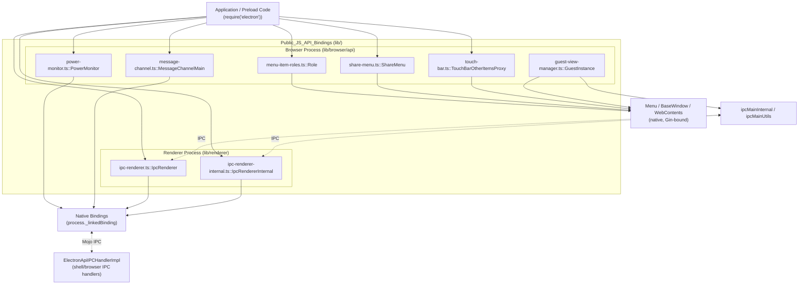
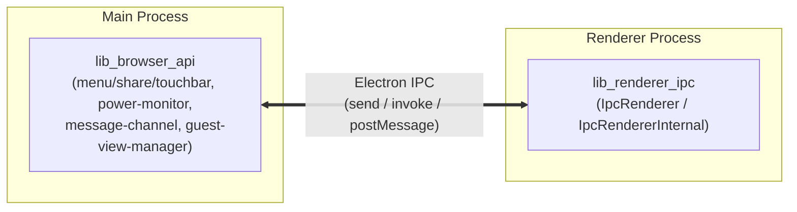

# `Public_JS_API_Bindings` — Public JavaScript API Bindings

## 1. Purpose

`Public_JS_API_Bindings` (rooted at `lib/`) is the **TypeScript layer** that constitutes the actual public `electron` module surface, plus the internal renderer-side IPC primitives that support it. It is the code developers interact with when they write `require('electron')` or `import { ... } from 'electron'`.

This module bridges two process contexts:

- **Browser process** (`lib/browser/api/*`, `lib/browser/guest-view-manager.ts`) — TypeScript wrappers that implement main-process-facing public APIs (menu roles, share menus, Touch Bar, power monitoring, `MessageChannelMain`) and orchestrate native bindings (`process._linkedBinding`) and other Electron classes (`Menu`, `BrowserWindow`, `WebContents`) into ergonomic developer-facing objects. It also implements the guest-view manager backing the legacy `<webview>` tag.
- **Renderer process** (`lib/renderer/api/ipc-renderer.ts`, `lib/renderer/ipc-renderer-internal.ts`) — thin `EventEmitter`-based facades over the native IPC transport, providing both the public `ipcRenderer` API and the privileged internal IPC channel used by Electron's own preload/renderer infrastructure.

Unlike the C++ `shell/browser/api/*` (Gin-bound) layer, everything in this module is pure TypeScript running inside Electron's Node.js-enabled JS environments (main process and renderer/isolate contexts), sitting directly on top of native bindings rather than exposing them via V8/Gin.

## 2. Architecture Overview

### Process boundary flow

## 3. Sub-modules

| Sub-module | Description | Core Components |
|---|---|---|
| **`lib_browser_api`** | Browser-process JS bindings: menu role behavior, share menu, Touch Bar, power monitoring, `MessageChannelMain`, and the guest-view manager for `<webview>`. | `menu-item-roles.ts::Role`, `share-menu.ts::ShareMenu`, `touch-bar.ts::TouchBarOtherItemsProxy`, `power-monitor.ts::PowerMonitor`, `message-channel.ts::MessageChannelMain`, `guest-view-manager.ts::GuestInstance` |
| ├─ `lib_browser_api_menu_and_sharing` | Menu role defaults, `ShareMenu`, Touch Bar item proxying | `menu-item-roles.ts::Role`, `share-menu.ts::ShareMenu`, `touch-bar.ts::TouchBarOtherItemsProxy` |
| ├─ `lib_browser_api_system_monitoring` | Lazy `EventEmitter` facade over native power-monitor binding | `power-monitor.ts::PowerMonitor` |
| └─ `lib_browser_api_messaging_and_guestviews` | Main-process `MessageChannel`/`MessagePort`, `<webview>` guest lifecycle & IPC | `message-channel.ts::MessageChannelMain`, `guest-view-manager.ts::GuestInstance` |
| **`lib_renderer_ipc`** | Renderer-side IPC facades: public `ipcRenderer` and internal-only `IpcRendererInternal`, both wrapping the native Mojo-backed IPC transport. | `ipc-renderer.ts::IpcRenderer`, `ipc-renderer-internal.ts::IpcRendererInternal` |

## 4. References to Core Components Documentation

- **[lib_browser_api](lib_browser_api.md)** — Browser-process API bindings overview
  - [lib_browser_api_menu_and_sharing](lib_browser_api_menu_and_sharing.md)
  - [lib_browser_api_system_monitoring](lib_browser_api_system_monitoring.md)
  - [lib_browser_api_messaging_and_guestviews](lib_browser_api_messaging_and_guestviews.md)
- **[lib_renderer_ipc](lib_renderer_ipc.md)** — Renderer IPC bindings (`IpcRenderer`, `IpcRendererInternal`)

### Related modules consumed by this module

- **Native window/menu system**: [shell_browser_api_window_ui](shell_browser_api_window_ui.md), [shell_browser_native_window](shell_browser_native_window.md)
- **WebContents & sessions**: [shell_browser_api_webcontents](shell_browser_api_webcontents.md), [shell_browser_api_session_net](shell_browser_api_session_net.md)
- **IPC transport (browser side)**: `shell_browser_ipc_handlers` (`ElectronApiIPCHandlerImpl`, `ElectronApiSWIPCHandlerImpl`) within [WebContents_Rendering_&_Communication](WebContents_Rendering_%26_Communication.md)
- **Native device/system bindings**: [shell_browser_api_system_device](shell_browser_api_system_device.md)
- **Gin/native plumbing for events and promises**: [Gin_Helper](Gin_Helper.md)
- **Preload/renderer bootstrap consumers of internal IPC**: [Renderer_Client](Renderer_Client.md), [Preload_Script](Preload_Script.md)

## 5. Key Design Patterns

- **Lazy native activation** — `PowerMonitor` defers calling into the native binding until a listener is actually registered.
- **Decorator-based reactive properties** — Touch Bar items use `@ImmutableProperty`/`@LiveProperty` decorators to bind class properties to native config and emit `change` events.
- **Stateless IPC facades with trust separation** — `IpcRenderer` (public, `internal=false`) and `IpcRendererInternal` (privileged, `internal=true`) share the same native transport but are physically distinct singleton classes, preventing trust-level spoofing from untrusted content.
- **IPC safety wrapper** — `guest-view-manager.ts`'s `makeSafeHandler` centralizes `webviewTag` feature checks before dispatching guest-view IPC.
- **Facade over native singletons** — `MessageChannelMain` and `PowerMonitor` wrap native binding objects behind conventional Node.js `EventEmitter`/class APIs.