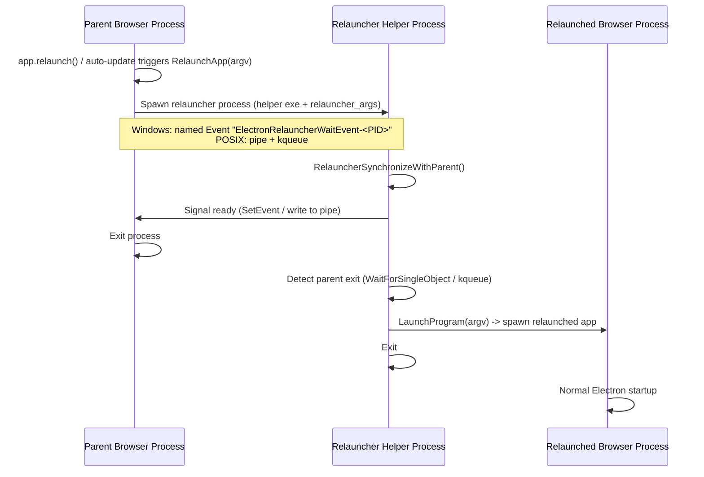
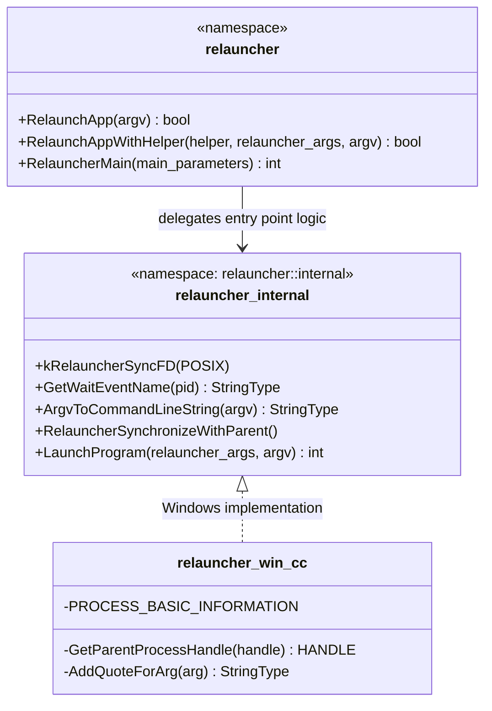
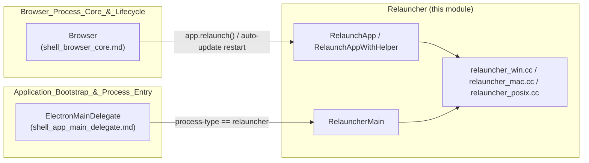

# Relauncher Module

## 1. Purpose

The **Relauncher** module implements Electron's cross-platform mechanism for **restarting the main browser application process** (e.g. in response to `app.relaunch()` from the JS API, or an auto-update installation). It solves a subtle process-lifecycle problem: a process cannot safely `exec()` a replacement for itself while also guaranteeing that exactly one instance of the application is ever visibly running (only one Dock icon on macOS, no flicker of two taskbar entries on Windows, etc.).

Instead of the parent process directly launching its replacement, Relauncher introduces an **intermediate "relauncher" helper process** that:

1. Is spawned by the parent process *before* the parent exits.
2. Synchronizes with the parent to know precisely when the parent has actually terminated (avoiding races with PID reuse).
3. Only then launches the new ("relaunched") instance of the application.

This module is a small, focused, platform-abstracted piece of the browser process implementation. It is compiled into the main Electron browser binary and is invoked by [Application_Bootstrap_&_Process_Entry](shell_app.md) during process startup dispatch, and used by the core [Browser](shell_browser_core.md) lifecycle object when the application needs to restart itself.

## 2. Architecture Overview

### 2.1 Component Map

| File | Core Component | Role |
|---|---|---|
| `shell/browser/relauncher.h` | `MainFunctionParams` (forward decl of `content::MainFunctionParams`) | Public, cross-platform API surface: `RelaunchApp`, `RelaunchAppWithHelper`, `RelauncherMain`, and the `internal` namespace helpers used by platform-specific `.cc` files. |
| `shell/browser/relauncher_win.cc` | `PROCESS_BASIC_INFORMATION` | Windows-specific implementation of the synchronization and launch primitives declared in `relauncher.h` (`RelauncherSynchronizeWithParent`, `LaunchProgram`, `GetWaitEventName`, `ArgvToCommandLineString`). |

> Note: Electron also ships POSIX/macOS relauncher implementations (`relauncher_mac.cc` / `relauncher_posix.cc`) which implement the same `relauncher::internal` interface using kqueue-based synchronization described in the header's comments. Only the Windows implementation is part of this module's core component set, but the architecture is symmetric across platforms.

### 2.2 High-Level Flow

### 2.3 API / Internal Structure

## 3. Core Components

### 3.1 `shell/browser/relauncher.h`

Defines the platform-agnostic public contract for the relauncher subsystem:

- **`bool RelaunchApp(const StringVector& argv)`** — Convenience entry point used by the rest of Electron (e.g. `Browser::Relaunch`/`app.relaunch()` plumbing) to restart the application using the helper executable bundled with the currently running instance.
- **`bool RelaunchAppWithHelper(const base::FilePath& helper, const StringVector& relauncher_args, const StringVector& argv)`** — Lower-level variant allowing an explicit relauncher helper binary path and extra arguments to be passed to the relauncher process itself. Used when relaunching a *different* installed copy of the app (same version) from a custom location.
- **`int RelauncherMain(const content::MainFunctionParams& main_parameters)`** — The actual `main()`-equivalent entry point invoked when the current process **is** the spawned relauncher helper (dispatched from `ContentMainDelegate`/`ElectronMainDelegate`, see [Application_Bootstrap_&_Process_Entry / shell_app_main_delegate](shell_app_main_delegate.md)). `MainFunctionParams` is a forward-declared `content::MainFunctionParams` struct supplied by the Chromium content layer describing how the process was launched.
- **`namespace internal`** — Platform-specific building blocks that each platform `.cc` file (`relauncher_win.cc`, `relauncher_mac.cc`, `relauncher_posix.cc`) must implement:
  - `kRelauncherSyncFD` (POSIX only) — the fixed file descriptor number used for the parent/relauncher synchronization pipe.
  - `RelauncherSynchronizeWithParent()` — blocks until the parent process has verifiably exited.
  - `LaunchProgram(relauncher_args, argv)` — actually spawns the replacement application process.
  - `GetWaitEventName(pid)` / `ArgvToCommandLineString(argv)` (Windows only) — Windows-specific helpers for named synchronization objects and command-line construction.

### 3.2 `shell/browser/relauncher_win.cc`

The Windows implementation of the `relauncher::internal` contract:

- **`PROCESS_BASIC_INFORMATION`** — A local redefinition of the internal NT structure (mirroring `ntdll`'s undocumented layout) used together with `sandbox::win`'s NT internals to inspect process information when locating the parent process.
- **`GetParentProcessHandle(base::ProcessHandle handle)`** — Resolves the current process's parent PID (via `base::GetParentProcessId`) and opens a handle to it with `PROCESS_ALL_ACCESS`, which is later used to wait for parent termination.
- **`AddQuoteForArg` / `ArgvToCommandLineString`** — Implements Windows command-line quoting rules (matching `CommandLineToArgvW` semantics) to safely rebuild a single command-line string from an argv-style vector, since Windows process creation APIs take a flat command line rather than an argv array.
- **`GetWaitEventName(base::ProcessId pid)`** — Produces a well-known named-event string `ElectronRelauncherWaitEvent-<pid>` that both the parent and the relauncher process agree upon to coordinate handoff, since Windows has no `kqueue`-style equivalent.
- **`RelauncherSynchronizeWithParent()`** — Windows synchronization implementation:
  1. Opens a handle to the parent process.
  2. Creates/signals the named wait `Event` so the parent knows the relauncher is ready and can safely exit.
  3. Blocks with `WaitForSingleObject(parent_process, INFINITE)` until the parent process handle is signaled (i.e., the parent has terminated).
- **`LaunchProgram(relauncher_args, argv)`** — Builds the final command line via `ArgvToCommandLineString` and calls `base::LaunchProcess` to start the relaunched application, returning `0` on success and `1` on failure.

## 4. Relationship to Other Modules

- **[Application_Bootstrap_&_Process_Entry](shell_app_main_delegate.md)**: `ElectronMainDelegate` dispatches to `relauncher::RelauncherMain` when Chromium's content layer determines the current process was launched as the relauncher helper (based on the `--type=relauncher`-style process-type switch on the command line).
- **[Browser_Process_Core_&_Lifecycle](shell_browser_core.md)**: The `Browser` singleton (and by extension the JS-exposed `app` object, see [System_&_App-Level_Services_API](shell_browser_api_system_device.md)) calls into `relauncher::RelaunchApp`/`RelaunchAppWithHelper` to implement `app.relaunch()` and self-update restarts, e.g. in conjunction with [`AutoUpdater`](shell_browser_core.md).
- **Platform-Specific Integration**: The per-platform relauncher `.cc` files complement other platform glue documented in [Platform-Specific_Integration](Platform-Specific_Integration.md) (e.g. Windows `ScopedHString`, macOS bundle helpers), though the relauncher's platform files are kept within this module because they share a single cross-platform header contract.

## 5. Design Notes & Rationale

- **Why not just `exec()`?** A direct in-place re-exec would still leave a short window where the OS considers only one process, but on macOS specifically, Dock/Launch Services icon identity is tied to process launch semantics that don't tolerate a live process disappearing and reappearing under a new PID cleanly — hence the dedicated helper hop.
- **Why an intermediate process at all (as opposed to parent launching child directly, then exiting)?** Launching the child from the parent and then exiting immediately still risks two visible app instances momentarily overlapping, and doesn't guarantee ordering. The relauncher's synchronization handshake (event/pipe + wait) deterministically sequences: *relauncher ready → parent free to exit → relauncher detects exit → new instance launched*.
- **Platform abstraction boundary**: The header only exposes primitive hooks (`RelauncherSynchronizeWithParent`, `LaunchProgram`, naming helpers) — all OS-specific synchronization primitives (kqueue on POSIX/macOS, named `Event` + `WaitForSingleObject` on Windows) are isolated in the platform `.cc` files, keeping `RelaunchApp`/`RelaunchAppWithHelper`/`RelauncherMain` entirely platform-independent.
