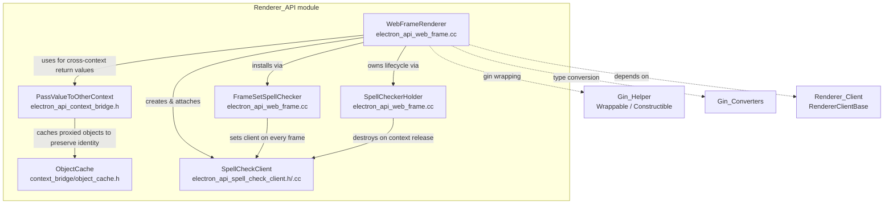
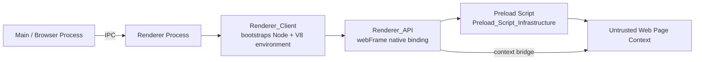

# Renderer_API Module

## Introduction

The **Renderer_API** module implements the native (C++) bindings that live inside Electron's **renderer process** and are exposed to the sandboxed JavaScript/V8 world through Node's `NODE_LINKED_BINDING_CONTEXT_AWARE` mechanism. It is the low-level engine behind the public `webFrame` and `contextBridge` renderer-facing JavaScript APIs (see [Public_JS_API_Bindings](Public_JS_API_Bindings.md) for the higher-level `ipcRenderer` JS surface).

Concretely, this module provides:

1. **Context Bridge machinery** — safely cloning/proxying JavaScript values (including functions and objects) across the isolated "main world" and "isolated world" V8 contexts that Electron uses to separate preload scripts from untrusted page code.
2. **Spell-checking integration** — a `blink::WebTextCheckClient` implementation that intercepts Blink's native spell-check requests and delegates the actual dictionary lookup to a JavaScript-supplied callback (typically Electron's `session.setSpellCheckerLanguages` / `webFrame.setSpellCheckProvider` plumbing).
3. **WebFrame native binding** (`electron_api_web_frame.cc`) — the central `WebFrameRenderer` gin-wrappable class that ties the above together and exposes frame-level operations (`executeJavaScript`, `insertCSS`, zoom control, isolated-world script execution, frame navigation helpers, etc.) to JavaScript.

This module is a child of the broader [Renderer_Process_Infrastructure](Renderer_Client.md) area, sitting alongside [Renderer_Client](Renderer_Client.md) (process bootstrap / `RendererClientBase`) and [Renderer_Extensions](Renderer_Extensions.md) (Chromium extensions support in the renderer). It depends heavily on the shared native/V8 binding infrastructure documented in [Gin_Helper](Gin_Helper.md) and [Gin_Converters](Gin_Converters.md), both part of the [Common_Native_Gin_Infrastructure](Common_Native_Gin_Infrastructure.md) module.

## Architecture Overview

### How it fits into Electron's process model

The renderer process is bootstrapped by components documented in [Renderer_Client](Renderer_Client.md) (`ElectronRendererClient`, `ElectronSandboxedRendererClient`, `WebWorkerObserver`), which set up the Node.js/V8 environment (see [Node_Bindings](Node_Bindings.md) and [V8_Node_Common_Utils](V8_Node_Common_Utils.md)). Once the environment is ready, this module's `Initialize()` entry point registers the `WebFrame` native binding that the JS-side `lib/renderer/api/web-frame.ts` wraps. Preload scripts (see [Preload_Script_Infrastructure](Preload_Script.md)) use the context bridge primitives from this module to safely expose APIs from the isolated world into the page's main world.

## Sub-modules

Since Renderer_API is a small, single-purpose module (one primary source directory with a handful of tightly-coupled files), it is documented in two focused parts:

| Sub-module | Description | Doc |
|---|---|---|
| **Context Bridge & Value Marshalling** | The `PassValueToOtherContext` API and its supporting `ObjectCache`, used to safely clone/proxy JS values (objects, functions, arrays) between the isolated world and the main world without breaking security boundaries. | [Renderer_API_context_bridge.md](Renderer_API_context_bridge.md) |
| **WebFrame Binding & Spell Check** | The `WebFrameRenderer` gin-wrappable class exposing frame operations to JS, plus the `SpellCheckClient`/`SpellCheckerHolder`/`FrameSetSpellChecker` machinery that bridges Blink's native spellchecker hooks to JavaScript-implemented dictionaries. | [Renderer_API_webframe_spellcheck.md](Renderer_API_webframe_spellcheck.md) |

## Key Design Notes

- **Security boundary enforcement**: The context bridge code is explicitly designed to prevent prototype pollution and identity confusion attacks when passing values between isolated worlds — see `BridgeErrorTarget` handling and the `ObjectCache`'s `v8::Local`-to-`v8::Local` mapping (valid only within a single `HandleScope`).
- **Gin-based native bindings**: `WebFrameRenderer` uses the shared `gin_helper::DeprecatedWrappable` / `gin_helper::Constructible` mixins (documented in [Gin_Helper](Gin_Helper.md)) to expose C++ methods as JS object methods/properties via `ObjectTemplateBuilder`.
- **Per-RenderFrame lifecycle**: Spell-check state is tied to the lifetime of a `content::RenderFrame`/its V8 context; `SpellCheckerHolder` observes `WillReleaseScriptContext` to guarantee cleanup, avoiding dangling native spellcheck clients.
- **NODE_LINKED_BINDING_CONTEXT_AWARE**: The module registers itself as a context-aware Node binding (`electron_renderer_web_frame`), consistent with other native bindings across Electron documented in [Common_API](Common_API.md).

## Related Modules

- [Renderer_Client](Renderer_Client.md) — renderer process bootstrap, `RendererClientBase`, autofill agent, and content-settings observer that this module's `WebFrameRenderer` calls into (e.g., `AllowGuestViewElementDefinition`, `GetSpellCheck()`).
- [Renderer_Extensions](Renderer_Extensions.md) — Chromium extensions support within the renderer process.
- [Gin_Helper](Gin_Helper.md) / [Gin_Converters](Gin_Converters.md) — shared V8/gin binding infrastructure used throughout this module.
- [Preload_Script](Preload_Script.md) / [Preload_ServiceWorker_(Renderer)](Preload_ServiceWorker_(Renderer).md) — consumers of the context bridge primitives defined here.
- [Public_JS_API_Bindings](Public_JS_API_Bindings.md) — TypeScript-level `ipcRenderer` API that complements this module's native `webFrame` binding on the JS side.
