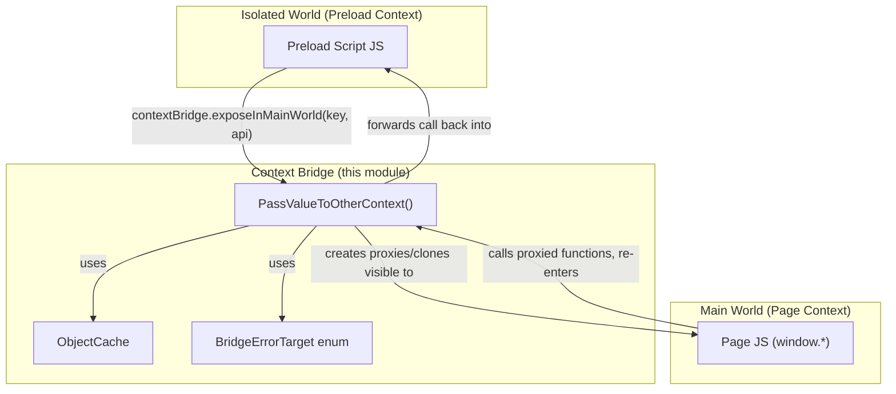
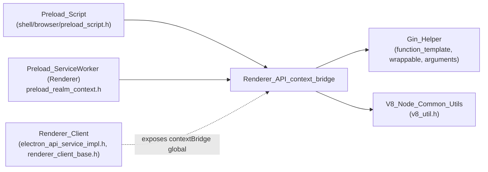
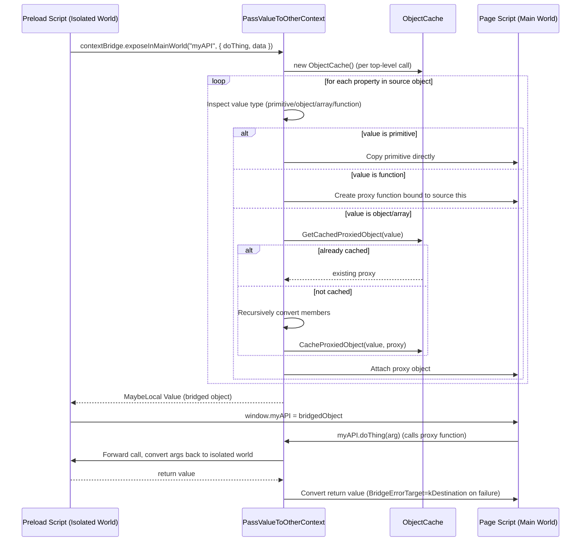
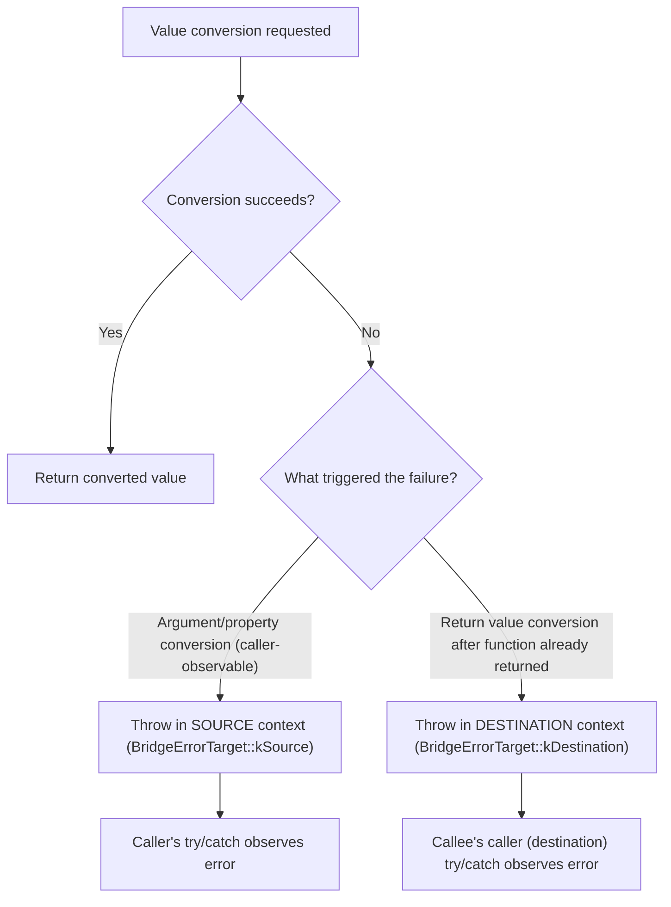
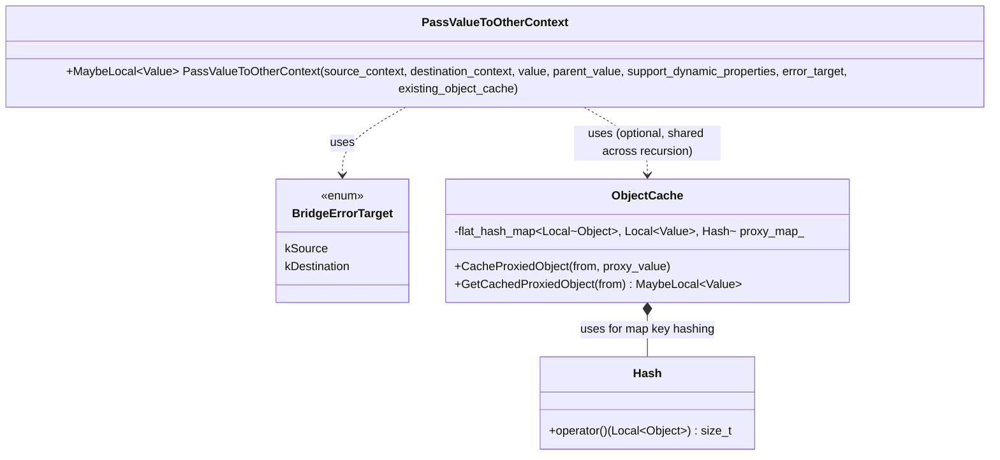

# Renderer API: Context Bridge

## Introduction

The **Context Bridge** module is the security-critical mechanism that allows Electron's preload scripts to safely expose JavaScript APIs from the *isolated world* (where preload scripts run) to the *main world* (where the actual web page's JavaScript executes), and vice versa. It implements the native (C++) backing for the `contextBridge.exposeInMainWorld()` renderer API.

Because the isolated world and the main world are distinct V8 `Context`s (each with its own global object, prototypes, and built-ins), a JavaScript value created in one context cannot simply be handed to the other — doing so naively would leak privileged capabilities to untrusted web content or break V8's security invariants. This module solves that problem by **deep-cloning/proxying values across V8 contexts**, converting objects, functions, arrays, and primitives into equivalent constructs that are safe and functional in the destination context, while preserving object identity for cyclic/graph-like structures via an object cache.

This module lives inside the broader `Renderer API` area of the codebase, specifically under `shell/renderer/api/`, and is a sibling of the [Renderer_API_webframe_spellcheck](Renderer_API_webframe_spellcheck.md) module (web frame and spellchecking APIs). It depends heavily on the [Gin_Helper](Gin_Helper_argument_callback_binding.md) infrastructure for V8/JS interop plumbing and is invoked as part of preload script execution (see [Preload_Script](Preload_Script.md) and [Preload_ServiceWorker_(Renderer)](Preload_ServiceWorker_%28Renderer%29.md)).

---

## Purpose & Core Functionality

| Concern | Description |
|---|---|
| **Cross-context value transfer** | Safely pass values (primitives, objects, arrays, functions, errors, promises) between the isolated (preload) V8 context and the main (page) V8 context. |
| **Proxying** | Objects and functions are not copied by reference across contexts; instead, proxy objects/functions are created in the destination context that forward property access and function calls back to the source context. |
| **Identity preservation** | The `ObjectCache` ensures that if the same source object is encountered multiple times during a single bridging operation (e.g., cyclic references, shared sub-objects), the same destination proxy is reused instead of creating duplicates. |
| **Error handling target selection** | Because a bridged function call can fail either synchronously (in the calling/source context) or in a way only observable in the destination context (e.g., converting a return value after the call has completed), the module tracks which context should "own" a thrown error (`BridgeErrorTarget`). |
| **Dynamic property support** | Optionally supports "dynamic properties," i.e., allowing getters/setters to be proxied live rather than snapshotted once. |

### Key Components

#### `PassValueToOtherContext` (declared in `electron_api_context_bridge.h`)
The central entry point of the module. Given a `source_context`, a `destination_context`, and a `value` living in the source context, it returns a `v8::MaybeLocal<v8::Value>` representing the equivalent value usable in the destination context.

```cpp
v8::MaybeLocal<v8::Value> PassValueToOtherContext(
    v8::Local<v8::Context> source_context,
    v8::Local<v8::Context> destination_context,
    v8::Local<v8::Value> value,
    v8::Local<v8::Value> parent_value,
    bool support_dynamic_properties,
    BridgeErrorTarget error_target,
    context_bridge::ObjectCache* existing_object_cache = nullptr);
```

Responsibilities:
- Recursively walks the input `value` (arrays/objects) and converts each member.
- For **functions**, wraps them in a proxy function object bound to the correct default `this` (using `parent_value` to determine the appropriate binding context when the function is nested inside a bridged object tree).
- For **objects**, either deep-copies plain data or creates a property-forwarding proxy, depending on `support_dynamic_properties`.
- Accepts an `existing_object_cache` so that recursive/nested calls across a single top-level bridging operation share the same cache (preventing infinite loops on circular references and preserving reference equality within one call).

#### `BridgeErrorTarget` (enum, in `electron_api_context_bridge.h`)
Determines **which V8 context should own/throw an exception** produced during bridging:

- `kSource` (default): The calling context receives the thrown error — appropriate for the vast majority of conversion failures, since the caller initiated the bridging.
- `kDestination`: Used only when converting a **return value** of a bridged function call after control has already returned to the caller; in that case, only the destination context can meaningfully catch the resulting error.

#### `ObjectCache` (in `context_bridge/object_cache.h`)
A lightweight `v8::Local`-to-`v8::Local` cache mapping a source object to its already-created destination proxy.

```cpp
class ObjectCache final {
 public:
  void CacheProxiedObject(v8::Local<v8::Value> from,
                          v8::Local<v8::Value> proxy_value);
  v8::MaybeLocal<v8::Value> GetCachedProxiedObject(
      v8::Local<v8::Value> from) const;

 private:
  struct Hash {
    std::size_t operator()(const v8::Local<v8::Object>& obj) const {
      return obj->GetIdentityHash();
    }
  };
  absl::flat_hash_map<v8::Local<v8::Object>, v8::Local<v8::Value>, Hash>
      proxy_map_;
};
```

- **`Hash`**: Custom hashing functor using V8's `GetIdentityHash()` so that `v8::Local<v8::Object>` handles pointing at the same underlying object hash identically, enabling use as a `flat_hash_map` key.
- **Lifetime constraint**: Because it stores raw `v8::Local` handles, an `ObjectCache` instance **must be destroyed before the enclosing `v8::HandleScope`** — it is designed to live only for the duration of a single top-level `PassValueToOtherContext` call tree, not to be cached long-term.

---

## Architecture



### Relationship to Preload Infrastructure



- **[Preload_Script](Preload_Script.md)** and **[Preload_ServiceWorker_(Renderer)](Preload_ServiceWorker_%28Renderer%29.md)**: Define how/when preload scripts execute and set up the isolated world; the context bridge is the tool those scripts use to communicate outward.
- **[Gin_Helper_argument_callback_binding](Gin_Helper_argument_callback_binding.md)**: Supplies `gin_helper::Arguments`, callback/function-template machinery (`function_template.h`, `callback.h`) used to build native-backed proxy functions exposed across the bridge.
- **[V8_Node_Common_Utils](V8_Node_Common_Utils.md)**: Utilities such as `v8_util.h` (`CloneableMessage`) which assist with structured-clone-like semantics for certain value types.
- **[Renderer_Client](Renderer_Client.md)**: Hosts the renderer-side service (`ElectronApiServiceImpl`, `RendererClientBase`) that ultimately registers the `contextBridge` binding accessible from preload JS.

---

## Data Flow: Exposing an API to the Main World



---

## Error Handling Flow



---

## Component Interaction Summary



---

## Design Notes & Constraints

1. **No long-lived caching**: `ObjectCache` is explicitly scoped to a single bridging call tree and must not outlive the active `v8::HandleScope`, since it stores bare `v8::Local` handles rather than persistent handles.
2. **`parent_value` binding**: When bridging a function that is a property deep within an object tree, `parent_value` lets the bridge bind the proxy function's `this` to the correct originating object rather than defaulting to `undefined` or the global object — mirroring natural JS method-call semantics (`obj.method()`).
3. **Security boundary**: This module is a primary contributor to Electron's context-isolation security model (`contextIsolation: true`). Bugs here can lead to "context bridge leaks," where main-world script gains access to privileged Node.js/Electron APIs. Any modification should be reviewed with this threat model in mind.
4. **Dependency on Gin**: The module builds directly on Chromium's `gin` V8 binding library (via [Gin_Helper](Gin_Helper_argument_callback_binding.md)) for argument marshaling and native function template creation, rather than reimplementing V8 interop primitives.

---

## Related Modules

- [Preload_Script](Preload_Script.md) — Defines preload script registration/execution that consumes this bridge.
- [Preload_ServiceWorker_(Renderer)](Preload_ServiceWorker_%28Renderer%29.md) — Service-worker-scoped preload context, another consumer of context bridging.
- [Gin_Helper_argument_callback_binding](Gin_Helper_argument_callback_binding.md) — Argument parsing and native callback/function-template infrastructure used to build proxy functions.
- [Gin_Helper_events_promises](Gin_Helper_events_promises.md) — Promise and event helper utilities relevant when bridging asynchronous return values.
- [V8_Node_Common_Utils](V8_Node_Common_Utils.md) — Shared V8/Node utilities (e.g., cloneable messages) used alongside context bridging.
- [Renderer_Client](Renderer_Client.md) — Hosts the renderer-side service objects that wire up the `contextBridge` global available to preload scripts.
- [Renderer_API_webframe_spellcheck](Renderer_API_webframe_spellcheck.md) — Sibling renderer API module (web frame manipulation & spellchecking) within `shell/renderer/api/`.
