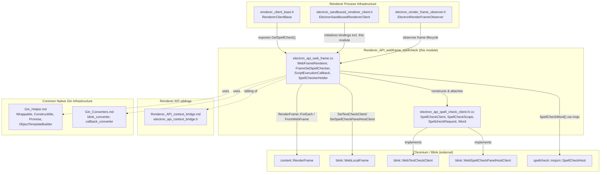
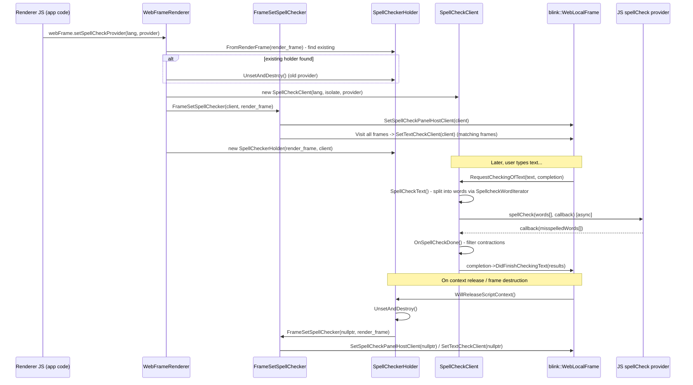
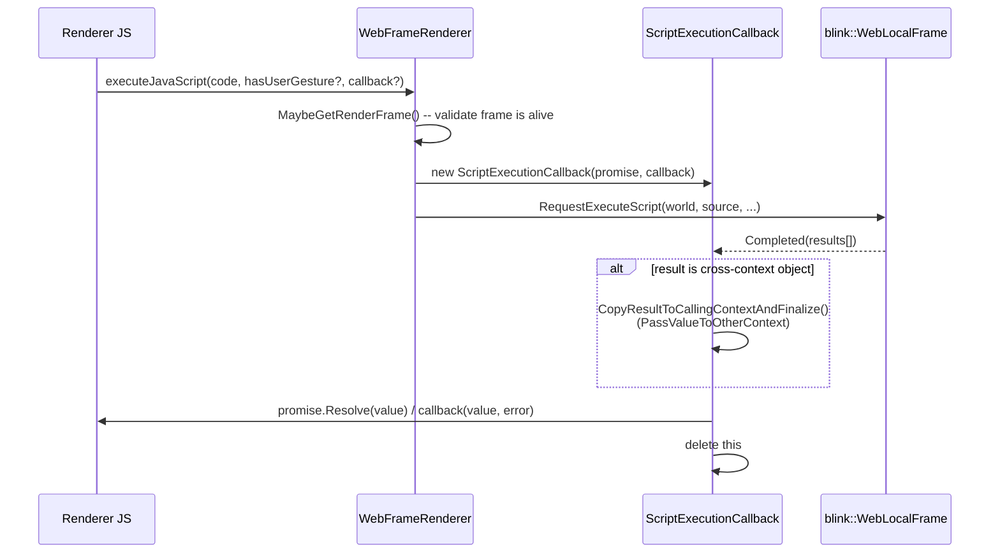
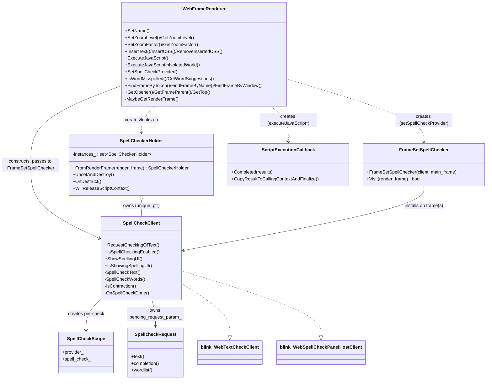

# Renderer API: WebFrame & Spellcheck

## Introduction

This module implements two tightly-coupled pieces of Electron's **renderer process** JavaScript API surface:

1. **`webFrame` native binding** (`shell/renderer/api/electron_api_web_frame.cc`) — exposes a `WebFrame` object (and a singleton `mainFrame`) to renderer-process JavaScript, allowing scripts to manipulate zoom, insert CSS/text, execute JavaScript in the main or isolated worlds, navigate the frame tree, and query web preferences.
2. **Custom spellchecking bridge** (`electron_api_spell_check_client.h/.cc`) — bridges Blink's native `WebTextCheckClient`/`WebSpellCheckPanelHostClient` interfaces to a JavaScript-supplied spellcheck provider (typically implemented on top of Chromium's `SpellCheck` component), enabling Electron apps to supply custom or platform spellcheck logic via `webFrame.setSpellCheckProvider()`.

The two pieces interact directly: `webFrame.setSpellCheckProvider()` (implemented in `electron_api_web_frame.cc`) constructs a `SpellCheckClient` and wires it into Blink via the `FrameSetSpellChecker` visitor, installing the client as the text-check and spelling-UI host client for the frame (and, in non-sandboxed same-process scenarios, for all live frames).

This module is a child of the **Renderer API** grouping and is a sibling of the **Context Bridge** submodule. It depends on and is invoked by the broader **Renderer Process Infrastructure** (renderer client base, sandboxed renderer client) and on shared **Gin Helper** / **Gin Converters** infrastructure for V8/Blink interop.

---

## Module Position in the System

---

## Component Breakdown

### 1. `electron_api_web_frame.cc` — `webFrame` Native Binding

This translation unit implements the Node linked binding `electron_renderer_web_frame`, which registers a `WebFrame` constructor and a `mainFrame` singleton object on the renderer-side `webFrame` module.

| Component | Responsibility |
|---|---|
| `WebFrameRenderer` | The gin-wrapped JS-facing class exposing all `webFrame`/frame-instance methods (zoom, CSS/text insertion, script execution, isolated worlds, frame-tree navigation, spellcheck query/config). |
| `FrameSetSpellChecker` | A `content::RenderFrameVisitor` that walks all live render frames (via `content::RenderFrame::ForEach`) and, for frames matching the target main frame, installs/uninstalls the `SpellCheckClient` as the frame's `WebTextCheckClient`. Also directly sets the `WebSpellCheckPanelHostClient` on the target main frame. |
| `SpellCheckerHolder` | A `content::RenderFrameObserver` that owns the lifetime of a `SpellCheckClient` for a given `RenderFrame`, ensuring it is torn down (via `FrameSetSpellChecker(nullptr, ...)`) when the script context is released or the frame is destroyed. Tracks all live instances in a static registry (`FromRenderFrame`) so a previous provider can be replaced. |
| `ScriptExecutionCallback` | Bridges Blink's `RequestExecuteScript` callback (list of per-frame results) to a `gin_helper::Promise`/optional completion callback, handling cross-context value cloning via `PassValueToOtherContext`. |
| `SpellCheckWord` (free function, `ENABLE_BUILTIN_SPELLCHECKER` only) | Calls into the Chromium `SpellCheck` component (obtained from `RendererClientBase::GetSpellCheck()`) using a `spellcheck::mojom::SpellCheckHost` remote to check a single word and optionally collect suggestions. Backs `isWordMisspelled`/`getWordSuggestions`. |

Key exposed JS API surface (via `FillObjectTemplate`):

- **Zoom**: `setZoomLevel`, `getZoomLevel`, `setZoomFactor`, `getZoomFactor`, `setVisualZoomLevelLimits`
- **Content manipulation**: `insertText`, `insertCSS`, `removeInsertedCSS`
- **Script execution**: `executeJavaScript`, `executeJavaScriptInIsolatedWorld`, `setIsolatedWorldInfo`, `_isEvalAllowed`
- **Spellcheck**: `setSpellCheckProvider`, `isWordMisspelled`, `getWordSuggestions`
- **Frame tree navigation**: `findFrameByToken`, `findFrameByName`, `_findFrameByWindow`, `getFrameForSelector`, and properties `frameToken`, `opener`, `parent`, `top`, `firstChild`, `nextSibling`
- **Diagnostics**: `getResourceUsage`, `clearCache`, `getWebPreference`

### 2. `electron_api_spell_check_client.h/.cc` — JS-backed Spellcheck Client

Implements `SpellCheckClient`, which adapts Blink's native spellchecking hooks to a JavaScript callback supplied by app code (e.g. Electron's built-in `SpellCheckProvider` on top of Hunspell, or a custom implementation).

| Component | Responsibility |
|---|---|
| `SpellCheckClient` | Implements `blink::WebTextCheckClient::RequestCheckingOfText` and `blink::WebSpellCheckPanelHostClient`. Holds persistent V8 handles to the JS `provider` object and its `spellCheck` method. Splits incoming text into words/contractions using `SpellcheckWordIterator`, then invokes the JS `spellCheck` callback asynchronously. |
| `SpellCheckScope` | RAII helper establishing a `v8::HandleScope` + `v8::Context::Scope` and resolving `Local` handles to the provider/spellCheck function for the duration of a spellcheck call. |
| `SpellcheckRequest` (nested private class) | Holds the pending text, the resulting `Word` list, and Blink's `WebTextCheckingCompletion` callback for a single in-flight check request; ensures only one request is in flight at a time (a new request cancels the previous one). |
| `Word` (in `.cc`) | Plain aggregate pairing a `blink::WebTextCheckingResult` (offset/length) with the raw word text and any contraction sub-words. |
| `IsContraction` | Fallback logic recognizing compound words (e.g. `"in'n'out"`) as correctly spelled if all sub-words are valid, even if the full compound isn't in the dictionary. |
| `OnSpellCheckDone` | Callback invoked from JS with the list of misspelled words; filters the pending word list (accounting for contractions) and completes the Blink request via `DidFinishCheckingText`. |

---

## Data Flow: Setting and Using a Spellcheck Provider

---

## Data Flow: Script Execution (`executeJavaScript*`)

---

## Component Relationship Diagram

---

## Key Design Points

- **Frame-scoped, self-managing lifetime**: `SpellCheckerHolder` is a `content::RenderFrameObserver` that self-deletes on `OnDestruct()` or `WillReleaseScriptContext()`, ensuring the `SpellCheckClient` (which holds V8 global handles into a specific script context) never outlives its context. Calling `setSpellCheckProvider` again safely tears down and replaces the previous holder/client pair.
- **Single in-flight spellcheck request**: `SpellCheckClient` only tracks one `SpellcheckRequest` at a time; a new request from Blink cancels the previous one via `DidCancelCheckingText()`.
- **Async round-trip to JS**: Actual misspelling determination is delegated entirely to the JS-side `spellCheck` callback provided to `setSpellCheckProvider`; native code only handles word segmentation (via `SpellcheckWordIterator`) and contraction handling.
- **Cross-context safety for script execution**: `ScriptExecutionCallback` explicitly detects when a script result object belongs to a different V8 context (e.g. isolated world vs. main world) and clones it via `PassValueToOtherContext` (from the Context Bridge submodule) before resolving the promise/callback in the caller's context.
- **Conditional compilation**: Spellcheck query methods (`isWordMisspelled`, `getWordSuggestions`) and the underlying `SpellCheckWord` helper are gated behind `BUILDFLAG(ENABLE_BUILTIN_SPELLCHECKER)` and depend on Chromium's `components/spellcheck` and a `spellcheck::mojom::SpellCheckHost` mojo interface.

---

## Related Documentation

- [Renderer_API_context_bridge.md](Renderer_API_context_bridge.md) — sibling submodule providing `PassValueToOtherContext` / `ObjectCache` used for cross-context value cloning.
- [Renderer_Client.md](Renderer_Client.md) — `RendererClientBase` (source of `GetSpellCheck()`), `ElectronRenderFrameObserver`, and `ElectronSandboxedRendererClient`, which bootstrap this module's bindings into each renderer frame.
- [Gin_Helper.md](Gin_Helper.md) — `Wrappable`, `Constructible`, `Promise`, `ObjectTemplateBuilder`, `Arguments`, and `ErrorThrower` infrastructure used throughout `WebFrameRenderer`.
- [Gin_Converters.md](Gin_Converters.md) — `blink_converter` (e.g. `WebCssOrigin` converter defined locally in this file) and `content_converter` used for translating Blink/V8 types.
- [Node_Bindings.md](Node_Bindings.md) — the Node.js linked-binding mechanism (`NODE_LINKED_BINDING_CONTEXT_AWARE`) used to register the `electron_renderer_web_frame` module.
