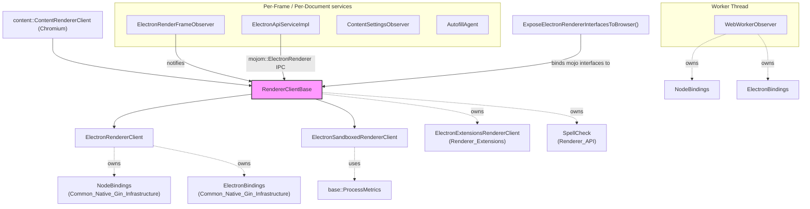
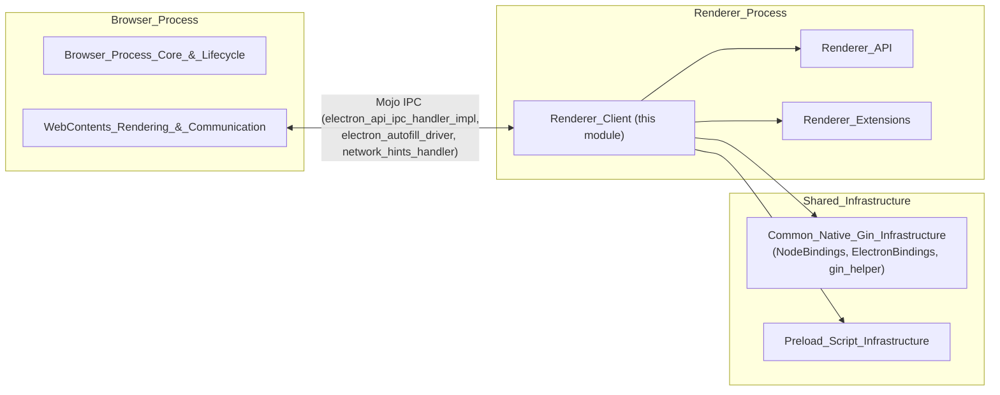
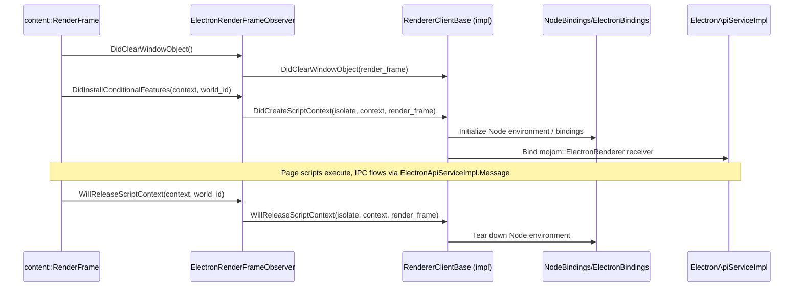

# Renderer_Client Module

## Introduction

The **Renderer_Client** module is the heart of Electron's renderer-process runtime. It is
responsible for wiring up Chromium's `content::ContentRendererClient` extension points to
Electron's own Node.js/V8 integration, per-frame observers, and IPC surfaces. Every renderer
process spawned by Electron — whether it hosts a normal web page, a sandboxed page, a Web
Worker, or a Service Worker — is driven by a concrete implementation rooted in this module.

Concretely, the module answers three questions for a renderer process:

1. **How does Node.js get bootstrapped into a V8 context?** (`ElectronRendererClient`,
   `ElectronSandboxedRendererClient`, `WebWorkerObserver`)
2. **How does the renderer observe/react to frame and document lifecycle events (script
   context creation/destruction, document creation, autofill, content settings)?**
   (`ElectronRenderFrameObserver`, `ContentSettingsObserver`, `AutofillAgent`)
3. **How does the renderer talk back to the browser process and vice-versa over Mojo/IPC?**
   (`ElectronApiServiceImpl`, `browser_exposed_renderer_interfaces.h`)

This module sits alongside two sibling modules under the larger **Renderer Process
Infrastructure** area:
- [Renderer_API](Renderer_API.md) — implements renderer-exposed JS APIs such as the
  context bridge and spell-check client that `RendererClientBase` wires up.
- [Renderer_Extensions](Renderer_Extensions.md) — Chrome-extensions renderer support
  (`ElectronExtensionsRendererClient`) that `RendererClientBase` optionally owns.

## Architecture Overview

`RendererClientBase` is the abstract root of the client hierarchy and implements the bulk of
`content::ContentRendererClient` behavior shared by all renderer process "flavors". Electron
ships two concrete flavors that differ mainly in *how* and *when* Node.js integration is
injected into a page's V8 context:

- **`ElectronRendererClient`** — used for the *non-sandboxed* / full Node-integration
  renderer, where Node bindings are installed directly into the main world context.
- **`ElectronSandboxedRendererClient`** — used when `contextIsolation`/sandboxing is active;
  Node integration is limited and lifecycle hooks are adapted to the sandboxed preload model.

Both flavors delegate frame- and document-level plumbing to a set of collaborating observer
and service classes that are also declared in this module.

## Sub-modules

The module is organized into two closely related sub-modules:

| Sub-module | Description | Documentation |
|---|---|---|
| **Renderer_Client_core** | The `RendererClientBase` abstract class and its two concrete implementations (`ElectronRendererClient`, `ElectronSandboxedRendererClient`) that bootstrap Node.js/V8 into a renderer process and implement the `content::ContentRendererClient` contract. | [Renderer_Client_core.md](Renderer_Client_core.md) |
| **Renderer_Client_frame_services** | Per-frame/document observers and IPC service objects that a `RendererClientBase` instance creates and delegates to: `ElectronRenderFrameObserver`, `ElectronApiServiceImpl`, `ContentSettingsObserver`, `AutofillAgent`, the browser-exposed interface binder, and the `WebWorkerObserver` used for Web Worker threads. | [Renderer_Client_frame_services.md](Renderer_Client_frame_services.md) |

## How it Fits into the Overall System

- The **browser process** (see [Browser_Process_Core_&_Lifecycle](Browser_Process_Core_&_Lifecycle.md)
  and its `shell_browser_ipc_handlers*` sub-modules under
  [WebContents_Rendering_&_Communication](WebContents_Rendering_&_Communication.md)) communicates
  with `Renderer_Client` classes through Mojo interfaces: `ElectronApiIPCHandlerImpl`,
  `ElectronAutofillDriver`/`ElectronAutofillDriverFactory`, and `NetworkHintsHandlerImpl` are all
  browser-side counterparts of the renderer-side classes documented here.
- `ElectronRendererClient` and `WebWorkerObserver` both depend on `NodeBindings` and
  `ElectronBindings` from **Common_Native_Gin_Infrastructure** (see
  [Node_Bindings.md](Node_Bindings.md) and [Common_API.md](Common_API.md)) to inject Node.js's
  module system, globals, and native bindings into a V8 context.
- Preload scripts, loaded before page scripts run, are coordinated with this module's frame
  observers; see [Preload_Script_Infrastructure](Preload_Script_Infrastructure.md) for how
  preload realms and service worker preload data are constructed on the renderer side.
- `RendererClientBase` conditionally composes `SpellCheck` (from
  [Renderer_API](Renderer_API.md), specifically its `Renderer_API_webframe_spellcheck` sub-module)
  and `ElectronExtensionsRendererClient` (from [Renderer_Extensions](Renderer_Extensions.md))
  when the corresponding Electron build flags are enabled.

## Key Lifecycle Flow

The following sequence illustrates how a script context is created and torn down, and how
Node.js integration and per-document services attach to it.

## Summary of Core Components

| Component | File | Responsibility |
|---|---|---|
| `RendererClientBase` | `shell/renderer/renderer_client_base.h` | Abstract base implementing shared `content::ContentRendererClient` behavior: plugin handling, service worker hooks, extensions/spellcheck composition, interface exposure. |
| `ElectronRendererClient` | `shell/renderer/electron_renderer_client.h` | Full Node-integration renderer client; owns `NodeBindings`/`ElectronBindings`, tracks per-context Node environments. |
| `ElectronSandboxedRendererClient` | `shell/renderer/electron_sandboxed_renderer_client.h` | Sandboxed renderer client; initializes limited bindings and emits `process` events, tracks injected frames. |
| `ElectronRenderFrameObserver` | `shell/renderer/electron_render_frame_observer.h` | Forwards `content::RenderFrameObserver` callbacks (context creation/destruction, layout, destruct) to the active `RendererClientBase`. |
| `ElectronApiServiceImpl` | `shell/renderer/electron_api_service_impl.h` | Mojo `mojom::ElectronRenderer` implementation; receives IPC messages/postMessage from the browser and takes heap snapshots. |
| `ContentSettingsObserver` | `shell/renderer/content_settings_observer.h` | Implements `blink::WebContentSettingsClient` to gate storage/clipboard access via the browser's content-settings utility. |
| `AutofillAgent` | `shell/renderer/electron_autofill_agent.h` | Implements `blink::WebAutofillClient` to surface autofill suggestions and forward events to the browser's autofill driver. |
| `WebWorkerObserver` | `shell/renderer/web_worker_observer.h` | Per-worker-thread analogue of `ElectronRendererClient`; injects Node integration into Web Worker contexts. |
| `ExposeElectronRendererInterfacesToBrowser` / `BinderMap` | `shell/renderer/browser_exposed_renderer_interfaces.h` | Registers Mojo interface binders that the browser process can call into on a given renderer client. |

See the sub-module pages linked above for detailed API descriptions, collaboration diagrams,
and cross-references to browser-side counterparts.
