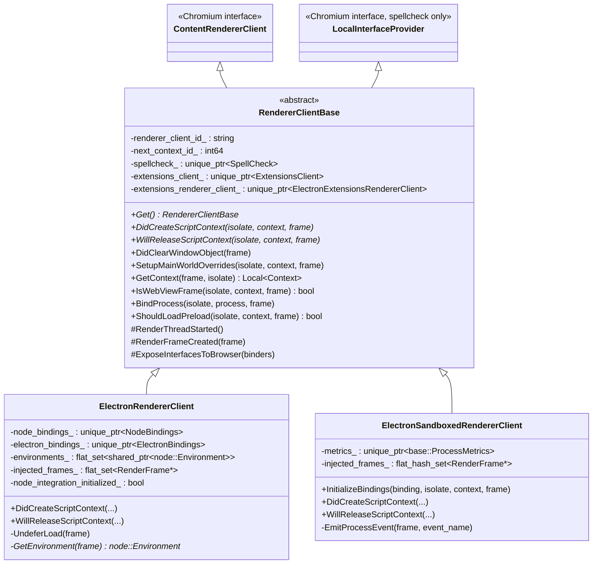
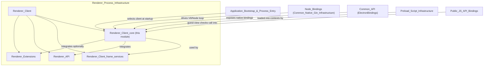
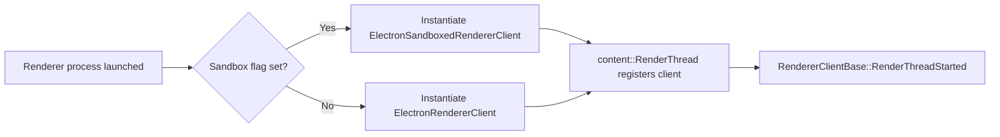
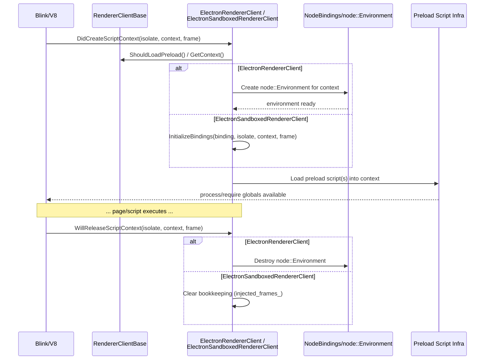
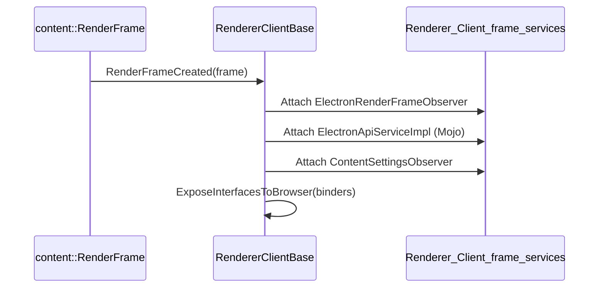
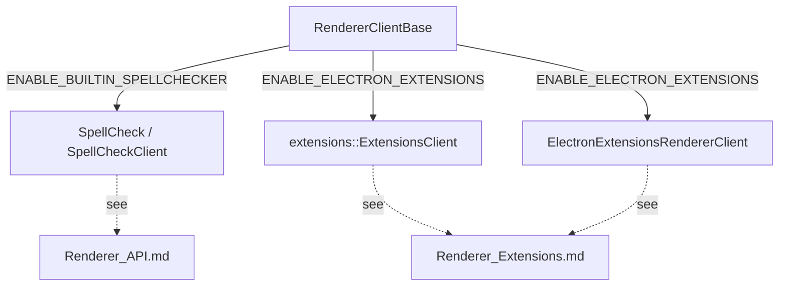

# Renderer_Client_core

## Introduction

`Renderer_Client_core` is the foundational layer of Electron's **renderer process** integration with Chromium's Content module. It defines how every renderer process (whether hosting an ordinary web page, a sandboxed preload environment, or an unsandboxed Node.js-enabled context) plugs into Blink/Content's rendering lifecycle and bootstraps Electron/Node.js JavaScript capabilities inside V8 script contexts.

The module is centered around three C++ classes:

| Component | Role |
|---|---|
| `RendererClientBase` | Abstract base implementing `content::ContentRendererClient`; shared plumbing for frame lifecycle, script-context tracking, extensions, and spellcheck wiring. |
| `ElectronRendererClient` | Concrete client used for **non-sandboxed** renderer processes — integrates full Node.js (`NodeBindings`, `ElectronBindings`) directly into the renderer's main-world V8 context. |
| `ElectronSandboxedRendererClient` | Concrete client used for **sandboxed** renderer processes — no direct Node.js integration; instead relies on `preload` bindings and process-metrics/event emission. |

This module is a child of [Renderer_Client](Renderer_Client.md) and is a sibling to [Renderer_Client_frame_services](Renderer_Client_frame_services.md), which supplies auxiliary per-frame observers/services (e.g., `ElectronRenderFrameObserver`, `ElectronApiServiceImpl`, `ContentSettingsObserver`) that attach to frames created through the clients defined here.

---

## Responsibilities

1. **Renderer entry point** — Implements the `content::ContentRendererClient` interface that Chromium's `content` layer calls into for every renderer-process event (thread start, frame creation, script context creation/release, plugin handling, service worker lifecycle, etc.).
2. **Script context bootstrapping** — Decides *when* and *how* to inject Electron/Node globals (`process`, `require`, preload scripts) into a V8 context, and tracks context IDs to correlate messages/log output.
3. **Sandboxed vs. non-sandboxed dispatch** — Provides two alternate implementations chosen at process-startup time (see [Application_Bootstrap_&_Process_Entry](Application_Bootstrap_&_Process_Entry.md)) depending on the `contextIsolation`/`sandbox` configuration of the window that spawned the renderer.
4. **Feature-flagged integration points** — Conditionally wires in:
   - Built-in spellchecking (`SpellCheck`, see [Renderer_API](Renderer_API.md))
   - Chrome extensions support (`ExtensionsClient`, `ElectronExtensionsRendererClient`, see [Renderer_Extensions](Renderer_Extensions.md))
5. **WebView/guest frame detection** — Exposes helpers (`IsWebViewFrame`, `AllowGuestViewElementDefinition`) used by higher-level API bindings ([Public_JS_API_Bindings](Public_JS_API_Bindings.md)) to gate `<webview>` tag behavior.

---

## Architecture

### Class Hierarchy

### Module Position

---

## Component Details

### `RendererClientBase`

`shell/renderer/renderer_client_base.h`

The abstract base class that every Electron renderer-process client extends. It implements `content::ContentRendererClient` and (when the built-in spellchecker is enabled) `service_manager::LocalInterfaceProvider`.

Key responsibilities:
- **Singleton access** via `RendererClientBase::Get()`, allowing other renderer-side code (e.g., API bindings) to reach the active client without direct wiring.
- **Pure virtual hooks** `DidCreateScriptContext` / `WillReleaseScriptContext` — subclasses *must* implement these to decide how/when Electron globals are injected or torn down for a given V8 context. This is the primary customization point distinguishing sandboxed vs. non-sandboxed behavior.
- **Frame + plugin lifecycle overrides** from `content::ContentRendererClient`: `RenderFrameCreated`, `OverrideCreatePlugin`, `IsPluginHandledExternally`, `GetScriptableObject`, document-lifecycle script runners (`RunScriptsAtDocumentStart/End/Idle`), and Service Worker lifecycle callbacks.
- **Guest view / WebView support**: `IsWebViewFrame` and the static `AllowGuestViewElementDefinition` are consumed by the `<webview>` tag implementation (see [Public_JS_API_Bindings](Public_JS_API_Bindings.md) → `guest-view-manager.ts`).
- **Conditional subsystems** guarded by build flags:
  - `ENABLE_BUILTIN_SPELLCHECKER`: owns a `SpellCheck` instance and implements `GetInterface` for local interface provisioning (see [Renderer_API](Renderer_API.md) → `electron_api_spell_check_client.h`).
  - `ENABLE_ELECTRON_EXTENSIONS`: owns `extensions::ExtensionsClient` and `ElectronExtensionsRendererClient` (see [Renderer_Extensions](Renderer_Extensions.md)).
- **Context bookkeeping**: `next_context_id_` provides monotonically increasing identifiers used to tag/track V8 contexts for logging and IPC correlation; `renderer_client_id_` uniquely identifies the renderer process instance.

### `ElectronRendererClient`

`shell/renderer/electron_renderer_client.h`

Used for renderers that run with **full Node.js integration** (i.e., `nodeIntegration: true`, or the main world of a non-sandboxed preload). It owns:
- `NodeBindings` — drives libuv/Node event-loop integration in the renderer thread (see [Node_Bindings](Node_Bindings.md), part of [Common_Native_Gin_Infrastructure](Common_Native_Gin_Infrastructure.md)).
- `ElectronBindings` — exposes Electron's native C++ bindings to the Node/V8 environment (see [Common_API](Common_API.md)).

Behavior:
- `DidCreateScriptContext` creates/attaches a `node::Environment` to the new V8 context, tracked in `environments_` (a `node::Environment::GetCurrent` call never returns null even without an Environment, so Electron maintains its own bookkeeping set).
- `WillReleaseScriptContext` tears down the associated Node environment.
- `injected_frames_` avoids redundant/unsafe lazy main-world context creation for frames that haven't executed any script yet.
- Overrides additional `ContentRendererClient` hooks: `PostIOThreadCreated` (wires Node's IO thread task runner), `RenderFrameCreated`, document-lifecycle script runners, Web Worker context lifecycle (`WorkerScriptReadyForEvaluationOnWorkerThread`, `WillDestroyWorkerContextOnWorkerThread`), and `SetUpWebAssemblyTrapHandler`.
- `UndeferLoad` and `GetEnvironment` are internal helpers to defer/resume frame loading around Node environment setup and to fetch the `node::Environment*` for a given frame.

### `ElectronSandboxedRendererClient`

`shell/renderer/electron_sandboxed_renderer_client.h`

Used for **sandboxed** renderers, where full Node.js integration is *not* available in the main world. Instead, a restricted `binding` object (native bindings surface) is injected via `InitializeBindings`, typically invoked from the [Preload_Script_Infrastructure](Preload_Script_Infrastructure.md) preload bootstrap.

Behavior:
- `InitializeBindings(binding, isolate, context, render_frame)` — sets up the native binding object exposed to the sandboxed preload script (as opposed to a full Node `require`).
- `DidCreateScriptContext` / `WillReleaseScriptContext` — lighter-weight context lifecycle handling compared to `ElectronRendererClient` (no `node::Environment` is created).
- `metrics_` (`base::ProcessMetrics`) is used to gather CPU/memory statistics emitted to the renderer's `process` object.
- `EmitProcessEvent` — dispatches process-level lifecycle events (e.g., `loaded`) to JS listeners.
- `injected_frames_` — same bookkeeping purpose as in `ElectronRendererClient`, implemented with `absl::flat_hash_set` here.
- Overrides Service Worker lifecycle callbacks (`WillEvaluateServiceWorkerOnWorkerThread`, `WillDestroyServiceWorkerContextOnWorkerThread`) for sandboxed service worker preload support.

---

## Process & Data Flow

### Renderer Client Selection at Startup

The selection between the two concrete clients happens during process entry, coordinated with [Application_Bootstrap_&_Process_Entry](Application_Bootstrap_&_Process_Entry.md) and the `sandbox`/`nodeIntegration` WebPreferences resolved by [Web_Contents](Web_Contents.md) (`web_contents_preferences.h`).

### Script Context Lifecycle

### Frame Creation & Interface Exposure

`RendererClientBase::RenderFrameCreated` is the attachment point where per-frame observers/services from [Renderer_Client_frame_services](Renderer_Client_frame_services.md) are created and bound to the newly created frame — this module supplies the *host* while that sibling module supplies the *attached services*.

---

## Feature-Flag Integration

- **Spellcheck**: When compiled with the built-in spellchecker, `RendererClientBase` implements `service_manager::LocalInterfaceProvider::GetInterface` so that the `SpellCheckClient` (documented in [Renderer_API](Renderer_API.md)) can request the browser-side spellcheck Mojo interface.
- **Extensions**: When Chrome extensions support is compiled in, the base class owns and forwards to an `ElectronExtensionsRendererClient` (declared in [Renderer_Extensions](Renderer_Extensions.md)), which augments script-injection and content-settings behavior for extension content scripts.

---

## Key Dependencies

| Dependency | Module | Relationship |
|---|---|---|
| `NodeBindings` | [Common_Native_Gin_Infrastructure](Common_Native_Gin_Infrastructure.md) (`Node_Bindings`) | `ElectronRendererClient` owns an instance to drive the Node.js event loop in-process. |
| `ElectronBindings` | [Common_Native_Gin_Infrastructure](Common_Native_Gin_Infrastructure.md) (`Common_API`) | `ElectronRendererClient` owns an instance to expose native Electron APIs to Node/V8. |
| `SpellCheck` / `SpellCheckClient` | [Renderer_API](Renderer_API.md) | Optional composition inside `RendererClientBase`. |
| `ExtensionsClient` / `ElectronExtensionsRendererClient` | [Renderer_Extensions](Renderer_Extensions.md) | Optional composition inside `RendererClientBase`. |
| `ElectronRenderFrameObserver`, `ElectronApiServiceImpl`, `ContentSettingsObserver`, `AutofillAgent`, `WebWorkerObserver` | [Renderer_Client_frame_services](Renderer_Client_frame_services.md) | Attached to frames during `RenderFrameCreated`. |
| Preload script loading | [Preload_Script_Infrastructure](Preload_Script_Infrastructure.md) | Invoked during `DidCreateScriptContext`/`ShouldLoadPreload` to inject `process`/bindings into the page or sandboxed context. |
| Process/sandbox configuration | [Web_Contents](Web_Contents.md), [Application_Bootstrap_&_Process_Entry](Application_Bootstrap_&_Process_Entry.md) | Determines which concrete client (`ElectronRendererClient` vs. `ElectronSandboxedRendererClient`) is instantiated for a renderer process. |
| `<webview>` guest checks | [Public_JS_API_Bindings](Public_JS_API_Bindings.md) | Calls `IsWebViewFrame`/`AllowGuestViewElementDefinition` exposed by `RendererClientBase`. |

---

## Summary

`Renderer_Client_core` is the glue layer that turns a generic Chromium renderer process into an "Electron renderer": it decides — per process, per frame, per V8 context — whether and how Node.js, Electron native bindings, spellchecking, and extension support are wired in. Its two concrete implementations (`ElectronRendererClient` for full Node integration, `ElectronSandboxedRendererClient` for the sandboxed/preload-only case) share the common lifecycle skeleton defined by `RendererClientBase`, while delegating richer per-frame behavior to sibling module [Renderer_Client_frame_services](Renderer_Client_frame_services.md) and preload bootstrapping to [Preload_Script_Infrastructure](Preload_Script_Infrastructure.md).
