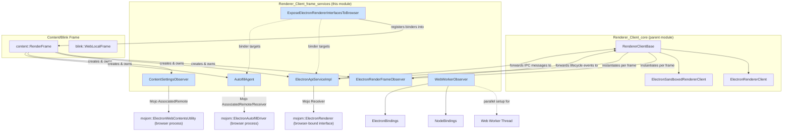
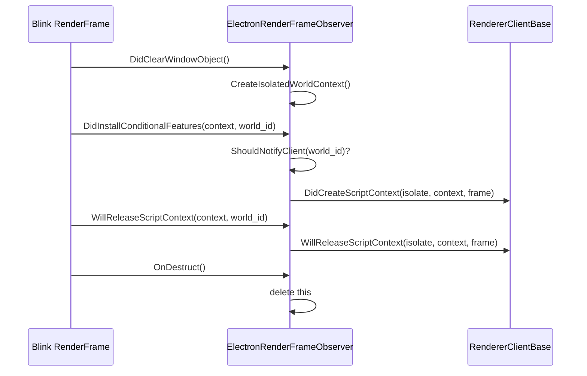
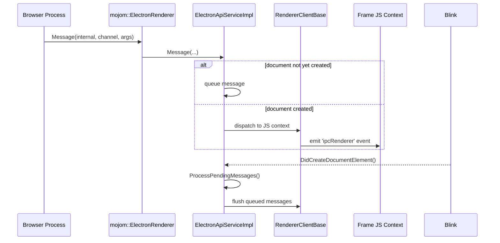
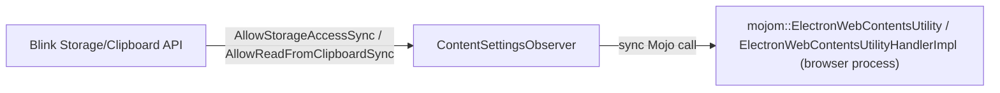
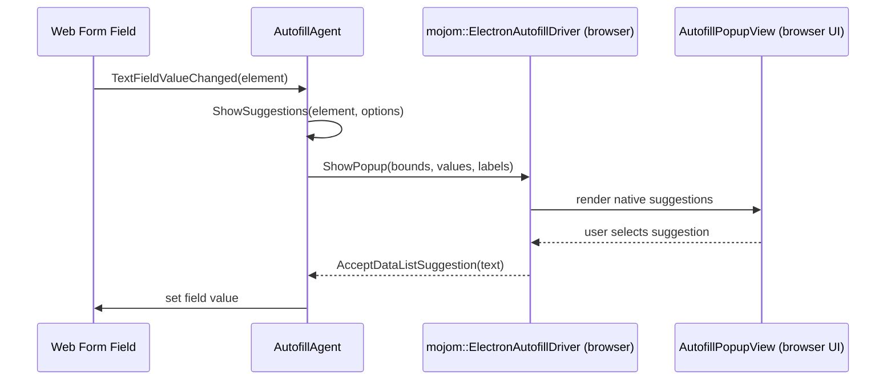
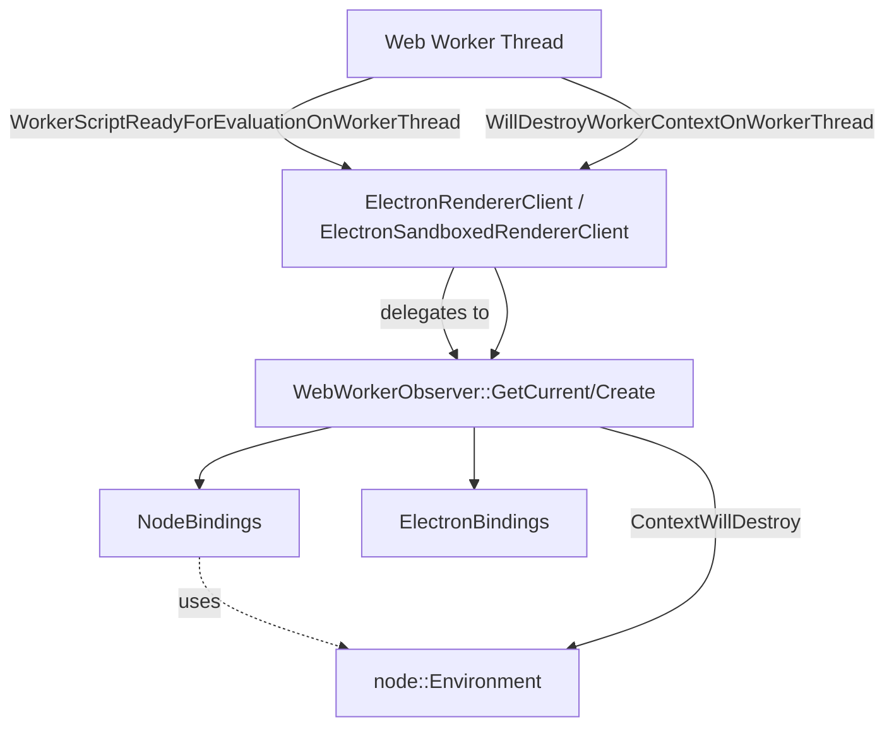
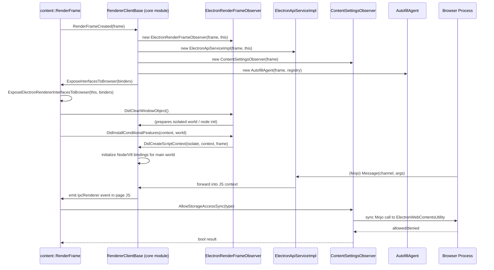

# Renderer_Client_frame_services

## Introduction

`Renderer_Client_frame_services` is a sub-module of Electron's renderer process infrastructure that provides **per-frame and per-worker service objects**. While [Renderer_Client_core](Renderer_Client_core.md) defines the top-level `RendererClientBase` and its concrete specializations (`ElectronRendererClient`, `ElectronSandboxedRendererClient`) that hook into Chromium's `content::ContentRendererClient` lifecycle, this module supplies the **collaborating observer and service objects** that are instantiated for each `content::RenderFrame` (or worker thread) to actually deliver Electron's renderer-side functionality:

- Forwarding frame lifecycle events (script context creation/release) to the renderer client.
- Implementing the Mojo `ElectronRenderer` interface used for browser → renderer IPC (`ipcRenderer` messages, heap snapshots, `postMessage`).
- Enforcing content settings (storage/clipboard access) requested from the browser process.
- Handling native form-autofill suggestion UI plumbing (delegated to a separate module, referenced here for context).
- Registering additional Mojo interfaces that the browser process may bind against a renderer frame.
- Bootstrapping Node.js integration for Web Workers, mirroring what `ElectronRendererClient` does for the main frame context.

Together these components form the "wiring" layer between Chromium's per-frame/per-worker observer pattern and Electron's higher-level renderer client and Node/V8 integration layers.

---

## Module Purpose & Responsibilities

| Component | Responsibility |
|---|---|
| `ElectronRenderFrameObserver` | Low-level `content::RenderFrameObserver` that intercepts frame/context lifecycle events (`DidClearWindowObject`, `DidInstallConditionalFeatures`, `WillReleaseScriptContext`, `DidMeaningfulLayout`, `OnDestruct`) and forwards them to the owning `RendererClientBase`. Also handles isolated-world context creation and heap-snapshot IPC requests. |
| `ElectronApiServiceImpl` | Implements the `mojom::ElectronRenderer` Mojo interface bound per-frame. Receives `Message`/`ReceivePostMessage`/`TakeHeapSnapshot` calls from the browser process and relays them into the frame's JS context via the `RendererClientBase`. Also exposes `OnInterfaceRequestForFrame` for late frame-scoped interface binding. |
| `ContentSettingsObserver` | Implements `blink::WebContentSettingsClient` to synchronously answer Blink's storage-access and clipboard-read queries by consulting the browser process over the `mojom::ElectronWebContentsUtility` associated Mojo interface. |
| `AutofillAgent` | Bridges Blink's `WebAutofillClient` callbacks (text field edits, focus changes, datalist suggestions) to the `mojom::ElectronAutofillDriver`/`mojom::ElectronAutofillAgent` Mojo interfaces, enabling Electron's autofill-popup feature. |
| `BinderMap` / `ExposeElectronRendererInterfacesToBrowser` | Registers Electron-specific Mojo interface binders (e.g., autofill agent, api service) into Chromium's per-frame `BinderMap`, allowing the browser process to request these interfaces from a renderer frame. |
| `WebWorkerObserver` | Per-worker-thread singleton that sets up `NodeBindings` and `ElectronBindings` so that Web Workers created inside a renderer process also get Node.js integration (when enabled), mirroring the main-thread setup performed by `ElectronRendererClient`. |

These classes are **not standalone entry points**; they are created and owned by the classes in [Renderer_Client_core](Renderer_Client_core.md) (primarily `RendererClientBase::RenderFrameCreated`) or by Content/Blink's worker infrastructure (`WebWorkerObserver`).

---

## Architecture Overview

---

## Component Details

### 1. ElectronRenderFrameObserver

A thin `content::RenderFrameObserver` whose sole job is to **notify `RendererClientBase`** of key frame/context events so the client can drive Node.js/V8 environment setup at the right moments.

Key behaviors:
- `ShouldNotifyClient(world_id)` filters events so only the appropriate world (main world vs. isolated worlds used for content-scripts/extensions) triggers client callbacks.
- `OnTakeHeapSnapshot` handles a legacy IPC path for capturing V8 heap snapshots via a platform file handle.
- `has_delayed_node_initialization_` supports scenarios where Node bindings must be initialized lazily rather than immediately at window-object-clear time.

### 2. ElectronApiServiceImpl

Implements the Mojo interface `mojom::ElectronRenderer`, which is the primary transport for **browser-to-renderer messaging** (complementing `mojom::ElectronBrowser` used for renderer-to-browser calls documented in [Public_JS_API_Bindings](Public_JS_API_Bindings.md) — see `IpcRenderer`/`IpcRendererInternal`).

Responsibilities:
- `Message(internal, channel, arguments)` — delivers a browser-sent IPC message into the frame's JS context (ultimately surfacing as an `ipcRenderer` event).
- `ReceivePostMessage(channel, message)` — delivers `MessagePort`-style transferable messages (see [WebContents_Rendering_&_Communication](WebContents_Rendering_&_Communication.md)'s `MessagePort`).
- `TakeHeapSnapshot(file, callback)` — triggers a V8 heap snapshot write to the supplied Mojo handle.
- `OnInterfaceRequestForFrame` — allows additional frame-scoped interfaces to be resolved through its internal `service_manager::BinderRegistry`.
- Manages a `document_created_` flag and defers dispatch of pending messages via `ProcessPendingMessages()` until `DidCreateDocumentElement()` fires, ensuring scripts aren't messaged before the DOM is ready.

### 3. ContentSettingsObserver

Implements `blink::WebContentSettingsClient` to let Blink synchronously check whether storage access (cookies, localStorage, etc.) or clipboard reads are permitted, per the effective `WebPreferences` and browser-side policy. It lazily binds an `AssociatedRemote<mojom::ElectronWebContentsUtility>` (see [WebContents_Rendering_&_Communication](WebContents_Rendering_&_Communication.md) → `ElectronWebContentsUtilityHandlerImpl`) to query the browser process synchronously.

### 4. AutofillAgent

Bridges native form-field interaction events from Blink (`WebAutofillClient`) to Electron's autofill popup feature implemented in the browser process (see [Desktop_UI_Widgets_&_Dialogs](Desktop_UI_Widgets_&_Dialogs.md) → `AutofillPopupView`, and [WebContents_Rendering_&_Communication](WebContents_Rendering_&_Communication.md) → `AutofillDriver`/`AutofillDriverFactory`).

Key flows:
- Listens for `TextFieldValueChanged`, `TextFieldDidReceiveKeyDown`, focus/blur, and datalist changes.
- Calls `ShowSuggestions`/`ShowPopup`/`HidePopup` which talk to the browser-side `mojom::ElectronAutofillDriver` associated interface to render native suggestion UI.
- Implements `mojom::ElectronAutofillAgent::AcceptDataListSuggestion` so the browser-rendered popup can inform the renderer which suggestion the user picked.
- `ShowSuggestionsOptions` is an internal struct controlling whether to trigger suggestions on empty fields or only when the caret sits at the end of existing text.

### 5. browser_exposed_renderer_interfaces (BinderMap / ExposeElectronRendererInterfacesToBrowser)

A free function, `ExposeElectronRendererInterfacesToBrowser(RendererClientBase* client, mojo::BinderMap* binders)`, that registers callbacks into Chromium's `mojo::BinderMap` for the frame. This is the mechanism through which the browser process obtains `mojom::ElectronRenderer`, `mojom::ElectronAutofillAgent`, and other frame-scoped Mojo interfaces bound to `ElectronApiServiceImpl`/`AutofillAgent` instances. It is invoked from `content::ContentRendererClient::ExposeInterfacesToBrowser` overrides in `RendererClientBase` (see [Renderer_Client_core](Renderer_Client_core.md)).

### 6. WebWorkerObserver

While the other components in this module are frame-scoped, `WebWorkerObserver` is **worker-thread-scoped**. It is the Web Worker analogue of the Node/V8 bootstrap logic found in `ElectronRendererClient` (see [Renderer_Client_core](Renderer_Client_core.md)):

- `WebWorkerObserver::Create()` / `GetCurrent()` manage a thread-local singleton.
- `WorkerScriptReadyForEvaluation(context)` initializes `NodeBindings` and `ElectronBindings` (from [Common_Native_Gin_Infrastructure](Common_Native_Gin_Infrastructure.md) / [Node_Bindings](Common_Native_Gin_Infrastructure.md)) for the worker's V8 context, enabling `require()`/Node globals inside dedicated/shared Web Workers when Node integration in workers is enabled.
- `ContextWillDestroy(context)` tears down the corresponding `node::Environment`.
- Maintains a `base::flat_set` of live `node::Environment` shared_ptrs, mirroring the bookkeeping pattern used in `ElectronRendererClient`.

---

## Data & Control Flow: Frame Creation to IPC Delivery

---

## Relationship to Other Modules

- **[Renderer_Client_core](Renderer_Client_core.md)** — Parent module. Defines `RendererClientBase`, `ElectronRendererClient`, and `ElectronSandboxedRendererClient`, which *own and orchestrate* the components documented here. This module's classes assume a valid `RendererClientBase*` is supplied at construction.
- **[Public_JS_API_Bindings](Public_JS_API_Bindings.md)** — `lib/renderer/api/ipc-renderer.ts` and `lib/renderer/ipc-renderer-internal.ts` are the JS-side consumers of messages delivered by `ElectronApiServiceImpl::Message`.
- **[WebContents_Rendering_&_Communication](WebContents_Rendering_&_Communication.md)** — Browser-side counterparts: `ElectronApiIPCHandlerImpl`, `ElectronWebContentsUtilityHandlerImpl`, `AutofillDriver`/`AutofillDriverFactory`, and `MessagePort` implement the browser side of the Mojo interfaces consumed/implemented here.
- **[Desktop_UI_Widgets_&_Dialogs](Desktop_UI_Widgets_&_Dialogs.md)** — Hosts `AutofillPopupView`/`AutofillPopup`, the native UI rendered in response to `AutofillAgent`'s driver calls.
- **[Common_Native_Gin_Infrastructure](Common_Native_Gin_Infrastructure.md)** — `NodeBindings`, `ElectronBindings`, and V8/Node utility classes used by `WebWorkerObserver` (and by `ElectronRendererClient` in the core module) to bootstrap JavaScript environments.
- **[Renderer_API](Renderer_Process_Infrastructure.md)** *(sibling under Renderer_Process_Infrastructure)* — `electron_api_context_bridge` and `electron_api_web_frame`/spellcheck utilities operate within the same per-frame lifecycle established by `ElectronRenderFrameObserver`.
- **[Renderer_Extensions](Renderer_Process_Infrastructure.md)** *(sibling)* — `ElectronExtensionsRendererClient` integrates with `RendererClientBase` similarly to how the frame services in this module do, for the Chrome extensions system.

---

## Key Design Notes

1. **Separation of transport vs. policy**: `ElectronApiServiceImpl` is purely a Mojo transport/dispatch shim; the actual JS-context manipulation and Node/V8 lifecycle logic live in `RendererClientBase` subclasses. This keeps IPC plumbing decoupled from environment bootstrap logic.
2. **World-aware event filtering**: `ElectronRenderFrameObserver::ShouldNotifyClient` ensures that isolated worlds (used by content scripts/extensions) don't trigger Electron's main-world Node integration unintentionally.
3. **Sync IPC for content settings**: `ContentSettingsObserver` deliberately uses a synchronous associated Mojo call because Blink's `WebContentSettingsClient` interface requires synchronous answers to storage/clipboard queries.
4. **Document readiness gating**: `ElectronApiServiceImpl` defers message delivery until `DidCreateDocumentElement()` to avoid dispatching `ipcRenderer` events into a JS context that isn't fully ready.
5. **Worker parity**: `WebWorkerObserver` intentionally mirrors the environment bookkeeping pattern (`flat_set` of `node::Environment`) used in `ElectronRendererClient`, ensuring consistent lifecycle semantics between main-frame and worker-thread Node integration.
