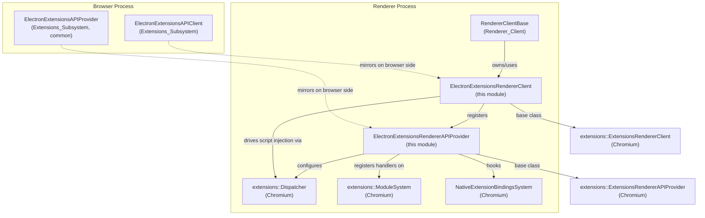
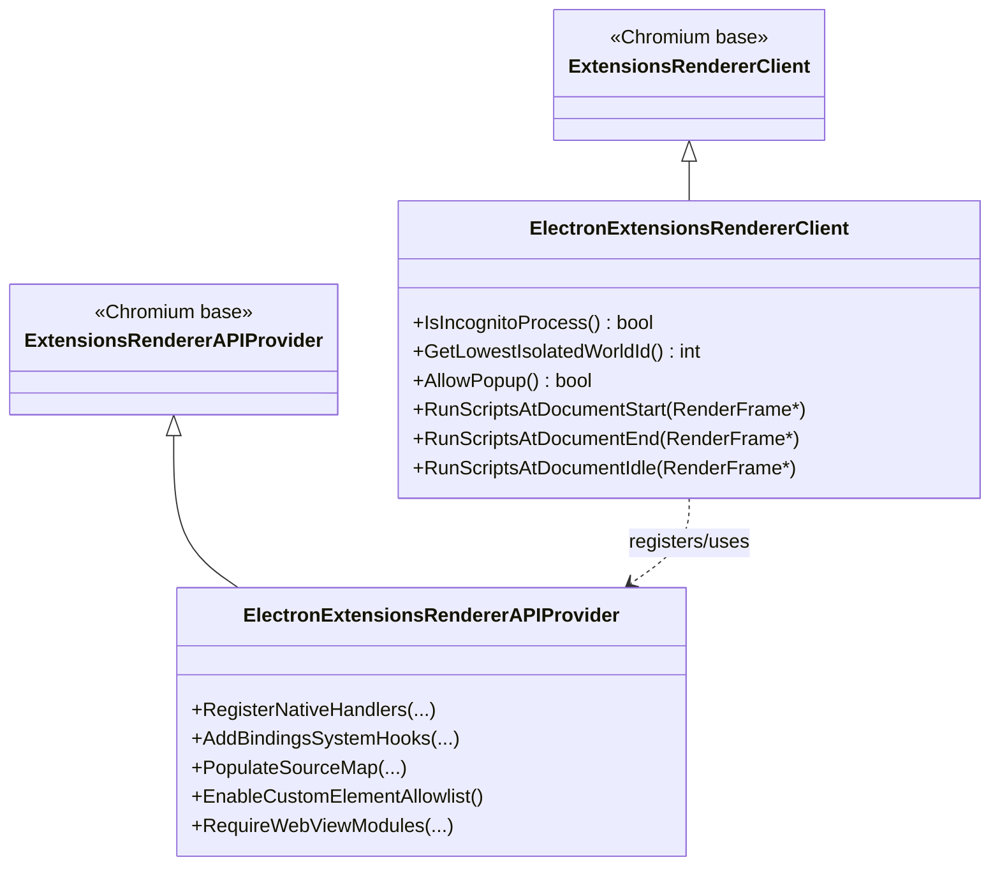
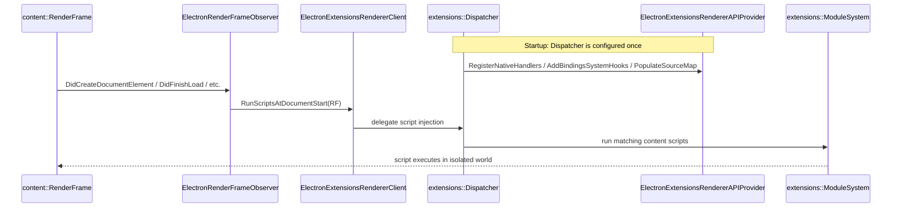

# Renderer Extensions

## Introduction

The **Renderer Extensions** module is Electron's renderer-process integration point for the
Chromium `extensions` module system. It supplies the two glue classes that the Chromium
extensions renderer library requires in order to run inside an Electron renderer process:

- **`ElectronExtensionsRendererClient`** — Electron's implementation of
  `extensions::ExtensionsRendererClient`, the renderer-side entry point that Chromium's
  extensions system uses to query process-level configuration (e.g. incognito status,
  isolated-world allocation) and to drive script injection at various points of the
  document lifecycle.
- **`ElectronExtensionsRendererAPIProvider`** — Electron's implementation of
  `extensions::ExtensionsRendererAPIProvider`, responsible for registering native JS
  bindings, hooking the bindings system, and populating the source map that exposes
  extension JS APIs (e.g. `chrome.*` namespaces) to extension content scripts and pages
  running in the renderer.

Together these two classes let Electron reuse Chromium's mature extensions
infrastructure (content script injection, isolated worlds, native API bindings) while
keeping Electron-specific behavior (such as always non-incognito processes) isolated behind
a small, well-defined seam.

This module is intentionally minimal — it does not implement extension business logic
itself, but instead acts as a **renderer-side adapter/plumbing layer** connecting the
generic Chromium extensions runtime to Electron's broader renderer infrastructure
(see [Renderer_Client.md](Renderer_Client.md)) and to the browser-process extensions
subsystem (see [Extensions_Subsystem.md](Extensions_Subsystem.md), specifically its
`ElectronExtensionsAPIClient` / `ElectronExtensionsAPIProvider` counterparts).

## Architecture Overview

### Position in the System

### Class Relationships

## Core Components

### `ElectronExtensionsRendererClient`
*File: `shell/renderer/extensions/electron_extensions_renderer_client.h`*

Implements `extensions::ExtensionsRendererClient`, Chromium's abstraction point for
renderer-side, embedder-specific extension behavior. Key responsibilities:

| Method | Purpose |
|---|---|
| `IsIncognitoProcess()` | Reports whether the current renderer belongs to an incognito/off-the-record profile. Electron typically has no notion of incognito browsing contexts, so this is generally hard-coded/simplified. |
| `GetLowestIsolatedWorldId()` | Provides the starting numeric ID for isolated JS worlds allocated to extension content scripts, ensuring no collisions with other isolated worlds used elsewhere in Electron's renderer. |
| `AllowPopup()` | Determines whether popups triggered from extension-injected script are permitted. |
| `RunScriptsAtDocumentStart/End/Idle(RenderFrame*)` | Lifecycle hooks invoked by the render frame observer infrastructure (see [Renderer_Client.md](Renderer_Client.md), specifically `ElectronRenderFrameObserver`) at the corresponding DOM lifecycle stage, delegating to the Chromium `Dispatcher` to run any matching content scripts. |

This class is constructed and owned by Electron's `RendererClientBase` (see
[Renderer_Client.md](Renderer_Client.md)), which coordinates all renderer-side client
behavior including extensions, spellcheck, sandboxing, and autofill.

### `ElectronExtensionsRendererAPIProvider`
*File: `shell/renderer/extensions/electron_extensions_renderer_api_provider.h`*

Implements `extensions::ExtensionsRendererAPIProvider`, the interface Chromium's
`Dispatcher` uses to pull in embedder-defined (as opposed to Chromium-core) extension APIs
and bindings. Responsibilities:

| Method | Purpose |
|---|---|
| `RegisterNativeHandlers(...)` | Registers Electron-specific native JS handler objects into the extension's `ModuleSystem`, making C++-backed functionality callable from extension JS. |
| `AddBindingsSystemHooks(...)` | Installs any additional hooks into the `NativeExtensionBindingsSystem`, allowing Electron to intercept or extend binding behavior (e.g. custom API dispatch). |
| `PopulateSourceMap(...)` | Adds Electron-specific extension API JS source files into the `ResourceBundleSourceMap`, so they can be `require()`-d by extension scripts like any other bundled module. |
| `EnableCustomElementAllowlist()` | Enables the allow-list of custom HTML elements permitted within extension pages. |
| `RequireWebViewModules(ScriptContext*)` | Ensures `<webview>`-related JS modules are loaded into the given script context, connecting to Electron's guest view infrastructure (see [Public_JS_API_Bindings.md](Public_JS_API_Bindings.md)). |

Auxiliary forward-declared types referenced by this header:
- `Dispatcher` (`extensions::Dispatcher`) — the central Chromium object driving per-frame
  extension script execution; supplied to and used by both classes in this module.
- `RenderFrame` (`content::RenderFrame`) — represents a single frame within the renderer
  process; passed into `ElectronExtensionsRendererClient`'s script-injection lifecycle
  methods.

## Data / Control Flow

The following sequence illustrates how a content script gets injected into a page via this
module, from frame navigation to script execution:

## How This Module Fits Into the Overall System

- **[Renderer_Client.md](Renderer_Client.md)** — `RendererClientBase` and
  `ElectronRenderFrameObserver` own and drive instances of
  `ElectronExtensionsRendererClient`, invoking its lifecycle methods as frames navigate and
  load. This module cannot function standalone; it depends on the broader renderer client
  infrastructure for frame/document lifecycle notifications.
- **[Extensions_Subsystem.md](Extensions_Subsystem.md)** — The browser-process counterpart.
  `ElectronExtensionsAPIClient` and `ElectronExtensionsAPIProvider` (browser/common)
  mirror the responsibilities of this module's renderer classes but for the browser
  process side of the extensions system (e.g. supplying `MessagingDelegate`,
  `ManagementAPIDelegate`, manifest/permission features). Both sides must stay consistent
  for a given extension feature to work end-to-end.
- **[Public_JS_API_Bindings.md](Public_JS_API_Bindings.md)** — Guest view and messaging
  primitives (`GuestInstance`, `MessageChannelMain`) referenced indirectly via
  `RequireWebViewModules`, which wires `<webview>` tag support into extension pages.
  IPC transport for renderer-side communication is provided by the `lib_renderer_ipc`
  sub-module (`IpcRenderer`, `IpcRendererInternal`) documented in that same file.
- **[Common_Native_Gin_Infrastructure.md](Common_Native_Gin_Infrastructure.md)** — Native
  handlers registered via `RegisterNativeHandlers` are typically implemented using
  Electron's `gin_helper` wrapping utilities described there.

## Summary

| Component | Role | Chromium Base Class |
|---|---|---|
| `ElectronExtensionsRendererClient` | Per-process renderer client: incognito/isolated-world queries, script injection lifecycle | `extensions::ExtensionsRendererClient` |
| `ElectronExtensionsRendererAPIProvider` | Registers native handlers, bindings hooks, and JS source maps for extension APIs | `extensions::ExtensionsRendererAPIProvider` |

Because this module consists of exactly two closely-related adapter classes with no
further internal structure, it is documented as a single page without sub-module
breakdown.
