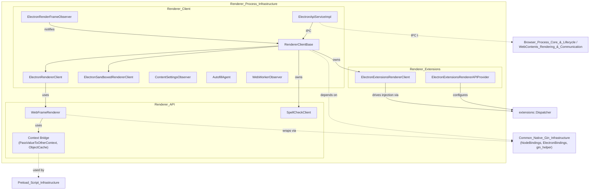
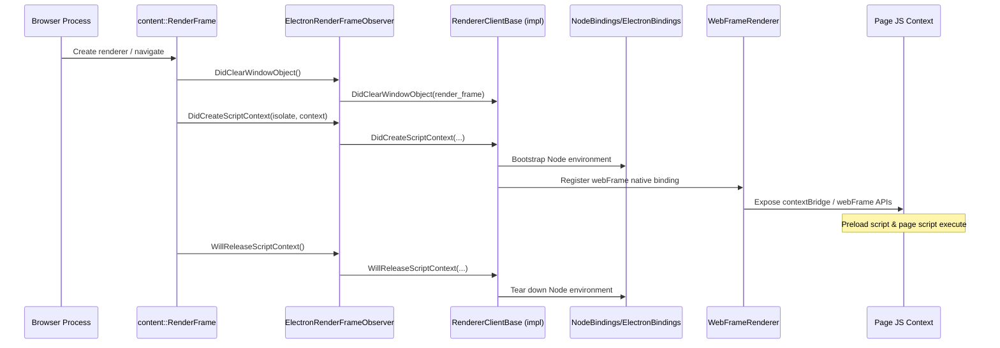

# Renderer_Process_Infrastructure

## Introduction

The **Renderer_Process_Infrastructure** module implements Electron's native (C++) runtime that lives inside each **renderer process**. It bridges Chromium's Blink/renderer engine with Electron's Node.js integration, exposing controlled native bindings to JavaScript, managing per-frame/document lifecycle events, enabling Chromium extensions support, and providing the security primitives (context bridge, spellcheck) that preload scripts and sandboxed pages depend on.

This module answers three core questions for any renderer process spawned by Electron:

1. **How is Node.js/V8 bootstrapped into a page's JavaScript context?** — handled by `ElectronRendererClient`, `ElectronSandboxedRendererClient`, and `WebWorkerObserver`.
2. **How does the renderer observe and react to document/frame lifecycle events** (script context creation/destruction, autofill, content settings, spellcheck)? — handled by `ElectronRenderFrameObserver`, `ContentSettingsObserver`, `AutofillAgent`, and the `SpellCheckClient`.
3. **How does the renderer communicate with the browser process, and how are safe cross-context JS values (e.g., via `contextBridge`) and Chromium extensions supported?** — handled by `ElectronApiServiceImpl`, `WebFrameRenderer`/context bridge utilities, and the `extensions/` renderer client & API provider.

It is a foundational counterpart to the browser-side [Browser_Process_Core_&_Lifecycle](Browser_Process_Core_&_Lifecycle.md) and [WebContents_Rendering_&_Communication](WebContents_Rendering_&_Communication.md) modules, and it directly enables the [Preload_Script_Infrastructure](Preload_Script_Infrastructure.md) and [Public_JS_API_Bindings](Public_JS_API_Bindings.md) modules on the JavaScript side.

## Architecture Overview

### Process & Lifecycle Flow

## Sub-modules

| Sub-module | Description | Documentation |
|---|---|---|
| **Renderer_API** | Native bindings exposed to JS in the renderer: the `contextBridge` value-marshalling machinery (`PassValueToOtherContext`, `ObjectCache`) and the `WebFrameRenderer` gin-wrapped class powering the `webFrame` API, including native spellcheck integration (`SpellCheckClient`, `FrameSetSpellChecker`). | [Renderer_API](#) |
| **Renderer_Client** | The core renderer bootstrap layer: `RendererClientBase` and its concrete flavors (`ElectronRendererClient` for full Node integration, `ElectronSandboxedRendererClient` for sandboxed/context-isolated pages), plus frame/document services (`ElectronRenderFrameObserver`, `ElectronApiServiceImpl`, `ContentSettingsObserver`, `AutofillAgent`) and the Web Worker analogue `WebWorkerObserver`. | [Renderer_Client](#) |
| **Renderer_Extensions** | Renderer-side adapters for Chromium's extensions system: `ElectronExtensionsRendererClient` (script injection lifecycle, isolated worlds) and `ElectronExtensionsRendererAPIProvider` (native handler registration, bindings hooks, JS source map population for `chrome.*` APIs). | [Renderer_Extensions](#) |

## Key Design Notes

- **Security boundary enforcement**: The context bridge (`Renderer_API`) is specifically engineered to safely pass values between isolated and main V8 worlds without leaking prototypes or breaking identity guarantees, forming the backbone of Electron's `contextIsolation` security model.
- **Two renderer client flavors**: `ElectronRendererClient` and `ElectronSandboxedRendererClient` both derive from `RendererClientBase` but differ in how/when Node.js integration is injected, depending on whether sandboxing/context isolation is enabled.
- **Gin-based bindings**: Native JS-exposed objects (`WebFrameRenderer`, native handlers) rely on the shared gin/V8 wrapping utilities from [Common_Native_Gin_Infrastructure](Common_Native_Gin_Infrastructure.md).
- **Mojo IPC bridge**: `ElectronApiServiceImpl` and the browser-exposed interface binder connect this module to browser-side IPC handlers (`ElectronApiIPCHandlerImpl`, `ElectronAutofillDriver`, `NetworkHintsHandlerImpl`) documented under [WebContents_Rendering_&_Communication](WebContents_Rendering_&_Communication.md).
- **Extensions integration**: `Renderer_Extensions` mirrors the browser-side extensions classes documented in [Extensions_Subsystem](Extensions_Subsystem.md), and both sides must remain consistent for a given extension feature to function end-to-end.
- **Worker support**: `WebWorkerObserver` provides the Web Worker thread equivalent of `ElectronRendererClient`, injecting Node integration outside the main document context.

## Related Modules

- [Common_Native_Gin_Infrastructure](Common_Native_Gin_Infrastructure.md) — shared Node/V8/gin binding infrastructure (`NodeBindings`, `ElectronBindings`, `gin_helper`) consumed throughout this module.
- [WebContents_Rendering_&_Communication](WebContents_Rendering_&_Communication.md) — browser-side IPC handlers and `WebContents` APIs that communicate with this module's services over Mojo.
- [Extensions_Subsystem](Extensions_Subsystem.md) — browser/common-process counterpart to `Renderer_Extensions`.
- [Preload_Script_Infrastructure](Preload_Script_Infrastructure.md) — consumer of the context bridge primitives defined in `Renderer_API`.
- [Public_JS_API_Bindings](Public_JS_API_Bindings.md) — TypeScript-level `ipcRenderer`/guest-view APIs that complement the native bindings provided here.