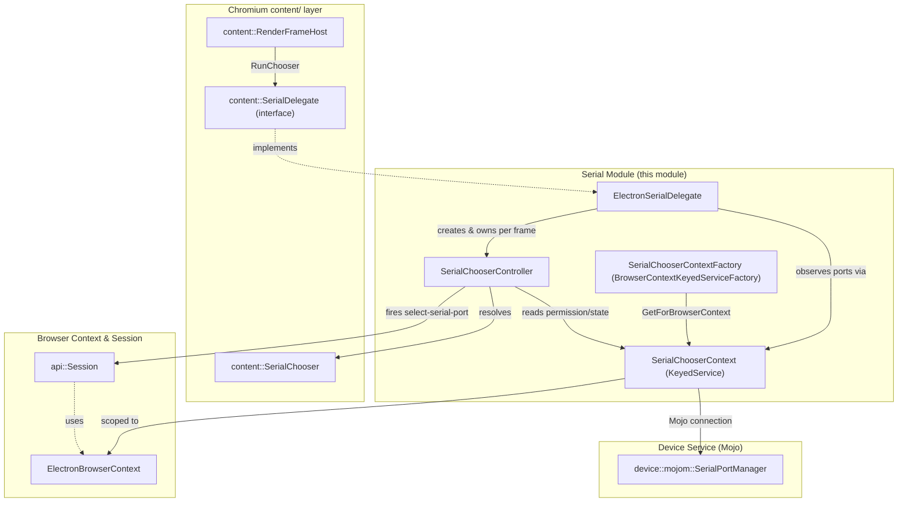
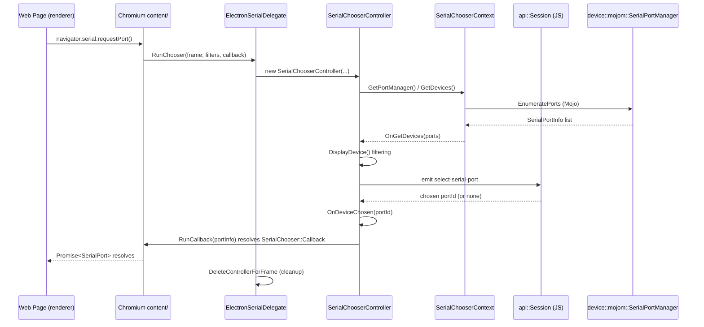

# Serial Module

## 1. Purpose & Overview

The **Serial** module implements Electron's main-process support for the
**Web Serial API** (`navigator.serial`), allowing web content and renderer
processes to discover, request permission for, and connect to serial ports
(including Bluetooth-backed serial devices) exposed by the host operating
system.

It is one of several "device chooser" subsystems in Electron — architecturally
a sibling of the [USB](USB.md) and `shell_browser_hid` modules under the
[Device & Peripheral Access](Device_%26_Peripheral_Access.md) area — and it
follows the same general pattern used by Chromium for exposing hardware to the
web platform:

1. A **Delegate** (`ElectronSerialDelegate`) that plugs into Chromium's
   `content::SerialDelegate` interface, wiring the browser's per-frame serial
   requests into Electron-specific logic.
2. A **Chooser Context** (`SerialChooserContext` / `SerialChooserContextFactory`)
   that is a `KeyedService` scoped to a `BrowserContext`, responsible for
   tracking granted port permissions, talking to the device service
   (`device::mojom::SerialPortManager`), and notifying observers of port
   add/remove events.
3. A **Chooser Controller** (`SerialChooserController`) that drives the actual
   picker UI/flow presented to the user (or programmatically resolved via
   Electron's `select-serial-port` event on `Session`), filtering and
   surfacing available devices for a specific frame/request.

This module has no independent JS/TS surface of its own; it is surfaced to
JavaScript through the `Session` API (see
[shell_browser_api_session_net_session_core.md](shell_browser_api_session_net_session_core.md))
via events such as `select-serial-port`, `serial-port-added`,
`serial-port-removed`, and `serial-port-revoked`.

---

## 2. Architecture Overview

### Key relationships

| Component | Role | Depends on |
|---|---|---|
| `ElectronSerialDelegate` | Entry point invoked by Chromium (`content::SerialDelegate`) per `RenderFrameHost`; manages one `SerialChooserController` per frame | `SerialChooserContext`, `SerialChooserController` |
| `SerialChooserContext` | Per-`BrowserContext` service tracking granted permissions & live port list; bridges to the device service | `ElectronBrowserContext`, `device::mojom::SerialPortManager` |
| `SerialChooserContextFactory` | Standard Chromium `BrowserContextKeyedServiceFactory` singleton that lazily builds/retrieves a `SerialChooserContext` per context | `SerialChooserContext` |
| `SerialChooserController` | Drives a single "choose a serial port" request: queries devices, filters by requested filters/Bluetooth service IDs, surfaces the choice through `api::Session`, and resolves the Mojo callback | `SerialChooserContext`, `ElectronSerialDelegate`, `api::Session`, `content::WebContents` |

---

## 3. Component Details

### 3.1 `ElectronSerialDelegate`
*File: `shell/browser/serial/electron_serial_delegate.h`*

Implements `content::SerialDelegate`, the interface Chromium's `content`
layer calls into whenever a web page invokes the Web Serial API. Responsibilities:

- **`RunChooser`** — creates (and owns) a `SerialChooserController` keyed by
  the requesting `content::RenderFrameHost`, kicking off the picker flow.
- **`CanRequestPortPermission` / `HasPortPermission`** — permission checks
  delegated to the `SerialChooserContext` for the frame's browser context.
- **`RevokePortPermissionWebInitiated`** — handles web-initiated permission
  revocation (`navigator.serial.forget()`).
- **`GetPortInfo` / `GetPortManager`** — accessors used by Chromium's Serial
  API implementation.
- Implements `SerialChooserContext::PortObserver` to react to port
  add/remove/connection events and to the chooser context shutting down,
  cleaning up its `controller_map_` (one controller per active frame) and
  observer list accordingly.

It is instantiated and owned by `ElectronBrowserClient` (see
[shell_browser_main_parts_client_core_browser_client.md](shell_browser_main_parts_client_core_browser_client.md)),
which exposes it to `content::ContentBrowserClient::GetSerialDelegate()`.

### 3.2 `SerialChooserContext`
*File: `shell/browser/serial/serial_chooser_context.h`*

A `KeyedService` (one instance per `ElectronBrowserContext`) and a
`device::mojom::SerialPortManagerClient` that:

- Establishes and maintains the Mojo connection to the device service's
  `SerialPortManager` (`EnsurePortManagerConnection`,
  `SetUpPortManagerConnection`, `OnPortManagerConnectionError`).
- Tracks currently known ports in `port_info_` (token → `SerialPortInfoPtr`)
  and per-origin ephemeral grants in `ephemeral_ports_`.
- Exposes permission APIs: `GrantPortPermission`, `HasPortPermission`,
  `RevokePortPermissionWebInitiated`, and the static
  `CanStorePersistentEntry` policy check.
- Defines the nested `PortObserver` interface (extending
  `content::SerialDelegate::Observer`) with an additional
  `OnSerialChooserContextShutdown()` hook, allowing dependents
  (`ElectronSerialDelegate`, `SerialChooserController`) to safely unregister
  when the context is torn down.
- Defines platform-specific persisted-entry key constants (e.g.
  `kVendorIdKey`, `kProductIdKey`, `kSerialNumberKey` on non-Windows;
  `kDeviceInstanceIdKey` on Windows; `kUsbDriverKey` on macOS) used when
  serializing port identity for persistent permission storage.

### 3.3 `SerialChooserContextFactory`
*File: `shell/browser/serial/serial_chooser_context_factory.h`*

Standard Chromium `BrowserContextKeyedServiceFactory` singleton
(`base::NoDestructor`-backed) providing:

- `GetForBrowserContext(content::BrowserContext*)` — lazily builds/returns
  the `SerialChooserContext` for a given context.
- `GetInstance()` — the factory singleton accessor.
- Overrides `BuildServiceInstanceForBrowserContext` and
  `GetBrowserContextToUse` to integrate with Electron's browser-context
  lifecycle (see [shell_browser_context.md](shell_browser_context.md)).

### 3.4 `SerialChooserController`
*File: `shell/browser/serial/serial_chooser_controller.h`*

Represents a single, live "pick a serial port" request originating from a
`RunChooser` call. Responsibilities:

- Stores the requested `filters_` and
  `allowed_bluetooth_service_class_ids_`, plus the Mojo
  `content::SerialChooser::Callback` to invoke with the user's/programmatic
  choice.
- `GetDevices` / `OnGetDevices` — queries the `SerialChooserContext` for the
  current port list and filters via `DisplayDevice`.
- `IsWirelessSerialPortOnly` — determines whether only Bluetooth-backed
  serial ports should be shown (based on filter contents).
- `GetSession` — resolves the associated `api::Session` (via a
  `gin::WeakCell<api::Session>`) so it can emit the `select-serial-port`
  event to JavaScript, allowing the app to programmatically resolve the
  choice or defer to native UI.
- `OnDeviceChosen` — completes the flow by resolving `callback_` with the
  selected port (or none), and `RunCallback` performs the final Mojo
  callback invocation.
- Implements both `SerialChooserContext::PortObserver` (to react to port
  changes/removal while the picker is open) and
  `device::BluetoothAdapter::Observer` (`AdapterPoweredChanged`) to handle
  Bluetooth radio state changes affecting wireless serial ports.
- Holds a `base::WeakPtr<ElectronSerialDelegate>` back-reference so it can
  notify the delegate when it completes, and a
  `content::GlobalRenderFrameHostId` to validate the requesting frame is
  still alive.

---

## 4. Request Flow

Permission checks (`HasPortPermission`) and revocation
(`RevokePortPermissionWebInitiated`) follow a simpler synchronous path
directly between `ElectronSerialDelegate` and `SerialChooserContext`,
without spinning up a `SerialChooserController`.

---

## 5. Integration with the Rest of the System

- **Browser Client wiring**: `ElectronSerialDelegate` is owned by
  `ElectronBrowserClient`, which implements `GetSerialDelegate()` from
  Chromium's `ContentBrowserClient`. See
  [shell_browser_main_parts_client_core_browser_client.md](shell_browser_main_parts_client_core_browser_client.md).
- **Browser Context scoping**: `SerialChooserContext` instances are keyed
  per `ElectronBrowserContext`/`Session`, following the same pattern as
  other per-context services documented in
  [shell_browser_context.md](shell_browser_context.md) and
  [shell_browser_api_session_net_session_core.md](shell_browser_api_session_net_session_core.md).
- **JS-visible events**: The `select-serial-port`, `serial-port-added`,
  `serial-port-removed`, and `serial-port-revoked` events on `Session` are
  the JavaScript-facing surface driven by this module's C++ controllers/
  context — application code listens to these to implement custom serial
  port picker UI.
- **Sibling device modules**: The same delegate/context/factory/controller
  pattern is used by the [USB](USB.md) subsystem
  (`ElectronUsbDelegate`/`UsbChooserContext`/`UsbChooserController`) and by
  `shell_browser_hid` (`ElectronHidDelegate`/`HidChooserContext`/
  `HidChooserController`) — consult those docs for comparison when
  extending or debugging chooser-based device access.
- **Bluetooth adapter access**: For Bluetooth-backed serial ports,
  `SerialChooserController` observes `device::BluetoothAdapter` directly
  (distinct from the dedicated [shell_browser_bluetooth](shell_browser_bluetooth.md)
  module, which handles the general Web Bluetooth API).

---

## 6. Summary

The Serial module is a compact, tightly-scoped subsystem that bridges
Chromium's generic Web Serial API plumbing (`content::SerialDelegate`,
`content::SerialChooser`) with Electron's `BrowserContext`/`Session` model.
Its four components — delegate, context, factory, and controller — form a
clear separation of concerns: routing (`ElectronSerialDelegate`), state/
permission storage and device-service connectivity (`SerialChooserContext`
+ `SerialChooserContextFactory`), and per-request UI/flow orchestration
(`SerialChooserController`). Because the module is small and highly
cohesive, no further sub-module decomposition is provided; developers
extending serial support should modify these four files together and refer
to the sibling [USB](USB.md) module for parallel patterns.
