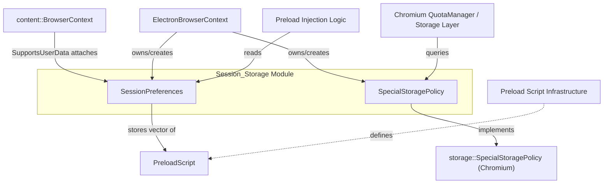
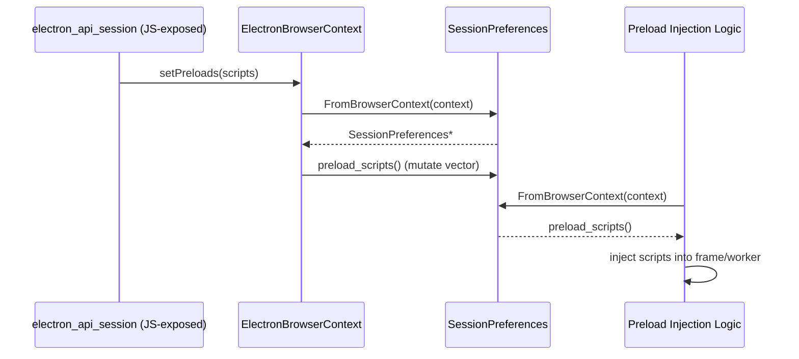
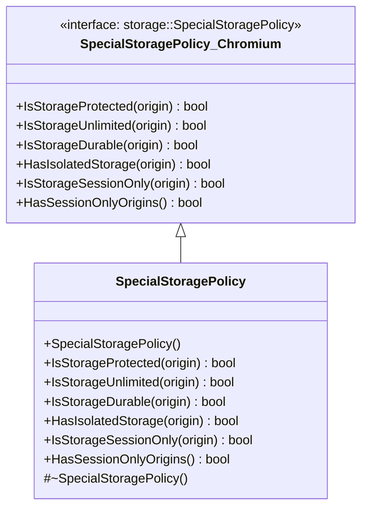

# Session_Storage

## Introduction

The **Session_Storage** module provides two small but critical pieces of per-`BrowserContext` state that Electron's session subsystem relies on:

1. **`SessionPreferences`** – a `base::SupportsUserData::Data` attachment that stores session-scoped preload script configuration (i.e., which JavaScript preload scripts should be injected into web frames or service workers for a given session).
2. **`SpecialStoragePolicy`** – an implementation of Chromium's `storage::SpecialStoragePolicy` interface that determines how a given origin's storage (cookies, IndexedDB, cache, etc.) should be treated — whether it is protected, unlimited, durable, isolated, or session-only.

Both classes are lightweight policy/data objects that are created once per `BrowserContext` (Electron `Session`) and consulted by lower-level Chromium storage and content APIs throughout the lifetime of that session. They do not implement business logic themselves so much as **expose hooks that the rest of Electron's browser-context and session layers populate and query**.

This module is a direct dependency of the broader session and browser-context management functionality documented in [shell_browser_context](shell_browser_context.md) (part of `Browser_Context_&_Session_Management`), and its `PreloadScript` data type is defined and documented in [Preload_Script](Preload_Script.md).

## Architecture Overview

**Key relationships:**

- `SessionPreferences` is attached to a `content::BrowserContext` via the `base::SupportsUserData` mechanism, using a static locator key (`kLocatorKey`) for lookup. It is created once via `SessionPreferences::CreateForBrowserContext()` and retrieved on demand via `SessionPreferences::FromBrowserContext()`.
- `SpecialStoragePolicy` is a standalone ref-counted policy object (per Chromium's `storage::SpecialStoragePolicy` contract) that is typically instantiated and handed to Chromium's storage/quota subsystems when a `BrowserContext` (Electron `Session`) is constructed.
- Both classes are consumed by [shell_browser_context](shell_browser_context.md), which owns the `ElectronBrowserContext` that wires them into the browser context's lifecycle.
- `SessionPreferences` depends on the `PreloadScript` struct, detailed in [Preload_Script](Preload_Script.md), which describes an individual preload script (its id, type — web frame or service worker — file path, and legacy validation flag).

## Component Details

### SessionPreferences

`shell/browser/session_preferences.h`

`SessionPreferences` is a per-session data holder that tracks preload scripts registered for a session (e.g., via `Session.setPreloads` / `Session.registerPreloadScript` JS APIs exposed by [shell_browser_api_session_net](shell_browser_api_session_net.md)'s `electron_api_session`).

**Responsibilities:**
- Store an ordered list (`std::vector<PreloadScript>`) of preload scripts associated with a `BrowserContext`.
- Provide static accessors to create and fetch the instance attached to a given `content::BrowserContext`:
  - `CreateForBrowserContext(content::BrowserContext*)`
  - `FromBrowserContext(content::BrowserContext*)`
- Expose whether any registered preload script targets service workers via `HasServiceWorkerPreloadScript()`.

**Design notes:**
- Implements `base::SupportsUserData::Data`, which is the standard Chromium pattern for attaching arbitrary, keyed data to objects like `BrowserContext` without modifying the base class.
- Uses a private static `kLocatorKey` (an `int`, whose *address* serves as the key) — a common Chromium idiom for type-safe `SupportsUserData` key allocation.
- The constructor is private; instances can only be created through `CreateForBrowserContext`, enforcing a single well-defined creation path.

### SpecialStoragePolicy

`shell/browser/special_storage_policy.h`

`SpecialStoragePolicy` implements Chromium's abstract `storage::SpecialStoragePolicy` interface, allowing Electron to customize storage eviction/quota/persistence behavior per-origin.

**Responsibilities (interface overrides):**
| Method | Purpose |
|---|---|
| `IsStorageProtected(origin)` | Whether the origin's storage should be protected from clearing. |
| `IsStorageUnlimited(origin)` | Whether the origin is exempt from storage quota limits. |
| `IsStorageDurable(origin)` | Whether the origin's storage should be treated as durable. |
| `HasIsolatedStorage(origin)` | Whether the origin uses isolated storage. |
| `IsStorageSessionOnly(origin)` | Whether the origin's storage should be cleared at session end. |
| `HasSessionOnlyOrigins()` | Whether any origin is marked session-only. |

**Design notes:**
- Inherits from `storage::SpecialStoragePolicy`, a ref-counted (`RefCountedThreadSafe`-style) Chromium interface, so instances are typically held via `scoped_refptr`.
- The destructor is `protected`, consistent with ref-counted object conventions (prevents direct stack/heap deletion outside the ref-counting mechanism).
- In Electron, this policy is generally instantiated once per `ElectronBrowserContext` and passed into the underlying `content::BrowserContext`'s storage partition configuration, influencing how Chromium's `QuotaManager` and cookie/storage subsystems treat each origin.

## How This Module Fits Into the Overall System

- **Upstream consumers:** [shell_browser_context](shell_browser_context.md) constructs `ElectronBrowserContext`, which in turn creates and owns `SessionPreferences` and `SpecialStoragePolicy` instances as part of setting up a session's storage partition and preload configuration.
- **Cross-module data type:** The `PreloadScript` struct used by `SessionPreferences` is owned by the [Preload_Script](Preload_Script.md) sub-module, which also defines the injection/runtime side of preload scripts in the renderer (see [Preload_ServiceWorker_(Renderer)](Preload_ServiceWorker_Renderer.md) if documented separately).
- **JS API surface:** Session-level JavaScript APIs (`session.setPreloads`, cookie/storage clearing, etc.) exposed via [shell_browser_api_session_net](shell_browser_api_session_net.md) (`electron_api_session.cc/h`) ultimately read/write `SessionPreferences` and rely on `SpecialStoragePolicy` decisions when managing per-origin storage behavior.
- **Chromium integration:** `SpecialStoragePolicy` plugs directly into Chromium's generic `storage::SpecialStoragePolicy` contract, meaning it is consulted transparently by Chromium's `QuotaManager`, cookie store, and other storage backends without those components needing Electron-specific knowledge.

Because this module has only two, tightly-scoped, single-responsibility files with no further meaningful internal subdivision, no sub-module documentation has been generated; all detail is captured above.
