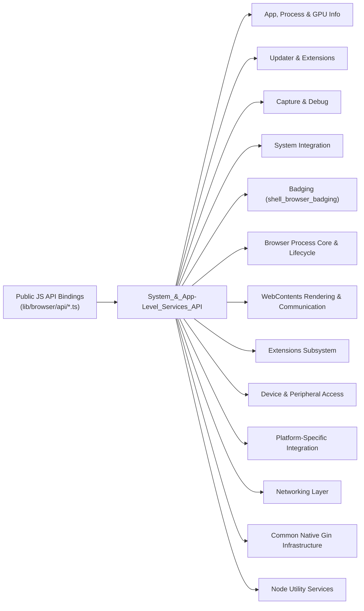

# System & App-Level Services API

## Introduction

The `System_&_App-Level_Services_API` module is the native (C++) backing layer for Electron's **process-wide, application-level, and operating-system integration APIs**. It exposes the top-level main-process JavaScript globals and singleton/factory-created objects — such as `app`, `autoUpdater`, `globalShortcut`, `powerMonitor`, `powerSaveBlocker`, `nativeTheme`, `screen`, `systemPreferences`, `Notification`, `PushNotifications`, `desktopCapturer`, `Debugger`, `DownloadItem`, `UtilityProcess`, `Extensions`, and GPU introspection helpers — as well as the browser-side implementation of the W3C **Badging API** (`navigator.setAppBadge()` / `clearAppBadge()`).

Located under `shell/browser`, this module lives at the intersection of Chromium's browser-process subsystems (power monitor, GPU data manager, wake lock service, extension registry, `BrowserContextKeyedServiceFactory`) and Electron's Gin/V8 binding infrastructure. It is the primary place where OS-specific system integration (Windows/macOS/Linux conditional code) is surfaced to JavaScript, complementing sibling modules that handle windows/UI, web content, sessions/networking, and device/peripheral access.

## Purpose

- Provide the native implementation for Electron's core `app` singleton, including process lifecycle, child-process metrics, utility process spawning, and GPU information retrieval.
- Wrap Chromium subsystems for auto-updates, extension management, remote debugging, desktop capture, and download tracking.
- Bridge OS-level capabilities — global shortcuts, display/screen info, power state, native theming, system preferences, notifications, push notifications, and in-app purchases — into JS-consumable EventEmitter-style objects.
- Implement the per-`BrowserContext` `BadgeManager` service that services `blink::mojom::BadgeService` requests from frames and Service Workers, enabling app icon badging.

## Architecture Overview

```mermaid
graph TB
    subgraph "System_&_App-Level_Services_API"
        subgraph "App, Process & GPU Info"
            App["App\n(electron_api_app.h)"]
            ProcessMetric["ProcessMetric"]
            UtilityProcessWrapper["UtilityProcessWrapper"]
            GPUInfoManager["GPUInfoManager"]
            GPUInfoEnumerator["GPUInfoEnumerator"]
        end
        subgraph "Updater & Extensions"
            AutoUpdater["AutoUpdater"]
            Extensions["Extensions"]
        end
        subgraph "Capture & Debug"
            Debugger["Debugger"]
            DesktopCapturer["DesktopCapturer"]
            DownloadItem["DownloadItem"]
        end
        subgraph "System Integration"
            GlobalShortcut["GlobalShortcut"]
            Screen["Screen"]
            PowerMonitor["PowerMonitor"]
            PowerSaveBlocker["PowerSaveBlocker"]
            NativeTheme["NativeTheme"]
            SystemPreferences["SystemPreferences"]
            Notification["Notification"]
            PushNotifications["PushNotifications"]
        end
        subgraph "Badging"
            BadgeManager["BadgeManager"]
            BadgeManagerFactory["BadgeManagerFactory"]
        end
    end

    App -->|owns/queries| ProcessMetric
    App -->|delegates GPU queries| GPUInfoManager
    GPUInfoManager -->|serializes gpu::GPUInfo via| GPUInfoEnumerator
    App -.->|BrowserObserver| Browser["Browser\n(Browser Process Core & Lifecycle)"]
    PushNotifications -.->|BrowserObserver| Browser
    AutoUpdater -.->|WindowListObserver| WindowList["WindowList"]
    Extensions -.->|ExtensionRegistryObserver| ExtSys["ElectronExtensionSystem\n(Extensions Subsystem)"]
    Notification -.->|delegates to| NotifPresenter["NotificationPresenter\n(Platform-Specific Integration)"]
    UtilityProcessWrapper -.->|spawns via| NodeService["NodeService\n(Node Utility Services)"]
    BadgeManagerFactory -->|GetForBrowserContext| BC["ElectronBrowserContext\n(Browser Context & Session Management)"]
    BadgeManagerFactory --> BadgeManager
```

## Module Composition

## Sub-modules

| Sub-module | Focus |
|---|---|
| **App, Process & GPU Info** (`shell_browser_api_system_device_app_process`) | The `App` singleton, child-process/`ProcessMetric` tracking, `UtilityProcess` spawning, and GPU info plumbing (`GPUInfoEnumerator`, `GPUInfoManager`) |
| **Updater & Extensions** (`shell_browser_api_system_device_updater_extensions`) | `AutoUpdater` lifecycle and the `Extensions` manager for loading/tracking extensions |
| **Capture & Debug** (`shell_browser_api_system_device_capture_debug`) | `desktopCapturer` source enumeration, the `Debugger` remote-debugging protocol binding, and `DownloadItem` tracking |
| **System Integration** (`shell_browser_api_system_device_system_integration`) | OS-level integration: `GlobalShortcut`, `Screen`, `PowerMonitor`/`PowerSaveBlocker`, `NativeTheme`, `SystemPreferences`, `Notification`, `PushNotifications`, `InAppPurchase` |
| **Badging** (`shell_browser_badging`) | `BadgeManager` and `BadgeManagerFactory` implementing the W3C Badging API mojo service, scoped per `BrowserContext` |

## Key Design Patterns

- **Wrappable + EventEmitterMixin**: Nearly every class is a `gin_helper::Wrappable` exposing an `EventEmitter`-like JS surface, forwarding native OS/Chromium callbacks into `Emit(...)` calls.
- **Singleton & factory accessors**: `App::Get()`, `PushNotifications::Get()`, `GPUInfoManager::GetInstance()`, and `BadgeManagerFactory::GetInstance()`/`GetForBrowserContext()` provide process-wide or per-context service access.
- **Delegate/Observer bridging**: `App` and `PushNotifications` implement `BrowserObserver` and `ElectronBrowserClient::Delegate` to receive lifecycle/content-layer callbacks and re-emit them as JS events.
- **Binding-context security**: `BadgeManager` ties every mojo `SetBadge`/`ClearBadge` call to a trusted `FrameBindingContext` or `ServiceWorkerBindingContext`, avoiding reliance on untrusted renderer-supplied identity.
- **Platform-conditional compilation**: `PowerMonitor`, `SystemPreferences`, `InAppPurchase`, and `UtilityProcessWrapper` contain substantial `BUILDFLAG(IS_WIN/IS_MAC/IS_LINUX)` branches, reflecting the module's role as the main surface for OS-specific system integration.

## References to Core Components Documentation

- [shell_browser_api_system_device (App, Process, GPU, Updater, Extensions, Capture/Debug, System Integration)](shell_browser_api_system_device_app_process.md) — includes sub-docs:
  - [App, Process & GPU Info](shell_browser_api_system_device_app_process.md)
  - [Updater & Extensions](shell_browser_api_system_device_updater_extensions.md)
  - [Capture & Debug](shell_browser_api_system_device_capture_debug.md)
  - [System Integration](shell_browser_api_system_device_system_integration.md)
- [shell_browser_badging (BadgeManager & BadgeManagerFactory)](shell_browser_badging.md)

### Related modules
- [Browser Process Core & Lifecycle](shell_browser_core_lifecycle.md) — `Browser`, `BrowserObserver`
- [Browser Context & Session Management](shell_browser_context.md) — `ElectronBrowserContext` (badge/service scoping)
- [Extensions Subsystem](shell_browser_extensions_core_system.md) — `ElectronExtensionSystem`
- [Common Native Gin Infrastructure](Gin_Helper.md) — `Wrappable`, `EventEmitterMixin`, `Handle`, `Promise`
- [Node Utility Services](Node_Service.md) — `NodeService` used by `UtilityProcessWrapper`
- [Platform-Specific Integration](shell_browser_notifications.md) — `NotificationPresenter` and platform notification backends